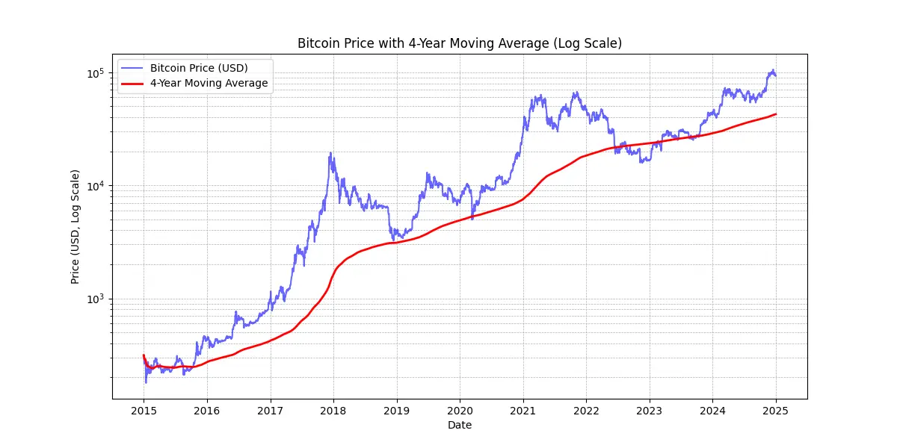

# شروع به سفر شرکت خود در شبکه بیت کوین کنید

کشف قابلیت‌های عملی بیت‌کوین و شبکه Lightning و بررسی اینکه چگونه آن‌ها می‌توانند **عملیات تجاری شما را تحول دهند** مانند اینترنت. از سرمایه دیجیتال تا پرداخت‌های سریع، اقتصادی و قابل مقیاس، بیت‌کوین طیف گسترده‌ای از **موارد استفاده برای کسب و کارها** ارائه می‌دهد.

در طول این راهنما، شما یاد خواهید گرفت چگونه بیت کوین را به عنوان یک شبکه پولی جهانی، جهانی و بومی اینترنت درک کنید. با ویژگی های بنیادین منحصر به فرد خود، **بیت کوین بهبودهای قابل توجهی نسبت به شبکه های ارز سنتی فراهم می کند**. شما کشف خواهید کرد چرا و چگونه از بیت کوین برای موارد استفاده مالی کلاسیک مانند ذخیره سازی سرمایه و سیستم های پرداخت استفاده کنید. علاوه بر این، این راهنما پوشش خواهد داد خرید و نگهداری بیت کوین، از جمله الزامات حسابداری و مالیاتی مرتبط، و همچنین پیاده سازی راه حل های پرداخت بیت کوین ساده یا مقیاس بزرگ.

چه شما یک **کسب و کار کوچک** باشید یا یک **شرکت بزرگ**، ادغام بیت کوین در عملیات روزانه شرکت شما می تواند شرکت شما را بیشتر **مقاوم، بهره ور و رقابتی** کند. هر شرکت مبتنی بر اینترنت یک شرکت مبتنی بر بیت کوین خواهد شد و این دوره اطمینان می دهد که شما آماده هستید. بخش های اولیه مروری بر اصول عملکرد بیت کوین ارائه می دهند، بنابراین حتی اگر شما مبتدی هستید، دانش پایه ای لازم برای ادامه را کسب خواهید کرد. یادگیری مبانی اختراع ساتوشی همیشه یک ایده خوب است، چه قبل از غوص در BIZ101 و چه بعد از آن.

+++
# مقدمه

<partId>326cf945-5d3f-4d86-8c3e-4d1c35959799</partId>

## شرکت خود را به بیت کوین متصل کنید

<chapterId>1be42be9-4080-49f5-b5b2-6b531dd55f5f</chapterId>

شروع به سفر شرکت خود در شبکه بیت کوین با این دوره آموزشی جامع - درگاهی برای درک چگونگی انقلاب بیت کوین و شبکه رعد و برق در عملیات تجاری سنتی. این دوره برای خرده فروشان، کارآفرینان، مدیران، و تصمیم گیرندگان شرکتی طراحی شده است که مایل به بررسی قابلیت های عملی بیت کوین به عنوان یک شبکه پولی جهانی، بومی اینترنت و یک روش قوی برای تبادل ارزش هستند.

طی دوره، شما با اصول بنیادی آشنا می‌شوید که بیت کوین و شبکه Lightning را به طور متمایز تحول‌بخش می‌کند. شما یاد خواهید گرفت که چگونه این فناوری‌ها یک طیف از موارد استفاده را ارائه می‌دهند، از ذخیره‌سازی سرمایه دیجیتال تا پرداخت‌های سریع، اقتصادی و قابل مقیاس، و چگونه آن‌ها بهبودهای حیاتی را بر سیستم‌های ارز و پرداخت سنتی فراهم می‌کنند. دوره BIZ101 نظریه اقتصادی را با کاربردهای واقعی جهان واقعی متصل می‌کند، توضیح می‌دهد که چگونه غیرمتمرکزسازی می‌تواند وابستگی‌ها به واسطه‌ها را کاهش دهد و محدودیت‌هایی که در سیستم‌های میراثی وجود دارد را بر طرف کند.

دوره با بررسی دقیق ارزهای متداول و مکانیزم های پرداخت آغاز می شود، با بررسی نحوه عملکرد ارز به عنوان یک شبکه برای فعال سازی معاملات، پس انداز و تخصص اقتصادی، زمینه را فراهم می کند. سپس، ما به فناوری پشت بیت کوین و نوآوری های معرفی شده توسط شبکه Lightning خواهیم پرداخت، نقش آنها در تسهیل معاملات بی دریغ، امن و تقریبا فوری را که می تواند به کسب و کارهای همه اندازه ها خدمت کند، آشکار می کند. سپس ما به بخش های عملی این دوره خواهیم پرداخت، با شروع با قسمتی در مورد نگهداری بیت کوین به عنوان خزانه، پیروی شده توسط قسمت نهایی در مورد پذیرش بیت کوین به عنوان وسیله ای برای پرداخت.

چه شما نماینده یک کسب و کار کوچک یا یک شرکت بزرگ باشید، این دوره با هدف مجهز کردن شما به دانشی برای یکپارچه سازی بیت کوین در عملیات روزانه شرکت خود طراحی شده است، در نتیجه مقاومت، کارایی و برتری رقابتی شرکت شما افزایش می یابد. همانطور که بیت کوین ادامه دارد چشم انداز اقتصادی را شکل می دهد، درک این فناوری های نوآورانه نه تنها یک گزینه است بلکه یک ضرورت استراتژیک است. آماده شوید تا با محتوای بینش آمیز، مثال های عملی و راهنمایی استراتژیک که به شما امکان می دهد جهان در حال تکامل بیت کوین را ناوبری و بهره برداری کنید، مشارکت کنید!

# ارز، سیستم های پرداخت، و بیت کوین

<partId>d9bd0e21-8488-44e0-af55-6d0b934f83c2</partId>

## ارزهای سنتی

<chapterId>785e095c-6811-4ca2-ba46-fe38291432d4</chapterId>

### ارزها شبکه هستند

ارزها در اصل شبکه هایی هستند که مبادله مقدار به صورت کارآمد را ممکن می سازند.

بدون ارز، افراد باید بر **مبادله** تکیه کنند، یک سیستمی که در آن کالاها یا خدمات به طور مستقیم مبادله می‌شوند. مبادله غیر عملی است زیرا نیازمند "تصادف دوگانه از خواسته‌ها" است - هر دو طرف باید همزمان آنچه را که دیگری پیشنهاد می‌دهد، بخواهند. برای مثال، اگر کشاورزی با گندم اضافی کفش می‌خواهد، باید کفاشی را پیدا کند که به طور خاص به گندم نیاز دارد. این کمیاب و ناکارآمد است. علاوه بر این، **در یک اقتصاد مبادله با n محصول، تقریباً n(n−1)/2 نرخ مبادله لازم است**، که یک سیستم بسیار پیچیده و سنگین را ایجاد می‌کند. برای مثال، این نیازمند بیش از ~124,000 نرخ مبادله برای فقط 500 محصول است.

ارز با عمل به عنوان یک واسطه، این موضوع را ساده می کند و **یک شبکه ایجاد می کند که تعداد نرخ های تبادل را به n کاهش می دهد** - یکی برای هر محصول نسبت به ارز. این معاملات را بسیار ساده تر می کند و **به مردم امکان می دهد که کالاها و خدمات را بدون نیاز به تقاضای متقابل در یک زمان معامله کنند**. به جای تبادل گندم برای کفش به طور مستقیم، کشاورز می تواند گندم خود را برای ارز بفروشد و بعداً از همان ارز برای خرید کفش یا هر چیز دیگری که نیاز دارد استفاده کند.

معرفی ارز به عنوان یک شبکه نه تنها تجارت را تسهیل می کند بلکه امکان **تقسیم کار و تخصص** را نیز فراهم می کند. با وجود یک وسیله معتبر مبادله، افراد و جوامع دیگر نیازی به تولید همه چیزی که مصرف می کنند ندارند. به جای آن، آنها می توانند تمرکز خود را بر روی آنچه که بهترین کار می کنند، افزایش کارایی و کیفیت. یک کشاورز می تواند در کشت محصولات تخصص پیدا کند، یک کفاش در ساخت کفش تخصص پیدا کند و یک سازنده در ساخت خانه ها تخصص پیدا کند. این متخصصان سپس می توانند کالاها و خدمات خود را از طریق ارز مبادله کنند، از تخصص یکدیگر بهره مند شوند. این تخصص سبب افزایش **بهره وری و نوآوری** می شود، زیرا افراد مهارت های خود را پالایش می کنند و روش های جدیدی را در زمینه های مربوطه خود توسعه می دهند.

طبیعت شبکه‌ای ارز منافع قابل توجه اضافی را به همراه دارد. اولاً، بخشی از شبکه ارز بودن **از بیرون بودن از آن مفیدتر است**. استاندارد مشترک شبکه تجارت را تسهیل می‌کند، افراد را قادر می‌سازد تا فعالیت‌های اقتصادی خود را حتی **در فواصل بزرگ** هماهنگ کنند. به عنوان مثال، یک تاجر در یک شهر می‌تواند با استفاده از یک ارز مشترک، کالاهای خود را با خریداری در شهر دیگر معامله کند، این امر رشد اقتصادی و همکاری در مناطق بزرگ را ترویج می‌کند.

یک مزیت حیاتی دیگر ارز، توانایی آن در **اجازه دادن به مبادلات به تعویق افتاده** است. با مبادله، معاملات فوری هستند؛ یک کالا به طور مستقیم با کالای دیگری عوض می شود. اما ارز، **پس انداز را ممکن می سازد - افراد می توانند ارزش را برای استفاده در آینده ذخیره کنند**. این نمایانگر یک پیشرفت بزرگ در برنامه ریزی اقتصادی، سرمایه گذاری و انباشت ثروت است، همه اینها زندگی شرکت کنندگان در شبکه را بهبود می بخشد.

در نتیجه، ارزها شبکه هایی هستند که برای انتقال ارزش به صورت کارآمد طراحی شده اند. آنها محدودیت های مبادله را برطرف می کنند، تجارت را ساده می کنند و فرصت هایی برای هماهنگی و پس انداز ایجاد می کنند. مانند هر شبکه ای، ارزش یک ارز بستگی به پذیرش گسترده و کاربرد آن دارد - در نهایت، بهترین ارز برنده می شود.

### یک ارز خوب چیست ؟

یک ارز خوب، چندین ویژگی ضروری را دارد که آن را برای تسهیل تبادل ارزش موثر می کند. در اینجا توضیح مختصری از هر یک ارائه شده است:

- امن**: یک ارز باید در برابر سرقت یا دسترسی غیرمجاز محافظت شود، تا کاربران با اطمینان بتوانند آن را نگه دارند و منتقل کنند. امنیت برای ایجاد اعتماد در سیستم بسیار حیاتی است.
- **ضد جعل**: یک ارز باید بسیار دشوار یا غیرممکن باشد تا تقلبی شود. این اطمینان می دهد که هر واحد اصلی است، ارزش خود را حفظ می کند و باعث افزایش تورم ناشی از ورود واحدهای جعلی به گردش می شود. به عنوان مثال، در تاریخ، طلا نه تنها به خاطر زیبایی و کمیابی آن ارزش گذاری شده است، بلکه به این دلیل که بسیار سخت است تولید آن. بر خلاف اسکناس های کاغذی یا ورودی های دیجیتال، شما نمی توانید فقط "طلا بسازید" - باید از زمین استخراج شود. این کمیابی طبیعی و دشواری تولید کمک کرده است تا طلا وضعیت خود را به عنوان یک مخزن مورد اعتماد ارزش و یک معیار برای اصالت حفظ کند.
- کمیاب**: یک ارز خوب باید تامین محدود یا انتشار کنترل شده داشته باشد. کمیابی اطمینان می دهد که ارزش آن برای مدت زمان طولانی حفظ می شود، از تولید بیش از حد جلوگیری می کند، که باعث فرسایش قدرت خرید می شود. برای مثال، برخی از قبایل بومی آمریکا از مروارید به عنوان یک نوع ارز استفاده می کردند. در ابتدا، تولید این مرواریدها سخت بود، کمیابی و ارزش آنها را حفظ می کرد. اما، هنگامی که تاجران اروپایی شروع به تولید انبوه و سیلاب بازار با مروارید کردند، نایابی آنها ناپدید شد. همانطور که عرضه افزایش یافت، مرواریدها قدرت خرید خود را از دست دادند، نقش آنها را به عنوان یک مخزن قابل اعتماد ارزش زیر سوال برد.
- **بدون اجازه**: در گذشته، ارزهایی مانند سکه‌های طلا و نقره اغلب توسط افراد خصوصی، مقامات محلی یا تاجرانی که به مواد اولیه دسترسی داشتند، سکه زده می‌شدند. این سیستم گاهی اوقات تحت توافقات یا مجوزهایی که توسط پادشاهان یا حاکمان اعطا می‌شد، عمل می‌کرد. بر طول زمان، پادشاهان و دولت‌ها این فرآیند را متمرکز کردند تا بر ثبات اقتصادی، مالیات و سیستم پولی بیشتر کنترل داشته باشند. یک مثال معروف از این موضوع **تالر** است، یک سکه نقره‌ای که اولین بار در سال 1518 در **دره Joachimsthal** (در حال حاضر Jáchymov در جمهوری چک) توسط معدنچیان و مقامات محلی سکه زده شد. نام "تالر" از کلمه آلمانی **"Thal"** که به معنی "دره" است، گرفته شده است. این سکه‌ها، که برای نقره با کیفیت بالای خود شناخته می‌شدند، در سراسر اروپا به طور گسترده منتشر شدند. بر طول زمان، این عبارت از لحاظ زبانی و جغرافیایی تکامل یافت و در نهایت منجر به نام "دلار" شد که در ایالات متحده برای ارز خود پذیرفته شد.

در عصر مدرن، ارزها تحت سیستم سنیوراژ کاملا مجوز داده شدند، به این معنی که فقط نهادهای مجاز - مانند بانک های مرکزی یا خزانه داری ها - می توانستند سکه بزنند یا اسکناس چاپ کنند. افراد دیگر قانونا اجازه تولید ارز را ندارند، که این امر کنترل متمرکز بر صدور و تامین آن را تضمین می کند.

امروزه، اصل سنیوراژ توسط رمز ارز بیت کوین که بدون کنترل متمرکز عمل می کند، چالش می شود. بیت کوین یک سیستم "بدون اجازه" است که هر کسی می تواند در استفاده از ارز شرکت کند بدون اینکه اجازه بخواهد و همچنین از طریق استخراج، در ایجاد آن شرکت کند. این غیر متمرکز سازی، انحصار صدور از دولت ها را حذف می کند، سوالاتی را در مورد بازگشت احتمالی به سیستم های رقابتی ارز بازار آزاد مطرح می کند.

- واحد حساب**: یک ارز باید یک معیار استاندارد برای مقایسه ارزش کالاها و خدمات ارائه دهد. این موضوع معاملات را ساده می کند و قیمت گذاری را شفاف و یکنواخت در سراسر معاملات می کند.
- دوام بخش**: یک واحد پولی باید در مقابل سایش و خراش در طول زمان مقاوم باشد. ارزهای فیزیکی، مانند سکه ها یا اسکناس ها، باید در برابر آسیب مقاوم باشند، در حالی که ارزهای دیجیتال باید بدون خطر از دست دادن داده ها به طور امن ذخیره شوند.
- قابل حمل**: یک ارز باید قابل حمل و استفاده آسان باشد تا تجارت در فاصله ها را فعال کند. این می تواند از طریق قابل حمل بودن فیزیکی (سکه ها یا اسکناس های سبک وزن) یا سیستم های انتقال دیجیتالی انجام شود.
- قابل تقسیم**: یک واحد پولی باید به واحدهای کوچکتر تقسیم شود تا معاملات با اندازه‌های متفاوت را تسهیل کند. این انعطاف پذیری اطمینان می‌دهد که برای خریدهای کوچک و تجارت در مقیاس بزرگ عملی است.
- قابل تعویض**: تمام واحدهای یک ارز باید قابل تعویض و با ارزش برابر باشند. به عنوان مثال، یک بیل دلار باید معادل هر بیل دلار دیگری باشد. این یکنواختی، عدالت و سادگی در معاملات را تضمین می کند.
- قابل تشخیص**: یک ارز باید به راحتی قابل شناسایی و مورد اعتماد باشد. ارزهای فیزیکی این موضوع را از طریق طراحی های منحصر به فرد و ویژگی های امنیتی بدست می آورند، در حالی که ارزهای دیجیتال ممکن است بر پروتکل های تأیید اعتماد کنند. این موضوع باعث پذیرش گسترده و کاهش خطر تقلب می شود.

این خصوصیات یک ارز را عملی، قابل اعتماد و کارآمد برای تسهیل تجارت و ذخیره ارزش در یک اقتصاد می‌کند.

### تکامل سیستم‌های ارزی

**از سکه ها به پول کاغذی: افزایش کارایی و قابل حمل بودن**

انتقال از سکه به پول کاغذی نشان‌دهنده یک بهبود قابل توجه در **قابل حمل بودن** و کارایی بود. سکه‌ها، که از فلزات گران‌بها مانند طلا یا نقره ساخته شده بودند، به دلیل ارزش ذاتی خود ارزشمند بودند. با این حال، آنها سنگین، دشوار برای حمل در مقادیر زیاد و مستعد سایش یا سرقت بودند. پول کاغذی با معرفی یک رسانه سبک، استاندارد و قابل حمل که ارزش را نمایان می‌کرد به جای حاوی آن بودن، شبکه‌های ارز را انقلابی کرد. این نوآوری اجازه داد تا اقتصادها با فعال کردن تجارت راحت‌تر در فاصله‌های طولانی و کاهش چالش‌های لجستیکی استفاده از کالاهای فیزیکی به عنوان پول، مقیاس بزرگتری را پیدا کنند.

پول کاغذی همچنین مقیاس پذیری را افزایش داد. به جای اتکا به محدودیت تامین فلزات گرانبها، اقتصادها می توانستند پایه ی مالی خود را از طریق ارزهای نمایندگی، در ابتدا توسط انبوه و سپس توسط اعتماد به نهادهای صادر کننده، گسترش دهند. این تغییر راه را برای سیستم های مالی پیچیده تر و متصل تر فراهم کرد.

**از کاغذ به پول الکترونیکی: گسترش دسترسی و سرعت**

انتقال از پول کاغذی به پول الکترونیکی شبکه ارز را با افزایش دسترسی و سرعت بیشتر بهبود بخشید. با افزایش سیستم‌های بانکی، کارت‌های اعتباری و معاملات دیجیتال، پول نه تنها **قابل حمل** شد بلکه تقریبا **لحظه‌ای** شد. انتقالات الکترونیکی نیاز به تبادل فیزیکی را از بین برد، امکان معاملات در فواصل بسیار دور را در ثانیه‌ها فراهم کرد.

این تغییر همچنین دسترسی به ارز را دموکراتیک کرد. بانکداری الکترونیکی و سیستم های پرداخت موانع ورود برای افراد و کسب و کارها را کاهش داد، امکان مشارکت در اقتصاد جهانی را فراهم کرد. سرعت و راحتی پول الکترونیکی شبکه های تجارت را گسترش داد و مدل های کسب و کار جدیدی را که در یک سیستم مبتنی بر کاغذ غیرممکن بود، تشویق کرد.

این شبکه‌های ارز مدرن با یک معایب قابل توجه همراه بودند: **عدم قابلیت حسابرسی و شفافیت در مدیریت عرضه پول**، که اغلب منجر به تورم بی‌کنترل و از دست رفتن اعتماد به سیستم‌های متمرکز می‌شود. برای مثال، بیش از 20٪ از کل دلارهای در حال گردش آمریکا در چهار سال گذشته به چاپ رسیده است. این وسوسه‌ی مداوم برای ارائه بیشتر ارز - که در نتیجه ارزش نگهداری شده توسط دارندگان فعلی را کاهش می‌دهد - بیشتر می‌تواند به یک نقص سیستمی نسبت داده شود: سیاستمداران اغلب ترغیب می‌شوند تا از تصمیمات بودجه‌ای سختگیرانه اجتناب کنند، به جای آن ترجیح می‌دهند چالش‌ها را به دولت‌های آینده با "لگد زدن به سطل" موکول کنند.

**از ارز متمرکز به ارز غیرمتمرکز: افزایش اعتماد و حاکمیت**

امروز، ظهور ارز غیرمتمرکز بیت کوین نمایانگر پرش بعدی در شبکه های ارزی است. پول الکترونیکی سنتی بر مبنای مراجع متمرکزی مانند بانک ها یا دولت ها برای مدیریت و تأیید معاملات استناد می کند. در حالی که این سیستم ها موثر هستند، اما در مقابل ناکارآمدی ها، سانسور و نقاط شکست تکی آسیب پذیر هستند. ارزهای غیرمتمرکز با **توزیع اعتماد و حذف واسطه ها** این خصوصیات شبکه را بهبود می بخشند. همچنین این بدان معناست که پول می تواند بسیار **سریعتر** و **ارزانتر** حرکت کند، زیرا هیچ مرحله ای از مجوز وجود ندارد. در نهایت هیچ انسانی نمی تواند وسوسه شود تا برنامه تامین ارز بیت کوین را تغییر دهد، این برنامه توسط نرم افزار اجرا می شود.

در سیستم‌های غیرمتمرکز، معاملات توسط شبکه‌ای جهانی از شرکت‌کنندگان با استفاده از فناوری بلاکچین تأیید می‌شوند، امنیت، شفافیت و انعطاف‌پذیری را تضمین می‌کند. این ساختار خطر کلاهبرداری را به حداقل می‌رساند، وابستگی به مراجع مرکزی را کاهش می‌دهد و افراد را قادر می‌سازد تا بیشتر بر مالیات خود کنترل داشته باشند. با حذف موانع جغرافیایی و نهادی، ارزهای غیرمتمرکز یک سیستم پولی واقعاً جهانی و شامل همه را ارائه می‌دهند.

**تکامل شبکه‌های ارزی**

هر مرحله از تکامل شبکه‌های ارزی ویژگی‌های کلیدی را بهبود بخشیده است: قابل حمل بودن، قابلیت مقیاس پذیری، دسترسی، سرعت، امنیت، و اعتماد. سکه‌ها به خاطر قابل حمل بودن و کارایی بهتر به پول کاغذی تبدیل شدند. پول کاغذی به پول الکترونیکی تبدیل شد، که دسترسی جهانی و معاملات لحظه‌ای را ممکن ساخت. حالا، بیت کوین، اعتماد و امنیت را مجدداً تعریف می‌کند و یک سیستم پولی باز و مقاوم ایجاد می‌کند. این پیشرفت تاریخی بر تلاش مداوم بشریت برای ایجاد شبکه‌های بهتر برای تبادل ارزش تاکید می‌کند، هر تکراری بر محدودیت‌های قبلی ساخته و آنها را تجاوز می‌کند.

شبکه بهترین احتمالا برنده خواهد شد.

## سیستم‌های پرداخت سنتی

<chapterId>1306196c-1e8a-454b-8e11-6887ecb3d8b4</chapterId>

سیستم‌های پرداخت روش‌ها و زیرساخت‌هایی هستند که انتقال وجوه بین دو طرف را ممکن می‌سازند - معمولاً بین یک پرداخت‌کننده (مانند یک مصرف‌کننده) و یک دریافت‌کننده پرداخت (مانند یک کسب‌وکار). این معاملات می‌توانند در تنوعی از تنظیمات رخ دهند: یک مصرف‌کننده که به یک تاجر محلی پرداخت می‌کند، یک کسب‌وکار که صورت‌حساب‌ها را با یک تامین‌کننده تسویه می‌کند، یا حتی افرادی که پول را به یکدیگر منتقل می‌کنند. درک سیستم‌های پرداخت شامل نگاهی به انواع مختلف روش‌های پرداخت، خصوصیات آن‌ها، و کاربردهای آن‌ها در هر دو زمینه کسب‌وکار-به-مصرف‌کننده (B2C) و کسب‌وکار-به-کسب‌وکار (B2B) است.

### روش‌های رایج پرداخت

1. **نقد:** ارز فیزیکی که مستقیماً بین دو طرف مبادله می‌شود.

2. **چک ها:** اسناد کاغذی که به بانک دستور می‌دهند مبلغ مشخصی را از حساب پرداخت کننده به حساب گیرنده پرداخت کند.

3. **انتقالات سیمی:** انتقال الکترونیکی وجوه بین بانک‌ها، که اغلب برای مبالغ بزرگتر و پرداخت‌های مرزی استفاده می‌شود.

4. **کارت های پرداخت (اعتباری / بدهی):** کارت های پلاستیکی یا دیجیتال متصل به شبکه کارت، که امکان انتقال وجوه از حساب بانکی دارنده کارت (یا خط اعتباری) به حساب تجارتی را فراهم می کند.

5. **کیف پول های دیجیتال و پرداخت های موبایل:** برنامه ها یا دستگاه هایی که اطلاعات پرداخت را ذخیره می کنند (مثلاً Apple Pay، WeChatPay، AliPay،PayPal)، که انتقال سریع و اغلب بدون تماس را فعال می کنند.

**استفاده در B2C و B2B:**

- B2C (کسب و کار به مصرف کننده):**
    - مصرف کنندگان به طور مکرر از پول نقد، کارت ها و کیف پول های دیجیتال برای خریدهای روزمره استفاده می کنند - مانند خرید مواد غذایی، خرید آنلاین، یا خدماتی مانند سرویس های حمل و نقل.
    - سرعت، راحتی و هزینه های پایین (برای مصرف کننده) اغلب اولویت های کلیدی هستند.
    - پرداخت بدون تماس و موبایلی در این فضا به دلیل سهولت استفاده از آنها، رو به افزایش است.
- B2B (کسب و کار به کسب و کار):**
    - کسب و کارها معمولاً برای پرداخت به تامین کنندگان، تسویه حساب های بزرگ، یا انجام پرداخت های مکرر بر روی انتقالات بانکی، چک ها و سیستم های صورتحساب متکی هستند.
    - تمرکز اغلب بر ردیابی، اسناد و توانایی برخورد با ارزش‌های معامله بزرگتر است.
    - استفاده از کارت وجود دارد اما به دلیل هزینه های بیشتر و محدودیت های معامله، کمتر رایج است. راه حل های دیجیتال مانند پلتفرم های پرداخت یکپارچه در حال ظهور هستند تا فرایندهای قابل دریافت / پرداخت حساب ها را ساده سازی و اتوماسیون کنند.

*گرافیک: روند جهانی در روش‌های پرداخت نقطه فروش (POS) (2023-2027)، گزارش جهانی پرداخت‌ها 2024، Worldpay.*

### پیچیدگی پشت یک پرداخت ساده کارتی

وقتی مشتری در یک فروشگاه از کارت اعتباری استفاده می کند، کارت توسط دستگاه POS خوانده می شود، که به طور امن داده های معامله را به بانک اکتساب کننده تجارت ارسال می کند. اکتساب کننده این اطلاعات را به شبکه کارت مربوطه (مثلاً ویزا یا مسترکارت) ارسال می کند، که سپس درخواست را به صادر کننده - بانکی که کارت مشتری را ارائه داده است - مسیریابی می کند. صادر کننده حساب مشتری یا خط اعتباری را بررسی می کند و مجوز را از طریق شبکه و اکتساب کننده برگشت می دهد، اجازه می دهد تا تاجر پرداخت را بپذیرد.

این معامله که به ظاهر ساده به نظر می‌رسد در واقع شامل بیش از 15 مرحله، 7 واسطه، و به طور متوسط بین 48 ساعت و 5 روز طول می‌کشد تا تاجر بتواند وجوه را دریافت کند. در روزهای بعد، فرآیند تسویه و پاکسازی رخ می‌دهد. شبکه کارت معاملات روز را جمع‌آوری می‌کند و تبادل وجوه بین اکتساب کننده و صادر کننده را هماهنگ می‌کند. بانک مرکزی دقت و پایداری این تسویه حساب‌های بین بانکی را تضمین می‌کند. در نهایت، حساب بانکی تاجر مبلغ خالص (کم هزینه‌ها) را از اکتساب کننده دریافت می‌کند، بنابراین چرخه معامله را به اتمام می‌رساند.

در کل، این فرآیند پیچیده، زمان بر و هزینه بر است برای چیزی که باید عمل ساده انتقال ارزش از یک طرف به طرف دیگر باشد.

### روش‌های مقایسه پرداخت

| روش پرداخت                      | نیاز به اجازه؟                  | زمان تایید تراکنش (از دید فروشنده)       | سرعت تسویه حساب (وجوه کاملا تسویه شده)      | نهایی بودن (سهولت برگشت)               | تعداد واسطه‌ها                 | هزینه‌های معمول (به پرداخت کننده)   |

| ------------------------------ | ------------------------------- | ----------------------------------------- | ---------------------------------------------- | ---------------------------------------- | ------------------------------ | ---------------------------------- |

| **نقد**                           | خیر                              | فوری (تبادل فیزیکی)             | فوری (بدون تاخیر تسویه حساب)                | بالا (غیر قابل برگشت پس از پرداخت)            | هیچ                           | هیچ                               |

| **چک ها**                     | بله (پاکسازی بانک)             | پذیرش در هنگام سپرده (ضمانت نشده)    | چندین روز (فرآیند پاکسازی چک)          | متوسط (می تواند قبل از پاکسازی برگردد/متوقف شود) | بانک                           | **کم تا متوسط** (هزینه های بانکی)      |

| **انتقالات بانکی**             | بله (بانک/شبکه)              | تأیید در عرض ساعات                 | همان روز یا روز بعد (داخلی)                | بالا (معمولاً پس از ارسال قابل برگشت نیست)    | بانک‌ها، شبکه‌های پرداخت        | **متوسط** (ثابت/درصدی)       |

| **کارت های پرداخت**              | بله (اجازه صادر کننده کارت) | چند ثانیه تا چند دقیقه (کد اجازه)   | چند روز (تسویه حساب بین بانکی)              | متوسط (امکان برگشت وجه وجود دارد)            | صادر کننده، دریافت کننده، شبکه کارت | **متغیر (1-3% از معامله)** |

| **کیف پول دیجیتال / پرداخت موبایلی** | بله (ارائه دهنده کیف پول / بانک) | ثانیه (تایید فوری) | معمولا 1-2 روز (بستگی به منبع تامین مالی دارد) | متوسط (استرداد / اختلاف امکان پذیر است) | بانک ها، اپراتورهای کیف پول | **کم تا متوسط (متغیر)** |

### محدودیت‌های راه‌حل‌های موجود

صنعت سنتی پرداخت‌ها نماینده‌ی یک اقتصاد سالانه به میزان تقریبی 2,200 میلیارد دلار است، که تقریباً یک دهم از دی‌پی‌دی ایالات متحده یا معادل با دی‌پی‌دی فرانسه است. چون ارزها به عنوان شبکه‌های مجوزدار عمل می‌کنند، رقابت محدودی وجود دارد، که این "خدمت" را بیشتر شبیه به یک مالیات اعمال شده بر روی اقتصاد تولیدی می‌کند. علاوه بر بار هزینه‌ای که ایجاد می‌کند، محدودیت‌های چند دیگری نیز وجود دارد، که در زیر توضیح داده شده است.

| محدودیت                           | توضیح                                                                                                                                                                                                                             | تأثیر                                                                                                |

| -------------------------------- | ---------------------------------------------------------------------------------------------------------------------------------------------------------------------------------------------------------------------------------- | ---------------------------------------------------------------------------------------------------- |

| هزینه های بالای کارت                   | هزینه های تعویض (~0.3٪)، هزینه های شبکه (ثابت یا 0.3٪-1٪)، اشتراک های ترمینال / PSP و حاشیه های بانک (0.5٪-1.7٪) به یک هزینه قابل توجه تبدیل می شوند - مانند یک "مالیات" جهانی بر بخش های تولیدی، به ارزش چندین تریلیون دلار.     | افزایش هزینه های بازرگان، کاهش حاشیه ها و احتمالاً افزایش قیمت های مصرف کننده.                  |

| تسویه حساب نهایی بسیار کند       | تسویه حساب وجوه می تواند تا 5 روز طول بکشد، که جریان پول و فعالیت اقتصادی کلی را کند می کند.                                                                                                                                | تاخیر در تامین نقدینگی برای تجار و کاهش سرعت گردش اقتصادی.                        |

| تقلب                            | کانال‌های تجارت الکترونیکی به شدت هدف تقلب قرار گرفته‌اند، منجر به زیان‌های قابل توجهی می‌شوند (مثلاً، 28 میلیارد دلار). می‌تواند تا سال 2024 به حدود 174 میلیارد دلار در سراسر جهان برسد. مدیریت این اختلافات زمان می‌برد و استرس ذهنی ایجاد می‌کند. | افزایش هزینه‌های عملیاتی، اقدامات پیچیده جلوگیری از تقلب، و کاهش اعتماد مشتری.       |

| ترک سبد خرید                 | مراحل امنیتی اضافی (کدهای یکبار مصرف، تأیید هویت دو عاملی تحت PSD2) در هنگام پرداخت مشکلاتی ایجاد می کند.                                                                                                                   | پیچیدگی بیشتر در هنگام پرداخت منجر به افزایش ترک سبد خرید و از دست دادن فروش می شود.                       |

| مبالغ حداقل معامله بالا | آستانه های حداقل خرید بر روی کارت ها می تواند باعث شود تا خریداران و مصرف کنندگان به شرایط قیمت گذاری یا خرید نامناسب وادار شوند، که این امر معاملات کم ارزش را دچار افسردگی می کند. | کاهش رضایت و انعطاف پذیری مشتری، که احتمالاً خریدهای فوری یا کم ارزش را محدود می کند. |

| اهسته‌سازی از پیش مجاز           | سیستم‌های فعلی نمی‌توانند تراکنش‌ها را با سرعت میلی‌ثانیه انجام دهند یا جریانات پرداخت مداوم و به‌صورت واقعی را پشتیبانی کنند.                                                                                                                   | محدودیت استفاده از مواردی که نیاز به پرداخت فوری یا پخش مداوم دارند، نوآوری و قابلیت ارتقا را محدود می‌کند. |

| نیاز به حساب بانکی / کارتی     | دسترسی به این روش های پرداخت نیازمند یک حساب بانکی یا کارتی مرتبط است، به طور خودکار افرادی که چنین حساب هایی ندارند را محروم می کند.                                                                                                       | محدودیت در شمول مالی، دسترسی برای جمعیت های بی بانک یا کم بانک را کاهش می دهد.                 |

| ایجاد مکرر حساب آنلاین | کاربران اغلب باید چندین حساب آنلاین ایجاد کنند، که منجر به خستگی، کاهش راحتی و افزایش قرار گرفتن داده‌های شخصی می‌شود.                                                                                                 | تجربه کاربر را تضعیف می‌کند، نگرانی‌های حریم خصوصی را افزایش می‌دهد و خطر نقض داده‌ها را افزایش می‌دهد.          |

| هزینه‌های ارز خارجی (FX)       | عدم وجود یک واحد جهانی حسابداری مجبور می‌کند تا تبدیلات ارزی گران‌قیمتی برای معاملات فراتر از مرز انجام شود.                                                                                                                              | هزینه‌های اضافی برای تجارت بین‌المللی ایجاد می‌کند، که معاملات جهانی را کمتر قابل پرداخت می‌کند.             |

دقیقاً همانطور که از پرداخت هزینه بر اساس دقیقه برای تماس های صوتی به استفاده از ارتباطات مبتنی بر IP تقریباً رایگان جابجا شدیم، ظهور شبکه های باز و کارآمدتر می تواند پرداخت ها را مجدداً تعریف کند، کاهش هزینه ها و واسطه ها، و تشویق مدل های تجاری جدید.

## بیت کوین برای کسب و کار: یک ارز در حال ظهور

<chapterId>4488fe33-663f-41a3-a668-e9ca2fb7122e</chapterId>

**بیت کوین چیست؟**

بیت کوین یک **سیستم مبادله ارز دیجیتال همتا به همتا** (پول الکترونیکی) است. عبارت "بیت کوین" به مؤلفه های زیر اشاره دارد:

- یک پروتکل کامپیوتری ** که بدون واسطه ها، بدون نیاز به اجازه و به صورت مستعار، تبادل ارز را در اینترنت تسهیل می کند. این اصول رمزنگاری پیشرفته را به کار می گیرد.
- یک شبکه فیزیکی ** از ماشین های متصل به اینترنت (گره ها، معدنچیان، و غیره) که توسط افراد و کسب و کارها اداره می شود، یک سیستم غیرمتمرکز (بدون اقتدار مرکزی یا نقطه کنترل تک) را تشکیل می دهد.
- واحد حساب** درون سیستم. هرگز بیش از 21 میلیون بیت کوین وجود نخواهد داشت. هر بیت کوین به 100 میلیون واحد تقسیم می شود که "ساتوشی" نامیده می شود، که به افتخار خالق ناشناس آن نامگذاری شده است.

آنها با هم بیت کوین را یک **دارایی حامل** و یک ارز دیجیتال **بدون صادر کننده** می سازند. مالکیت فقط با نگه داشتن **کلید رمزنگاری خصوصی** تضمین می شود، که کنترل کاملی را **بدون واسطه ها یا طرف های سوم مورد اعتماد** ارائه می دهد. هنگام انتقال، نهایت مالکیت فوری است: دارنده جدید آن را بدون تکیه بر یک مرجع مرکزی برای حفاظت یا قابلیت تبدیل کاملا متعلق به خود می داند. معاملات **غیر قابل تغییر** هستند - پس از ثبت بر روی بلاکچین، آنها نمی توانند تغییر کنند یا حذف شوند.

بیت کوین یک سیاست پولی ثابت دارد، با **سقف 21 میلیون بیت کوین**، که از این تعداد حدوداً 19.8 میلیون تا قبلاً توزیع شده اند. این امر آن را **کاهشی** می کند، با ارزش آن که به مرور زمان با ذخیره سازی کاربران و افزایش بهره وری در آن افزایش می یابد.

ویژگی های فنی آن از طلا و دلار برتری دارد، که آن را سخت ترین دارایی مالی ایجاد شده تا کنون می کند. بیت کوین هم یک ذخیره ارزش و هم یک وسیله مبادله است، یک ارز در حال شکل گیری. تصور کنید ارزشی را بدون واسطه، با هزینه کم، بدون تقلب، 24/7، و بدون دخالت طرف سوم، به سرعت از خزانه یک شرکت به خزانه شرکت دیگر منتقل می کنید.

بیت کوین به طور موثر ارزش را حفظ می کند زیرا دفترچه حساب آن ضد تقلب است. ارزش آن به دلیل تامین نادر و محدود ترکیب شده با تعداد رو به افزایش فرصت های مبادله، که توسط تعداد رو به افزایش کاربران رانده می شود، افزایش می یابد.

بیت کوین اغتشاشگر است زیرا ما را تشویق می کند تا مفاهیمی در ریاضیات، رمزنگاری، اقتصاد و تاریخ که هرگز به ما آموخته نشده است را یاد بگیریم. در حالی که اغلب به عنوان پیچیده درک می شود، در واقع این نوآوری است که از طریق تمرین و آزمایش قابل دسترسی است.

بیت کوین ما را به چالش می‌کشد تا طبیعت خود پول را مجدداً در نظر بگیریم. آیا می‌توانید توضیح دهید پول واقعاً چیست؟ یک کارمند حقوقی یا کارآفرین ممکن است 50,000 تا 100,000 ساعت از زندگی خود را برای کسب پول صرف کند، اما چند نفر **حتی 100 ساعت را برای درک بهتر آن اختصاص می‌دهند** و آن را حفظ می‌کنند؟ بیت کوین ما را تشویق می‌کند تا دلایل اساسی نیازمان به پول و دیدگاه زمانی ما را مورد سوال قرار دهیم. آیا پول برای تجمل فوری است یا انعطاف‌پذیری بلند مدت؟ اگر ما دارایی ارزش‌افزوده داشتیم که به ما اجازه می‌دهد خریدها را به تاخیر بیندازیم، چه انتخاب‌هایی می‌کردیم؟ چه گفتگوهایی را می‌خواستیم 20 یا 30 سال بعد با خودمان داشته باشیم؟

**کارت هویت بیت کوین**

- سن: **15 سال (3 ژانویه 2009)
- مقدار روزانه تبادل: ** 10 میلیارد دلار (> CAC40)
- سقف بازار: ** ۱.۸ تریلیون دلار (> متا، ویزا، نقره؛ < اپل، گوگل، طلا)
- کاربران: ** حدوداً 100 تا 200 میلیون نفر (1-2٪ از جمعیت جهانی)
- نوسان: ** به طور ذاتی هیچ (1 بیت کوین = 1 بیت کوین)، بسیار بالا به صورت خارجی (در مبادلات ارز فیات)
- عملکرد: ** اولین معامله با 0.0009 دلار؛ اکنون 100،000 دلار (100 میلیون برابر)
- دسترسی شبکه (زمان بالا):** 100٪ از سال 2013
- اعلام مرگ یا انتقاد: ** یک بار در ماه

**یک شگفتی از همکاری انسانی:**

- کاملاً **متن باز**
- نهاد حقوقی: ** هیچکدام
- مدیر عامل: ** هیچکدام
- سرمایه‌گذاری سرمایه‌های خطرپذیر: ** هیچ
- بازاریابی:** هیچ
- R&D: **داوطلب محور
- حکومت: ** توسط کاربران
- مدل اقتصادی نوآورانه: ** ایجاد بلوک توسط هزینه‌های معامله (مبتنی بر حراجی) حمایت می‌شود

برای اطلاعات بیشتر در مورد بیت کوین، تاریخچه آن، چگونگی کارکرد آن و استفاده از آن، من همچنین پیشنهاد می کنم این دوره جامع دیگر را دنبال کنید:

https://planb.network/courses/2b7dc507-81e3-4b70-88e6-41ed44239966
## مقدمه ای بر شبکه ی رعد و برق

<chapterId>c095c7ad-5469-4c7b-9510-b6c0b86244e7</chapterId>

**چیست برق؟**

شبکه رعد و برق **یک پروتکل و یک شبکه** است که معاملات بیت کوین را با حداقل تعامل با بلاکچین اصلی بیت کوین امکان پذیر می سازد. اینجاست که چگونگی کار آن را توضیح می دهیم:

- راه اندازی اولیه: ** وجوه در بلاکچین اصلی قفل (ضمانت) می شوند تا یک کانال پرداخت بین 2 طرف ایجاد شود.
- شبکه پرداخت: ** یک وب از کانال‌های پرداخت بین چندین طرف، یک شبکه پرداخت را تشکیل می‌دهد (مسیریابی و اتصال).
- معاملات خارج از زنجیره: ** معاملاتی رخ می‌دهد بین طرفین اما **فورا منتشر نمی‌شوند** روی زنجیره اصلی بیت کوین (**"خارج از زنجیره"**).
- تسویه حساب های زنجیره ای: **فقط **مانده نهایی** معاملات یک کانال در بلاکچین اصلی بیت کوین (**"زنجیره ای**") منتشر می شود، که اجازه می دهد معاملات زیادی در این مدت انجام شود. این بسته بندی چندین پرداخت، از ازدحام کاهش می یابد و بنابراین هزینه ها نسبت به انجام معاملات زیادی در زنجیره ای کاهش می یابد.
- بستن کانال: **یک کاربر می تواند در هر زمانی کانال خود را ببندد و بیت کوین خود را با انتشار آخرین وضعیت معامله بازیابی کند. این اصل معاملات است که در هر لحظه **"قابل انتشار" هستند اما "منتشر نشده"** تا زمان لازم. خروج (بستن کانال) می تواند یک طرفه باشد (توسط هر یک از 2 طرف در هر زمان تصمیم گرفته شود) یا به طور متقابل تصمیم گرفته شود (که منجر به کاهش هزینه های زنجیره ای می شود)

این روش از کندی و پیچیدگی انجام هر تراکنش مستقیماً بر روی بلاکچین اصلی بیت کوین جلوگیری می کند، فقط موجودی نهایی را ثبت می کند و امنیت آن را حفظ می کند. شبکه Lightning یک لایه "روی" بیت کوین است اما به آن متصل می ماند.

**یک شبکه پرداخت جهانی**

این پروتکل یک **شبکه** از ماشین‌ها ایجاد می‌کند که کانال‌ها یک سیستم پرداخت جهانی را تشکیل می‌دهند. این گره‌ها می‌توانند به آزادی توسط افراد یا کسب و کارها اداره شوند، که این امر آن را یک شبکه کاملا باز می‌کند.

شبکه Lightning امکان تبادل فوری ارزش را با سرعت نور فراهم می کند. این مانند یک پروتکل ایمیل است که بر روی پرداخت ها اعمال شده است: یک شبکه پرداخت نسل بعدی. این به طور رادیکالی روش حرکت "پول" را تغییر می دهد، آن را به اندازه انتقال داده ها در اینترنت آزاد و سریع می کند.

**مزایای کلیدی:**

- سرعت: ** معاملات فوری.
- هزینه های کم: ** هزینه های بسیار کمتر نسبت به شبکه های بانکی سنتی.
- آسانی در پذیرش: ** شرکت ها می توانند به سرعت برای پذیرش پرداخت های Lightning با استفاده از فقط یک برنامه تلفن همراه یا یک دکمه پرداخت در وب سایت خود راه اندازی کنند.

زیرساخت برق سریع‌تر از سیستم‌های پرداخت سنتی از نظر سرعت، هزینه و کارایی انرژی عمل می‌کند. با افزایش پذیرش تجار، این مومنتوم سرعت خواهد گرفت: اگر پرداخت‌ها می‌توانند شبکه بانکی انحصاری را دور بزنند، چرا باید درصد قابل توجهی از درآمد را به واسطه‌های امروزی بدهیم؟

**کاربردهای بی نهایت:**

کاربردهای رعد و برق بسیار فراتر از هزینه های کم و سرعت است. با ارائه یک راه انداز پرداخت کاملاً رایگان و فوری، فرصت های بسیاری در اقتصاد را باز می کند.

**افزایش توانایی‌های مبادله بیت‌کوین:**

برق نقش بیت کوین را به عنوان یک "واسطه مبادله" تقویت می کند. با افزایش فرکانس و آزادی معاملات، این نقش اصلی پول را تقویت می کند: تسهیل مبادلات اقتصادی و ایجاد ارزش برای تمام شرکت کنندگان.

ارتقای آینده "اقتصاد ماشین هوشمند" نیازمند یک سیستم پرداخت فوق العاده سریع و با فرکانس بالا خواهد بود، استاندارد فنی که فقط لایتنینگ می تواند برآورده کند. این امکان ایجاد کالاها و خدمات بیشتر را فراهم می کند. با توجه به اینکه تامین بیت کوین محدود است، قدرت خرید هر واحد افزایش خواهد یافت. بیت کوین و لایتنینگ با گسترش شبکه های خود، قوی تر می شوند.

برق نگاهی به آینده ای می اندازد که در آن تمام کسب و کارهایی که به اینترنت مبتنی شده اند، همچنین بر پایه بیت کوین خواهند شد.

**پرداخت‌های بیت‌کوین در رویکرد برقی: یک مورد کاربردی معمولی برای تجارت**

شبکه Lightning برای پرداخت های بیت کوین در فروشگاه های فیزیکی یا آنلاین به دلیل سرعت و نهایی بودن پرداخت آن بسیار مناسب است.

- سرعت: **برق (~500 میلی ثانیه تا چند ثانیه) به طور قابل توجهی سریعتر از شبکه اصلی بیت کوین است، جایی که معاملات می تواند حدود 30 دقیقه برای تأیید طول بکشد. برای خریدهای بزرگ (خوب بیش از 1،000 دلار)، شبکه اصلی بیت کوین هنوز ممکن است ترجیح داده شود، زیرا سرعت کمتر حیاتی است. با این حال، این جزئیات اغلب از کاربر متوسط پنهان می شوند، زیرا برنامه ها این تصمیمات را بدون درز در پس زمینه انجام می دهند.
- نهایی بودن: ** هنگامی که پرداختی در Lightning انجام می‌شود، آن نهایی است. هیچ امکانی برای برگشت وجوه توسط طرفین سوم یا اختلافات مربوط به تقلب وجود ندارد.
- هزینه ها: ** هزینه های معامله در شبکه Lightning حداقلی است و توسط کاربر پرداخت می شود، نه تاجر. تاجران فقط در صورتی که بعداً نیاز به انتقال بیت کوین خود به شبکه یا سرویس دیگری داشته باشند، هزینه ای را متحمل می شوند.

**کارت شناسایی رعد و برق**

- اختراع: **2015
- راه اندازی: **2016
- سن: **7 سال (اولین تراکنش: 28 دسامبر 2017)
- توانایی فنی شبکه: ** در مقیاس، این می تواند 1000 برابر معاملات فوری بیشتری نسبت به سیستم های سنتی را کنترل کند.
- اندازه تراکنش ها: ** در محدوده ای از بزرگترین تا 1000 برابر کوچکتر از سیستم های سنتی قرار دارد.
- سرعت تراکنش: **تا 100 برابر سریع‌تر.
- هزینه ها: ** تا 90٪ کمتر.
- پرداخت نهایی: ** نزدیک به فوری (غالباً حدود 500 میلی ثانیه، گاهی اوقات چند ثانیه).
- مصرف انرژی: ** حدود 8٪ از سیستم پولی سنتی جهانی.
- ویژگی ها:**
    - همتا به همتا
    - یونیورسال
    - بدون اجازه
    - حریم خصوصی خوب
    - امنیت ثابت شده
    - دسترسی بالا (زمان بی‌وقفه عالی)
    - قابل کنترل و سازگار

برای اطلاعات بیشتر در مورد کارکرد فنی شبکه Lightning، من همچنین پیشنهاد می کنم این دوره جامع دیگر را دنبال کنید:

https://planb.network/courses/34bd43ef-6683-4a5c-b239-7cb1e40a4aeb
# بیت کوین در خزانه

<partId>bf45c1e8-af97-4b6b-af42-2866f493b14d</partId>

## سود، سرمایه، و کلیدهای استقامت کسب و کار

<chapterId>656ad88f-3c27-4054-a94e-b29727009b8e</chapterId>

### یک شرکت سالم

**آینده نامعلوم است**، و کسب و کارها باید با تمرکز روشنی بر سودآوری و حفظ سرمایه این عدم قطعیت را راهبری کنند. بر اساس اقتصاد اتریشی، **سودها نشانه نهایی سلامت یک شرکت هستند** - آنها نشان می دهند که کسب و کار به طور کارآمد نیازهای مصرف کننده را برآورده می کند. بدون سود، یک شرکت نمی تواند خود را حفظ کند، چه برسد به رشد. برای اینکه یک کسب و کار سالم بماند، باید نه تنها سود کسب کند بلکه به فکر آینده باشد، **سرمایه را برای سرمایه گذاری های آینده و چالش ها ذخیره کند**.

**حفظ سرمایه** بسیار حیاتی است زیرا به شرکت‌ها اجازه می‌دهد تا در بازاری غیرقابل پیش‌بینی تغییر کنند و فرصت‌ها را به دست بگیرند. این موضوع شامل یافتن تعادلی بین سرمایه‌گذاری مجدد درآمدها برای رشد و حفظ یک بوفر مالی برای مقابله با احتمال رکود است. اقتصاد اتریشی اهمیت **"ترجیح زمانی"** را برجسته می‌کند، به این معنی که شرکت‌ها باید با دقت تصمیم بگیرند چقدر باید بازده فوری را نسبت به سرمایه‌گذاری برای موفقیت بلندمدت اولویت دهند. یک شرکت سالم بنیاد مالی خود را قوی نگه می‌دارد، اطمینان حاصل می‌کند که در هر دو زمان خوب و بد انعطاف‌پذیری وجود دارد.

نشانه‌های بازار مانند قیمت‌ها و رقابت، کسب و کارها را در تصمیم‌گیری هوشمندانه درباره تخصیص منابع هدایت می‌کنند. با گوش دادن به این سیگنال‌ها، شرکت‌ها می‌توانند از دام افراط یا سرمایه‌گذاری‌های بد - به خصوص آنهایی که تحت تأثیر عوامل مصنوعی مانند اعتبار آسان هستند - خودداری کنند. تخصیص نادرست منابع نه تنها سلامت شرکت را به خطر می‌اندازد بلکه توانایی آن را برای خدمت به مشتریان به طور موثر نیز کاهش می‌دهد.

در نهایت، حفظ یک کسب و کار سالم به معنی حفظ توانایی تطبیق، انجام انتخاب های مالی عاقلانه و همیشه نگاه داشتن به آینده است. **با تمرکز بر سود، حفظ سرمایه و پاسخ به سیگنال های بازار، کسب و کارها - چه بزرگ چه کوچک - حتی در مواجهه با عدم قطعیت می توانند رشد کنند**.

### آیا سرمایه فضیلتی دارد؟

**چگونه سرمایه معمولا تصویرگری می‌شود**

بیایید مجدداً مفهوم واقعی سرمایه را کشف کنیم - یک اصطلاح که اغلب در جامعه ما اشتباه فهمیده شده و منفی درک می شود.

در نظریه اقتصادی سنتی (کینزی)، سرمایه اغلب به شکل ساده شده به عنوان یک سهم یکنواخت از دارایی های فیزیکی یا مالی دیده می شود، که عمدتاً برای تحریک تقاضای کلی از طریق سرمایه گذاری استفاده می شود. اغلب با تمرکز ثروت و قدرت اقتصادی که توسط یک نخبه کوچک نگهداری می شود، مرتبط است. در زمینه ای که شکاف ثروت به طور مداوم در حال گسترش است، بسیاری سرمایه را نمادی از نابرابری اقتصادی می دانند، به خصوص وقتی ثروت انباشته شده به نظر نمی رسد به اکثریت منافعی برساند.

"سرمایه" اغلب به عنوان ابزار استثمار تصویرسازی می‌شود و این دیدگاه بر حرکت‌های مختلفی که سرمایه را به طور ذاتی مخالف منافع کارگران می‌بینند، تأثیر عمیق گذاشته است. اما آیا این صحیح است؟ یا این ادراک می‌تواند توسط:

1. کمبود درک از مکانیزم‌های اقتصادی (از جمله توسط خود اقتصاددانان)؟

2. دخالت دولت و دستکاری بازار؟

3. اشتباه بین سرمایه‌داری رفیقی و سرمایه‌داری بازار آزاد؟

4. قالب‌بندی رسانه‌ها از بحران‌های اقتصادی؟

5. آرزوی تدارک سریع و عدالت اجتماعی فوری؟

۶. نرمال‌سازی فرهنگی بیانیه‌های ضد سرمایه‌داری؟

خوشبختانه، بیت کوین ما را مجبور می کند که همه چیز را دوباره بیاندیشیم و این تصورات از پیش فرض را چالش کنیم. مکتبی از فکر وجود دارد - مکتب اقتصاد اتریش - که می تواند روی این مسائل روشنایی بیاندازد و به ما کمک کند طبیعت واقعی سرمایه را دوباره در نظر بگیریم.

**روزی روزگاری**

بیایید با یک داستان کوتاه شروع کنیم:

"روی یک جزیره کوچک متروکه، یک ماهیگیر تنها زندگی می کند. هر روز، او ساعت ها را صرف ماهیگیری با دست خالی می کند، فعالیتی که بیشتر وقت و انرژی او را می برد. یک روز، او یک ایده دارد: ساختن یک نیزه که به او اجازه می دهد به طور کارآمدتری ماهی بگیرد. اما او می داند که این نیاز به یک فداکاری دارد."

قبل از شروع به ساخت نیزه، ماهیگیر تصمیم می‌گیرد تا مقداری ماهی را برای تامین نیاز خود در طول فرآیند ساخت جدا کند. او چند روز کمتر از معمول می‌خورد، مقدار کافی ماهی را صرفه‌جویی می‌کند تا بتواند روی پروژه خود متمرکز شود. این ماهی‌های صرفه‌جویی شده نمایانگر **سرمایه** اوست، یک انبوه کوچکی که او را قادر می‌سازد تا به هدف خود برسد.

در حالی که او وقت خود را به ساخت نیزه اختصاص می دهد، او بر روی ذخایر خود تکیه می کند، به دلخواه برخی از راحتی فوری خود را به تاخیر می اندازد (بازتابی از **ترجیح زمانی** او). پس از چندین روز کار سخت، او یک نیزه محکم را تکمیل می کند.

با نیزه، او حالا می‌تواند ماهی را بسیار سریع‌تر و با کمترین تلاش بگیرد. دیگر نیازی نیست خود را مانند قبل خسته کند و حتی شروع به انباشت زیادی از ماهی می‌کند. این انباشت امکانات جدیدی را فراهم می‌کند: او می‌تواند آن را ذخیره کند، به اشتراک بگذارد یا در پروژه‌های دیگر در جزیره سرمایه‌گذاری کند. با تأخیر در مصرف فوری و استفاده از سرمایه خود، ماهیگیر به طور قابل توجهی کارایی و چشم‌انداز آینده خود را بهبود بخشید."

این داستان نقش اساسی سرمایه، صبر و بینش را در ساختن آینده بهتر نشان می‌دهد - مفاهیمی که در رشد اقتصادی و پیشرفت انسانی مرکزی هستند.

### مدرسه اقتصاد اتریش و دیدگاه آن نسبت به سرمایه

مدرسه اقتصاد اتریش نامگذاری شده است بر اساس بنیانگذاران و مشارکت کنندگان اولیه آن که اصلیتاً از اتریش بودند. این نام به جا ماند و این مدرسه از آن پس با فکر لیبرال کلاسیک به شدت همراه شده است، که تاکید بر آزادی فردی، بازارهای آزاد و حداقل دخالت دولت است.

**دیدگاه اتریشی درباره سرمایه**

در دیدگاه اتریشی، سرمایه به شدت به ایده تعویق مصرف برای ساخت ابزار یا منابع تولیدی که تولید آینده را افزایش می‌دهد، مرتبط است. این فرآیند، که به نام تجمع سرمایه شناخته می‌شود، در نظریه اقتصادی اتریش مرکزی است. عناصر کلیدی این دیدگاه عبارتند از:

- ترجیح زمانی و مصرف به تعویق افتاده**: افراد به طور طبیعی ترجیح می دهند که هم اکنون مصرف کنند تا بعداً، اما آنها ممکن است تصمیم به به تعویق انداختن مصرف بگیرند اگر انتظار داشته باشند که در آینده پاداش بیشتری دریافت کنند. با صرفه جویی امروز، منابع می توانند در کالاهای سرمایه ای (ابزار، ماشین آلات، زیرساخت ها) سرمایه گذاری شوند که به مرور زمان بهبود بخشندگی را افزایش می دهند. جوامع یا افرادی که ترجیح زمانی کمتری دارند بیشتر صرفه جویی می کنند و در پروژه های بلند مدت سرمایه گذاری می کنند، رشد پایدار را ترغیب می کنند.
- سرمایه به عنوان راننده تولید آینده**: کالاهای سرمایه‌ای به عنوان ابزارهای میانی برای تولید کالاهای نهایی مصرفی دیده می‌شوند. با انباشت سرمایه، کارآفرینان می‌توانند بهره‌وری را افزایش دهند و در آینده ثروت بیشتری ایجاد کنند. به عنوان مثال، به جای تولید کالاهای مصرفی فوری، منابع ممکن است برای ساخت کارخانجات یا ماشین‌آلات استفاده شوند. اگرچه این کار مصرف کوتاه مدت را کاهش می‌دهد، اما بهره‌وری ناشی از آن امکان تولید و رفاه بیشتر در آینده را فراهم می‌کند.
- **تولید غیر مستقیم و کارایی**: اقتصاددانان اتریشی، مانند اوژن بوم-باورک، بر ایده تولید غیر مستقیم تاکید کردند - فرایندهای تولید طولانی و پیچیده تر شامل مراحل متعدد. اگرچه این فرایندها زمان می برند، در نهایت نتایج کارایی و تولید بیشتری را به دست می آورند، مانند ساخت یک اره برای پردازش چوب به جای جمع آوری لاگ ها با دست.
- نرخ های بهره به عنوان سیگنال ها**: نرخ های بهره، از دیدگاه اتریشی، به طور طبیعی نشان دهنده ترجیحات زمانی افراد هستند. نرخ های بالا نشان دهنده ترجیح برای مصرف فوری است، در حالی که نرخ های پایین پس انداز و سرمایه گذاری بلند مدت را تشویق می کند. وقتی بانک های مرکزی به طور مصنوعی نرخ های بهره را دستکاری می کنند، این سیگنال های طبیعی را تحریف می کنند، منجر به تخصیص نادرست منابع و سرمایه گذاری های غیر قابل پایداری (سرمایه گذاری نادرست) می شوند.

**دو شکل از سرمایه در اقتصادهای مدرن**

در چارچوب سیستم پولی مبتنی بر بدهی که در آن فعالیت می کنیم، **یک نوع دوم سرمایه وجود دارد**: یکی که هنگامی که بانک از طریق یک مکانیزم اعتباری ساده وام ایجاد می کند، فوراً تولید می شود. این شامل ایجاد نقدینگی ex nihilo است، جایی که بانک پولی را قرض می دهد که در واقع از پیش نگهداری نمی کند بلکه بر اساس وعده بازپرداخت ایجاد می کند.

از یک سو، سرمایه "اتریشی" نتیجه صرفه‌جویی‌های واقعی است، فرایندی که درگیر تصمیمات اقتصادی متفکرانه و فداکاری دقیق است. از سوی دیگر، سرمایه ایجاد شده از طریق ایجاد پول مبتنی بر بدهی یک ساختار فوری و مصنوعی است. این دو نوع سرمایه، با اینکه **در استفاده از آنها برای تامین مالی پروژه‌ها به طور سطحی مشابه به نظر می‌رسند، از لحاظ طبیعت بنیادین متفاوت هستند**.

این دو نوع سرمایه هرگز نباید با هم ادغام شوند، اما در یک سیستم مبتنی بر بدهی، اغلب این اتفاق می افتد، **سیگنال های اقتصادی را تحریف می کند** و اغلب منجر به سرمایه گذاری نادرست می شود. این سوء تفاهم روشن می کند که چرا سرمایه داری اغلب به طور غیر قانونی مورد انتقاد قرار می گیرد.

**مسئله اصلی با کینزیانیسم**

سیاست‌های کینزی، که به طور گسترده توسط نخبگان جهانی پذیرفته شده‌اند، نرخ‌های بهره را دستکاری می‌کنند و تقاضا را از طریق بدهی تحریک می‌کنند. این امر باعث می‌شود منابع به سمت پروژه‌های کوتاه مدت و غیرپایدار جریان پیدا کنند، چرخه‌های اقتصادی را تشدید می‌کند و رشد واقعی مبتنی بر صرفه‌جویی سالم و سرمایه‌گذاری‌های بهره‌برداری می‌شود. رهبران کسب و کار این سیاست مضر را از نزدیک مشاهده می‌کنند زیرا شرکت‌های سالم به دنبال بازدهی تورمی، به خریدهای بیش از حد ارزش گذاشته شده هدایت می‌شوند، که این امر رشد ارگانیک و پایدار را زیر سوال می‌برد.

در چنین محیطی، چگونه می‌تواند سرمایه "سالم" - که با دقت توسط کارآفرینان ذخیره شده است - با سرمایه "ناسالم" که به صورت مصنوعی ایجاد شده است، رقابت کند؟ علاوه بر این، گسترش یکجانبه مقدار پول، قدرت خرید سرمایه سالم را تضعیف می‌کند، اختلال اقتصادی را تشدید می‌کند و نارضایتی اجتماعی را افزایش می‌دهد.

**نسیمی از امید: بیت کوین**

بیت کوین راهی را برای اندوختن و حفظ سرمایه در بلند مدت بدون فرسایش ناشی از تورم پولی ارائه می دهد. به عنوان یک مخزن ارزش، این امکان را به کسب و کارها می دهد تا با استحکام، سرمایه گذاری های آینده را برنامه ریزی کنند، چالشی برای سیستم های مدیریت بدهی و بازگشت به تجمع واقعی و محصولاتی سرمایه را ترغیب می کند.

### بیشتر درباره مکتب اقتصادی اتریش

**مکتب اقتصاد اتریش** یک سنت از اندیشه اقتصادی است که ارزش بازارهای آزاد، آزادی فردی و اهمیت عمل انسان در فرآیندهای اقتصادی را می‌پرورد. این مکتب از دخالت دولت، به خصوص در پول و بازارها، انتقاد می‌کند و می‌گوید که افراد، که توسط ترجیحات ذهنی خود هدایت می‌شوند، بهترین قضات منافع خود هستند.

**شخصیت های کلیدی مدرسه اتریشی**

- کارل منگر**: بنیانگذار مکتب اتریش، منگر نظریه ارزش ذهنی را توسعه داد، که ادعا می کند ارزش کالاها بستگی به ترجیحات فردی دارد تا به هزینه های تولید.
- لودویگ فون میسز**: یکی از ستون‌های اصلی مدرسه اتریش، میسز مبحث پراکسیولوژی (نظریه عمل انسانی) را معرفی کرد و کتاب _عمل انسانی_ را نوشت، که نقد عمیقی بر سوسیالیسم و برنامه‌ریزی مرکزی است.
- فریدریش هایک**: یک دانشجوی میسز، هایک در سال 1974 برای کار خود در زمینه دانش غیرمتمرکز و اتفاقی بودن بازار، جایزه نوبل اقتصاد را برنده شد. در کتاب خود _راه به بردگی_، او به شدت انتقاد به کنترل متمرکز کرد.
- موری روثبارد**: یک شاگرد از میسز و یک حامی سختگیر لیبرتریانیسم، روثبارد نظریه انارشو-کاپیتالیسم را توسعه داد، جامعه بی دولتی را که توسط قراردادهای داوطلبانه اداره می شود تصور کرد. کتاب او _مرد، اقتصاد، و دولت_ یک اثر بنیادین در اقتصاد اتریشی است.

**اقتصاددانان مؤثر دیگر**

- میلتون فریدمن**: در حالی که به طور مستقیم با مدرسه اتریشی مرتبط نیست، فریدمن از بسیاری از ایده های مخالف بازار و لیبرال پشتیبانی می کرد. سیاست پولداری او با فکر اتریشی متفاوت است اما انتقادات آنها را از دخالت بیش از حد دولت در اقتصاد به اشتراک می گذارد.
- فردریک باستیا**: یک اقتصاددان فرانسوی قرن 19م، باستیا با آثار خود در مورد تجارت آزاد و پیامدهای پنهان سیاست‌های اقتصادی، مدرسه اتریش را تحت تاثیر قرار داد. مقاله او با عنوان _چیزی که دیده می‌شود و چیزی که دیده نمی‌شود_ یک متن بنیادین لیبرالیسم اقتصادی است.

*اختصاص: موسسه لودویگ فون میسز*

**سهمیات اصلی و ایده ها**

این متفکران ایده ای را شکل دادند که مداخله دولت بازارها را مختل می کند و آزادی اقتصادی برای رفاه و هماهنگی هماهنگ شده اقدامات انسانی ضروری است. بینش های آنها اهمیت تصمیم گیری متمرکز را برجسته می کند و خطرات کنترل متمرکز در سیستم های اقتصادی را نشان می دهد.

برای اطلاعات بیشتر در مورد این موضوع:

https://planb.network/courses/d955dd28-b7c6-4ba2-a123-d932e21d148f
https://planb.network/courses/9d1bde6a-33e5-45dd-b7c0-94da72e45b11
https://planb.network/courses/d07b092b-fa9a-4dd7-bf94-0453e479c7df
## نگهداری بیت کوین در خزانه

<chapterId>89622a40-d14f-4c37-a075-8e7e1731ec26</chapterId>

### چالش‌های خزانه یک شرکت

گنجینه مکانی است که انسان چیزهای گرانبها را در آن قرار می‌دهد. یک شرکت سالم به درستی سرمایه‌گذاری شده است تا بتواند با بی‌قراری آینده مقابله کند و سرمایه‌گذاری‌های خود را برنامه‌ریزی کند. امروزه، بخشی از گنجینه اضافی در دارایی‌های مالی که به طور عمومی به عنوان بسیار "نقدینگی" شناخته می‌شوند، مانند اوراق بهادار، سپرده‌های مدت دار، و غیره قرار می‌گیرد.

برای یک افق بسیار طولانی، برخی شرکت‌ها از دارایی‌های غیرنقدی مانند املاک و مستغلات استفاده می‌کنند بدون اینکه خطرات خاصی را درک کنند:

- عدم نقدینگی در هنگام بحران
- در نهایت بازدهی نسبتاً پایین پس از کسر هزینه ها
- بازگشتی که با نرخ واقعی تورم، یعنی تورم عرضه پول (~7٪ در سال، پایین را ببینید)، رقابت نمی کند
- ریسک پنهانی که باعث می شود املاک و مستغلات بخشی از عملکرد "پس انداز" خود را به نفع دارایی هایی مانند بیت کوین از دست بدهد. در نتیجه، ممکن است نزدیک تر به "ارزش استفاده" خود برگردد: فراهم کردن پناهگاه.

بیایید به سرعت محیطی را که کسب و کارها در آن فعالیت می کنند مرور کنیم.

**تورم واقعی**: بسیار به ناامیدی از وظیفه خود، بانک های مرکزی هدف 2٪ تورم سالانه را دارند، که به معنای 40٪ افت ارزش پول در طی 20 سال است. با افزودن دوره های تورم بیشتر برجسته، مشخص می شود که شرکت ها نمی توانند فقط از ارز برای ذخیره سازی میوه های کار خود استفاده کنند. آنها باید استراتژی های مالی پیچیده ای را پیاده سازی کنند، که حتماً همراه با مجموعه ای از ریسک ها است. این استراتژی ها آشکارا **برای کسب و کارهای بسیار کوچک قابل دسترسی نیستند**، که از قبل بسیار مشغول به فعالیت های اصلی خود هستند.

**انفلاسیون پنهان**: در یک سیستم پولی مبتنی بر بدهی، با پشتیبانی از بانک‌های مرکزی، **میانگین سالانه حدود 7٪ از کل عرضه پول افزایش می‌یابد** (به عنوان مثال، M1 در منطقه یورو یا ایالات متحده). این بدان معناست که "سهم شما از کیک" در عرض چند سال به نصف کاهش می‌یابد - مگر اینکه شما دسترسی امتیازی به شیر مالی داشته باشید و بتوانید با استفاده از دارایی‌ها و خرید سریع آن‌ها در "قیمت‌های قدیمی" قبل از اینکه پول تازه ایجاد شده قیمت آن‌ها را افزایش دهد، رشد خود را ادامه دهید. این اثر کانتیون است که بخشی از انتقال ثروت به سمت ثروتمندترین‌ها را توضیح می‌دهد، در حالی که "سرمایه" به طور اشتباه به عنوان مقصر متهم می‌شود (به مقدمه ما درباره سرمایه در بالا مراجعه کنید).

**ریسک طرف مقابل**: سیستم مالی فعلی پر ریسک است و شما همیشه به "پول خود" دسترسی ندارید. بدون اینکه تصویر یک خانه کارتی را به تصویر بکشیم، باید پذیرفت که موسسات مالی در کمترین بحران، سودها را خصوصی سازی کرده و زیان ها را اجتماعی می کنند. در یک سیستم "پول دفتری" (پولی که در دفتر ثبت شده است)، پولی که در بانک است فقط یک "ادعا" است؛ شما واقعاً مالک آن نیستید و خود بانک ها "آن را ندارند" (موجودی نسبی). این پول، به نوعی، واقعاً جادویی است. برخی از بانک های معتبر که یک زمانی بیت کوین را مسخره می کردند، امروزه وجود ندارند، مانند کردیت سوئیس.

این عدم اعتماد باعث احیای دوباره "دارایی های حامل" مانند طلا می شود (حتی اگر امنیت آن پیچیده باشد، حمل و نقل و تقسیم آن و غیره) و البته، بیت کوین، تازه وارد.

### بیت کوین به عنوان دارایی مالی

بیت کوین یک جایگزین رادیکال ارائه می‌دهد. این یک دارایی حامل است، **بدون صادر کننده مرکزی**، تقریباً غیر قابل تصرف است و از اثرات شبکه بهره می‌برد. کاربران "واقعی" بیت کوین تصمیم می‌گیرند از آن برای ذخیره سازی میوه‌های کار خود استفاده کنند، زیرا این به عنوان یک مخزن ارزش مقاوم در برابر سانسور و تورم دیده می‌شود. با تشکر از اثر شبکه، که توسط قانون متکالف نشان داده شده است، هر کاربر جدید متقاعد کننده ارزش شبکه را افزایش می‌دهد؛ همانطور که تعداد شرکت کنندگان افزایش می‌یابد، کاربرد بیت کوین به صورت نمایی افزایش می‌یابد. این مدل آن را به یک شکل متمایز و امیدبخش از سرمایه تبدیل می‌کند، که بر اساس پذیرش کاربر و اعتماد ساخته شده است.

بیت کوین **سرمایه‌ی با سرعت بالاترین تبدیل شدن به نقد در جهان** است، که بدون وقفه 24/7 کار می‌کند، بر خلاف بازارهای مالی سنتی که ساعات بسته شدن و "کلیدهای مدار" دارند. این نقدینگی به کاربران اجازه می‌دهد در هر لحظه بیت کوین بخرند یا بفروشند، چه در پاسخ به خبرهای خوب یا بد (مثلاً پرتاب موشک، جنگ‌ها، و غیره).

بیش از یک دهه است که بیت کوین رشد سالانه میانگین بیش از 60 درصدی را نشان داده است. این عملکرد منحصر به فرد اجازه داده است که دارندگان بلند مدت سرمایه اولیه خود را حفظ کنند، بر خلاف سایر ابزارها.

با این حال، چندین عامل کلیدی وجود دارد که باید به آنها توجه کنید:

اولاً، **عملکرد گذشته ضمانت نتایج آینده را نمی‌دهد**. تا زمانی که بیت کوین **امن و غیرمتمرکز** باقی بماند، می‌توان به طور منطقی امیدوار بود که ارزش سالانه آن بیش از 20٪ در سال برای دهه آینده افزایش یابد، که این امر آن را به ابزار موثری برای خزانه تبدیل می‌کند.

دوم، بیت کوین تاکنون **چرخه های 4 ساله** را تجربه کرده است، به این معنی که با دیدگاه زمانی بیش از 4 سال، شرط همیشه سودآور بوده است. برای کسانی که بیت کوین را به عنوان سرمایه گذاری می بینند، دیدگاه زمانی کوتاه مدت (<4 سال) می تواند خطرناک باشد.

*مایکل سیلور: "بهترین سیگنال قیمت بیت کوین، میانگین ساده ۴ ساله است."* نمودار بالا را ببینید.

علاوه بر این، توصیه می شود که در معرض بیت کوین خود را **متناسب** با سطح درک خود نگه دارید. همچنین مهم است که عجله نکنید یا سعی نکنید بازار را به طور کامل زمان بندی کنید.

در نهایت، بیت کوین به عنوان **ناپایدار** شناخته می شود. برای دقت، قیمت آن به اصطلاح در واحدهای پول فیات است. بخشی از این ناپایداری برای یک دارایی هنوز جوان طبیعی است، اما همچنین توسط حضور سرمایه گذارانی که آن را به عنوان یک مخزن ارزش بلند مدت استفاده نمی کنند، بلکه به دنبال سود سریع هستند، تشدید می شود. علاوه بر این، معاملات دارای اهرم (استفاده از وجوه قرضی برای افزایش موقعیت های معاملاتی) هر دو حرکت قیمت بالا و پایین را تشدید می کند، جلوگیری می کند که بیت کوین از یک مسیر صعودی مستقیم پیروی کند. این منجر به نوسانات بیشتری می شود، اما با گذشت زمان، همانطور که پایه کاربران متعهد رشد می کند، این ناپایداری به نظر می رسد در حال ثابت شدن است. به طور خلاصه، **امکان ندارد دارایی با عملکرد بالا مثل بیت کوین بدون ناپایداری داشته باشیم**، اما قطعاً می توانید دارایی های کمتر با عملکرد کمتر با ناپایداری کمتر داشته باشید.

### بیت کوین توسط وال استریت پذیرفته شد

پذیرش بیت کوین توسط موسسات مالی، موقعیت آن را در بازار جهانی بیشتر مستحکم می کند.

بیانیه های اخیر توسط **BlackRock** برجستگی های بیت کوین را به عنوان یک دارایی ذخیره ارزش و یک ابزار تنوع سبد سرمایه گذاری نشان می دهد. این غول سرمایه گذاری جهانی اخیرا پیشنهاد کرده است که **روند رشد کاربران بیت کوین سریع تر از اینترنت** یا تلفن های همراه است، که به طور قابل توجهی توسط **تغییرات جمعیت شناختی و نسلی**، همچنین بی اعتمادی افزایش یافته به موسسات مالی سنتی (!) رانده می شود. به دلیل کمیاب بودن، غیر حاکمیتی و طبیعت غیر متمرکز آن، برخی از سرمایه گذاران بیت کوین را به عنوان یک گزینه پناه امن **در زمان های ناپایداری مالی و پولی**، ترس، یا رویدادهای چالش برانگیز جغرافیایی می بینند.

**Spot Bitcoin ETFs** که در ژانویه 2024 راه اندازی شد، موفقیت فوق العاده ای را تجربه کرد - **موفق ترین** راه اندازی ETF در تاریخ - با حدود 20 میلیارد دلار ورودی خالص. از ژانویه تا نوامبر. این مقدار حدودا چهار برابر بهتر از راه اندازی بعدی بهترین ETF است، Nasdaq-100 QQQ. این ETF ها دسترسی آسان تر و منظم تری به بیت کوین فراهم می کنند، که **بیشتر آن را مشروع کرده** است و جریان قابل توجهی از سرمایه نهادی را جذب کرده است.

صندوق‌های سرمایه‌گذاری بیت‌کوین با فاصله زیادی در زمینه **پذیرش نهادی** پیشتاز هستند - از ده صندوق سرمایه‌گذاری با رشد سریع‌ترین عبور کرده‌اند - چه از نظر تعداد نهادهای مشارکت کننده یا اندازه دارایی‌های تحت مدیریت (AUM). موفقیت این صندوق‌های سرمایه‌گذاری بیت‌کوین، تقاضای رو به افزایش برای ابزارهای سرمایه‌گذاری مرتبط با دارایی‌های دیجیتال را تأکید می‌کند، بنابراین جایگاه بیت‌کوین را در چشم‌انداز مالی سنتی تثبیت می‌کند.

بیت کوین اکنون در بازار "ذخیره ارزش" **بازی** می کند. این فقط یک قطره در سطل از نظر مقیاس است: تقریباً 1,800 میلیارد دلار نسبت به 18,000 میلیارد دلار طلا یا 500,000 میلیارد دلار املاک و مستغلات. با این حال، سهم بازار تقریبی 0.1٪ آن فرصت بسیاری برای رشد فراهم می کند، به خصوص با توجه به اینکه رقبای آن با جذب کاربران جدید مشکل دارند.

| تیکر  | جریان 1 روز (میلیون دلار) | جریان 1 هفته (میلیون دلار) | جریان 1 ماه (میلیون دلار) | جریان 3 ماه (میلیون دلار) | جریان سال تا کنون (میلیون دلار) |

| ------- | --------------- | --------------- | --------------- | --------------- | ---------------- |

| **جمع** | +457.19         | +1,507.95       | +2,888.01       | +3,672.29       | **+20,262.94**   |

| IBIT    | +393.40         | +750.91         | +1,536.47       | +3,821.37       | +22,460.44       |

| FBTC    | +14.81          | +372.40         | +627.16         | +458.71         | +10,266.69       |

| ARKB    | +11.51          | +163.26         | +295.92         | -3.88           | +2,647.32        |

| BITB    | +12.93          | +146.50         | +263.30         | +97.46          | +2,262.69        |

| HODL    | +5.75           | +38.77          | +94.54          | +100.39         | +682.03          |

| BRRR    | +1.92           | +4.72           | +17.76          | +20.54          | +540.19          |

| EZBC    | +11.79          | +17.53          | +39.29          | +47.48          | +439.45          |

| BTC     | .00             | -3.13           | +36.59          | +419.18         | +419.18          |

| BTCO    | +6.43           | +19.25          | +47.30          | +56.41          | +394.82          |

| BTCW    | .00             | +2.84           | +6.04           | +146.69         | +217.47          |

| YBIT    | -1.34           | -10.26          | +5.06           | +13.81          | +76.30           |

| DEFI    | .۰۰             | .۰۰             | .۰۰             | -۲.۰۳           | -۱.۷۹            |

| GBTC    | .00             | +5.16           | -81.42          | -1503.84        | -20,141.85       |

*20 میلیارد دلار در 10 ماه: ETFهای بیت کوین در کمتر از یک سال آنچه را که ETFهای طلا در 5 سال به دست آوردند، به دست آورد. منبع: جریان سرمایه گذاری صندوق در USD. ترمینال بلومبرگ، بلومبرگ L.P.، 2024.*

### بیت کوین در جعبه ابزار شرکت

روند رو به افزایش استفاده از بیت کوین در ایالات متحده، بر نگرش ها در سایر نقاط دنیا نیز تأثیر می گذارد، به خصوص در میان متخصصان مدیریت ثروت که دیگر نمی توانند از در نظر گرفتن آن در میان ابزارهای خود صرف نظر کنند - به خصوص زمانی که محصولات مالی سنتی در حال عملکرد ضعیف یا مواجهه با دوره های سخت هستند. تنها بانک های سنتی هنوز به نظر می رسد که می توانند از توجه به آن صرف نظر کنند.

از یک دیدگاه مالی خالص، بیت کوین به عنوان یک دارایی تنوع بخش شناخته شده است. نه تنها با دیگر کلاس های دارایی همبستگی ندارد، بلکه به نظر می رسد در دوران های جدید تزریق نقدینگی رشد می کند - یک قسمت دیگر به نظر می رسد با کاهش نرخ بهره توسط ECB، فدرال و چین شروع می شود.

به طور خلاصه، برای مورد استفاده رایج ترین - سرمایه گذاری اضافی خزانه برای حداقل یک دوره چهار ساله - بیت کوین کاملا مناسب است. ارزشمند است که آن را با استراتژی ورود تدریجی ترکیب کنیم: سرمایه گذاری مبالغ ثابت در فواصل منظم برای هموار کردن نقطه ورود یا خروج.

سایر موارد استفاده بیت کوین را یک دارایی خزانه داری استراتژیک می کنند، به عنوان مثال:

- قادر بودن برای ارائه **ضمانت** یا نقدینگی 24/7
- قادر بودن به انتقال سریع به خزانه داری شرکت دیگر **در هر زمان**
- پوشش خطر **تبادل ارز خارجی**
- پرداخت به **تامین کننده** ای که آن را قبول می کند، به خصوص در موقعیت های اضطراری

### آیا بیت کوین خیلی گران است؟

شما لازم نیست حتما 1 بیت کوین بخرید، زیرا بیت کوین به زیر واحدهایی تقسیم می شود که ساتوشی نامیده می شوند، که به افتخار خالق ناشناس آن نامگذاری شده است. یک بیت کوین برابر است با **100 میلیون ساتوشی**، که به کاربران اجازه می دهد حتی **قسمت های بسیار کوچکی از یک بیت کوین** را بخرند، بفروشند یا معامله کنند. در واقع، درون کد منبع بیت کوین، تمام معاملات به ساتوشی حساب می شوند و واژه "بیت کوین" فقط در "کوین بیس" ظاهر می شود، که معامله خاصی است که ماینرها برای دریافت پاداش خود ایجاد می کنند.

علاوه بر این، مجموع 21 میلیون بیت کوین - یا **2.1 کادریلیون ساتوشی** - می تواند به طور کارآمد توسط یک عدد صحیح 64 بیتی نمایش داده شود. این بدان معناست که با وجود قیمت بالای هر بیت کوین کامل، به لطف تقسیم پذیری آن، برای محدوده گسترده ای از سرمایه گذاران قابل دسترسی است. بنابراین شما نیازی به خرید یک بیت کوین کامل برای مشارکت در شبکه یا سرمایه گذاری در این دارایی دیجیتال ندارید.

بیایید به یاد داشته باشیم که سرمایه بازار کلی نسبتاً پایین آن، نسبت به دارایی های دیگر مانند سهام، طلا یا املاک و مستغلات، ظرفیت ارزش افزایی آن را حفظ می کند. با نفوذ هنوز بسیار پایین (حدود 1٪ از جمعیت جهانی)، ما فکر می کنیم که فقط در آغاز صعود آن هستیم. این باعث می شود که آن **شرط برداشت نامتقارن ترین نسل ما** باشد: اکنون احتمال بسیار کمی وجود دارد که در این نقطه به صفر برسد، و احتمال قوی ای وجود دارد که ادامه دهد به پیشرفت.

### تصمیم برای تخصیص خزانه شرکت در بیت کوین

**روند تصمیم‌گیری** برای سرمایه‌گذاری در بیت‌کوین به شدت تحت تأثیر موقعیت شما در شرکت خواهد بود. اگر شما **صاحب اکثریت هستید، آزاد هستید** تا بخش اضافی از صندوق خزانه را بر اساس قضاوت خود تخصیص دهید. در مقابل، اگر شما شریک یا سهامدار در یک ساختار تصمیم‌گیری جمعی هستید، باید از طریق مذاکرات مشترک عبور کنید، که می‌تواند موارد را پیچیده کند.

در این سناریوی دوم، هماهنگ کردن دیدگاه های مختلف بسیار ضروری می شود، زیرا بیشتر **وابسته به درک هر ذینفع از دارایی بیت کوین است**. همانطور که می گویند: "بیت کوین همه چیزی است که مردم در مورد کامپیوترها نمی دانند به همراه همه چیزی که آنها در مورد پول نمی فهمند." حتی اگر یک شریک تلاش کرده باشد که بیت کوین را به طور کامل درک کند، انتقال این دانش به دیگران می تواند چالش برانگیز باشد. در چنین مواردی، **توصیه می شود یک منبع خارجی را درگیر کنید** تا از اینکه ایده بیش از حد با یک فرد همسو شود و مقاومت ایجاد کند، جلوگیری شود.

در حال حاضر، سناریوی مالک اصلی که تصمیم می‌گیرد، نماینده‌ی بیشترین شرکت‌هایی است که بیت کوین نگه می‌دارند. در اینجا چند مثال واقعی وجود دارد :

- متخصصان مستقل**: مشاوران، عملگردانان در حوزه سلامت، یا وکلا که بخشی از خزانه بلند مدت خود را در بیت کوین سرمایه گذاری می کنند. به طور کلی، این متخصصان از قبل حساب های پس انداز یا سپرده با بازده کمی را نزد خود نگه داشته اند.
- **مدیران بخش فناوری**: مدیر اجرایی که شرکت خود را فروخت و بخشی از سود حاصل از شرکت نگهداری شخصی خود را چند سال پیش در بیت کوین سرمایه گذاری کرد. امروزه، آنها از وضعیت مالی راحتی برخوردارند و در کسب و کارهای جدید سرمایه گذاری می کنند.
- صاحبان کسب و کارهای بسیار کوچک** : کارآفرینان در صنایع خدماتی، کشاورزی یا صنایع دستی، که پتانسیل بیت کوین را درک کرده اند و بخشی از خزانه خود را به آن اختصاص می دهند. انگیزه اصلی آنها در تنوع و آزادی است که آن را فراهم می کند.
- شرکت‌های معامله‌شده عمومی** مانند MicroStrategy با تبدیل قسمت قابل توجهی از خزانه شرکتی خود به بیت کوین، سابقه‌ای را ایجاد کرده‌اند که نشان‌دهنده تغییر جهانی در استراتژی‌های تخصیص سرمایه شرکت‌ها است. تا پاییز 2024، شرکت‌های متعدد دیگری نیز این روند را دنبال کردند، این روند را بیشتر مشروع کردند.

### مالیات بر بیت کوین نگهداری شده توسط کسب و کارها

برای کسب و کارهایی که به عنوان اشخاص حقوقی جداگانه ساخته نشده اند - مانند مالکیت تنها یا سایر نهادهای غیرتشکیل شده - مالیات بر معاملات بیت کوین اغلب بازتابی از روش اعمال شده به افراد است. در بسیاری از موارد، همان قوانین حاکم بر سود سرمایه یا درآمد اعمال می شود، دقیقاً همانطور که اگر فردی بیت کوین را می فروخت. به عنوان مثال، در برخی کشورها، سود ممکن است بخشی از درآمد شخصی کارآفرین به شمار آید، که موضوع **درجه بندی مالیات بر درآمد شخصی** است.

با این حال، **کسب و کارهای تشکیل شده** - کسب و کارهایی که موضوع مالیات بر درآمد شرکت هستند - اغلب از چارچوب مالیاتی مطلوب تری بهره می برند. بر خلاف افراد، که ممکن است با محدودیت هایی در مقابله با سود و زیان در کلاس های دارایی مختلف روبرو باشند، شرکت ها به طور کلی می توانند سود یا زیان حاصل از معاملات بیت کوین را مستقیماً در حساب سود و زیان سالانه خود یکپارچه کنند. این می تواند منجر به موقعیت مالیاتی پیچیده تر و گاهی اوقات مزیت بیشتری شود.

نرخ های مالیاتی خاص و روش های آن به طور قابل توجهی بر اساس حوزه قضایی متفاوت است. به عنوان مثال، در فرانسه و بسیاری از کشورهای غربی، شرکت ها ممکن است با نرخ مالیات شرکتی حدود 25٪ روبرو شوند، که ممکن است کمتر از مالیات های ثابت نرخی باشد که افراد بر روی سود سرمایه گذاری می پردازند.

به دلیل این تفاوت ها، **برخی از صاحبان کسب و کار تصمیم می گیرند بیت کوین را از طریق ساختارهای شرکتی خود خریداری و نگه داری کنند**، زیرا این کار می تواند فرصت های **برنامه ریزی مالیاتی کارآمدتری** فراهم کند. همیشه توصیه می شود با یک حرفه ای مالیاتی که با قوانین مربوطه در قضاوت (ها) آشنا است مشورت کنید تا مطمئن شوید که مطابقت دارد و استراتژی مالیاتی را بهینه کنید.

## چگونه بیت کوین تهیه کنیم

<chapterId>1e6dbaf5-581a-49a4-8f37-3728e77bda17</chapterId>

### سه روش ا acquisition

سه راه برای کسب بیت کوین وجود دارد:

- در مقابل کالا یا خدمات: **

از آنجا که بیت کوین به عنوان یک وسیله مبادله عمل می کند، می توان یک اقتصاد دایره ای را تصور کرد. اگرچه این امروزه نادر است، اما بیشتر و بیشتر کسب و کارها شروع به پذیرش پرداخت های بیت کوین می کنند - چرا کسب و کار شما نه؟ (به فصل بعدی ما نگاه کنید)

- استخراج بیت کوین:**

این شامل کسب جوایز از اجرای ماشین‌های استخراج است. برای کسب و کارهای غیرتخصصی، این نسبتاً حاشیه‌ای است. شما می‌توانید از طریق واسطه‌هایی که به شما قدرت محاسبه، شبکه و نگهداری را می‌فروشند یا اجاره می‌دهند، شرکت کنید. اگر شما ماشین‌ها را می‌دارید، می‌توانید آن‌ها را به عنوان دارایی‌های قابل استهلاک در نظر بگیرید. در مقیاس بزرگ، شما باید با دقت بازده سرمایه‌گذاری را محاسبه کنید زیرا بازار بسیار رقابتی است و نیاز به پیش‌بینی خوبی از هزینه‌ها، به خصوص برق، دارد.

برای یادگیری بیشتر درباره روش‌های استخراج، شما می‌توانید [بخش "استخراج" در آموزش‌های ما را مشاوره کنید](https://planb.network/tutorials/mining).

- خرید بیت کوین:**

این تا به حال روش متداول ترین است، که یا از طریق مبادلات همتا به همتا انجام می شود یا، معمولاً، در پلتفرم های معاملاتی تخصصی. اما هنگام خرید بیت کوین به عنوان دارایی خزانه داری شرکت، شرکت ها باید با استانداردهای نظارتی قوی و رویه های شناخت مشتری (KYC) مطابقت داشته باشند. هنگامی که آنها آن را در پلتفرم های معاملاتی تخصصی می خرند، معمولاً از شرکت ها خواسته می شود اطلاعات دقیق شرکت را ارائه دهند، از جمله اسناد شناسایی، بیانیه های مالی و مدرک آدرس، برای رفع نیازهای KYC و مقابله با پولشویی (AML).

برای یادگیری چگونگی باز کردن یک حساب کسب و کار و استفاده از آن برای خرید، فروش، و انتقال بیت کوین، شما می توانید این دو آموزش را که به طور خاص برای کسب و کارها طراحی شده اند، بررسی کنید، که پوشش می دهند پلتفرم های Kraken و Bitfinex در نسخه های شرکتی آنها:

https://planb.network/tutorials/exchange/centralized/bitfinex-pro-c8ef7476-5f60-4205-935e-a545ced0022a
https://planb.network/tutorials/exchange/centralized/kraken-pro-07b1c16c-d517-4bf7-9a78-b42dc0f21785
برای یادگیری بیشتر درباره روش‌های کسب بیت‌کوین از طریق یک صرافی یا نفر به نفر، شما می‌توانید [بخش "صرافی" در آموزش‌های ما را مشاوره کنید](https://planb.network/tutorials/exchange).

### به چه قیمتی؟

همانطور که قبلاً اشاره شد، نه تنها پیش بینی قیمت آینده بیت کوین غیرممکن است، بلکه قیمت آن در کوتاه مدت نیز بسیار ناپایدار است. از نظر تاریخی، استراتژی قابل اعتماد این بوده است که به تدریج و در فواصل منظم انباشت کنید و افق زمانی چهار سال یا بیشتر را حفظ کنید.

### چقدر باید بخرید؟

به طور غیرمنتظره، احتمالاً بهتر است با خرید بسیار کوچک بدون فکر زیاد شروع کنید. مقدار کمی (مانند صد یورو یا دلار) به شما آسیب جدی نمی زند و تجربه عملی شما را بسیار بیشتر و سریع تر از هر مقدار خواندن آموخته می کند.

همانطور که قبلاً اعلام شده، خردمندانه است که فقط سرمایه اضافی که به مدت چندین سال نیازی به آن ندارید را سرمایه گذاری کنید. هر استراتژی که به درستی فهمیده نشده باشد، خطری را ایجاد می کند که شما را در صورت نیاز فوری به نقد کردن در یک زمان بد، در موقعیت سختی قرار دهد.

علاوه بر شروع کوچک، مفید است که خزانه‌های شرکتی استراتژی تخصیص اندازه‌گیری شده را اتخاذ کنند. در یک طرف طیف، برخی از شرکت‌ها، مانند MicroStrategy، با تعهد بخش قابل توجهی از اموال خزانه اضافی خود به بیت کوین، رویکردی بسیار متفاوت را اتخاذ کرده‌اند، که نشان‌دهنده اعتقاد قوی نهادی است. در مقابل، استراتژی محتاطانه‌تر و احتمالاً منطقی‌تر ممکن است شامل تخصیص حدود 5٪ از خزانه شرکت به بیت کوین باشد، که با توجه به مدیریت ریسک و نیازهای نقدینگی، سود بالقوه را تعادل می‌بخشد.

این طیف را به عنوان یک مقیاس تصور کنید، از قرار دادن حداقل، که اطمینان می‌دهد شرکت برای نیازهای عملیاتی خود به اندازه کافی نقدینگی را حفظ می‌کند، تا یک موقعیت تهاجمی که هدف آن استفاده از ارزش افزایش طولانی مدت پیش بینی شده بیت کوین است. در حالی که تخصیص تهاجمی ممکن است بازده بالاتری را ارائه دهد، تخصیص متواضع کمک می‌کند تا نوسانات را کاهش دهد، اطمینان حاصل می‌کند که بنیاد مالی شرکت در حالی که هنوز از پتانسیل نوآوری بیت کوین در عملیات خزانه‌داری خود بهره می‌برد، امن باقی می‌ماند.

### چقدر اغلب؟

قاعده سخت و جامدی وجود ندارد. تلاش برای تعیین زمان بازار با شکار "نوسانات" می تواند کمتر موثر و بیشتر استرس زا باشد تا خرید به طور منظم. حتی سرمایه گذاران با تجربه گاهی اوقات اشتباه می کنند. "همه چیز را در یک بار" ریسک دو لبه است.

در واقع، ارزش افزایشی بیت کوین چنان است که حتی اگر شما تنها چند سال بعد شروع کنید، احتمالا هنوز سودهای بلند مدت را خواهید دید. درست است، احتمال دارد که نوسانات قیمت اصلی با گذشت زمان کاهش یابد. با این حال، به عنوان یک ارز کاهشی، بیت کوین طراحی شده است تا به طور موثر ارزش را ذخیره کند و سود بهره وری کاربران خود را نشان دهد. برای کشیدن یک تشبیه: ما در حال حاضر در "فاز راه اندازی" بیت کوین هستیم، یک ارز در حال ساخت، و هیچ کس هنوز ارزش منصفانه آن را نمی داند. بعدا، شاید در 20 یا 40 سال آینده، وقتی در یک "فاز پایدار" است، ممکن است بسیار پایدار باشد و با سود بهره وری جامعه به طور پیوسته رشد کند.

صنعت املاک و مستغلات اغلب تکرار می کند که "همیشه زمان مناسبی برای خرید وجود دارد"، فراموش کرده که اگر املاک و مستغلات کارکرد خود را به عنوان ذخیره ارزش از دست بدهد - به دارایی هایی مانند بیت کوین منتقل شود - قیمت ها می توانند به نزدیک ترین ارزش کاربردی خود (پناه) بازگردند. بیت کوین، در مقابل، هیچ هدفی غیر از ذخیره ارزش ندارد، که می تواند به معنی "همیشه زمان مناسبی برای خرید وجود دارد" باشد. آینده خواهد گفت.

*اعتبار: [دفتر بیت کوین](https://bitcoin.gob.sv/)*

### به چه شکل خرید کنیم؟ (روش های نگهداری)

شما بیت کوین را فیزیکی مالکیت نمی کنید. در عوض، شما یک کلید رمزنگاری را نگه می دارید که به شما اجازه می دهد تا مالکیت برخی یا همه واحدهای حساب خود را به یک یا چند کلید رمزنگاری دیگر منتقل کنید. تمام این اتفاقات روی بلاکچین بیت کوین رخ می دهد، که در ده ها هزار نود در سراسر جهان تکرار می شود.

این کلید رمزنگاری یک عدد تصادفی بسیار بزرگ است. برای ساده سازی تجربه کاربر، این عدد معمولا به صورت دنباله ای از 12 یا 24 کلمه نمایش داده می شود. این کلمات می توانند بر روی یک دستگاه فیزیکی که به آن "کیف پول سخت افزاری" می گویند، بارگذاری شوند. با این حال، باید درک کنید که بیت کوین ها "داخل" این دستگاه نیستند؛ این فقط یک ابزار برای امضای رمزنگاری شده تراکنش ها و پخش آنها در شبکه است. چیزی که واقعا مهم است، 12 یا 24 کلمه است که باید امن نگه داشته شوند.

این منجر به مسئله حفظ و نگهداری می شود: نگه داشتن بیت کوین به معنی نگه داشتن کلید(ها) است. یا خودتان آنها را نگه می دارید، یا این وظیفه را به طرف سومی واگذار می کنید. راه حل های میانی نیز وجود دارد. بیایید موارد رایج تر را بررسی کنیم:

- دارایی خود:**

این گزینه توسط طرفداران واقعی بیت کوین توصیه می شود، زیرا با طراحی اصلی بیت کوین هماهنگ است. شما به عنوان بانک خود عمل می کنید: هیچ خطری از کلاهبرداری سوم شخص وجود ندارد، اما شما مسئول امنیت کلید (ها) هستید. شما 24/7 دسترسی کامل به وجوه خود دارید. در محیط کسب و کار، اگر چندین نفر ممکن است نیاز به معامله داشته باشند، شما نیاز به ابزارها و رویه های مناسب برای مدیریت دسترسی و امنیت دارید.

- حضانت طرف سوم: **

برای مثال، یک مبادله یا خدمات خرید می تواند برای شما حسابی ایجاد کرده، ارز سنتی شما را به بیت کوین تبدیل کند و با استفاده از سیستم های امنیتی خود آن را به نام شما نگه دارد. بیشتر این خدمات به شما اجازه می دهند بیت کوین های خود را به کیف پولی منتقل کنید که فقط شما کلید آن را نگه می دارید. تا زمانی که این کار را انجام ندهید، واقعاً بیت کوین ها را متعلق به خود ندارید؛ شما به وعده آنها برای پرداخت به شما اعتماد می کنید. این موضوع شامل متعادل کردن خطرات امنیتی (خودتان در مقابل آنها) و خطر طرف مقابل (آنها ممکن است شکست بخورند یا ناپدید شوند) می شود. برخی از کسب و کارها این موضوع را قابل قبول می دانند، اگرچه به طور کلی برای ذخیره سازی طولانی مدت یا برای 100٪ تخصیص شما توصیه نمی شود. خدمات نگهداری همچنین ممکن است هزینه های ذخیره سازی را دریافت کنند.

- "بیت کوین کاغذی" (ETF ها یا ETP ها):**

اینها ابزارهای مالی سنتی هستند که نماینده اجزایی از بیت کوین هستند و عملکرد قیمت آن را تکرار می کنند. نهاد پشت محصول به طور نظری بیت کوین زیرین را می خرد و نگه می دارد. سهمیه ها و برداشت های شما به ارز سنتی (به عنوان مثال، دلار یا یورو) انجام می شود، نه به بیت کوین. به جز برخی محصولاتی که اجازه برداشت در بیت کوین واقعی را می دهند (برای جلوگیری از رویداد مالیاتی در برخی از قضایا)، این ابزارها شامل هزینه های مدیریت سالانه هستند. در اینجا، شما بر امنیت نهاد تکیه می کنید و با ریسک طرف مقابل روبرو هستید (برای مثال، اگر دولتی تصمیم بگیرد تمام بیت کوین های نگهداری شده توسط نهاد را تصاحب کند، مانند طلا در سال 1933 تحت دستور اجرایی 6102 آمریکا). اصلی ترین منفعت آنها دسترسی آسان است، زیرا از طریق کانال های مالی سنتی توزیع می شوند. آنها نیاز به امن کردن کلیدهای رمزنگاری را دور می زنند اما هیچ یک از ویژگی های ذاتی بیت کوین را ارائه نمی دهند: شما نمی توانید از شبکه بیت کوین 24/7 برای انتقال ارزش به صورت آزاد و بدون اجازه استفاده کنید. آنها فقط عملکرد مالی را تکرار می کنند، نه کارایی یا سلطنت بیت کوین خود.

علاوه بر این، شکلی که بیت کوین را نگه می دارید، به طور قابل توجهی بر اقدامات امنیتی مورد نیاز برای حفاظت از خزانه شرکت شما تأثیر می گذارد. چه شما انتخاب کنید خودتان مالکیت را داشته باشید، با استفاده از کیف پول های سخت افزاری تک امضا یا چند امضا، و غیره برای حفظ کنترل مستقیم بر کلیدهای خود، یا این وظیفه را به خدمات نگهداری طرف سوم یا ETF ها واگذار کنید، هر گزینه دارای پروفایل خطر خود است. به عنوان مثال، مالکیت خودکار دسترسی کامل را ارائه می دهد اما از پروتکل های امنیتی داخلی سختگیرانه می خواهد، در حالی که راه حل های طرف سوم بار مدیریتی را با هزینه خطر طرف مقابل کاهش می دهد. برای توضیح بیشتر تفاوت ها، این نمودار مدل امنیتی برای هر نوع نگهداری را شرح می دهد، کمک می کند تا شما روشی را انتخاب کنید که بهترین گزینه برای نیازهای سازمان شما است :

### از چه کسی خرید کنیم؟

اگر شما برای "بیت کوین کاغذی" انتخاب کنید، به موسسات مالی مانند بانک ها یا بورس های آنلاین متوجه خواهید شد.

اگر تصمیم بگیرید که بیت کوین واقعی را از طریق یک بازار (مبادله) یا یک کارگزار خریداری کنید، چندین دسته اصلی دارید:

- بسترهای بزرگ بین‌المللی یا خارجی: **

مثال‌هایی مانند Kraken، Coinbase یا Binance، که تاریخچه‌ای از استفاده توسط بسیاری از افراد را دارند. برخی با مشکلاتی روبرو شده‌اند و توصیه‌ی روشنی دشوار است. یک نکته مشورتی: اگر از آن‌ها استفاده می‌کنید، بیت‌کوین‌هایتان را بیش از حد لازم در آنجا نگه ندارید.

- ارائه دهندگان خدمات تنظیم شده (ارائه دهندگان خدمات دارایی دیجیتال ثبت شده):**

برای مثال، در فرانسه، پلتفرم‌هایی مانند Paymium (مبادله) یا BullBitcoin (کارگزار) به دلیل داشتن طرفداران واقعی بیت کوین در راس معروف هستند و سابقه قوی ای را ایجاد کرده اند. در ایالات متحده، شما ارائه دهندگان خدماتی مانند River یا Swann را دارید. به طور کلی، بررسی سوابق ارائه دهنده مهم است: شهرت آنها، سابقه، محبوبیت در جامعه بیت کوین، و آیا رهبری آنها با ارزش های اصلی بیت کوین هماهنگ است یا خیر.

**مبادله در برابر کارگزار:**

- یک **مبادله** به شما اجازه می‌دهد تا سفارشات خرید را با قیمتی که انتخاب می‌کنید قرار دهید، اما شما باید برای اجرا منتظر بمانید تا قیمت بازار و فروشندگان هماهنگ شوند.
- یک **بازاریاب** به شما قیمت ثابتی ارائه می‌دهد و می‌تواند معامله را سریع‌تر انجام دهد.

به فراتر از هزینه ها و سرعت اجرا - که اگر به فکر مدت زمان طولانی (چندین سال) باشید کمتر اهمیت دارد - یک کسب و کار باید نیز در نظر بگیرد:

- رابط کاربری: ** آیا پلتفرم کاربرپسند است؟
- ویژگی‌های حسابداری:** حداقل، توانایی برای صادر کردن تاریخچه تراکنش به فرمت .CSV.
- حضانت و امنیت:** آیا پلتفرم بیت کوین ها را برای شما نگه می دارد، یا مالکیت آن را به شما منتقل می کند؟ تنظیمات امنیتی آنها چگونه است؟ آیا آنها "قفل برداشت" یا محدودیت های دیگری در برداشت دارند؟
- پشتیبانی مشتری: ** کیفیت، پاسخگویی، و کمک شخصی سازی شده، به خصوص زمانی که شما در حال شروع هستید.
- اعتبار و اخلاق:** قابل اعتماد بودن و ارزش‌های پلتفرم.
- پشتیبانی از خریدهای تکراری: ** اگر قصد دارید به مرور زمان با خریدهای برنامه ریزی شده، بیت کوین انباشت کنید.

# راه حل های پرداخت بیت کوین سفارشی برای هر کسب و کار

<partId>b2c8af88-6bfc-49b1-ad84-4c292c713b55</partId>

## پذیرش بیت کوین به عنوان پرداخت

<chapterId>99af1203-bc84-4acc-9780-f733e7998335</chapterId>

اول از همه، مهم است که درک کنیم بیت کوین یک اختلال در همان مقیاس اینترنت است.

در روزهای اول، شبکه اینترنت امکان حذف واسطه ها از کانال های ارتباطی را فراهم کرد، و سپس این زیرساخت منجر به برنامه های بی شماری شد که قبلاً غیر قابل تصور بودند. امروزه، چه کسب و کاری وجود ندارد که حضور آنلاین نداشته باشد؟

بیت کوین یک زیرساخت اعتماد است، که اولین کاربرد آن حذف واسطه ها از ذخیره سازی و تبادل ارزش - پول است. کاربردهای دیگری که در حال حاضر غیر قابل تصور است، بر روی این زیرساخت ظهور خواهند کرد. حضور اولیه شما در اینجا معادل داشتن یک وب سایت است: درگاهی به پرداخت های نفر به نفر و تبادلات ارزش.

حالا، دیدگاه یک کسب و کار عملی را در نظر بگیرید که فعالیت اصلی آن هیچ ارتباطی با بیت کوین ندارد. چرا باید انتخاب کند که پرداخت های بیت کوین را بپذیرد؟

- ساخت گنجینه بیت کوین: **

مقاله قبلی ما در مورد خرید بیت کوین را ببینید. چه به دلیل اعتقاد یا به عنوان یک استراتژی تنوع، برخی از متخصصان تصمیم می گیرند که پرداخت های بیت کوین را بپذیرند. برخی از بیت کوینرها می گویند که کمتر شرکتی در مالی کم توان است - به این معنی که نه وقت و نه ابزاری برای انجام عملیات مالی پیچیده دارد - **بیشتر برای آن کسب و کار حیاتی می شود که با سخت ترین شکل پول موجود پرداخت شود**. با انجام این کار، زمین بازی را مساوی می کند، امکان حفظ ارزش را حتی برای کسب و کارهای کوچک و محدود به زمان فراهم می کند بدون اینکه در بازی های مالی گرفتار شوند.

- دستیابی به جمعیت جدید:**

تعداد کاربران بیت کوین در حال افزایش است و قدرت خرید قابل توجهی دارند. آنها به طور طبیعی به سمت کسب و کارهایی که ارز آنها را قبول می کنند، جذب می شوند. علاوه بر این، از آنجا که این اولین ارز جهانی و بومی اینترنت است، شما همچنین می توانید مشتریان بین المللی را جذب کنید.

- افزایش دید: **

با لیست کردن کسب و کار خود در پلتفرم هایی مانند BTCmap.org، به عنوان مثال. تنها تعداد کمی از کسب و کارها در حال حاضر بیت کوین را می پذیرند، بنابراین سخن از دهان به دهان به نفع شما کار می کند. همچنین شما را از رقبای خود متمایز می کند.

- هزینه های کمتر:**

پرداخت‌های فوری بیت کوین از طریق شبکه Lightning انجام می‌شود. **هزینه‌ها حداقل است و توسط خریدار پرداخت می‌شود**. هیچ هزینه‌ای برای دستگاه پرداخت وجود ندارد، هیچ خطایی در تأیید پرداخت رخ نمی‌دهد و هیچ کلاهبرداری وجود ندارد. در مقایسه، صنعت پرداخت (کارت‌ها، دستگاه‌ها، انتقالات، PSPها و غیره) سالانه حدود 2.2 تریلیون دلار در سراسر جهان هزینه می‌کند. به این اضافه کنید که بازپرداخت‌ها و کلاهبرداری‌ها، و در کل، تقریباً یک دهم معادل GDP آمریکا از کسب و کارهای مفید در سراسر جهان فقط برای انتقال ارزش "برداشت" می‌شود. بدون توجه به نوع کسب و کار شما، هزینه‌های مالی باری است که باید بهینه شود و در برخی موارد، هزینه‌های بالا می‌تواند مدل‌های کسب و کار خاص را محدود کند.

- آزادی و بدون اجازه، 24/7:**

نیازی به درخواست اجازه برای استفاده از بیت کوین نیست. هر کسی می تواند در عرض چند دقیقه با استفاده از یک برنامه تلفن همراه در اقتصاد شرکت کند. شما می توانید در هر زمان، بدون محدودیت برنامه ریزی یا تاخیر، پرداختی را از هر کسی - فرد یا کسب و کار - ارسال یا دریافت کنید.

- استفاده از شبکه بیت کوین برای مزایای آن: **

شما ملزم به نگه داشتن پرداخت های خود به صورت بیت کوین نیستید - به خصوص اگر نیاز به پرداخت به تامین کنندگان یا ارسال مالیات بر ارزش افزوده دارید. خدمات خاصی می توانند تمام یا بخشی از پرداخت های بیت کوین شما را به ارز مورد نظر شما (مثلاً یورو به IBAN شما) تبدیل کنند مقابل دریافت هزینه. در این سناریو، منفعت پذیرش بیت کوین ممکن است در جذب کاربران جدید یا در مزایای ذاتی بیت کوین باشد (مانند هزینه های کمتر، عملیات 24 ساعته و بدون خطر تقلب یا برگشت پرداخت).

### کدام راه حل پرداختی باید انتخاب کنید؟

راه اندازی پذیرش پرداخت های بیت کوین نسبتاً آسان است. برای انتخاب راه حل مناسب، ویژگی های معاملاتی که انجام می دهید را در نظر بگیرید: میزان پرداخت میانگین، فرکانس معامله، و آیا شما در یک محیط فیزیکی، آنلاین، یا هر دو پرداخت را قبول می کنید.

روش فکری شما به عنوان یک تاجر نیز مهم است. آیا شما یک آزمایش ساده انجام می دهید، یا انتظار دارید بیت کوین منبع درآمد قابل توجه و مکرری شود؟ اگر مورد آخر صادق است، شما به یک تنظیمات قوی، جامع و قابل سفارشی نیاز خواهید داشت.

فراموش نکنید که نقش های مختلف کارمندان و مکان های آنها را در نظر بگیرید. در هر سناریو، به یاد داشته باشید که باید قادر باشید تمام اطلاعات لازم را برای حسابدار خود فراهم کنید و فرآیند حسابداری را ساده کنید.

برای ساده سازی فرآیند تصمیم گیری، ما چهار پروفایل کسب و کار متفاوت تعریف کرده ایم. جداول زیر ویژگی های کلیدی و راه حل های پرداخت توصیه شده برای هر پروفایل را تجزیه و تحلیل می کنند.

### پروفایل های تجاری

#### پروفایل 1 - شروع کننده

| ویژگی                             | شروع کننده                                                                                                                               |

| -------------------------------- | ------------------------------------------------------------------------------------------------------------------------------------------ |

| **حالت ذهنی**                | "تلاش برای اولین پرداخت فیزیکی من", "دریافت انعام برای محتوای آنلاین من", "هدف گذاری درآمد بسیار کم"                                   |

| **فرکانس معامله**        | "اولین معامله به منظور یادگیری"، "گاهی اوقات پرداخت انجام می‌دهد"                                                                    |

| **نمونه‌های نوع کسب و کار**       | اقتصاد خلاق (ایجاد کنندگان محتوا، وبلاگ‌ها، مقالات، و غیره)، نکات گاه به گاه، فروش محصول فردی در محل، انجمن‌ها، رویدادهای تکرار نشونده |

| **نوع پرداخت**                 | به طور کلی چند سنت تا چند یورو/دلار؛ زیر حدود 300 یورو/دلار در هر مورد                                                            |

| **پیچیدگی تنظیمات**          | هیچ                                                                                                                                       |

| **راه حل توصیه شده به عنوان مثال** | کیف پول نگهداری مانند Wallet of Satoshi یا کیف پول غیر نگهداری مانند Phoenix                                                 |

| **رابط کاربری تاجر**           | کیف پول ساده بیت کوین لایتنینگ: یک برنامه روی گوشی موبایل                                                                                  |

| **رابط کاربر**               | کد پرداخت بیت کوین QR، اسکن شده از طریق کیف پول شخصی مشتری                                                                        |

| **هزینه ها**                     | مشتری هزینه های بیت کوین لایتنینگ را پرداخت می کند به علاوه هر گونه هزینه برنامه مربوطه                                                                          |

| **دستگاه فروشگاهی**         | برنامه رایگان برای گوشی هوشمند یا گزینه ای برای یک ترمینال فیزیکی (مثلا Bitcoinize)                                                                 |

| **مدیریت و نقش ها**         | مدیریت برنامه تکی؛ تفاوت نقش حداقلی                                                                                       |

| **صادرات حسابداری**           | فهرست‌های پایه تاریخچه تراکنش                                                                                                            |

| **API**                          | خیر                                                                                                                                         |

#### پروفایل 2 - ضروری

| ویژگی                             | حیاتی                                                                                                                                       |

| -------------------------------- | ------------------------------------------------------------------------------------------------------------------------------------------ |

| **حالت ذهنی**                | "من در کسب و کارم بیت کوین را می‌پذیرم اما حجم معناداری را انتظار نمی‌کشم"                                                                    |

| **تعداد معاملات**               | تعداد کمی معاملات در ماه                                                                                                                  |

| **نمونه های نوع کسب و کار**       | بارها، رستوران ها، فروش نیمه منظم محصولات تازه یا مستقیماً تامین شده، چندین فروشگاه تحت یک مالک، اقتصاد خلاق برای هنرمندان |

| **نوع پرداخت**                 | به طور کلی از چند یورو / دلار تا چند صد برای هر مورد؛ زیر ~300 برای هر مورد و زیر ~3,000 در ماه                       |

| **پیچیدگی تنظیمات**          | حداقل (برنامه موبایل)                                                                                                                       |

| **راه حل توصیه شده به عنوان مثال** | پرداخت بیت کوین سوئیسی                                                                                                                          |

| **رابط کاربری تاجر**           | کیف پول ساده بیت کوین لایتنینگ: یک برنامه روی گوشی موبایل؛ صورتحساب ساده با جزئیات حداقلی                                           |

| **رابط کاربر**           | کد پرداخت بیت کوین QR، اسکن شده از طریق کیف پول شخصی مشتری                                                                        |

| **هزینه ها**                     | معمولاً <1٪ برای ارسال به آدرس بیت کوین، و <1.5٪ برای تبدیل به پول نقد                                                           |

| **دستگاه فروشگاهی**         | برنامه رایگان برای گوشی هوشمند یا گزینه ای برای یک ترمینال فیزیکی (مثلا Bitcoinize)                                                                 |

| **مدیریت و نقش ها**         | گزینه نقش فروش فقط برای کارمندان؛ داشبورد آنلاین برای مدیریت                                                             |

| **صادرات حسابداری**           | صادرات CSV با جزئیات تراکنش کامل                                                                                               |

| **API**                          | بله                                                                                                                                        |

#### پروفایل 3 - حرفه ای

| ویژگی                           | حرفه‌ای                                                                                                                                                |

| -------------------------------- | ------------------------------------------------------------------------------------------------------------------------------------------------------ |

| **حالت ذهنی**                | - روش پرداختی مانند سایر روش‌ها برای تجارت الکترونیکی من - یا مدیریت مشترک برای گروهی از کسب و کارها که برای حجم بالاتر آماده‌اند                           |

| **فرکانس تراکنش**        | چندین تراکنش در روز                                                                                                                          |

| **نمونه های نوع کسب و کار**       | سایت های تجارت الکترونیک با حجم متوسط، بازارچه های کوچک، گروه هایی از فروشگاه های فیزیکی (مثلاً، کلیک و جمع آوری)، عملیات کوچک و متوسط کسب و کار                           |

| **نوع پرداخت**                 | بطور کلی از چند یورو / دلار تا چند صد؛ هیچ محدودیتی در اندازه پرداخت تعیین نشده است؛ کمتر از 250،000 در سال                                      |

| **پیچیدگی تنظیمات**          | سبک تا کاملاً مجهز (میزبانی محلی یا ابری)، اغلب نیاز به یک فروشگاه تجارت الکترونیکی دارد                                                              |

| **مثال راه حل توصیه شده** | سرور پرداخت BTC برای تجارت الکترونیک و / یا محیط های فیزیکی؛ ZapRite ، Musqet یا PayWithFlash برای پرداخت ، Be-BOP برای یک فروشگاه الکترونیکی یکپارچه |

| **رابط کاربری تاجر**           | وبسایت (موبایل و دسکتاپ) با ویرایش فاکتور، گزینه‌های سبد خرید، و ایجاد دکمه پرداخت؛ صدور فاکتور خودکار با ادغام تجارت الکترونیک |

| **رابط کاربر**           | کد پرداخت بیت کوین QR، اسکن شده از طریق کیف پول شخصی مشتری                                                                                    |

| **هزینه ها**                         | ترکیبی از هزینه های متن باز رایگان در پشت صحنه و هزینه های میزبانی / خدمات Lightning پرداخت شده؛ هزینه های جلوی صحنه شامل هزینه های Bitcoin Lightning و هزینه های تبدیل <1.5٪ می باشد       |

| **دستگاه فروشگاهی**         | فروشگاه وبسایت، نمایش فیزیکی اختیاری (مثلاً آیپد که سایت یا ترمینال بیت کوین را نشان می‌دهد)                                                              |

| **مدیریت و نقش ها**         | فروشگاه کاملا مجهز با چندین نقش مدیریتی؛ کارمندان و مشتریان با سیستم تعامل می کنند                                                       |

| **صادرات حسابداری**           | صادرات CSV با جزئیات تراکنش کامل                                                                                                           |

| **API**                          | بله                                                                                                                                                   |

#### پروفایل 4 - کسب و کار

| ویژگی                             | کسب و کار                                                                                                                                      |

| -------------------------------- | ----------------------------------------------------------------------------------------------------------------------------------------------- |

| **حالت ذهنی**                | - روش پرداخت استراتژیک برای کسب و کار - با برخی توسعه برای یکپارچه سازی در پلتفرم خدمات بر اساس مشخصات خاص     |

| **فرکانس تراکنش**        | تراکنش‌های بی‌نهایت، با فرکانس بالا                                                                                                          |

| **نمونه های نوع کسب و کار**       | شرکت های متوسط، شرکت های خدمات IT، شرکت های بزرگ، بازارهای عمده                                                             |

| **نوع پرداخت**                 | هر اندازه یا حجم                                                                                                                              |

| **پیچیدگی تنظیمات**          | متوسط تا بالا، بستگی به انتخاب معماری دارد                                                                                         |

| **مثال راه حل توصیه شده** | معماری سفارشی یا هماهنگ سازی راه حل های میزبانی شده توسط SaaS، احتمالاً با استفاده از خدمات LSP (*ارائه دهنده خدمات رعد و برق*) از طرف سوم   |

| **رابط تاجر**           | رابط های کاملا سفارشی جلویی و پشتی که کاملا در گردش کارها و فرآیندهای کسب و کار یکپارچه شده اند                                 |

| **رابط کاربر**           | از یک کد پرداخت QR بیت کوین تا یک رابط کاربری سفارشی کامل و / یا ادغام API                                                              |

| **هزینه ها**                         | ترکیبی از توسعه داخلی و هزینه های طرف سوم؛ مشتری هزینه های بیت کوین لایتنینگ را پرداخت می کند به علاوه هرگونه هزینه تراکنش از ارائه دهندگان خدمات |

| **دستگاه فروشگاهی**         | راه حل های طراحی شده سفارشی متناسب با محیط سازمانی                                                                                |

| **مدیریت و نقش ها**         | نقش های کاملا سفارشی در فروش، اداری، devops، حسابداری و مالی                                                            |

| **صادرات حسابداری**           | صادرات حسابداری کاملا سفارشی                                                                                                             |

| **API**                          | بله                                                                                                                                             |

در فصل های پیش رو، ما به تفصیل هر پروفایل کسب و کار و راه حل هایی که برای هر یک از آنها طراحی شده است را بررسی خواهیم کرد.

## استارتر

<chapterId>7edda53d-5b9f-432a-8493-115de8c94a67</chapterId>

پروفایل شروع کننده برای کسب و کارها، خالقان، و افرادی طراحی شده است که می خواهند پرداخت های بیت کوین را بدون اختصاص منابع یا مهارت های قابل توجه بررسی کنند. این افراد معمولاً کسانی هستند که حجم بسیار کمی از معاملات را انجام می دهند (شاید چند نکته، کمک های مالی، یا فروش های گاه به گاه) و به دنبال معرفی ساده و سبک به اکوسیستم بیت کوین و شبکه Lightning هستند. ارزش کلیدی روش شروع کننده در راه اندازی حداقلی آن است: در بیشتر موارد، تمام چیزی که لازم است یک گوشی هوشمند یا تبلت مجهز به کیف پول سازگار با Lightning است.

یکی از ویژگی‌های مشخص کننده این پروفایل، تمرکز آن بر پرداخت‌های کم حجم است که نادراً از چند صد یورو یا دلار در ماه فراتر می‌رود. این مقیاس متواضع آن را گزینه‌ای عالی برای هر کسی می‌کند که می‌خواهد با بیت کوین بازار را آزمایش کند، بدون پیچیدگی‌های موجود در استقرارهای حجم بالا. علاوه بر این، این امکان را فراهم می‌کند که یادگیری عملی فوری انجام شود؛ از آنجا که فشارهای عملیاتی کمتری وجود دارد و میزان پول درگیر کمتری است، اشتباهات می‌توانند محدود شوند و درس‌ها به سرعت یاد گرفته می‌شوند. از هنرمندانی که صنایع دستی ساخته شده را در نمایشگاه‌های آخر هفته می‌فروشند تا گروه‌های غیرانتفاعی که کمک‌های یکباره را می‌پذیرند، کاربران در این دسته اغلب تاکید بیشتری بر دسترسی و سهولت استفاده نسبت به قابلیت‌های پیشرفته دارند.

دو تنظیمات رایج ترین کیف پول برای پروفایل Starter شامل تصمیم گیری بین راه حل های نگهداری و غیر نگهداری است. کیف پول نگهداری (مانند Wallet of Satoshi یا Blink) به یک سرویس ثالث اجازه می دهد کلیدهای خصوصی و عملیات پشت صحنه را مدیریت کند، بنابراین مسئولیت های فنی برای کاربر را کاهش می دهد. این ترتیب برای کسانی که بیش از همه به راحتی ارزش می گذارند و می خواهند ساده ترین ممکن را برای ورود به سیستم داشته باشند، بسیار جذاب است. از طرف دیگر، کیف پول های Lightning غیر نگهداری (مانند Phoenix یا Breez) کلیدهای خصوصی و کنترل کامل را در دستان صاحب کسب و کار قرار می دهد، به ازای کمی تلاش اولیه بیشتر، استقلال و حریم خصوصی بیشتری را ارائه می دهد. در هر دو حالت، رابط های مدرن معمولاً به حدی کاربر پسند هستند که هر کسی می تواند وظایف ضروری را (تولید کد QR، وارد کردن مقدار پرداخت، و تأیید معاملات) در مدت چند دقیقه انجام دهد.

اگرچه نگرانی‌های امنیتی ممکن است زمانی که معاملات کوچک هستند کمتر فوریت داشته باشند، با این حال بسیار حیاتی است که اقدامات اولیه محافظتی را به جای آورد. حتی یک گوشی هوشمند یا تبلت که برای دریافت پرداخت‌های بیت کوین استفاده می‌شود باید توسط یک رمز عبور یا امنیت بیومتریک قفل شود و رویه‌های پشتیبانی (از جمله پیگیری اطلاعات ورود به یک کیف پول نگهدارنده تا حفاظت از عبارت بذر برای یکی غیر نگهدارنده) باید به طور جدی در نظر گرفته شود. اعضای کادر که معاملات را در یک محیط فیزیکی انجام می‌دهند، از آشنایی با مبانی بهره‌مند خواهند شد: چگونه برنامه را باز کنند، چگونه یک کد QR را به مشتری ارائه دهند و چگونه بررسی کنند که آیا پرداخت واقعاً رسیده است یا خیر.

حسابداری و گزارشگری، در حالی که نسبتاً ساده هستند تحت پروفایل Starter، هنوز هم نیاز به توجه دقیق دارند. اگرچه حجم معاملات ممکن است حداقل باشد، حفظ سوابق دقیق از بروز سردرگمی در آینده جلوگیری می کند و در صورت حسابرسی های مالی یا ارائه فایل های مالیاتی، شفافیت را حفظ می کند. بسیاری از برنامه های کیف پول به کاربران امکان صدور تاریخچه معاملات اولیه به صورت فایل CSV را می دهند؛ برای یک کسب و کار کوچک یا یک کارآفرین تنها، ذخیره کردن این فایل ها به طور منظم می تواند مصالحه حساب ها را بسیار آسان تر کند. همچنین خرد بودن برای ردیابی ارزش تقریبی فیات (برای مثال، در یورو یا دلار) در لحظه دریافت هر معامله خرد است. از آنجا که قیمت بیت کوین می تواند نوسان داشته باشد، داشتن سابقه نرخ تبدیل برای حسابداری و رعایت مالیاتی بی نظیر است.

برای کسب و کارهایی که مایلند پرداخت های فیزیکی یا حضوری خود را با کمک های مالی آنلاین یا انعام ها تکمیل کنند، اکنون به طور ساده می توان یک دکمه انعام Lightning یا ویجت کمک مالی را در وب سایت یا وبلاگ خود یکپارچه کرد. پلتفرم هایی مانند BTCPay Server، دکمه های پرداخت آسان برای پیکربندی ارائه می دهند، در حالی که برخی از خدمات رسانه های اجتماعی و پخش زنده در حال حاضر از انعام های Lightning با آدرس ها پشتیبانی می کنند. بنابراین، حتی یک کسب و کار مقدماتی می تواند یک شبکه اندک اما جهانی از حامیان را ایجاد کند. در عین حال، کسانی که ترجیح می دهند بیت کوین را برای مدت طولانی نگه ندارند، می توانند تبدیل جزئی یا خودکار به ارز فیات را با استفاده از کیف پول های نگهدارنده یا خدمات ثالث بررسی کنند. اگرچه این گزینه شامل هزینه های اضافی و احتمالاً تعهدات KYC است، اما به کسب و کارها کمک می کند تا از نوسانات نرخ ارز جانبی شوند و جریانات مالی موجود خود را با حداقل اختلال حفظ کنند.

یک مورد استفاده ساده نشان می‌دهد که چگونه تمام این عناصر با هم ترکیب می‌شوند. تصور کنید یک صنعتگر محلی وجود دارد که مرباهای خانگی خود را در یک بازار کشاورزی شنبه می‌فروشد. مسلح به یک تلفن همراه که یک کیف پول Lightning نگهداری می‌کند، قیمت هر بطری را به یورو تعیین می‌کند؛ وقتی مشتری می‌خواهد با بیت کوین پرداخت کند، تاجر به سرعت مقدار فیات مربوطه را وارد می‌کند و برنامه به طور خودکار ستوشی‌های مورد نیاز را محاسبه می‌کند. کد QR نتیجه گرفته شده توسط کیف پول مشتری اسکن می‌شود، پرداخت در چند ثانیه تسویه می‌شود و صنعتگر بلافاصله می‌داند که معامله موفق بوده است. در پایان روز، هر جزئیات معامله می‌تواند برای حفظ سوابق صادر شود و مانده روز می‌تواند به طور کامل یا جزئی به یک پلتفرم مبادله ارسال شود تا به ارز فیات تبدیل شود.

با تعادل ابزارهای کاربرپسند، حداقل نیازمندی‌های سخت افزاری و ثبت ساده، راه حل‌های Starter اجزای ضروری را بدون سردرگم کردن کسب و کارهای تازه وارد ارائه می‌دهند. در صورت افزایش حجم معاملات و تحول نیازمندی‌های عملیاتی یک کسب و کار، ارتقاء به دسته‌های پیشرفته‌تر که در فصل‌های آینده توضیح داده شده است، تبدیل به یک پیشرفت طبیعی می‌شود.

برای آموزش های دقیق در مورد کیف پول های توصیه شده و راه اندازی اولیه، لطفا راهنماهای زیر را مشاوره کنید:

**کیف پول ها/ گره های LN متعلق به خود:**

https://planb.network/tutorials/wallet/mobile/phoenix-0f681345-abff-4bdc-819c-4ae800129cdf
https://planb.network/tutorials/wallet/mobile/Bitkit-Wallet-a7224674-85c4-4045-9baf-37018d89550c
https://planb.network/tutorials/wallet/mobile/breez-46a6867b-c74b-45e7-869c-10a4e0263c06
https://planb.network/tutorials/wallet/mobile/blixt-04b319cf-8cbe-4027-b26f-840571f2244f
https://planb.network/tutorials/wallet/mobile/zeus-3e89603c-501d-439c-8691-d4a0d0de459b
**کیف پول‌های نگهداری LN:**

https://planb.network/tutorials/wallet/mobile/wallet-of-satoshi-c4792842-b046-44f9-a6f1-351191b7cc2b
https://planb.network/tutorials/wallet/mobile/blink-7ea5f5a4-e728-4ff9-b3f9-cf20aa6fc2bd
## ضروری

<chapterId>89be421f-f7df-4bcc-a9e4-df96e39ef249</chapterId>

پروفایل اساسی مناسب برای کسب و کارهای کوچک و متوسط است، احتمالا با کارکنان، که می خواهند بیت کوین را به راحتی و سریعا بپذیرند بدون نیاز به دانش فنی پیشرفته، در حالی که هنوز یک سیستم کامل و حرفه ای تر از یک کیف پول ساده دارند. این دسته بیشتر به رستوران ها، کافه ها، بارها یا فروشگاه های خرده فروشی کوچک اعمال می شود که فقط چندین پرداخت بیت کوین را هر ماه می بینند، اما می خواهند رابط کاربری داشته باشند که هم ساده و هم به اندازه کافی قوی باشد تا بتواند بدون وقفه عملیات روزانه را انجام دهد.

بر خلاف پروفایل شروع کننده، کسب و کارهای اساسی معمولاً پرداخت های بیت کوین را بخش مداومی از جریان درآمد خود می دانند تا یک تجربه محض. آنها هنوز با حجم معاملات نسبتاً کمی کار می کنند، اما فرکانس کافی است که مالکان و کارمندان از یک سیستم بیشتر ساخت یافته و قابل اعتماد بهره مند می شوند. در عین حال، پروفایل اساسی همچنان بر سادگی تمرکز دارد؛ در حالی که این امکان را می دهد تا داشبوردهای کاربردی و مدیریت نقش محدود داشته باشد، نیازی به منابع IT تخصصی یا ادغام های پیچیده ندارد.

توصیه‌های فناوری در این بخش اغلب بر مرکزیت **Swiss Bitcoin Pay** است، یک راه حل ساده برای پذیرندگان تا به راحتی پرداخت‌های بیت کوین را بپذیرند. این سرویس یک برنامه PoS کاربرپسند دارد که نیازی به تخصص فنی برای کارکنان ندارد. بر خلاف کیف پول‌های بیت کوین استاندارد، این برنامه فقط بر دریافت پرداخت‌ها تمرکز دارد، امکان استفاده از دستگاه را بدون خطر امنیتی برای کارکنان فراهم می‌کند. چندین برنامه PoS می‌توانند به یک حساب متصل شوند، قابل استفاده بر روی تبلت‌ها، صندوق‌های فروش، گوشی‌های هوشمند، یا از طریق نسخه وب برای کامپیوترها، پشتیبانی از اندروید و iOS. شما همچنین می‌توانید یک منو با مواردی که می‌فروشید و قیمت‌های مرتبط با آن‌ها ایجاد کنید، این امکان را به کارکنان می‌دهد که فقط یک سبد از موارد را برای مشتری در PoS انتخاب کنند و سپس کل مبلغ را دریافت کنند.

پرداخت ها می توانند به صورت بیت کوین به یک آدرس خاص برداشت شوند یا به ارز فیات تبدیل و روزانه به حساب بانکی واریز شوند. Swiss Bitcoin Pay این فرآیند را اتوماتیک می کند، پرداخت های بیت کوین و شبکه Lightning را بدون دخالت دستی وارد می کند. وجوه برای حداکثر 24 ساعت نگهداری می شوند قبل از انتقال. در حالی که کاملاً غیر محافظتی مانند BTCPay Server نیست، اما تعادل بین راحتی و امنیت را حفظ می کند و نیازی به KYC ندارد.

هزینه ها رقابتی هستند: 0.21٪ برای سال اول، سپس 1٪ برای پرداخت های بیت کوین و 1.5٪ برای پرداخت های تبدیل فیات، از جمله هزینه های معاملات بیت کوین. Swiss Bitcoin Pay یک میانه عملی را بین راه حل های نگهداری مانند Open Node و سیستم های میزبانی خود مانند BTCPay Server ارائه می دهد، با تأکید بر سادگی، امنیت، و استقلال مالی.

این نوع تنظیمات به کسب و کارهای حضوری امکان می دهد تا فاکتورهای پرداخت را به سرعت تولید کنند، کدهای QR را به مشتریان خود ارائه دهند و تراکنش های Lightning یا on-chain را با حداقل اصطکاک بپذیرند. کارکنان فقط به یک آموزش مختصر نیاز دارند تا این پرداخت ها را انجام دهند، در حالی که مدیران می توانند وارد یک داشبورد آنلاین شوند تا فروش روزانه را تطبیق دهند و به گزارشات اولیه دسترسی پیدا کنند. در دسترس بودن یک کنسول مدیریتی ساده شده همچنین به مکان های کوچکتر کمک می کند تا درآمدهای fiat و crypto را از یک رابط واحد پیگیری کنند، بنابراین سردرگمی را کاهش می دهد و زمان صرف شده بر روی حسابداری دستی می کاهد.

یکی دیگر از مزایای کلیدی روش اساسی، تاکید بر استقرار سریع و حداقل اختلال است. راه حل هایی مانند Swiss Bitcoin Pay می توانند در مدت چند ساعت به جای چند روز یا هفته راه اندازی شوند. برای مالک یا مدیر یک رستوران متوسط ​​شلوغ، به عنوان مثال، هدف نهایی این است که بدون ایجاد تاخیر در میز پرداخت یا گیجی در بین کارکنان، پذیرش بیت کوین را یکپارچه کند. هنگامی که POS پیکربندی شده است، مدیر ممکن است فقط دستورالعمل های سریعی را برای نمایش فاکتور و تأیید اینکه پرداخت پاک شده است، به کارکنان ارائه دهد. در بهترین حالت ممکن، تراکنش مشتری تقریباً فوراً از طریق شبکه Lightning تأیید می شود و پنل مدیریتی کسب و کار همزمان یک پرداخت جدید را در زمان واقعی ثبت می کند.

اگرچه پروفایل اساسی نیازی به سیستم های حسابداری بسیار پیچیده ندارد، با این حال هنوز هم خردمندانه است که سوابق معاملات مناسب را حفظ کنید. ابزارهایی مانند Swiss Bitcoin Pay امکان صدور CSV را ارائه می دهند، که مدیران را قادر می سازد تا مقدار معادل فیات هر فروش بیت کوین را ثبت کنند و آن را در کنار سایر منابع درآمد پیگیری کنند. این سطح از اسناد کافی است برای اکثر کسب و کارهای کوچک، و درک اولیه از نرخ های ارز می تواند در پر کردن مالیات و نظارت مالی عمومی کمک کند.

راه حل هیبریدی مناسب ترین برای پروفایل شما احتمالا پرداخت بیت کوین سوئیسی است:

https://planb.network/tutorials/merchant/merchant/swiss-bitcoin-pay-2-a78b057e-ed11-47ac-860c-71019fcb451a
راه حل دیگری که به آسانی قابل اجرا است، اما با این معایب که 100٪ نگهداری می شود، Open Node است:

https://planb.network/tutorials/merchant/merchant/open-node-e69a0c1c-47f7-4932-8494-e6f26c3c9784
اگر شما آماده هستید که دستان خود را کثیف کنید و می خواهید کنترل کاملی بر فرآیند داشته باشید، نرم افزار BTCPay Server گزینه ای عالی است. با این حال، اشکال اصلی BTCPay Server این است که راه اندازی و مدیریت آن زمان بر است و نیاز به سطحی از تخصص فنی دارد، اما شما می توانید راهنماهای ما را دنبال کنید:

https://planb.network/tutorials/merchant/merchant/btcpay-server-928eb01e-824b-4b57-a3e8-8727633beddc
در نهایت، به عنوان یک مکمل برای نقاط فروش فیزیکی، شما می توانید در نظر بگیرید که [یک PoS بیت کوینی](https://bitcoinize.com/) را راه اندازی کنید.

## حرفه‌ای

<chapterId>4d5dfa50-c4d0-481c-ab95-1863a898750e</chapterId>

پروفایل حرفه‌ای به شرکت‌هایی می‌پردازد که از پرداخت‌های گاه به گاه یا با حجم کم بیت کوین فراتر رفته‌اند و اکنون به زیرساختی قوی برای انجام چندین معامله روزانه نیاز دارند. این شرکت‌ها اغلب در چندین کانال فعالیت می‌کنند (شاید مکان خرده فروشی، وب‌سایت تجارت الکترونیکی اختصاصی و حتی فروش موبایل) و بنابراین به راه حل‌های پرداختی نیاز دارند که بتوانند بدون درز در گردش کارهای موجود آن‌ها یکپارچه شوند. در بسیاری از موارد، شرکت‌های در این سطح از قبل سیستم‌های نقطه فروش، پلتفرم‌های مدیریت سفارش آنلاین و عملیات دفتر پشتی را مدیریت می‌کنند که نیازمند یک رویکرد قابل اعتماد و قابل مقیاس‌پذیر است.

یکی از ویژگی‌های تعریف کننده بازرگان حرفه‌ای، نیاز به **ویژگی‌های پیشرفته** و **راه‌حل‌های قابل سفارشی سازی** است که حتی با افزایش حجم معاملات، کارایی را حفظ می‌کند. بر خلاف کاربران اساسی که ممکن است با ابزاری ساده که به خوبی در برنامه تلفن همراه جا می‌شود، راضی باشند، معمولاً کسب و کارهای حرفه‌ای ویژگی‌هایی مانند سفارشی سازی فاکتور با جزئیات، داشبوردهای گزارشگیری پیچیده و توانایی اختصاص دادن نقش‌های مدیریتی چندگانه را می‌طلبند.

گروه رستورانی، به عنوان مثال، ممکن است اعضای کادری را برای صورتحساب و مدیریت موجودی اختصاص دهد، در حالی که تیمی جداگانه محصولات را لیست کرده و کمپین های تبلیغاتی را نظارت می کند. در این محیط، راه حل پرداخت بیت کوین باید به طور مرتب با این ساختارهای سازمانی پیش از این وجود داشته باشد.

در مورد فناوری و ابزار، راه حل هایی مانند **BTC Pay Server** اغلب هسته ای از تنظیمات حرفه ای را تشکیل می دهند. BTC Pay Server یک پلتفرم منبع باز است که می تواند یا در محل یا از طریق میزبانی ابری اجرا شود و گزینه های گسترده ای برای ادغام برای وب سایت ها و پلتفرم های تجارت الکترونیکی ارائه می دهد. با اجرای نمونه خود، کسب و کارها درجه بالایی از کنترل را بر هر جنبه ای از جریان پرداخت حفظ می کنند، از صفحات پرداخت تولید شده به صورت خودکار تا اعلاناتی که با تأیید پرداخت فرآیندهای داخلی را فعال می کنند.

علاوه بر این، ابزارهایی مانند [Zaprite](https://zaprite.com/) یا [Musqet](https://musqet.tech/) می توانند تجربه پرداخت را بیشتر ارتقا دهند، امکان سفارشی سازی دقیق تر (از انتخابات برند تا قابلیت های گزارشگری پیشرفته) را فراهم می کنند. کسانی که ترجیح می دهند محیط خرده فروشی آنلاین همه در یکی را به کار ببرند، ممکن است به سمت [Be-BOP](https://be-bop.io/)، یک راه حل فروشگاه الکترونیکی که برای تسهیل پرداخت های بیت کوین بدون از دست دادن آسانی استفاده ساخته شده است، کشیده شوند.

پیاده سازی این فناوری ها در یک محیط حرفه ای به معنای توجه دقیق به **پیچیدگی عملیاتی** است. جریان کار اتوماتیک صورت حساب، نمایش چند واحد پولی، و همگام سازی با سیستم های موجود موجودی کالا، همه نشانه های یک پلتفرم خوب ادغام شده هستند. توانایی دقیق برای صادرات داده های معامله (چه به عنوان فایل های CSV، فراخوانی های API مستقیم، یا فرمت های سفارشی) کمک می کند تا کسب و کارها فروش بیت کوین را با سایر جریان های درآمد به طور کارآمد مطابقت دهند.

امنیت و مدیریت نقش یکی دیگر از موارد محوری برای کاربران حرفه ای است. همانطور که معاملات روزانه بیت کوین انباشته می شوند، کنترل دسترسی به عملکردهای مدیریتی تبدیل به یک اقدام ضروری برای کاهش ریسک می شود. در بسیاری از راه حل ها، مدیران می توانند سطوح مختلفی از مجوز را اختصاص دهند (شاید برخی از کارمندان را محدود به مشاهده تاریخچه معاملات و تولید فاکتورها کنند، در حالی که به دیگران اختیار مدیریت موجودی یا پیکربندی تنظیمات در سطح سیستم را می دهند...). این ساختار سلسله مراتبی نه تنها داده های حساس را محافظت می کند بلکه با روشن کردن اینکه کدام اعضای کادر کاری مسئول هر بخش از زیرساخت پرداخت هستند، عملیات را ساده تر می کند.

وقتی به مثال‌های واقعی می‌اندیشیم، یک فروشگاه الکترونیکی متوسط که تخصص آن لوازم جانبی فناوری است را در نظر بگیرید. این شرکت می‌تواند سرور پرداخت BTC را در فروشگاه آنلاین موجود خود یکپارچه کند، به طور خودکار آدرس‌های پرداخت بیت کوین را در هنگام پرداخت ایجاد می‌کند. مشتریان با اسکن کردن یک آدرس Lightning یا on-chain خرید خود را تکمیل می‌کنند و پلتفرم فروشگاه بلافاصله پرداخت را تأیید می‌کند. در همین زمان، یک سیستم داخلی وضعیت سفارش را به‌روز می‌کند و اعلان‌های ارسال را فعال می‌کند. با تشکر از ویژگی‌های گزارش پیشرفته، تیم مالی می‌تواند به راحتی فروش روزانه بیت کوین را بررسی کند، یک دفتر حساب متحد برای حسابرسی صادر کند و ارزش هر نگهداری BTC که شرکت تصمیم می‌گیرد نگه دارد را پیگیری کند.

*[اعتبار: فروشگاه بیت کوین بازار در پاریس، فرانسه.](https://bitcoinbazar.fr/)*

برای بررسی عمیق تر جزئیات اجرا و بررسی تنظیمات عملی سرور پرداخت BTC ، به دوره زیر مراجعه کنید:

https://planb.network/courses/6fc12131-e464-4515-9d3f-9255365d5fa1
## کارآفرینی

<chapterId>80fb2659-81ca-4a11-b492-72c7ae5774f9</chapterId>

پروفایل Enterprise در اوج اجرای پرداخت بیت کوین قرار دارد، به طور خاص برای شرکت های بزرگ، بازارهای عمده و کسب و کارهای معتبر طراحی شده است که به راه حل های کاملا سفارشی نیاز دارند. بر خلاف اجراهای مقیاس کوچک یا متوسط، عملیات سطح Enterprise پرداخت بیت کوین را در یک بافت گسترده از جریان های کاری و سیستم ها ادغام می کند، از دستگاه های نقطه فروش در محل تا فروشگاه های الکترونیکی، پلتفرم های حسابداری دفتر پشتی و چارچوب های ERP پیچیده.

در این مقیاس، هدف اصلی فقط پذیرش بیت کوین نیست، بلکه این است که این کار را به شکلی انجام دهیم که کاملاً **با فرآیندهای اصلی سازمان هماهنگ شده است**. این هماهنگی ممکن است نیازمند توسعه نرم افزار تخصصی باشد، چه راه حل کاملاً سفارشی باشد یا از طریق زیرساخت مبتنی بر SaaS که توسط ارائه دهندگان خدمات سومین طرف *Lightning Service Providers* (LSPs) هدایت می شود. چنین LSP هایی می توانند حجم بالای معاملات و پیکربندی های شبکه پیچیده را که ظرفیت ابزارهای متداول بیشتر را از بین می برد، مدیریت کنند. بنابراین، معماری نهایی شامل طیف گسترده ای از ملاحظات فنی و تجاری است، از ادغام های محرک API تا قابلیت های مدیریت خزانه پیشرفته.

در یک متن کارآفرینی، پیچیدگی عملیاتی به خصوص برجسته می شود. یک شرکت بزرگ ممکن است نیاز به تسهیل در بخش های متعددی داشته باشد (فروش، بازاریابی، devops، مالی، و حسابداری) هر کدام با مسئولیت های متمایز و نیازهای داده ای. در این سناریو، یک پلتفرم پرداخت بیت کوین باید مدیریت نقش بسیار دقیقی را ارائه دهد، اجازه می دهد هر بخش به دقیقاً عملکردهای مربوط به وظایف خود دسترسی داشته باشد در حالی که کنترل سختگیرانه ای را بر امنیت و یکپارچگی داده حفظ می کند. ظرفیت سفارشی سازی جریان کار همچنین ضروری است: به عنوان مثال، پرداخت های ورودی ممکن است باعث به روزرسانی سیستم های موجودی شود، اعلانات خودکار به مدیران فروش را ارسال کند، و ورودی های دفترچه حساب برای تیم مالی را به روز کند، همه در زمان واقعی. دستگاه های نقطه فروش خود به طور معمول به محیط کارآفرینی سفارشی شده اند، با رابط های نرم افزاری سفارشی که با برندینگ و نیازهای عملیاتی شرکت مطابقت دارد.

**امنیت** برای کسب و کارهای مقیاس بزرگ بسیار حیاتی است. حجم بالای معاملات و مبالغ بزرگ احتمالی بیت کوین نیازمند زیرساختی قوی است که قادر به دفاع در برابر حملات خبیثانه یا تهدیدات داخلی باشد. بهترین روش ها اغلب شامل تنظیمات خزانه ای با امضای چندگانه با قفل زمانی، پایگاه های کد با دقت مورد حسابرسی قرار گرفته و رعایت سختگیرانه چارچوب های مربوطه تنظیم کننده است. علاوه بر این، رعایت مقررات مالی محلی و بین المللی می تواند برای حفظ شهرت و مجوز فعالیت شرکت اساسی باشد.

**توسعه سفارشی** مربوط به ایجاد یا ادغام یک راه حل پرداخت بیت کوین در سطح سازمانی فراتر از کدنویسی چند ویژگی برنامه می‌رود. این معمولاً نیازمند طراحی معماری، پروتکل‌های تست جامع، و یک عرضه ساختارمند است که ممکن است شامل چندین فاز باشد (برنامه‌های آزمایشی اولیه، تست‌های بازار محدود، و نهایتاً استقرار جهانی).

در جبهه حسابداری، معاملات فراوان بالافراز نیازمند **صادرات های کاملا سفارشی** هستند و گاهی اوقات نیاز به همگام سازی در زمان واقعی با نرم افزار مالی شرکت دارند. شرکت های بزرگ ممکن است بر روی راه حل های برنامه ریزی منابع سازمانی (ERP) مانند SAP یا Oracle تکیه کنند که باید بدون درز با داده های پرداخت بیت کوین همکاری کنند. برای تسهیل این موضوع، API های پلتفرم انتخاب شده باید پیچیده و انعطاف پذیر باشند، به تیم های IT آزادی می دهند تا داشبوردهای گزارش سفارشی ایجاد کنند، فرآیندهای تطبیق خودکار را پیاده سازی کنند و خلاصه های مالی روزانه یا حتی ساعتی تولید کنند.

یک سناریوی معمول شرکت ممکن است شامل یک بازار بزرگ الکترونیکی باشد که هر روز به هزاران معامله خوش آمد می گوید. این بازار فراتر از فقط فهرست کردن بیت کوین به عنوان گزینه پرداخت، می تواند هر جنبه ای از تجربه کاربر را سفارشی کند، از اینکه چگونه جریان پرداخت بیت کوین در وب سایت مواجه با مشتری ظاهر می شود تا اینکه چگونه بازپرداخت ها، برگشت وجه یا حل اختلافات در پشت صحنه مدیریت می شوند. یک تیم توسعه و عملیات تخصصی، در همکاری با بخش های مالی و حقوقی، نگهداری مداوم، رفع اشکال امنیتی و به روزرسانی های مطابقت را نظارت می کند. اگر شرکت تصمیم بگیرد بخشی از درآمد بیت کوین خود را نگه دارد، یک سیستم خزانه داری داخلی میزان بیت کوین های شرکت را در کنار ارزهای سنتی رزرو می کند.

برای اطمینان از اجرای روان و امن در سطح سازمان، بیشتر سازمان‌ها از ارائه دهندگان خدمات تخصصی یا تیم‌های توسعه داخلی با تجربه در ادغام بیت کوین و شبکه Lightning استفاده می‌کنند. این فرآیند معمولاً با ارزیابی عمیق نیازها (پوشش زیرساخت فنی، الزامات مطابقت، و سفر مشتری مورد نظر) شروع می‌شود و سپس با طراحی یک معماری که می‌تواند حجم بالایی از عبور و مرور را کنترل کند ادامه می‌یابد. بسته به محدوده پروژه، شما ممکن است برای اعتماد به یک تیم چند رشته‌ای از کنترلورهای مالی، تحلیلگران امنیتی، و مهندسان نرم‌افزار نیاز داشته باشید. به طور جایگزین، تعداد رو به افزایشی از شرکت‌های مشاوره تخصصی می‌توانند شما را از مفهوم اولیه تا اجرای نهایی راهنمایی کنند، با کمک در وظایفی مانند ارزیابی راه‌حل‌های میزبانی شده توسط SaaS، پیکربندی *ارائه دهندگان خدمات Lightning*، و سفارشی سازی رابط‌های کاربری جلویی. با همکاری با کارشناسان حوزه، سازمان‌ها می‌توانند خطرات مرتبط با پیاده‌سازی پرداخت مقیاس بزرگ را کاهش دهند و یک راه‌حلی را به دست آورند که نه تنها مستحکم و مطابق است، بلکه به اندازه کافی انعطاف پذیر است تا رشد آینده را جای دهد.

## راه حل های پرداخت بیت کوین: گزینه ها و روندها

<chapterId>59ff43a1-98e2-4a81-af3e-9654bdd60952</chapterId>

همیشه برای هر دسته از راه حل ها معاملاتی وجود دارد. به عنوان مثال، در "فاز آزمایشی" اولیه، کیف پول های پیشنهادی به گونه ای طراحی شده اند که در زمینه رابط کاربری به ساده ترین شکل ممکن باشند، اما آنها میزبانی می شوند (**custodial**). این بدان معناست که وجوه توسط ارائه دهنده برنامه کنترل می شود. با این حال، اصول بیت کوین تشویق به حرکت به سمت مالکیت کامل وجوه توسط کاربر (**self-custodial**) می کند. در این مورد، توصیه می شود به محض اینکه اولین فروش ها انجام شدند - در واقع، به محض تایید اینکه مشتریانی دارید که مایل به پرداخت در بیت کوین هستند، به دسته بعدی ارتقا دهید.

یکی از مزیت های کلیدی بیت کوین توانایی انتقال وجوه به دلخواه است، که باعث می شود **تغییر ارائه دهندگان یا مؤلفه های راه حل شما بسیار آسان** شود. علاوه بر این، همه برنامه ها و راه حل ها خود به سرعت در حال تکامل هستند. به عنوان مثال، بیت کوینایز را در نظر بگیرید، که اکنون یک ترمینال فیزیکی نقطه فروش (POS) را ارائه می دهد که با بسیاری از برنامه های موجود در بازار ادغام می شود، راه حلی که تنها چند ماه پیش وجود نداشت.

### در جستجوی راه حلی برای ایجاد یک فروشگاه و پذیرش هر دو نوع پرداخت سنتی و بیت کوین هستید؟

اگر از صفر شروع می کنید - فروشگاهی ندارید، نرم افزار مدیریت محصولی ندارید و سیستم نقطه فروش (POS) ندارید - چند گزینه در اختیار دارید:

- برون‌سپاری:** شما می‌توانید ایجاد یک وبسایت با گزینه‌های خرید را برون‌سپاری کنید و سپس قابلیت پرداخت بیت‌کوین را در کنار راه‌حل‌های سنتی فروشگاهی اضافه کنید.
- راه حل های ساده: ** به طور جایگزین، شما می توانید از پلتفرم هایی مانند Accessing.app برای انجام آن توسط خودتان استفاده کنید. منافع کلیدی عبارتند از:
    - به سرعت و با هزینه کم راه اندازی یک فروشگاه آنلاین یا فیزیکی.
    - مناسب برای کسب و کارهای فصلی، رویدادها، رستوران ها، یا فروشگاه های خرده فروشی.
    - تعریف و مدیریت محصولات برای فروش فیزیکی و آنلاین.
    - پردازش پرداخت Fiat (به عنوان مثال، یورو، دلار) از طریق حساب Stripe خودتان.
    - پردازش پرداخت بیت کوین از طریق حساب SwissBitcoinPay خودتان.

### چگونه پیشرفت استقبال از پرداخت با لایتنینگ است؟

در حالی که شبکه Lightning کارایی برتر و هزینه های کمتری را ارائه می دهد، پذیرش آن هنوز در مراحل اولیه است. به جای تمرکز بر محدودیت های فعلی، ارزش دارد که به یاد داشته باشیم چگونه تحولات زیرساخت تاریخی رخ دادند:

- وقتی اتومبیل ها برای اولین بار ظاهر شدند، تعداد اتومبیل ها به اندازه کافی نبود تا ساختن جاده ها را توجیه کند، و جاده های کافی نبود تا مالکیت اتومبیل را توجیه کند.
- وقتی برق معرفی شد، مشتریان به اندازه کافی وجود نداشتند تا ساخت شبکه های برق را توجیه کنند، و شبکه های برق به اندازه کافی نبود تا مشتریان را جذب کنند.

زیرساخت‌های جدید به دلیل کارایی بیشتر موفق می‌شوند و کاربران اولیه به دلیل دریافت منافع قابل لمس می‌پیوندند. در اینجا مشاهداتی درباره شبکه Lightning در سال 2024 ارائه شده است:

- معاملات فوق العاده سریع:** معاملات اغلب به طور نزدیکی فوری (<500ms) هستند و نرخ شکست بسیار پایینی دارند.
- حرفه‌ای شدن شبکه: ** بازیکنان بزرگتر اطمینان از نقدینگی در سراسر شبکه را فراهم می‌کنند، در حالی که افراد بیشتر به هدایت پرداخت‌ها کمتر پرداخته و اکنون عمدتاً "گره‌های لبه" را اجرا می‌کنند.
- تجربه کاربری بهبود یافته: ** برنامه‌های موبایل برای کاربران فردی به طور قابل توجهی بهبود یافته‌اند. ویژگی‌هایی مانند ادغام، فاکتورهای Bolt12 ثابت، و پرداخت‌های بدون تأیید (0-conf) به طور گسترده‌ای در دسترس هستند، که باعث می‌شود تعاملات بی‌درز انجام شوند. مشکلات سازگاری (مانند بسته شدن اجباری) دیگر نگرانی‌های اصلی نیستند.
- مدیریت پیشرفته گره و کانال: ** هر دو راه حل فردی و حرفه ای پیشرفت کرده اند. به عنوان مثال، سرور پرداخت BTC اکنون از افزونه های متعددی برای اتصال با سایر ارائه دهندگان (PSPs، رمپ های روشن / خاموش، و غیره) پشتیبانی می کند. ارائه دهندگان زیرساخت جدید، مانند LightSpark و Alby Hub، همچنین در حال ورود به تولید هستند.
- رشد پذیرش تجارتی: ** تجار مانند BitRefill گزارش افزایش پرداخت های بیت کوین در میان کاربران فعال خود می دهند، با یک تغییر واضح به سمت بیت کوین بر روی Lightning. علاوه بر این، هزینه های فوق العاده کم Lightning آن را گزینه ای ترجیحی برای پرداخت های کوچک می کند (میانگین 32 یورو در هر معامله).

*[منبع: نقشه BTC](https://btcmap.org/)*

- معیارهای شبکه: ** تعداد کل کانال ها و بیت کوین های قفل شده در Lightning ثابت می ماند، با حدود 20,000 گره، 5,200 BTC و 60,000 کانال. با این حال، این فقط بخشی از شبکه را نشان می دهد و نشانگر چرخشی در میان شرکت کنندگان است، با کمتر شدن افراد و بیشتر شدن حضور حرفه ای ها.
- رعد و برق به عنوان پلی بین شبکه‌ها: ** کارایی و دسترسی شبکه رعد و برق از قبل آن را به عنوان پلی به سایر شبکه‌های متصل قرار داده است (مثلاً، FediMint، Liquid، و غیره).

**بازگشت کیف پول**

بیت کوین و شبکه Lightning در حال تکمیل **انقلاب کیف پول دیجیتال** هستند. خدمات وب جدید اکنون اجازه می دهند **معاملات بدون نیاز به ایجاد حساب کاربری** انجام شود - کیف پول شما هویت شما می شود! با پروتکل هایی مانند **Nostr Wallet Connect (NWC)** و **LN-URL-AUTH**، کیف پول ها می توانند به طور بی درز کاربران را تأیید کنند و معاملات را بدون حساب های سنتی فعال کنند. روزهای خستگی حساب برای خریدهای ساده یا اشتراک ها به پایان رسیده است. دیگر نیازی به ارائه اطلاعات شخصی یا پرداختی نیست که ممکن است در نهایت هک شده و برای فروش در وب تاریک قرار گیرد، همانطور که اغلب توسط رویدادهای اخیر به یادمان می آورد.

تاجران فردا این نوآوری را بغل خواهند زد، به مشتریان تجربه ای ایمن تر، بی درزتر (با یک کلیک) ارائه می دهند که همچنین حریم خصوصی آنها را هم رعایت می کند.

# حسابداری بیت کوین

<partId>d49d7595-a189-4e2b-bd60-c19e8e717aa2</partId>

## اصول ضروری برای حسابداری بیت کوین در کسب و کار

<chapterId>84063061-ffdb-4b1f-b20b-588ffb146877</chapterId>

محتوای زیر فقط برای اهداف آموزشی است و نباید به عنوان مشاوره مالی یا حسابداری در نظر گرفته شود. به شدت توصیه می شود که کسب و کارها و افراد قبل از انجام هرگونه اقدام، با یک حسابدار یا کارشناس حقوقی صلاحیت دار که با قوانین رمز ارز در حوزه خاص خود آشنا هستند، مشورت کنند.

### مفاهیم کلیدی حسابداری بیت کوین

**هر تراکنش بیت کوین باید ثبت شود و ممکن است منجر به رویداد مالیاتی شود**

به طور جهانی، بیت کوین اغلب نه به عنوان یک ارز، بلکه به عنوان یک دارایی دیجیتال طبقه بندی می شود. این تمایز تاثیر قابل توجهی بر روی نحوه حسابداری بیت کوین در کسب و کارها دارد، مالیاتی که باید پرداخت شود، گزارشگری مالی و الزامات مطابقت را تحت تاثیر قرار می دهد. کسب و کارهایی که بیت کوین را به عنوان روش پرداخت قبول می کنند یا آن را به عنوان ابزار خزانه داری استفاده می کنند باید این نکات تنظیمی را درک کنند.

**عواقب مهم‌ترین** که باید در نظر داشته باشید این است که، در بیشتر دادگاه‌ها، کسب، فروش، معامله یا استفاده از بیت کوین برای خرید، معمولاً **رویداد مالیاتی** ایجاد می‌کند و سودها مشمول مالیات سرمایه هستند.

یک جنبه دیگر از حسابداری بیت کوین تمایز بین دو نوع سود سرمایه است:

- سود و زیان نهانی:** سود یا زیان غیرمحسوس بر اساس ارزش بیت کوین نگهداری شده در پایان یک دوره حسابداری.
- سود/زیان موثر:** سود یا زیان محقق شده هنگامی که بیت کوین در طول سال مالی فروخته یا مبادله می شود.

این محاسبات بسیار بستگی به این دارد که بیت کوین برای سرمایه گذاری بلند مدت یا استفاده عملیاتی کوتاه مدت نگه داشته شود. علاوه بر این، شرکت ها باید روش های حسابداری خود را با ساختارهای مالیاتی محلی هماهنگ کنند، زیرا قوانین به طور قابل توجهی براساس کشور متفاوت است.

حسابداری برای کسب و کارهایی که بیت کوین نگه میدارند کمی دشوار است زیرا باید هر تراکنش را با دقت دنبال کرد تا سود یا زیان واقعی یا غیر واقعی را محاسبه کنید. برای هر فروشی که با پذیرش بیت کوین به عنوان روش پرداخت انجام می دهید، یا هر زمان که بیت کوین را می خرید یا می فروشید، باید ثبت کنید:

- زمان خاص
- قیمت فروش (در ارز فیات)
- قیمت خرید بیت کوین (قیمتی که بیت کوین در ابتدا خریداری شد).

این به شما در آینده اجازه می‌دهد تا بتوانید تفاوت را محاسبه کنید تا سود یا زیان را تعیین کنید.

**مثال:** یک کسب و کار 1 بیت کوین را با قیمت 30,000 دلار می خرد. بعداً، آن را 0.5 بیت کوین با قیمت 20,000 دلار می فروشد. برای محاسبه سود یا زیان، کسب و کار باید:

- زمان ضبط شده، قیمت خرید فیات و مقدار بیت کوین خریداری شده
- زمان، قیمت فروش فیات و مقدار بیت کوین فروخته شده را ثبت کرده ام
- تعیین هزینه بیت کوین فروخته شده: 0.5 BTC: $30,000 ÷ 2 = $15,000.
- مقایسه قیمت فروش با قیمت خرید: $20,000 (قیمت فروش) - $15,000 (قیمت خرید) = $5,000 سود.
- به روزرسانی دارایی های بیت کوین با قیمت هزینه جدید

این فرآیند باید برای هر معامله تکرار شود و طبیعت نوسانی قیمت بیت کوین، حفظ سوابق را حتی پیچیده‌تر می‌کند.

**چگونه کار می‌کند اگر بیت‌کوین یک ارز باشد؟**

اگر بیت کوین به عنوان یک ارز در نظر گرفته می شد، کسب و کارها آن را مانند هر ارز دیگری در سیستم حسابداری خود مدیریت می کردند. به جای پیگیری هزینه پایه و سود حاصل/غیر حاصل برای هر معامله، دارایی های بیت کوین به سادگی در یک حساب ارز ثبت می شدند. در پایان هر دوره گزارش، ارزش تمام دارایی های ارزی، از جمله بیت کوین، با استفاده از نرخ ارز فعلی به ارز حسابداری (به عنوان مثال، USD یا EUR) تبدیل می شد.

**مثال به روز شده اگر بیت کوین به عنوان یک ارز شناخته شد:**

- یک کسب و کار 1 بیت کوین را زمانی که ارزش آن 30,000 دلار است نگه می دارد. بعداً، این کسب و کار 0.5 بیت کوین را برای پرداخت استفاده می کند زمانی که ارزش بیت کوین 40,000 دلار است.
- این کسب و کار سود یا زیان حاصل شده را محاسبه **نمی کند**. به جای آن، تراکنش به شرح زیر ثبت می شود:
    - پرداخت: 20,000 دلار (0.5 BTC × 40,000 دلار).
    - مانده بیت کوین: 0.5 BTC، اکنون به ارزش 20,000 دلار (به روز شده با نرخ ارز فعلی).

**مزیت کلیدی اگر بیت کوین به عنوان یک ارز شناخته شود:**

- تنها نیاز است که کسب و کار معادل فیات ارز بیت کوین خود را به طور دوره‌ای تنظیم کند (برای مثال، برای گزارشات ماهانه یا سالانه)، دقیقاً مانند اینکه برای یورو، ین یا سایر ارزهایی که نگه می‌دارد انجام می‌دهد.
- این نیاز به ردیابی هزینه مبنای معامله را از بین می‌برد و حسابداری را، به خصوص برای کسب و کارهایی که معاملات بیت کوین را به طور مکرر انجام می‌دهند، ساده می‌کند.

این روش حسابداری بیت کوین را بسیار ساده تر می کند، بار اداری را کاهش می دهد و با روش درمان سایر ارزها هماهنگ می شود، با فرض اینکه بیت کوین به طور کامل به عنوان یکی از آنها در اصطلاحات قانونی و تنظیمی شناخته شود. ما هنوز در آنجا نیستیم.

### تفاوت بین حسابداری بیت کوین فردی و شرکتی

رفتار حقوقی و حسابداری با بیت کوین بین افراد و شرکت ها به طور قابل توجهی متفاوت است. برای افراد، سود حاصل از معاملات بیت کوین ممکن است مشمول مالیات بر درآمد باشد، اغلب با نرخ بالاتر. در مقابل، شرکت ها ممکن است از نرخ های مالیاتی شرکتی پایین تر برخوردار باشند اما باید به استانداردهای سخت گیرانه تر حسابداری پایبند باشند.

برای کسب و کارها، بیت کوین می تواند بسته به کاربرد مورد نظر آن زیر دسته بندی های مختلف قرار گیرد:

- دارایی های ثابت:** برای بیت کوینی که به عنوان یک سرمایه گذاری استراتژیک بلند مدت نگه داشته می شود.
- سهام: ** برای بیت کوین استفاده شده در فرآیندهای تولید (یک مورد کاربرد نادر، به عنوان مثال این مورد برای معامله گران حرفه ای است).
- نقد یا حساب های خزانه داری: ** برای بیت کوینی که به عنوان یک دارایی سیال نگه داشته می شود، عمدتا برای معاملات عملیاتی یا مدیریت خزانه کوتاه مدت.

انتخاب طبقه‌بندی بستگی به فعالیت و استراتژی شرکت دارد، با تأثیراتی بر گزارشگری مالی و تعهدات مالیاتی. همیشه مقررات محلی را بررسی کنید، زیرا این طبقه‌بندی‌ها ممکن است بر اساس کشور متفاوت باشند.

### چارچوب قانونی

تشخیص قانونی و رفتار با بیت کوین در هر قضایی متفاوت است. برخی کشورها، مانند السالوادور، بیت کوین را به عنوان ارز قانونی شناخته اند، که استفاده از آن در معاملات را ساده می کند اما گزارشگری مالی بین المللی را پیچیده می کند. دیگران بیت کوین را به عنوان دارایی دیجیتالی مورد بررسی قوانین مالیاتی و حسابداری خاص می دانند.

در بیشتر کشورها، بیت کوین به عنوان یک دارایی دیجیتال دسته بندی می شود و رفتار آن توسط استانداردهای حسابداری عمومی مدیریت می شود. کسب و کارها باید معاملات بیت کوین را به شرح زیر حساب کنند:

- ثبت سود/ زیان سرمایه:** کسب و کارها باید سود یا زیان واقعی خود را در نتایج مالی خود حساب کنند.
- ارزش‌گذاری سود/زیان‌های پنهان:** سود یا زیان‌های غیرمحسوس اغلب باید گزارش شوند اما ممکن است مستقیماً بر درآمد مالیاتی تأثیر نگذارند.
- رعایت استانداردهای حسابداری: ** شرکت ها باید تراکنش های بیت کوین را در روش های استاندارد حسابداری یکپارچه کنند، تضمین شفافیت و دقت.

رویکرد به حسابداری بیت کوین با جغرافیا متفاوت است:

- ایالات متحده: ** IRS بیت کوین را به عنوان **دارایی، مشابه سهام، اوراق بهادار یا املاک و مستغلات** طبقه بندی می کند. این طبقه بندی به این معنی است که هرگونه معامله ای که شامل رمز ارز باشد، مانند درآمد، فروش، معامله یا حتی استفاده از آن برای خرید، می تواند رویداد مالیاتی ایجاد کند و سودها مشمول مالیات بر سود سرمایه هستند.
- اتحادیه اروپا: ** اعضای اتحادیه بطور کلی بیت کوین را بیشتر به عنوان یک دارایی تکهنجاری تلقی می کنند تا یک ارز کاربردی. بنابراین معمولاً سودها مورد مالیات بر سود سرمایه قرار می گیرند.
- آسیا: ** کشورهایی مانند سنگاپور و ژاپن چارچوب های نظارتی پیشرو را پذیرفته اند، در زمینه های خاص به معاملات بیت کوین به صورت مثبت نگاه می کنند. اما بیت کوین به طور کلی به عنوان **دارایی های غیرملموس** محسوب می شود، و در تاریخ گزارش، با تغییرات شناخته شده در سود یا زیان، به ارزش منصفانه اندازه گیری می شود.

لزوم درک قوانین در کشور عملیاتی شما و تطبیق روش های حسابداری خود به طور متناسب وجود دارد.

### چالش ها در تکامل نظامی

سرعت سریع نوآوری رمزارز اغلب از چارچوب های نظارتی جلو می رود. از زمان شناخت بیت کوین به عنوان یک دارایی دیجیتال، قوانین جهانی به روزرسانی های افزایشی دیده اند، اما فاصله ها هنوز باقی مانده است:

- کمبود فقه:** تعداد کمی پرونده حقوقی موارد خاص حسابداری را روشن ساخته اند، فضایی برای تفسیر باقی گذاشته است.
- مناظرات در حال ادامه: ** مسائلی مانند رفتار مالیاتی با زیان‌های پنهان در بسیاری از حوزه‌های قضایی هنوز حل نشده است.
- پیچیدگی‌های فراتر از مرز:** شرکت‌هایی که بین‌المللی فعالیت می‌کنند با چالش‌هایی در تطبیق استانداردهای محاسباتی ملی متفاوت روبرو هستند.

با وجود این چالش ها، مواضع پیشگیرانه بسیاری از کشورها بنیاد مستحکمی را برای شرکت ها برای یکپارچه سازی بیت کوین در عملیات خود فراهم می کند. به روزرسانی های مداوم و هماهنگی بین المللی برای مقابله با پیچیدگی های ظهور کننده در حسابداری رمز ارز ضروری خواهد بود.

### طبقه‌بندی بیت‌کوین در گزارشات مالی

طبقه‌بندی بیت‌کوین در گزارشات مالی بسته به قضاوت و نحوه استفاده قصد شده از آن در یک کسب و کار متفاوت است. به طور کلی، بیت‌کوین به عنوان یک دارایی دیجیتال، مشابه موجودی، سرمایه‌گذاری یا ارز، اما با ویژگی‌های منحصر به فردی که بر روی روش حسابداری آن تأثیر می‌گذارد، مورد بررسی قرار می‌گیرد.

- دارایی دیجیتال یا دارایی غیرملموس**: بسیاری از حوزه‌های قضایی، از جمله فرانسه و اتحادیه اروپا، بیت کوین را به عنوان یک دارایی دیجیتال یا غیرملموس بجای ارز قانونی طبقه‌بندی می‌کنند. این طبقه‌بندی باعث می‌شود کسب و کارها باید بیت کوین را متفاوت از ارزهای فیات حساب کنند.
- **موجودی**: اگر فعالیت اصلی یک کسب و کار، معامله بیت کوین باشد، مانند صرافی های رمز ارز یا دلالان، بیت کوین به عنوان موجودی طبقه بندی می شود. در این حالت، ارزش گذاری بر اساس استانداردهای حسابداری موجودی انجام می شود.
- سرمایه گذاری مالی**: شرکت هایی که بیت کوین را به عنوان یک دارایی طولانی مدت نگه می دارند ممکن است آن را به عنوان یک سرمایه گذاری مالی طبقه بندی کنند. به عنوان مثال، در ایالات متحده، کسب و کارها می توانند بر اساس دستورالعمل های هیئت استانداردهای حسابداری مالی (FASB)، بیت کوین را حساب کنند، با تشخیص کاهش های ارزش بازار.

**پیامدهای طبقه‌بندی :**

- دارایی های بلند مدت اغلب نیاز به آزمون کاهش ارزش و استهلاک دارند.
- فعالیت‌های معاملاتی فعال یا مرتبط با پرداخت نیازمند پیگیری مداوم سود و زیان‌های واقعی و غیر واقعی است.

### روش‌های ارزیابی

روش‌های ارزیابی، تکنیک‌های حسابداری هستند که برای تعیین پایه هزینه بیت کوین استفاده می‌شوند، که برای محاسبه دقیق سود یا زیان در معاملات ضروری است. به طور کلی، بهتر است **همیشه ارزش به روز شده هزینه‌های دارایی بیت کوین فعلی را در سیستم حسابداری حفظ کنید**. این امر شفافیت را تضمین می‌کند، با قوانین مالیاتی مطابقت دارد و از عقب افتادن زمانی که نیاز به انجام محاسبات است جلوگیری می‌کند.

- اولین وارد، اولین خروج (FIFO)**: متداول در قضاوت هایی مانند استرالیا و هند، این روش بیت کوین را بر اساس هزینه اولیه تهیه ارزش گذاری می کند. این می تواند بسیار **پیچیده** شود زیرا ممکن است هنگام فروش، نیاز به ردیابی هر قسمت از بیت کوین به طور جداگانه باشد.
- میانگین وزنی هزینه (WAC)**: اغلب برای معاملات حجم بالا به دلیل **سادگی** آن ترجیح داده می شود، همانطور که در کشورهایی مانند ایالات متحده مشاهده می شود.

توصیه می شود که یک کتاب کار با جزئیات کامل از هزینه های بیت کوین را **از لحظه ای که یک شرکت شروع به خرید بیت کوین می کند یا آن را به عنوان پرداخت قبول می کند** حفظ کنید تا اطمینان حاصل کنید که ثبت سوابق دقیق و منظم است. این ملاحظه به تنهایی باید در اولویت باشد هنگام انتخاب یک راه حل نرم افزاری برای پذیرش پرداخت بیت کوین یا خرید بیت کوین.

### حسابداری برای معاملات در خرده فروشی و تجارت الکترونیک

خرده فروشان باید برای هر معامله نرخ تبادل بیت کوین به پول ملی را ثبت کنند. به عنوان مثال، در بسیاری از کشورها، کسب و کارها از نرخ تبادل در زمان فروش برای محاسبه مالیات بر ارزش افزوده استفاده می کنند.

کسب و کارها باید اطمینان حاصل کنند که هر **ابزار پرداخت** که استفاده می کنند، توانایی ارائه موارد زیر را دارد:

- یک فاکتور ایجاد کنید با مقدار ارز محلی (یورو، دلار، پوند)، که شامل مالیات بر ارزش افزوده یا سایر مالیات های محلی، معادل بیت کوین، تاریخ و زمان، نرخ تبادل بیت کوین و منبع تبادل و غیره باشد.
- همه رسیدهای پرداخت را حداقل به فرمت .csv صادر کنید، با تمام اطلاعات فوق، به گونه ای که حسابدار به راحتی بتواند آنها را پردازش کند
- به طور ایده آل، ضبط نگهداری از مقدار به روز شده هزینه-پایه برای بیت کوین فعلی نگهداری شده در خزانه داری

### چالش‌ها

- نوسان**: قیمت بیت کوین به شدت تغییر می کند، که باعث می شود ارزش دارایی ها و پیش بینی نتایج مالی آینده دشوار شود.
- نظارت تنظیمی**: در کشورهایی مانند چین، وضعیت محدود بیت کوین استفاده آن را به عنوان دارایی خزانه داری محدود می کند.
- **عدم قطعیت تنظیمی**: چشم‌انداز تنظیمی در حال تغییر بیت کوین اغلب باعث می‌شود تا کسب و کارها در حالت تعلیق باشند. برای مثال، تغییرات در سیاست‌های مالیاتی، مانند آنچه در هند یا ایالات متحده رخ داده است، می‌تواند شیوه‌های حسابداری را بی‌درنگ تحت تأثیر قرار دهد.
- **خطرات سوء مدیریت**: طبقه بندی نادرست یا عدم نظارت بر معاملات بیت کوین می تواند منجر به مشکلات رعایت مقررات، جرایم، یا آسیب به شهرت شود.
- **خطرات بازآموزش**: حفظ یک بخش قابل توجه از خزانه یک شرکت در بیت کوین، کسب و کار را در معرض خطر زیان های ناشی از کاهش قیمت قرار می دهد. این می تواند عواقب جدی داشته باشد، به خصوص اگر چنین کاهش هایی زمانی رخ دهند که پرداخت ها به تامین کنندگان، کارمندان، یا مالیات مورد نیاز است. علاوه بر این، مالک شرکت ممکن است مسئولیت قانونی بپذیرد، که می تواند منجر به جرایم یا مسائل قانونی دیگر شود، مانند اتهامات سوء استفاده از دارایی های شرکت.

## ابزارها و نرم افزارهای حسابداری

<chapterId>e7b31be5-1176-4835-944e-3cba1b7040fa</chapterId>

وقتی یک شرکت تصمیم می‌گیرد بیت کوین را در حسابداری خود یکپارچه کند، ابزارها و نرم افزارهای تخصصی مختلف جمع آوری و پردازش داده‌ها را ساده می‌کنند. بین راه حل‌های شناخته شده تر، [CoinTracker](https://www.cointracker.io/)، [Waltio](https://www.waltio.com/)، [Cryptio](https://cryptio.co/)، [Koinly](https://koinly.io/)، [TokenTax](https://tokentax.co/) و [ZenLedger](https://zenledger.io/) قابل ذکر هستند. این پلتفرم‌ها عمدتاً بر چهار جنبه تمرکز دارند:

- جمع‌آوری خودکار داده‌ها؛
- تبدیل این داده ها به قالب های سازگار با نرم افزارهای حسابداری عمومی تر (QuickBooks، Xero، ERP)؛
- محاسبه بدهی‌های مالیاتی؛
- دسته‌بندی تراکنش.

آنها اغلب مکمل خردمندانه ای برای سازمان های بزرگ با کیف پول ها و دارایی های متعدد در سیستم ها یا مبادلات مختلف هستند.

با این حال، یک فایل `.csv` ساده که شامل تاریخچه تراکنش ها است، اغلب برای اکثر کسب و کارهای کوچک کافی است. هدف، ثبت تاریخ، مقدار، معادل ارزش در یورو/دلار و آدرس های مربوط به بیت کوین برای هر پرداخت است. اکثریت عظیمی از راه حل های پرداخت بیت کوین (BTC Pay Server، Swiss Bitcoin Pay، و غیره) یا پلتفرم های مبادله (Bitfinex، Kraken، Coinbase، و غیره) از قبل مکانیزمی برای صادر کردن تاریخچه تراکنش ها ارائه می دهند. با ارائه این فایل به یک حسابدار، امکان ساده سازی ورود داده ها و تشخیص واضح جریان های ورودی و خروجی مرتبط با بیت کوین فراهم می شود.

برای کسانی که بیت کوین خود را خود نگهداری می کنند، مدیریت UTXOs (*خروجی های تراکنش های خرج نشده*) یک مرحله مهم است. برچسب زدن مناسب UTXO کمک می کند تا منشأ هر تکه BTC را ردیابی کند، تراکنش های مرتبط با فعالیت حرفه ای را از هزینه های شخصی تفکیک کند و قابلیت ردیابی برای اهداف قانونی یا مالیاتی را تسهیل کند. اکثر نرم افزارهای کیف پول بیت کوین خوب به شما اجازه می دهند تا کیف پول خود را با استفاده از فایل پشتیبان (یا xpub شما، بسته به تنظیمات شما) وارد کنید و بر اساس منشأ یا مقصد آنها UTXOs را برچسب بزنید. برای کمک به شما، در اینجا یک آموزش کامل اختصاص داده شده به این عمل است:

https://planb.network/tutorials/privacy/on-chain/utxo-labelling-d997f80f-8a96-45b5-8a4e-a3e1b7788c52
در نهایت، چه شما یک تاجر کوچک یا یک کسب و کار بیشتر مستقر باشید، امکان **تسویه یک فاکتور به بیت کوین** وجود دارد. کلید این است که معامله را به درستی سند کنید. اگر از یک کیف پول خود نگهداری پرداخت کنید، ایده آل است که یک معامله را با ذکر شماره فاکتور و هدف پرداخت در برچسب های خود ایجاد کنید. اگر ترجیح می دهید فاکتور را از طریق یک مبادله تسویه کنید، همچنین گزینه ای برای صادر کردن رسید یا تاریخچه معامله برای شامل کردن در سوابق حسابداری خود خواهید داشت. این شفافیت، ردیابی و گزارش تمام عملیات BTC شما را ساده خواهد کرد.

## مثال های عملی حسابداری بیت کوین

<chapterId>763f6f20-9181-495a-bf7d-b405899e65ec</chapterId>

### مورد استفاده 1: فروشگاه خرده فروشی تبدیل پرداخت های بیت کوین به یورو

**سناریو**: یک نانوایی کوچک بیت کوین را به عنوان روش پرداخت قبول می کند اما بلافاصله تمام بیت کوین دریافتی را به یورو تبدیل می کند تا از برخورد با نوسانات رمز ارز جلوگیری کند.

**مثال**:

- نرخ تبدیل بیت کوین**: 1 بیت کوین = €40,000.
- معامله 1**: مشتری چندین شیرینی به قیمت 20 یورو می خرد.
    - معادل بیت کوین: (20 / 40,000) = 0.0005 بیت کوین = 50,000 ساتوشی.
    - هزینه تبدیل: 1.5٪ (€20 × 0.015) = €0.30.
    - دریافت شده خالص: €20 - €0.30 = €19.70.
- معامله 2**: مشتری قهوه را به قیمت 5 یورو خریداری می کند.
    - معادل بیت کوین: (5 / 40,000) = 0.000125 بیت کوین = 12,500 ساتوشی.
    - هزینه تبدیل: 1.5٪ (€5 × 0.015) = €0.075.
    - دریافت شده خالص: €5 - €0.075 = €4.93.

**خلاصه معاملات**:

- فروش کل**: €25.
- کل هزینه ها**: €0.375.
- **یوروهای خالص دریافت شده**: €24.625.

**تبعات حسابداری**:

- ثبت فروش کل (€25) به عنوان درآمد.
- هزینه تبدیل (€0.375) را به عنوان هزینه کسر کنید.
- هیچ دارایی بیت کوین در برگه تراز ظاهر نمی شود زیرا تمام مقادیر فوراً تبدیل شدند.

### مورد استفاده 2: فروشگاه خرده فروشی 50٪ از پرداخت های بیت کوین را نگه می دارد

**سناریو**: همان بیکاری تصمیم می‌گیرد 50٪ از پرداخت‌های بیت‌کوین را به عنوان یک دارایی خزانه نگه دارد، در حالی که 50٪ دیگر را به یورو تبدیل می‌کند.

**مثال**:

- نرخ تبدیل بیت کوین**: 1 بیت کوین = €40,000.
- معامله از طرف مشتری**: مشتری شیرینی به ارزش 50 یورو خریداری می کند.
    - معادل بیت کوین: (50 / 40,000) = 0.00125 بیت کوین = 125,000 ساتوشی.
    - تبدیل (50٪): ارزش 25 یورو بیت کوین = 0.000625 بیت کوین = 62،500 ساتوشی.
        - هزینه تبدیل: 1.5٪ (€25 × 0.015) = €0.375.
        - دریافت شده خالص به یورو: €25 - €0.375 = €24.625.
    - نگه داشته شده در بیت کوین (50٪): 62،500 ساتوشی = 0.000625 بیت کوین.

**خلاصه**:

- فروش کل**: €50.
- هزینه**: €0.375.
- **یوروهای خالص دریافت شده**: €24.625.
- بیتکوین نگهداری شده**: 62,500 ساتوشی.

**تبعات حسابداری**:

- ثبت فروش کل (€50) به عنوان درآمد.
- هزینه تبدیل (€0.375) را به عنوان هزینه کسر کنید.
- بیت کوین نگهداری شده (62,500 ساتوشی) به عنوان یک دارایی دیجیتال در برگه تراز ظاهر می‌شود.
- سود غیر واقعی: اگر ارزش بیت کوین در پایان سال مالی بالاتر یا پایین‌تر باشد، سود یا زیان غیر واقعی ای وجود خواهد داشت که در یادداشت‌های مالی افشا شده اما به عنوان درآمد محسوب نمی‌شود.

### مورد کاربردی 3: خدمات حرفه ای نگهداری بیت کوین برای سرمایه گذاری بلند مدت

**سناریو**: یک طراح گرافیک مستقل، بیت کوین را به عنوان پرداخت قبول می کند و تمام بیت کوین دریافتی را به عنوان سرمایه گذاری بلند مدت نگه می دارد.

**مثال**:

- نرخ تبدیل بیت کوین در زمان پرداخت**: 1 بیت کوین = €30,000.
- معامله از طرف مشتری**: مشتری برای خدمات به ارزش 3,000 یورو پرداخت می کند.
    - معادل بیت کوین: (3,000 / 30,000) = 0.1 بیت کوین = 10,000,000 ساتوشی.
- ارزیابی پایان سال**:
    - نرخ تبدیل بیت کوین در پایان سال: 1 بیت کوین = €35,000.
    - ارزش دارایی بیت کوین: 0.1 بیت کوین × €35,000 = €3,500.
    - سود غیر محقق: €3,500 - €3,000 = €500.

**خلاصه**:

- درآمد کل شناخته شده**: €3,000.
- دارایی بیت کوین**: 0.1 بیت کوین با ارزش 3,500 یورو در برگه تراز.
- سود غیر واقعی**: 500 یورو در یادداشت های مالی افشا شده اما به عنوان درآمد محسوب نشده است.

**تبعات حسابداری**:

- ثبت درآمد (€3,000) در زمان ارائه خدمت.
- بیت کوین (0.1) با ارزش 3,500 یورو در برگه تراز نگهداری شد.
- سودهای غیرمحقق شده ردیابی می‌شوند اما در بیانیه‌های سود/زیان درج نمی‌شوند.

### مورد استفاده 4: صاحب کسب و کار 50٪ از بیت کوین را پس از افزایش قیمت می فروشد

**سناریو**: صاحب کسب و کار در طول سال سه خرید بیت کوین انجام می‌دهد، بیت کوین را به عنوان دارایی نگه می‌دارد و پس از افزایش قابل توجه قیمت، 50٪ آن را می‌فروشد.

**مثال**:

- خرید بیت کوین از مشتریان**:
    - خرید 1: €2,000 در €20,000/BTC = 0.1 بیت کوین = 10,000,000 ساتوشی.
    - خرید 2: €3,000 در €25,000/BTC = 0.12 بیت کوین = 12,000,000 ساتوشی.
    - خرید 3: €5,000 در €30,000/BTC = 0.1667 بیت کوین = 16,670,000 ساتوشی.
    - بیت کوین کل نگهداری شده**: 0.3867 بیت کوین = 38,670,000 ساتوشی.
- ارزش‌گذاری پایان سال**:
    - قیمت بیت کوین در پایان سال: €40,000/BTC.
    - مجموع ارزش: 0.3867 بیت کوین × €40,000 = €15,468.
    - سود غیر واقعی: €15,468 - €10,000 (هزینه کل) = €5,468.
- فروش 50% بیت کوین**:
    - بیت کوین فروخته شد: 0.19335 بیت کوین.
    - فروش: 0.19335 بیت کوین × €40,000 = €7,734.
    - مبنای هزینه (میانگین وزنی):
        - هزینه کل: €2,000 + €3,000 + €5,000 = €10,000.
        - میانگین وزنی قیمت: €10,000 / 0.3867 بیت کوین = €25,850/بیت کوین.
        - هزینه بیت کوین فروخته شده: 0.19335 بیت کوین × €25,850 = €4,999.
    - سود حاصل شده: €7,734 - €4,999 = €2,735.

**خلاصه**:

- بیتکوین باقیمانده**: 0.19335 بیتکوین با ارزش 7,734 یورو (در نرخ 40,000 یورو/بیتکوین).
- سود تحقق یافته**: €2,735 در صورت سود و زیان ضمیمه شده است.
- سود غیرمحقق**: €5,468 که در یادداشت های مالی اعلام شده است (شامل ارزش غیرمحقق بیت کوین باقیمانده).

**تبعات حسابداری**:

- ثبت درآمد حاصل از فروش (€7,734).
- کسر هزینه بیت کوین فروخته شده (€4,999) برای محاسبه سود واقعی.
- بیت کوین نگهداری شده (0.19335) در برگه تراز با ارزش 7,734 یورو ظاهر می‌شود.
- سودهای غیرمحقق شده به میزان 5,468 یورو از بیت کوین نگهداری شده در یادداشت های مالی آشکار شده است.

# نتیجه‌گیری

<partId>f6ca8d01-a4f3-449b-ac9f-c5fba9a69178</partId>

## این دوره را ارزیابی کنید

<chapterId>0fe8c49e-b7f8-46f7-9c42-b8a9a99a7b46</chapterId>

<isCourseReview>درست است</isCourseReview>

## امتحان نهایی

<chapterId>40a0f18c-bdc9-45b2-8dea-15f7e574230e</chapterId>

<isCourseExam>درست است</isCourseExam>

## نتیجه‌گیری

<chapterId>5503c23e-3a90-4a23-8d89-75e3cc1ee53e</chapterId>

<isCourseConclusion>صحیح</isCourseConclusion>