# Samarinka Na Farko Ta Bitcoin

A cikin wannan koyon, za mu bayyana asusun Bitcoin a cikin 25 babi, don haka za ka iya fahimtar wannan fasaha a hanya mai sauki da kuma aiki. Koyon yana bincike kan asusun harkar tare da nuna batutuwan kamar yadda ake mining, wallets, dillancin/sayen dandamali, da sauran. Za a samar da kayan koyon kari a cikin tafiyar, kuma muna kuma kira ku duba "21 Posters" a cikin sashi na kayan aiki bayan ka kammala wannan koyon.

Ba ka bukatar sanin wani abu na musamman don ka fara. A gaskiya, abubuwan da ke nan za su iya samun damar zuwa ga daliban dukkanin matakan, kuma ya kamata ya dauki kusan awa 15 don kammala.

+++
# Shawarwari

<partId>3cd2ac82-026c-53e1-874a-baf5842adc6d</partId>

## Tsallake zuwa Wurin da ba a Saniba

<chapterId>27e3fb60-4b50-556b-9e70-c4f5475c121d</chapterId>

### Barka da zuwa ga sabon tsarin kudi da fasaha.

Bitcoin shine sabon salo na fasaha da kuma kudi, wanda zai iya sa mu tambayi dangane da alakar mu da kudi da al'umma. A gaskiya, Bitcoin (da aka kira shi BTC) shine **kudin da ba'a daidaita ba** da kuma **ba'a tsare shi ba**, wanda hakan ke nufin ba wani sashi ko hukuma ke sarrafa shi ba. Shi ne sabon abu mai ban mamaki wanda ya wuce kawai "kudin yanar gizo": shi ne kuma tsarin kwamfuta (Bitcoin) da kuma unit na kudi (bitcoin).

Protokolin yana amfani da fasahohin kasa kamar cryptography, sadarwa ta hanyar hanyar sadarwa, da "blockchain" mai yawa, yayin da bitcoin unita ke aiki kamar kudin da ake bukata don aiki mai kyau na wannan protokoli. A rayuwar kullum, Salvadorians da bitcoiners a duniya daban-daban suna amfani da kudin bitcoin don sayar da sayar da kayayyaki da kuma ayyuka, suna amfani da wannan fasaha don inganta rayuwarsu.

### Wani rubutun ilimi mai sauƙi amma mai samunwa

A cikin wannan koyi, za mu yi magana kan wasu sassa na kuɗin Bitcoin, wanda ya hada da yadda za a siye da sayar da bitcoins, ake kula da su a cikin alƙammu na zamani, kuma yadda za a yi amfani da su don ayyuka. Za mu kuma duba rawar 'yan gudanarwa, wadanda su ne muhimmiyar samar da sabbin bitcoins da kuma tsaro na kafafen hanyar Bitcoin. A ƙarshe, za mu duba gabaɗaya na Bitcoin da yadda teknolojin Hanyar Ina zai inganta ayyukan Bitcoin.


Yana da muhimmanci a fahimci cewa Bitcoin shine tsarin kudi mai sabo wanda ya canza kamar yadda muke tattara da kuɗi, don haka koyon yadda ake amfani da shi ne wani abu da ya dace ga duk wanda yake so ya zama a kan kuɗinsa na kansa.

**Sashi 1 - Kudi**


- Babban Ƙashi 1 - Mecece kudi?
- Babban 2 - Kudi na Fiat
- Shafiin 3 - Hyperinflation
- Shafi'in 4 - Tsarin kudi na Bitcoin

**Sashi 2 - Bitcoin Wallets**


- Kashi 5 - Yaya aljannu na Bitcoin ke aiki?
- Shafi'in 6 - Zaɓar tsaro na kai
- Kashi 7 - Saitin da aljihunka
- Babban Littafi 8 - Tsaro daga lokaci

**Sashi 3 - Siffar na fasaha na Bitcoin**


- Shafi'in 9 - Me ne shi aiki?
- Babban 10 - Bitcoin nodes
- Shafi'in 11 - Masu Raba Rabin
- Shafi'in 12 - Masu noma da yanayin yamma

**Sashi 4 - Adana da Bitcoin**


- Shafi'in 13 - Farashin Bitcoin
- Shafi'in 14 - Yaya za ka siya Bitcoin?
- Babban Littafi 15 - Aiki don Bitcoin
- Babban Littafi 16 - Hyper-bitcoinization

**Sashi 5 - Shandaki na Adadin Kariya**


- Kashi Na 17 - Shaida zuwa Lightning Network
- Shafi'in 18 - Amfani da hanyoyin Lightning Network

Kafin mu gabatar da bayanin kudin da ake amfani da shi a cikin al'umma (Babban Shafi 1), ya kamata mu fara daga asalin Bitcoin. An fara aiki da Bitcoin a shekarar 2009, Bitcoin shine sabon fasahar da ba'a gani irin ta ba. Don haka, akwai alamar cewa ba za mu fahimci duk abin da ya shafi shi ba, a lokacin da muka fara. A gaskiya, kamar yadda ake koyarwa yadda za a yi amfani da yanar gizo ko kuma yadda za a yi gidan mota, ba ka bukatar san duk bayanai na fasaha a nan take: za ka iya fara da koyar da yadda za a karɓa, biya, kuma tsare kudinka, sannan ka dauki matakan ƙanƙanin domin ka yi karatu a kan shi.

Bayan gaba, muna kawai a farkon yin amfani da shi, domin mun wuce hanya ta farawa: kuna da damar samun ilimin da kuke so akan wannan sabon samfani mai muhimmanci.

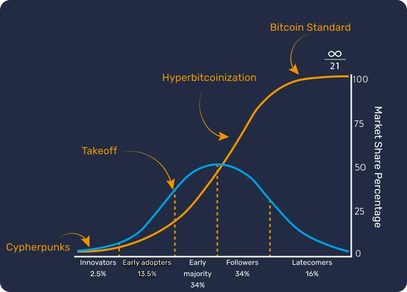

Muhimmancin abin nan shi ne ka fahimci wannan sabon fasaha a hanya mai jama'a, don haka muna fatan ka ji dadin wannan koyarwa kuma ka ci gaba da samarwa a cikin wannan sabon tsarin kudi na duniya.

## Tarihin Gaban Bitcoin

<chapterId>9a94b627-5b69-5d81-9125-f1fa9b0aa6ad</chapterId>

Kafin auran "Bitcoin" ya zama mai alfahari da adireshin kudi na zamani da sauyin tattalin arziki, aikin kafa shi ya fara ne ta hanyar tunani, sabuluwa, da yanayin tarayya. Cikin wadannan, yanayin cypherpunk ya fito a matsayin wani abu mai muhimmanci a cikin tarihinsa na farko na Bitcoin.

### Cypherpunks: masu gani na duniyar fasaha ta na'ura

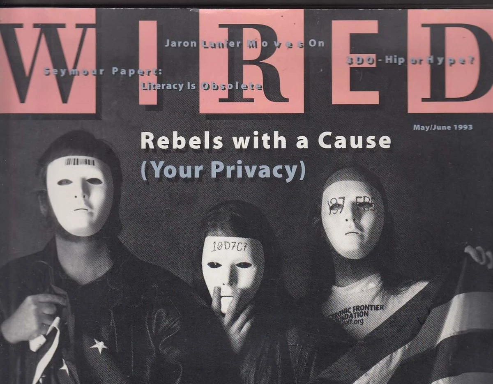

A cikin zuciyar ƙarancin fasahar fasaha na shekarar 1980 da 1990, ɗanɗano suka fara tambayar da ƙarfi a kan hanyar tsaro da yanci a zamanin fasaha. Wadannan mutane, da za a sani da suka biyo bayan "cypherpunks", sun tabbatar da cewa fasahar rubutu zata iya aiki kamar kayan aiki don kare hakkokin mutum daga shaidar gwamnatocin da kamfanonin babban girma.

Matakan gaskiya kamar Julian Assange, Wei Dai, Tim May, da David Chaum suna da muhimmanci a tsarin tunani da nazarin mafiya. 'Yan fahimtar da suka rika rarraba ra'ayoyinsu a cikin jerin wasikar da ta shaida tasiri, inda masu sha'awar daga dukkan fadin duniya suka shiga cikin hira game da hanyoyin mafi kyau don amfani da fasaha don samar da 'yancin kai mafi girma.

### Uku na ƙungiyar Cypherpunks na asali

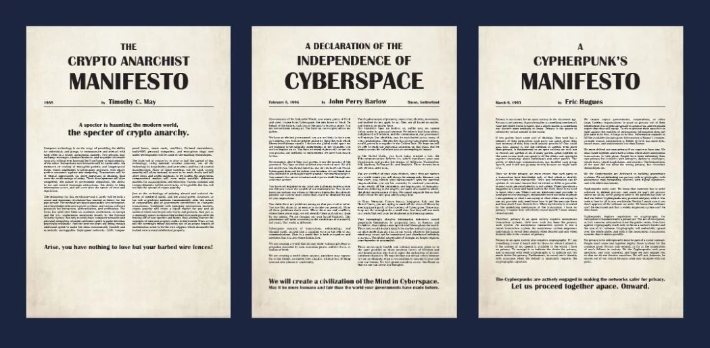

Mugunyar cypherpunk, wanda ya tsufa cikin aiki na zamani na digital da kuma cryptography, ya amfani da wasu rubutattun kuma na asali don fada tsarin da kuma tunanin shi na gaba. Cikin wannan rubutattun, uku ne suka fito sosai:


- "Maganganun Cypherpunk":

rubutaccen da Eric Hughes a shekara ta 1993, "Cypherpunk Manifesto" yake cewa tsaro ne hakkokin bawa dan adam. Marubucin yake cewa iya magana da kai tsaye da sirri ne abin da ya dacewa domin samar da al'umma mai yanci. Manifeston yake cewa: "Ba za mu iya jiran gwamnati, kamfanoni, ko kungiyoyi masu girma, masu fuska ba su ba mu tsaro [...]. Dole ne mu tsare tsarar mu idan mun so mu samu wani".


- "Kundin Tsarin Crypto-Anarchist":

rubutaccen da Timothy C. May a shekara ta 1992, wannan takardar ta bayyana yadda amfani da kammala za a iya kawo zamanin anarki na kammala inda gwamnatocin zasu kasance ba sa iya hada hannu a cikin ayyukan 'yan siyasa na mutane. May ya tuna gobe inda mutane ke canza bayanai da kuɗi ba tare da shawarar wani uku ba.


- "Sanarwarar da Kanfautaccen Yanci na Cyberspace":

ko da ba kawai cypherpunk, wannan rubutu yana nuna ra'ayin mutane da yawa da suka shiga aikin. An rubuta shi a shekarar 1996 ta hanyar John Perry Barlow, shi ne amsar karayar da gwamnati ke yi kan yanar gizo. Bayanin yana cewa yanar gizo ce wurin da ya bambanta da fadin duniya kuma ba a yi amfani da dokokin da suka shafi fadin duniya a cikin shi ba. Yana cewa, "Ba mu da gwamnati da aka zaba ba, kuma ba mu da tabbacin cewa za mu samu daya ba".

### Bitcoin na gabatarwa

Kafin zuwan Bitcoin, akwai ƙoƙarin ƙirƙirar kudi na zamani. Misali, David Chaum ya gabatar da ra'ayin "kudin zamani mai ɓoye" da shirinsa na "DigiCash" a cikin 1980s. Ba tare da ƙarin bayani ba, saboda matsalolin daban-daban, DigiCash ba ya yi tasiri ba.

Wani sabon abin da ya gabata shi ne "B-money" na Wei Dai. Koda kuwa ba a yi amfani da shi ba, ya nuna damuwar wani kudi na zamani mai suna da cewa, inda ake gano wadannan laifuffuka ta hanyar al'umma mai yin adana mafi kyau ba ta hanyar wata hukuma ta tsakiya ba.

Hoto dake ya bayyana yadda aikin ya ci gaba ta hanyar da yawa na sabuntawa na fasaha.

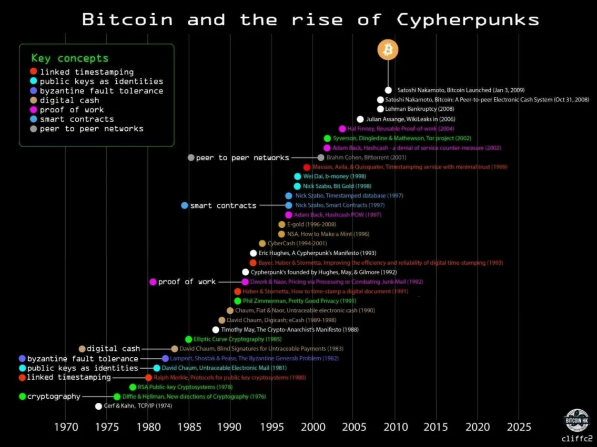

Yayi a cikin wannan yanayin mai kyau ne wanda Satoshi Nakamoto mai ban mamaki ya wallafa takardar bayanin Bitcoin a shekarar 2008. A cikin wannan takarda, ya hada wasu ra'ayoyin daga yanar gizon cypherpunk, kamar gaskiya na aiki da tsari na cryptographic, don samar da kudin adireshin da ba za a iya gagarumarwa ba da kuma kudin tsaro na digital.

Duk da haka, Bitcoin ya fi haka ne: ya nuna cimma na tsarin cypherpunk. Sai da fasaharsa, ya nuna yancin kan tsarin kudi na gargajiya kuma ya bayar da wata hanya mai ban mamaki ta kan gaskiya, rarrabewa, da mulkin al'umma.

### Makonni

Tarihin ƙanƙanin Bitcoin ya ƙunshi cikakken tsarin cypherpunk da binciken al'umma na samar da ƙarfin kariya a zamanin na'urar. Ta hanyar hada tsarin rubutaccen halitta, rarrabewa, da gaskiya, Bitcoin ya zama abin da ya fi kudi. A gaskiya, shi ne samfurin sabon salo na fasaha da fasahar zamani wanda ke ci gaba da sauya duniyarmu.

Don haka, Bitcoin shi ne tsarin da ya tsawo tsawon lokaci mai tsawo, kuma ya hana mu tambayi kan dangantarmu da iya, lokaci, da kuɗi.

Amma, shin Bitcoin ce adireshin "gaskiya"? Don fahimtar wannan, muna bukatar fahimtar ra'ayin kuɗi da irin-irinsa, wanda zamu duba a babban babi na gaba.

Idan ka so ka gano tarihin Bitcoin a cikin kashi, muna ƙaunar kaɗan muna shawarar ka a kan ƙungiyarmu na HIS 201, inda za ka gano asalin da kuma yadda Bitcoin ya fara fitowa, kuma kuma farawa na tarihin da al'umma. Wannan ƙungiya an rubuta shi cikakken bayani da ma'auni, tare da, kuma, da yawa daga cikin labarai:

https://planb.network/courses/a51c7ceb-e079-4ac3-bf69-6700b985a082
# Kudi

<partId>e913df1a-4cbd-5380-ba67-ca2a0414f671</partId>

## Kudi A Cikin Tarihi

<chapterId>c838e64d-d59f-5703-8c74-ea5e8c4fdd31</chapterId>

Tashin hali na kudi shi ne wani abu mai ban mamaki na tarihin mutane wanda yake nuna gaskiya na al'adun al'umma a duk lokacin da suke cikin bukatar ci gaba da ci gaba da kasancewa a cikin bukatar tattalin arziki.

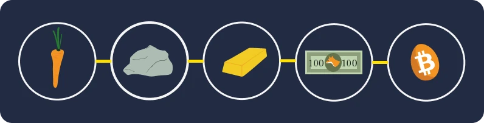

### Daga kokawa zuwa asusun kuɗi

A farko, kudi na da alaka da abin da ake iya ganinsa, kamar gona, dabbobi, ko wani abu mai amfani. Amma, abubuwan nan na da matsalar babban da suke iya bace, wanda yake sa wuya a yi amfani da su a matsayin wata hanya mai tsawon lokaci na adana kudi. Misali, an gona mara kyau ko cutar dabbobi za ta iya goge kudin mutum a cikin dare daya.

Don haka, kamar yadda al'adun suka ci gaba kuma ciniki ya watsa zuwa yankunan sabo, bukatar wata hanya mai zaman kansu ta kasuwa ta taso. Mutane na farko sun yi gwajin da abubuwan kamar kwayoyi da dutse masu yawa, amma ba su da tsada ko kakkautawa kamar yadda suka yi tunanin. A ƙarshe, zinari ya zama nauyi, saboda rarashinsa, tsadarinsa, da raba-rabansa. Shi ne, kuma yana nan har zuwa yau, alamar tattalin arziki da iko.

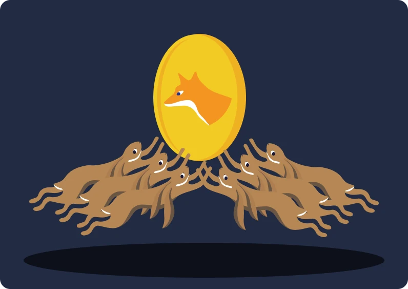

### Me ya ke nufin kuɗi?

Kudi shine kayan aiki mai inganci na sadarwa:


- Yana samar da damar sadarwa tsakanin yanzu da gobe, domin yana canza lokacinmu da iya mu zuwa abin da za'a iya amfani da shi a lokacin da zai zo ba tare da wuya na rashin kudin kudade ba.
- Ya taimaka wajen sadarwa a cikin harshen duniya: ba tare da san juna ko magana da harshen daya, guda biyu masu bauta zasu iya al'ada, ciniki, kuma amincewa akan darajar abubuwa.

Aiki a cikin duniyarmu ya yi wahala sosai wajen kirkire shi ta hanyar sana'a. A gaskiya, babu mutum ko kungiya da za ta iya samar da kuɗi, domin shi ne wani abu na tabbataccen halitta da ya kamata ya fito daga kasuwa da amincewar jama'a. A wannan hali, farashin su ne alamomi da kuma ƙididdige na bayanai da ke taimakawa al'umma a cikin yin adana kayayyaki.

Don haka, zinari a matsayin kudi shi ne sakamakon shekaru 4,000 na Darwinism na kudi bisa ga ayyukan Aristotle na biyu:


- **Adana da amfani**: kuɗi zai iya amfani da shi don kawo karfin sayar da abubuwa zuwa nan gaba, don haka ya kamata ya zama abu mai tsada;
- Mai sayarwa**: kuwa kudi zai iya amfani da shi a matsayin watauwa don sayen kayayyaki da kuma ayyuka maimakon cin amana, hakan yana kawar da matsalar samun abin da ake so tsakanin masu sayarwa;
- Ƙashi na asusun**: kudi yana ba mu damar yin kwatanta dabi'un abubuwan da dama don mu fahimci irin adadin da suka dace.


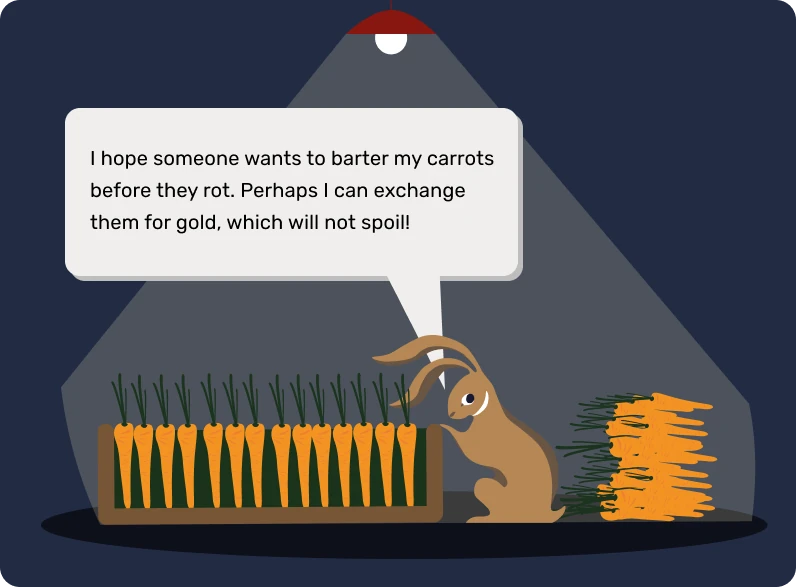

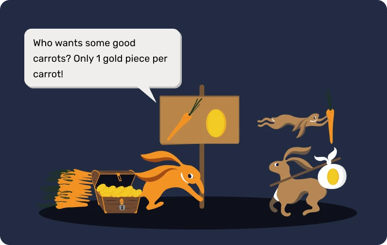

### Ƙungiyoyin kuɗi

Zinariya ta naɗa shi da alamun wanda ya dace da kudin: rarashin shi na tabbataccen yana ba shi daraja, yayin da siffofin sa na tabbataccen ba shi da wuya ya ragu a lokacin. Wannan siffofi sun sa zinariya ya zama wani **kayan ajiye kudi**, amma ba wani kudin da ake amfani da shi yake ba, saboda wannan irin kudin ba a iya raba shi ko kai shi zuwa wurare masu nisa ba. A cikin duniya mai zaman kansu da kuma fasaha, zinariya ta yi wuya ta bi wajen kuma ta bukatar wani makaman kuma ta sa shi ya zama wani abu da ake iya raba da kuma canja shi da sauki (i.e. ta hanyar kudaden da aka buga).

A kan gaba, kudaden hali na gwamnati (fiat) suna da amfani sosai, amma koyaushe an rage darajarsu ta hanyar masu sarrafa su (sarakuna, bankuna na tsakiya, sarakunan babba, manyan sarauta).

Don samar da wannan ra'ayi sosai, za mu dubi siffofin wadatar da kudi mai amfani:

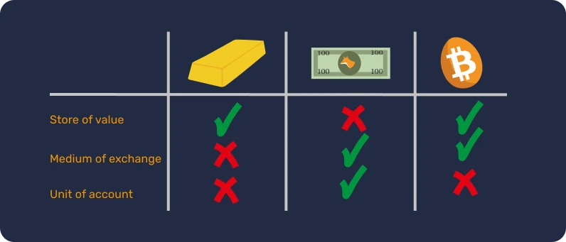


- Fungibility**, nufin da cewa za a iya canzawa da wani ɗan'ƙwalli na irin sa ba tare da rasa darajar ba;
- Divisibility**, domin ya iya raba zuwa cikakkun yankuna don saukaka cinikayya na yawan lemo daban-daban;
- Liquidity**, wanda ke nufin ya yi sauki a canza zuwa kayayyaki ko hanyoyi.

Don samun wannan shari'a, kuɗi ta tari da tari ta canza ta hanyoyi daban-daban:


- Dutsen rawa -> Kudi
- Takardar kudi -> Katin banki
- Blockchain -> Lightning Network

Kudaden kudi na ci gaba da canza zuwa yau da kullun, suke sauya su su dace da dama-dama. Kamar yadda muka ce, yayin da zinari ne mafi kyau na adana kudi, ba shi da amfani a tattalin arziki na duniya na yanzu ba. Haka kuma, kudaden kudi na amana kamar dalar da euro suna da kasuwanci mai sauƙi kuma anan gaba suke suka yi saboda su na yanzu haka kawai suke a cikin yanar gizo, amma darajar su na ci gaba da raguwa ta hanyar taimakon kudin.

Daga bangaren daya, Bitcoin yana bayar da damar sababbin. Siffofinsa, kamar yadda ake kwatanta kashi, yana sa shi ya zama wani babban wurin adana kudi. Wannan haka, a matsayin kudi na yanar gizo mai tsada, yana aiki kamar wani **tsarin canja kudi** wanda ya wuce iyakokin kasar. Duk da haka, ba a yanzu ba a yarda da shi a kasuwanci, koda kuwa ake [ci gaba da amfani da shi](https://btcmap.org/map).

## Kudin amana

<chapterId>25151d46-7db1-5b48-8bba-cbde1944555a</chapterId>

> "Wadanda basu tuna tarihin da ya wuce ba suna da damuwa su sake yin shi" in ji George Santayana.
Gaskiya da ta yi gaba sosai lokacin da ya shafi tsarin kudi na yanzu.

### Fiduciary = Aminci

Yau, kudaden mafi girma kamar Euro da Dollar an kira su fiduciary. Hakan na nufin ba su da darajar kai tsaye ba kuma suna dangantawa ne kawai da imanin da kuma amincin da muke sa a cikin hukumomin da ke sarrafa su.

Kudi na fiduciary shine irin kudin da aka umarci a matsayin haka ta hanyar hukumar, i.e. kasar, kamar kasar Sin da Yuan, ko hukumar tattalin arziki ta siyasa, kamar Hukumar Tarayya ta Turai da Euro. Hukumar da ke daukar nauyin fitarwa ita ce bankin tsakiya (Misali, za mu iya ambaton Bankin Mutanen Sin, Bankin Tsakiya na Amurka, ko Bankin Tsakiya na Jamhuriyar Guinea). Wannan ne kwararrun hukumomi ne da suka dauki nauyin tsara manufar kudi kuma don haka yadda ake bukatar ayyana ko buga kudin.

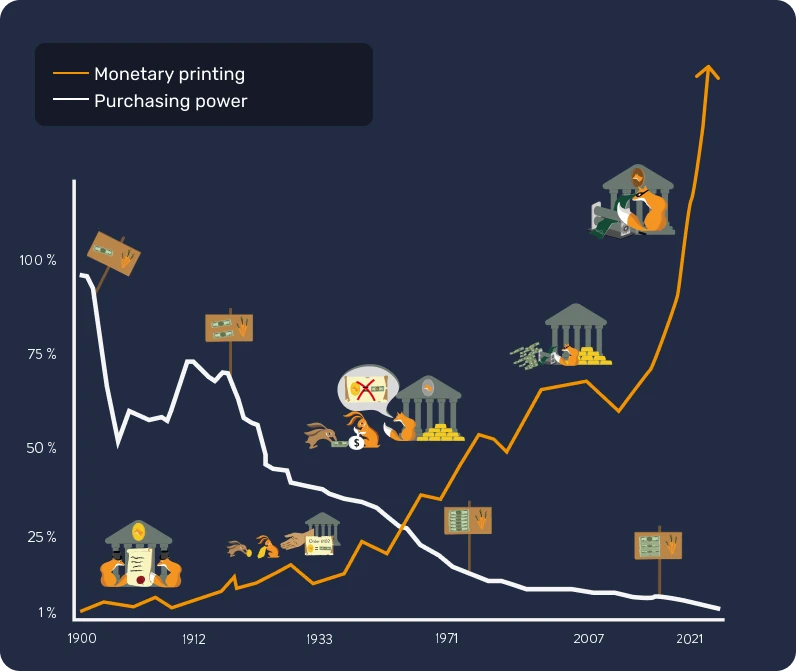

### Matakan gudummawa: tsarin da ya tsufa kamar Darajar Roma

Tun bayanin tarihi, zinari ya kasance tamkar adireshin kudi, amma ƙarfin sa ya kasance yana haɗa shugabanni, ko kuma gwamnatin zamani, su dora kudade mafi kyau, da yawa na amana.

Tashar daidaitaccen ne kuma ya samu damarwa daga yadda ake amfani da shi tun daga asali na al'adu. Jagoranci, masu son yin sarrafa kan kudi, suka fara da tattalin arziki na zinari, hakan ya fi karfafa su ne ta hanyar amfani da karfin su kuma a yi alkawari da tsaro da kuma tsaro. Da wannan kudin mai daraja a hannun su, suka shigar da kudin sabo, wanda ya yi kama da darajar zinari, amma an yi shi a cikin hoton su. Sannan kudin nan ya fara tafiya, kuma mutane suka sauri goge su ga sauki mai sauƙi na amfani da shi.

Duk da haka, sai dai shugabannin nan su fara rage darajar sabon kuɗin daidai, ta hanyar rage darajarsa da kashi daya ko biyu a shekara a kiyaye da farashin zinari na farko. Wannan rage darajar da ba a ji ba ake gudanarwa a kan hakan ne domin al'umma. A gaskiya, wadanda suke adana a cikin wannan kuɗin amana sun ga darajar adanansu na raguwa, yayin da gwamnati ta biya kudinsu na ayyuka ta hanyar tafiyar da kudin. Wannan rage darajar kuɗin kuma yana sa wani bashi ya zama mai sauƙi don biya.

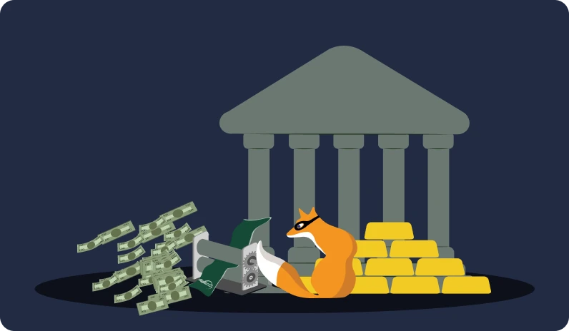

A lokacin da ake bukata, jagoran ya yi magana: kudin bai da tabbas na bin zinari ba. Al'umma, wanda yanzu sun saba da kudin da aka amince da shi kuma suna da rashin sanin abubuwan kudi, sun yarda da wannan gaskiya, wanda yake ba da damar gwamnatin yin wasa da yawan kudin da ta ke fitarwa da kuma buga kudaden da suka yi yawa a kusan babu kudin da ake biya.

Tace-tacen kudi na sauya zuwa ga tafiyar kudin kima kuma ya yi talakawa miskin sosai. Wanda haka, tsarin tattalin arziki an shirya shi kuma an hana shi don hana faduwar shi, domin wani tarin da zai iya jawo matsalar tattalin arziki mai yawa. A kan motsi, hukumomin tattalin arziki da mutane masu kudi suna samun riba sosai daga wannan tsari, wanda yake haifar da bambanci na rashin adalci kuma yana goyon bayan mulkin sarauta. A cikin wannan matakai, ba su da sha'awar yi wa tsarin canje-canje na asali, suka bari tsarin ya ci gaba da tafiya har zuwa lokacin da zai iya fashewa.

Idan da aka gudanar da shi kyau, wannan shawara zai iya dauka shekaru goma sha takwas. Amma, ya kamata a lura da cewa madaidaici mai sauri ko rasa aminci zai iya kawo karuwar tufafi (kalli babi na gaba). Tarihin ya nuna cewa dalar Amurka ya rasa 98% na darajarsa cikin shekaru 100, euro 30% cikin shekaru 20, da kuma na fenti sterling 99% tun daga lokacin da aka samar da shi.

A ƙarshe, kurudin zai iya kasancewa ba ya da alaƙa da zinari ba, kamar yadda kudin Roma ya kasance a ƙarshe na mulkin, ko kuma ya rage zuwa kashi mai amfani daidai, ba tare da alaƙa da gaskiya mai zane ba.

Yau, muna kallon wani lokaci na tarihi da ya canza. Dalarin, wanda ya yi tsauri sosai, yana nuni da cewa ya ragu, yayin da zinari ya rasa rawar da ya yi. Muna tsaye kan kofar wani sabon tsari na kudi, wanda yake tunani da mu cewa ayyukan tarihi suna da yawa da muke manta da su.

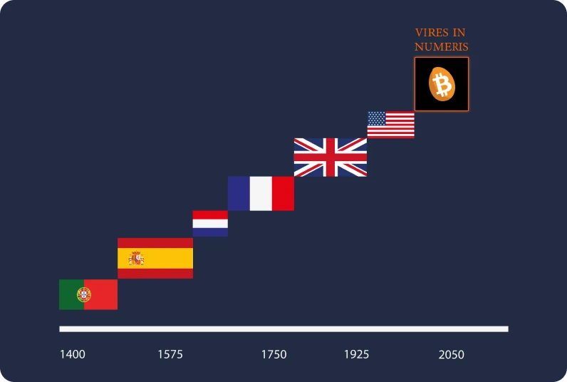

### Shine Bitcoin ita ce?

Saboda wadannan fasalin, injiniyar Bitcoin ke samun halin yau da kullun. A bisa ga kudaden da suka gabata, ba ya bukatar **wani na gaba na gaskiya** kuma yana nufin raba gwamnati da kuɗi.


A gaskiya, Bitcoin ya nuna kansa a matsayin amsa ga wadannan matsalolin da suka shafi tsarin tare da shawararwarin daidaitaccen amsa da sabon tsarin kudi na zamanin. Tarihi, idan an yi amfani da zinariya a matsayin kudi saboda kwarewarsa ga wadatar da kudi, Bitcoin kuma ba za a iya wadatar shi ba. Wannan kuma, ya kasa zuwa ga miliyan 21, saboda halinsa na daidaitaccen da kuma na fasaha. Bitcoin shi ne kudi da ya yi amfani da gaskiya da kuma kwarewa, yana ba da wata zaɓi mai kyau ga tsarin kudi na yanzu na tsakiya.

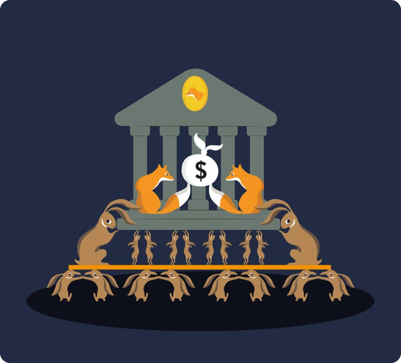

Wani dalili mai karfi da ya sa Bitcoin ya samu hankali shi ne zuwan kudaden hali na bankin tsakiya na tarayya, ko CBDCs, wanda ya yi kamar zai faru ne. Wannan sabon irin kuɗi zai bunkasa tattalin arziki mai tsarin tsaki, kuma zai iya hana 'yan kasar samar da 'yancin kuɗi da kuma taimakawa matsalolin da suka shafi mulkin sarauta.

Zamu iya kammala wannan babi da wannan fasali daga mai samar da kyautar Nobel F.A Hayek a shekarar 1984:

> "Ba na gaskata cewa za mu iya samun kuɗi mai kyau kuma, har sai da mu cire abin daga hannun gwamnati. Idan ba za mu iya cire su da ƙarfi daga hannun gwamnati ba, abin da za mu iya yi shi ne ta hanyar wani hanyar da ba su iya dakatar da shi ba."
Don samun karin bayani game da kuskuren tattalin arziki da yanci, muna kira ku ku gano irin wani koyar da muke bayarwa a cikin koyar da muke ECO 102, wanda yake binne rayuwa da tunanin Frédéric Bastiat, wani mai tunani na Faransa na karshen shekara ta 19, wanda za a iya cewa ya yi farin ciki da fitowar Bitcoin:

https://planb.network/courses/d07b092b-fa9a-4dd7-bf94-0453e479c7df
## Hyperinflation

<chapterId>b04c024c-54f3-50cb-997f-58721cfc74be</chapterId>

Hyperinflation shine wani abu na kudi wanda ya kai ga kudin fiat: an sanya shi da alamun rasa imani ga kudin da kuma karancin tattalin arziki saboda buga kudin daga gwamnati. Saboda haka, adadin kudin da mutane suka adana zai iya shiga cikin lokaci mai kadan, wanda zai iya sa kasar ta kai ga kashi na tattalin arziki, al'umma, da siyasa.

### Tsadar tattara mai yawa!

Don samun fahimtar tushen tauraron kudin adana, akwai bukatar mu dauki irin tauraron da dama.


- Da tashin kudin saye na 2%, kana rasa 2% daga iko na saye a shekarar, wanda ke kai ga 10% cikin shekara 5.
- Da 7%, ka rasa ɗari na ɗaya a cikin shekaru 10.
- Da 20%, ka rasa kusan rabin shi a cikin shekaru 3.

Idan da tashin kudin mai yawa ya faru, ba mu ke magana akan 20% a shekara ba, amma kuma 20% a watan ko, a karshe, har ma a rana. An samu tashin kudin mai yawa na 100% a rana a cikin uku, wanda shi ne halin da ya faru da yana faruwa a duniyarmu.

Ya yi muhimmanci a fahimci cewa hyperinflation ba ta faruwa ta hanyar tsaro ba, ta kasuwanci, ko ta hanyar yaki daga masu hulda. Hyperinflation ita ce sakamakon rashin daidaiton tsarin kudi da aka yi ta hanyar masu tsarin kudi da 'yan siyasa. Sakamakarta na shafa kowace dan kasar kuma hatta ta shafa kungiyoyin da za su zo. Muna kira ku da kaunar jama'a ka yi amfani da minti biyar ka karanta teburin da ke kasa don ka fahimci tasirin gaskiya na wannan halitta (koyarwar ECO204 ta ci gaba da cewa akan wannan batu). Kamar yadda ka ga, babu kasar ko kudin da ke cikin tsaro.

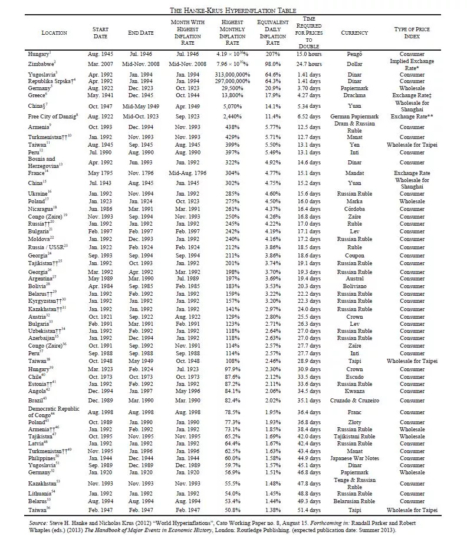

### Me yaya su ne na hyperinflation?

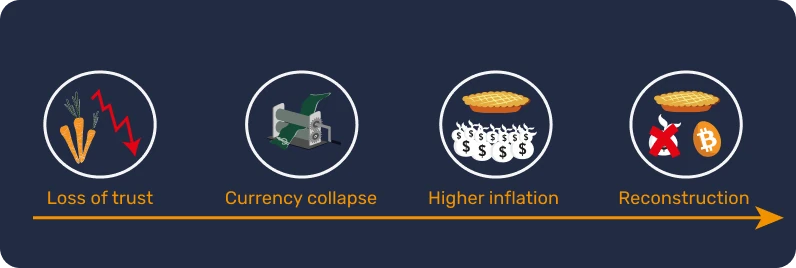

Don samun hyperinflation, wasu abubuwan dole su faru.

Makoma 1 - Rasa jin kunya


- Tsammanin daidaitaccen karfin kudi yana ba da damar samar da kudi da rashin adalci a cikinsa. A wannan mafita, wasu yankuna daban-daban za su iya kara wa'azi kan yawan kudi, kamar yaki, matakan al'umma, ko kara karfin abubuwan da suka da muhimmanci kamar gona ko mai. Don haka, za a iya rasa aminci a kan kudi, kuma mutane suka fara tambayi kan asalin kudi da amfani da tsarin kudi da gwamnati ta umarci.

Makonni 2 - Kasa na kudi da kara farashin abu


- Yayin da gwamnatin ta rasa shawara, mutane suka fara canja kuɗin su zuwa wani mai tsada, kamar yadda ya faru a Venezuela da dalar Amurka. Wannan matsala ta haɗa da ƙarar samar da kayayyaki, wanda ya haɗa da wani da'ira mai ƙarfi inda kayayyaki da ayyuka suka zama ƙara na tsada. Don cimma buƙatun nan da gyara siyasa ta kuɗi, gwamnatin ta buga kuɗi mafi yawa, wanda ya haɗa da tashin hankali na kuɗi.

Makale 3 - Doguwar hawa da ta'addancin buga kuɗi


- Don haka, an bukaci kudade mafi yawa don sayen kayayyaki, wanda ke jawo rashin kudin kashi. A amsa, gwamnatin ta dawo da buga kudade mafi yawa, wanda ke kara yin tafiyar tafiyar kudin kashi.

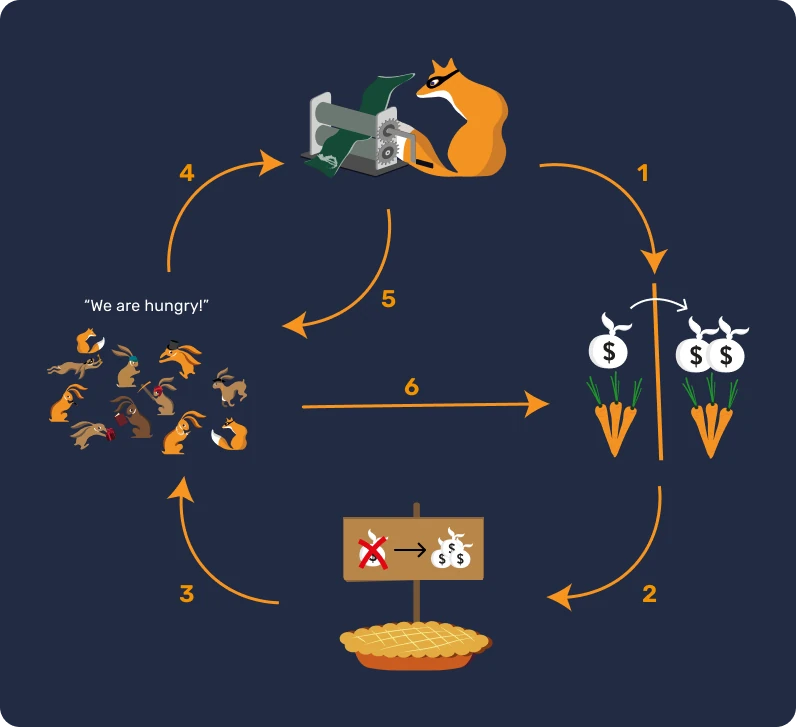

Makon 4 - Farkon da sabuwar kudi


- An kuma shigar da sabon kuɗi don maye gurbin na ƙari, domin katse da tawagar tattalin arziki ta hanyar gudanar da la'akari masu riga-kafi wadanda ba su kasance a wurin kuɗin da ya gabata ba.

Shawo kan wani matsalar tafiyar da yawa yana bukatar canje-canje mai ban mamaki, kamar suyi sabon gaskiya, canje-canjen gwamnati, canje-canjen masu gudanar da banki, da dai sauransu. Rasa aminci, kasa da kudin, da kuma sake gina suna da muhimmanci ga mayar da tattalin arziki kan kudin kashi.

### Uku na misalai m muhimmanci


- Jamus, 1922-1923.

Daya daga cikin misalan mafi ban mamaki na tafiyar kudi ya faru a Jamhuriyar Weimar ta Jamus bayan Yakin Duniya na Farko.

Jamusanci ya yi karɓar kudi mai yawa don biyan yaki. Amma, ba kawai Jamusanci ya rasa shi ba, sai ya biya biliyan-biliyan na dalar a matsayin kudade. Watan da ya fi samun yawan tafiyar kudi shi ne Oktoba 1923, wanda ya isa ga 29,500%, wanda ya kai ga tafiyar kudi na 20.9% a kowace rana. Farashin abubuwa ya yi kara kashi biyu a kowace kwana 3.7!

Kudin kasar nan na Jamus ya zama abin da ba ya da amfani haka kuwa wasu 'yan kasar suka fi so su yi wuta da kudin kertas da suka samu maimakon itace kayan adawa saboda hakan ya fi araha. An ce ma a cikin gidajen abinci, masu aiki suna bukatar sanar da abokan ciniki kudaden abinci kowace awa 30 don su dauki lafiya.

A ƙarshe, hukumomin suka ƙirƙira kurudin sabon, wanda ya yi amfani da bashin Jamus, Faransa, da Ingila, kuma ya tabbatar da ƙasa ta Jamus.


- Hungary, 1945-1946

Ƙasar da ta fuskanci lokacin da ta yi kasa a farko ita ce Hungary bayan Duniya Ƙarshen II.

Hungary ta sami kansa a kan gefen rikicin, tare da kusan dukiyar samar da abubuwan da ake yi a cikin gida. Watan da ya fi samun tashin hankali na tsadar kudade shi ne Yuli 1946, wanda ya ga tashin hankali na tsadar kudade na mamaki na 41,900,000,000,000,000%, wanda ya yi daidai da 207% a kowace rana. Kudaden suka yi kauri kowace 15 awa!

Sabon kudin da aka saka a cikin tafiyar anan shi ne 100 miliyan biliyan Pengo (100,000,000,000,000,000) a 1946.

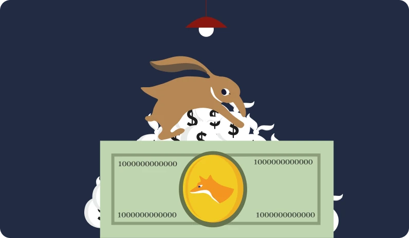


- Zimbabwe, 2007-2008

Har zuwa shekarar 2000, Zimbabwe ta kasance mai kwarewa ga kusan duk abinda take bukata sai mai.

A shekarar 1997, dalar Zimbabwe ya fadi da fiye da 72% bayan gwamnatin ta amince da biyan yakin basasa ga 'yan'yan yakin da dama da kudin Amurka na miliyan 450. Tun da gwamnatin bata da irin wannan kudin a cikin kayan ta, ta koma ga gudanar da buga kudi. A shekarar 2005, tattalin arziki ya isa 586%, amma kawancin shi ya kasance a tsawon watan Nuwamba na 2008 da aka kiyasta a 79,600,000,000% a kowace wata.

A cikin Yuni 2007 gwamnatin ta riga ta amsa ta hana sarrafawa, amma wannan mataki bai shiga cikin tattalin arziki ba. Kasuwanni suna cikin "garkuwa", kuma kasuwannin ba su da damar sake kawo kayayyaki a cikin dukansu ba.

A watan Afrilu 2009, Ministan Kwamitin Kasuwanci ya sanar da dakatar da kudin Zimbabwe da ya yarda da amfani da kudade na kasashen waje don kasuwa. Duk akaunta na banki, kwamitin kudin kula da kuma hukumomin kudi sun ga kudinsu sun kashe a cikin dare.


A ƙarshe, hyperinflation yana da tasiri na ƙarƙashin darajar kuɗin, wanda ke haifar da ƙarƙashin adadin kuɗi da rasa aminci a cikin tsarin kuɗi. Kamar yadda Voltaire ya yi magana, kuɗin da ba a daidaita ba zai ƙarƙata darajar sa na asali a ƙarshe kuma ya haɗu da sifili.

Kudi da ke amincewa da wani mai aminci na uku kamar masana'antar kudi, a aiki da a mafi tsawon lokaci, shi ne wanda ba ya daidai ba, domin ba zai iya tabbatar da iko na siye ko kuma kare adadin kuɗi.

Don samun karin bayani akan batun hyperinflations, muna shawarar ka aikata kursin ECO 204 na David St-Onge, inda za ka koyi abin da ake kira da hyperinflationary cycles da kuma tasirin da suke yi a rayuwarmu. Za ka iya gano kuma alamar da ke tsakanin wadannan kungiyoyi da, mafi muhimmanci, yadda za ka kare kanka daga su.

https://planb.network/courses/caa75343-ac90-4249-bcca-0e2e57c3a0f1
## 21 miliyan bitcoins

<chapterId>f4a06d76-1963-56fd-93ff-dfa41489bcde</chapterId>

### Tsarin tattalin arzikin Bitcoin

Bitcoin shine adadin kudi na yanar gizo da aka tsara da adadin mafi girma na **21 miliyan kashi**. Wannan sifin da ya kasancewa na rashin yawa an tsara shi ta hanyar lambar kwamfuta da aka yi amfani da shi kuma an inganta shi ta hanyar taron dukkan masu amfani da shi a cikin tsarin.

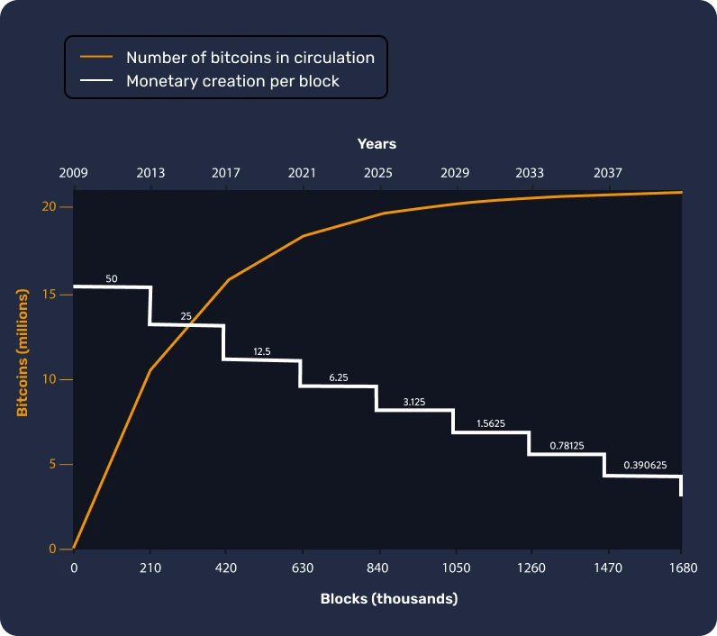

Adabiyyar kudin ta iya nuna da hanyar wani kwaro wanda yake nuna yadda bitcoins suka fito a cikin lokaci. Misali, a 2022, an sami kimanin bitcoins 18.5 miliyan a cikin tafiyar. Bayanai sun nuna cewa a 2025, za a sami kimanin bitcoins 19.5 miliyan, wanda yake nufin kimanin 93% na adadin kudin, kuma a 2037, wannan lambar zata isa bitcoins 20.4 miliyan.

### Yaya sabon bitcoins ke ƙirƙirarwa?

Samar da sababbin bitcoins shine sakamakon adana. A kashi, adana suke amfani da kwamfuta mai karfi wanda yake lissafin matsaloli mai ban mamaki, wanda yake tabbatar da kuma tsara shagulgulan. Idan an lissafa matsala, adanin ya kara sabon block na shagulgulan zuwa ga blockchain, wani rukuni mai tsada da ya bambanta da ya rarraba duk shagulgulan da aka yi akan hanyar. Blockchain yana tabbatar da gaskiya da tsaro, domin kowanne block ya hada da wanda ya gabata, hakan yana sa shi ya zama kamar ba zai yiwuwa a canza bayanai ba ba tare da amincewa daga hanyar ba.

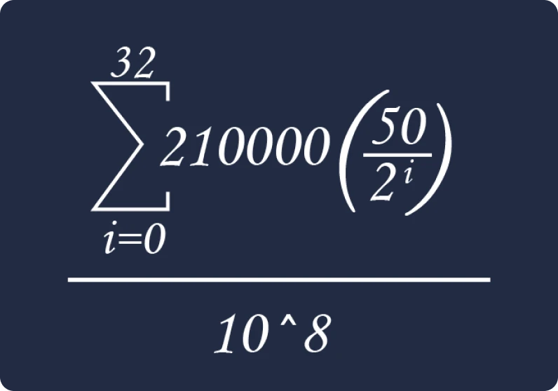

Bayan da suka yi nasarar yin wannan aiki, masu noma suna samun albashi da sabuwar kudin bitcoin kowace goma sha minti. Wannan albashi an shirya shi don ya raba biyu kowace 210,000 blocks, wanda ya kai kusan shekara hudu (wani abu da aka sani da "halving"), yana ba da tsawon kudin da aka fitar da hali kamar tsaye. Saboda wannan tsarin, za a iya bincike da al'adu cewa halitta na sabuwar bitcoin zai dakile a shekarar 2140, lokacin da dukkanin lambar ta isa iyaka na miliyan 21.

| Lamba Kariyar Lambobi | Tsawon Dutsi | BTC Biyan Buki Bayan Lamba Kariya | An Kiyasta BTC a Tattara Bayan Lamba Kariya |

| -------------- | ------------ | ------------------------- | ------------------------------------------ |

| 1              | 210,000      | 25 BTC                    | 10,500,000 BTC                             |

| 2              | 420,000      | 12.5 BTC                  | 15,750,000 BTC                             |

| 3              | 630,000      | 6.25 BTC                  | 18,375,000 BTC                             |

| 4              | 840,000      | 3.125 BTC                 | 19,687,500 BTC                             |

| 5              | 1,050,000    | 1.5625 BTC                | 20,343,750 BTC                             |

| 6              | 1,260,000    | 0.78125 BTC               | 20,671,875 BTC                             |

| 7              | 1,470,000    | 0.390625 BTC              | 20,835,937.5 BTC                           |

| 8              | 1,680,000    | 0.1953125 BTC             | 20,917,968.75 BTC                          |

| 9              | 1,890,000    | 0.09765625 BTC            | 20,958,984.375 BTC                         |

| 10             | 2,100,000    | 0.048828125 BTC           | 20,979,492.188 BTC                         |

| 11             | 2,310,000    | 0.0244140625 BTC          | 20,989,746.094 BTC                         |

| 12             | 2,520,000    | 0.01220703125 BTC         | 20,994,873.047 BTC                         |

| 13             | 2,730,000    | 0.006103515625 BTC        | 20,997,436.523 BTC                         |

| 14             | 2,940,000    | 0.0030517578125 BTC       | 20,998,718.262 BTC                         |

| 15             | 3,150,000    | 0.00152587890625 BTC      | 20,999,359.131 BTC                         |

| 16             | 3,360,000    | 0.000762939453125 BTC     | 20,999,679.566 BTC                         |

| 17             | 3,570,000    | 0.0003814697265625 BTC    | 20,999,839.783 BTC                         |

| 18             | 3,780,000    | 0.00019073486328125 BTC   | 20,999,919.892 BTC                         |

| 19             | 3,990,000    | 0.000095367431640625 BTC  | 20,999,959.946 BTC                         |

| 20             | 4,200,000    | 0.0000476837158203125 BTC | 20,999,979.973 BTC                         |

Zamu dawo zuwa fahimtar yankan a cikin kuma cikakken bayani a [babban littafin mai yanki](https://planb.network/courses/2b7dc507-81e3-4b70-88e6-41ed44239966/dbb8264a-7434-57e4-9d1b-fbd1bae37fdf).

### Ta'addanci adadin zamani

Iyakar daidaitaccen 21 miliyan shine tushe na kakkautar Bitcoin, kuma an tabbatar da shi ta hanyar biyu na muhimmi: gyara wahalar mining da kimiyyar wasan kwaikwayo.


- Sauyin kama na adana matsalar ne wanda yake faruwa kowane 2016 blocks, ko kimanin kwana biyu, don tabbatar da cewa sabon block ya kara zuwa ga blockchain kowane minti goma a tsawon lokaci. Wannan tsawon lokaci na kirkirar block da kuma yawan bitcoins suna cikin sakamakon Bitcoin da ba za a iya canzawa ba sai da amincewar al'umma, ba kamar yadda ake daukar hukuncin a cikin tsarin kudi na gargajiya.

Matsalar samun hash mai inganci na bi wani irin taurari: idan adadin masu noma ya karu, hakan na nufin cewa adadin blokan da suka samu ya karu, wanda ke kawo karuwa a cikin lokacin da ya kamata a samu block. Saboda haka, matsalar ta karu. Saboda haka, adadin blokan da masu noma suka samu ya ragu, wanda ke nufin cewa tsarin ya komo cikin matsayin da ya kamata na 10 miniutes a kowace block. Don Allah ka duba hoto a kasa don nuna hakan a fili.

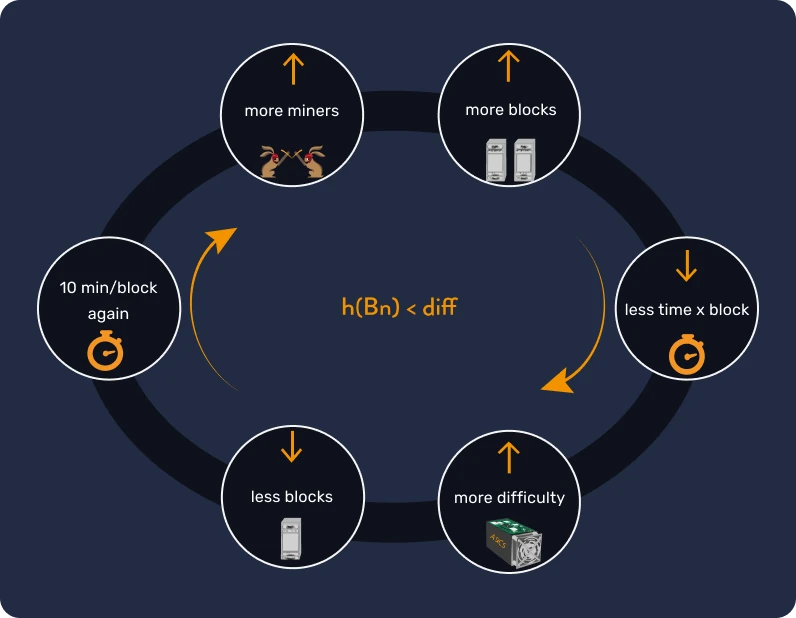

Kuna ka san cewa masu noma suna da kariya don noma block domin samun sabon bitcoins ta hanyar tallafin block, da kuma biyan bukatun daga cinikayyin da suka hada a cikin wannan block?

Don haka, yayin da yawan bitcoins da aka fitar ya kusa da iyaka na miliyan 21, adawa zasu samu biyan bukata fiye da ta hanyar tallafin block.


- Game theory shi ne tsarin lissafi da ya dauki aiki akan hankalin mutane. Yana yi daidai da cewa mutane za su yi aiki da hankali, su nemi samar da riba ga kansu yayin da suke lura da zaɓuɓɓukan da wasu za su yi. A cikin Bitcoin, game theory yana taimakawa don tabbatar da cewa mafi yawan mai sayar da kuma masu amfani za su yi aiki a cikin al'umma na hanyar sadarwa. A gaskiya, domin canje-canje na tsarin an yi shi ta zabe na masu amfani, kowane canje-canje ga tsarin Bitcoin zai bukata amincewa na al'ummar masu amfani, wanda shi ne abu mai wuya sosai. Don haka, idan wani ya so ya ƙirƙira Bitcoin na 22 miliyan, zai bukata ya shawarci duk masu amfani su yarda da rage darajar kuɗin adalci na kansu, wanda ba shi da wuya saboda Bitcoin shi ne duniya kuma ba shi da gwamnati ta tsakiya.

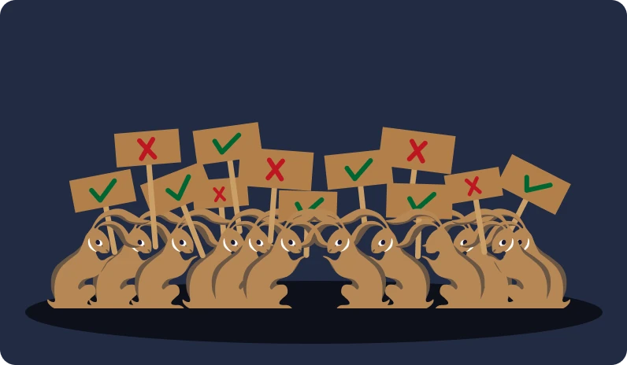

Tuniyar daidaitawa na kurudin kudi ya hana da tunani na asali na Bitcoin, don haka canja a yawan adadin shi na iya kasancewa ba zai faru ba.

### Kayan aiki mai iko na kudi: kowane lokaci, daga farko har abada!

Rarancin Bitcoin shi ne babban abu, kuma yawan samfurin 21 miliyan bitcoins a cikin tattalin arziki ne jama'a kuma kowace mutum zai iya tabbatar da shi.

A gaskiya, duk wanda ya so zai iya yin wannan ta hanyar Bitcoin node (i.e. mai tabbatar da ciniki) ta hanyar shigar da umarnin da ke kamar haka: `bitcoin-cli gettxoutsetinfo`. Wannan gaskiya ta ƙara karɓar aminci a cikin tsarin Bitcoin, wanda ba a kan hukumomin al'umma ko mutane ba, amma kuma a kan tsari na lissafin da kuma tsarin rubutun da ke cikin shi (Za ku koya yadda za ku yi wannan da sauki a cikin LNP201).

```json
{
"height": 710560,
"bestblock": "0000000000000000000887384d67103412ea7f18a43953e65c8c4ac36bf42e54",
"transactions": 473244,
"txouts": 1018917,
"bogosize": 2183872374,
"hash_serialized_2": "eebb9987337700ffaacbbaa11223344",
"disk_size": 178239584,
"total_amount": 18745998.12345678
}
```

Bitcoin na tabbatar da sarrafa kudi mai kyau ta hanyar yin iyakar halittarta ta tsarin, wanda yake sa shi bambance da kudade daban saboda zai iya kare adadin masu amfani. Ya zama daidai da tsarin kasuwanci na Austrian, adadin shi mai tsada da yadda ake yin halitta ya kare shi daga cikakken hatsarin tafiyar kudi da kudade na gargajiya ke fuskanta (duba ECO201 don sanin karin bayani).

A takaice, Bitcoin, tare da halin da ya kasance ba'a daidaita ba, kashi mai yawa, da bayani, yana ba da wani zamani mai ban mamaki ga tsare-tsaren kudade na gargajiya. Yana nuna yadda ake iya amfani da fasaha don ƙirƙirar kudi da ba kawai ake amfani da shi kuma ake tabbatar da shi ba, amma kuma yana kare darajar adadin kuɗin adana na masu amfani ta hanyar maida kashi a kan adadin shi.

### Karinƙi na ɓangaren 1!

# Bitcoin Alabobin

<partId>28860585-4f61-59d9-b242-f4c57d837cc1</partId>

## Meene Bitcoin wallets?

<chapterId>1c0166ab-cb7a-5bc6-9175-d13482bd91f1</chapterId>

A cikin sashi na 2, za mu yi nazari kan adana da tsaro na Bitcoin ta hanyar amfani da alabobin kudi, don fahimtar inda ake samun wannan Bitcoin masu yawa da yadda za a tuntuba da su!

### Bayananin jakunan Bitcoin

Mu amfani da alabobin kudi don tuntuba da hanyar sadarwa ta Bitcoin a cikin uku na asali:


- Don samun bitcoins
- Don aika bitkoini
- Don samar da su tsakanin hacking da kokarin sace

Wani jakin Bitcoin zai iya samun dabi'u da yanayi da yawa: software akan kwamfutarka, aikace-aikace akan wayarka ta hannu, na'urar sifili kamar wani USB key, ko kuma wani takarda. Kowanne daga cikinsu yana bada aiki da dabi'u daban-daban. A gaskiya, wasu an tsara su don mu'amala da yawa tare da kara hankali kan tsaro, yayin da wasu ke daukar nauyi kan sirri, ko kuma suna nufin biyan kuɗinmu na kowace rana na kudade masu yawa.

Portfolios zasu iya auna a cikin ƙungiyoyi na amfani, koyaushe a kan tambayar mai muhimmanci: shin kai ne mai daidaita kuɗin ko kai ne ka bar sarautar kuɗinka ga wani? Za mu yi nazari kan wannan batu a cikin babi na gaba, amma tambayar ta kasance mai sauki: shin kuɗin na cikin aljihunka ko na cikin aljihun mai amfani da banki?


### Yaya jakin Bitcoin yana aiki yaya?

Ko shine wakilinka Bitcoin ko kanka, babban yawan jakuna na Bitcoin suna aiki da fasahar da ta dace da fasahar asimetric, wadda take da tsarin ma'aikatan key: key na sirri don sayarwa da key na jama'a don karɓarwa.


- Makaman sirri

Da ka fara samar da alamar kudi, maganar sake samun (makami) ya zama sirri kuma aka nuna maka a matsayin kalmomi 12 ko 24.

Mafita na sirri na da muhimmanci ne saboda yake nuna mulkin bitcoins da kuma hakkokin amfani da su ko aiko da su. Don haka, mai da mafita na sirri shi ne mai gaskiya na bitcoins.

Wannan makulli ya kamata a rike shi da sirri kuma a kare shi kyau, domin ya bude kudinka!


- Makaman sarauta & adireshin

Makaman sarauta an haifar da ita daga makaman sirri kuma an haɗa da ita. Raba makaman sarauta yana haifar da hatsari ga tsaro (saboda wasu masu amfani zasu iya ganin kudinka) amma ba ga tsaro (saboda ba zasu iya amfani da kudinka ba ba tare da samun makaman sirri ba). A mayar da haka, an yi amfani da makaman sarauta don ƙirƙirar adireshin Bitcoin, kuma haka ake karɓar kuɗi.

Wadannan adireshin an halitta su ne ta atomatik na ɗakin kuwaɗinka kuma za'a iya raba su da kyau. Don kara inganta tsaro na sirri, shawara ce ka amfani da su sau ɗaya kawai.

A cikakken magana, wannan fasahar ta ba mu ikon samun bitcoins ba tare da baiwa mai karɓar damar sace kuɗinmu ba! Akwatin wasiƙa zai iya zama misali mai dacewa: mutane za su iya jefa kuɗi cikin shi, amma kai kadai ne wanda zai iya buɗe shi.

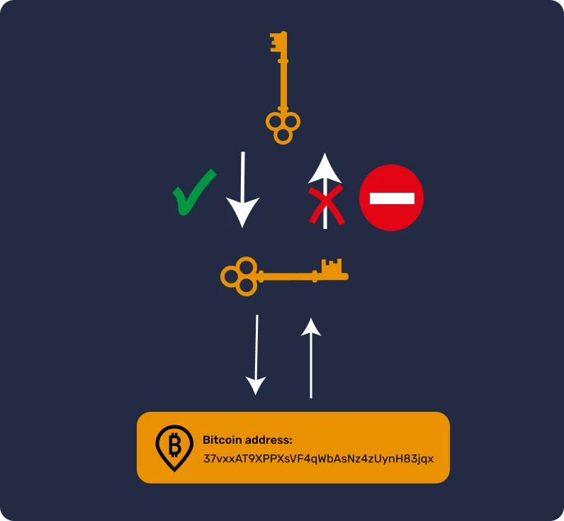

### Shin bitcoins a cikin alamar?

Ko da manyan makullinka suna a cikin alamarinka, amma bitcoins din kanku na aikatawa "a cikin" cikin Bitcoin blockchain, wanda shi ne rubutun haske na jama'a a cikin hanyar Bitcoin peer-to-peer (za mu yi magana game da shi a bangaren 3). Hakanan, hakanan, yana nufin cewa rasa na'urar da ke da alamarinka ba zai haddasa rasa bitcoins dinka ba ne. Abin da yake ba ka damar sake samar da alamarinka kuma ka yi amfani da bitcoin dinka shi ne makullin sirri, don haka ka tuna da tabbatar da shi daidai!

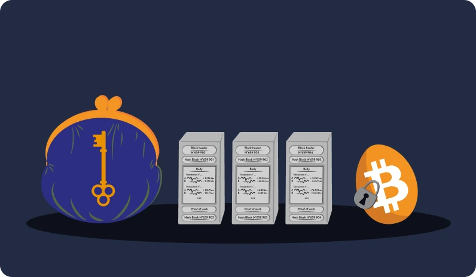

Murna da farin ciki, tun daga 2017, makullin sirri zai iya wakiltar da jerin kalmomi 12 ko 24, wanda ake kira 'kalmomin maimakon', wadanda suka yi sauƙi ajiye. Wannan kalmomi na aiki kamar ajiye kudi da kuma ba ka damar sake samar da aljihunka ta amfani da kowane software ko manhajar Bitcoin. Don haka, kowane mutum da ya samu wannan jerin kalmomi zai iya samun damar shiga cikin Bitcoin naka.

### Me ya kamata a yi akan maƙera?

Me ya kamata mutum ya fahimci cikakken kalmar mu na 12 ko 24 ta hanyar kuskure? Amsar gajeru ita ce, hakan na iya kasancewa ne, saboda tsarin fasaha da aka amfani da shi wajen kirkirar alamar kuɗi. Don jin dadin hakan, samun cikakken kalmar ku na kuskure na kama da samun "lamban daidai" tsakanin 1 da $2^256$, wanda hakan ya kusa da kama da samun "atom din daidai" a cikin Duniya. Duk da haka, idan ba ka jin dadin wannan tsarin tsaro na asali ba, za ka iya ƙara wa shi inganci ta hanyar ƙara kalma ta rahoto (kalmar ƙarƙashin) zuwa ga alamar kuɗin Bitcoin.

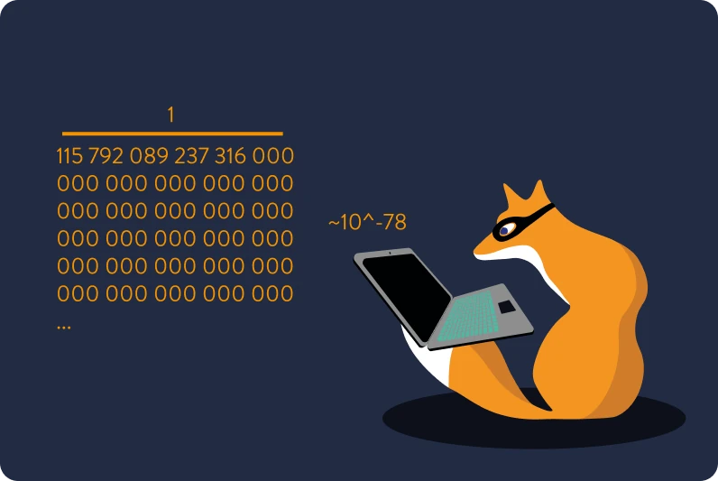

Don haka, damar aikata wani abu kan alamar Bitcoin ɗinka ita ce mafi ƙasa idan ka bi tsarin tsaro mai kyau da za mu bayyana a ɓangaren gaba.

Ka tuna a ka ka zaɓi jakar hannu mai dacewa da bukatunka da amfani: koyarwar cikakken yadda za a sarrafa da kula da irin jakunan hannu daban-daban akwai a [sashe na koyarwa na jami'armu](https://planb.network/tutorials/wallet).

Idan, a cikin tafiya ta kasa ɓarna, kana so ka karanta karin bayani akan yadda ake gina alamar Bitcoin, daga tashin hankali zuwa samar da adireshin, muna shawarar ka aikata CYP 201 wanda aka kirkira domin wannan batu:

https://planb.network/courses/46b0ced2-9028-4a61-8fbc-3b005ee8d70f
## Bitcoin Alamar da Tsaro

<chapterId>00c1afea-e54a-511f-bab3-2efc2fbfa6a1</chapterId>

### Yin tambaya daidai kafin a fara

Idan ka da bitcoins, tsaro na kuɗin ka shine damuwa mai yawa. Hanya mafi kyau don ƙayyade matakin tsaro da ya dace da matsayinka ita ce ka tambayi kanka tambayoyi na tsawon lokaci:


- Wane ne zai iya samun damar kuɗin ku? A kalmomin sauran kalma, shin kana da damar kawai zuwa kuɗin Bitcoin ɗin ku, ko wata ɗaya (kamar kamfanin) ta ba ka damar zuwa kuɗin ku?
- Yaya kake nufin amfani da bitcoins a cikin alamar wannan? A kan gaba? Domin ajiye a tsawon lokaci, ko a tsawon lokaci mai tsawo?
- Me ya kasance su na fasaha?
- Me ya ke kwantitarka na tsaro?

Babu amsa ko aiki mai zaman kansa da ke daidai ga dukkanin, don haka ka dauki lokaci ka amsa tambayoyin nan, domin zai taimaka maka wajen gyara tsarin tsaro na naka.

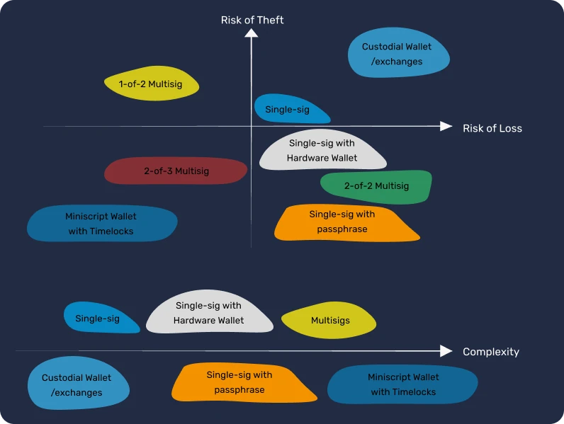

### Yin tattaunawa akan alama Bitcoin a matsayin tattalin arziki

Anan kasa, za mu bayyana wasu matakan tsaro:


- **Matsayin 0**, ka yi amfani da wani abu mai suna "aiki na kula da kudin" inda ba ka ne kawai mai daidaita bitcoin ɗinku ba. Ka san cewa wannan uwa mai aminci zai iya hana ka samun damar samun kudin ɗinku ne na koyaushe. A wannan lokaci, matsayin ka na yada kudaden ka ya yi kama da na tsarin asusun kudi na gargajiya tare da asusun kudi.

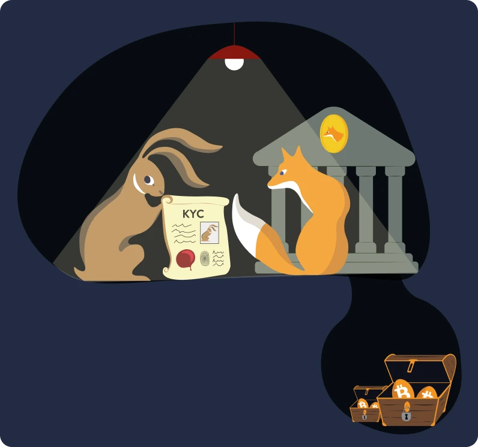


- **Matsayin 1**, ka yi amfani da alamar Bitcoin a wayarka ko kwamfutarka, inda kana kai kadai mai daidaitawa da bitkoininka kuma za ka iya yin cinikayyanka da sauki. Kayan aiki da aka ambata a baya an ce shi "hot wallet", saboda makullin sirri ya adana a na'urar da ke da amfani da yanar gizo. A wannan hali, ya kamata ka saka duba da kalmomin sirri don sake samun damar shiga cikin asusunka idan ka rasa wayarka ko kwamfutarka.

Misali, za ka amfani da Sparrow Wallet azaman jakar mai zafi:

https://planb.network/tutorials/wallet/desktop/sparrow-7e9a77c0-013d-4f8e-a811-408b71dc7607

- Matsayin 2**, ka yi amfani da aljihu mai jiki, kuma ka tabbatar da jerin kalmominka na 12/24. Ana yin magana akan shi da suna "aljihu mai sanyi" saboda ana adana makullinka a kan na'ura da ba'a haɗa ta hanyar yanar gizo ba. A wannan lokaci, za ka kasance ka na bukatar sa hannu a kowane mu'amala tare da na'urarka, wanda yake sa kudin ka ya kasance ba a samuwa a kowace rana.

Misali, za'a iya amfani da Ledger, ko Satochip, ko kuma Tapsigner:

https://planb.network/tutorials/wallet/hardware/ledger-nano-s-plus-75043cb3-2e8e-43e8-862d-ca243b8215a4
https://planb.network/tutorials/wallet/hardware/satochip-e9bc81d9-d59b-420d-9672-3360212237ba
https://planb.network/tutorials/wallet/hardware/tapsigner-ab2bcdf9-9509-4908-9a4a-2f2be1e7d5d2
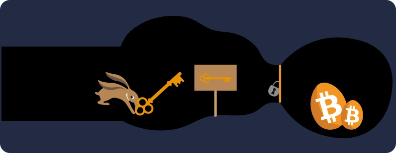


- **Matsayin 3**, ka yi amfani da alamar kudi na matsayin 1 ko 2, amma ka kara wata kalmar sirri. A wannan lokaci, ka sani cewa akwai bukatar ka ajiye jerin kalmomi 12/24 **da** kalmar sirrinka. A matsayin alamar, wadannan biyu na bayanai za a ajiye su a wurare biyu daban-daban.

Don samun karin bayani akan yadda ake amfani da kuma aiki da kalmar sirri na BIP39:

https://planb.network/tutorials/wallet/backup/passphrase-a26a0220-806c-44b4-af14-bafdeb1adce7
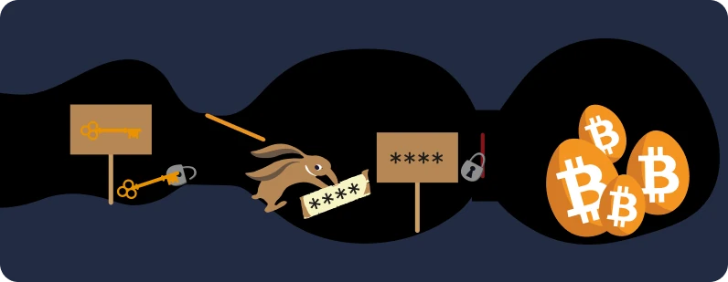


- Matsayin na 4**, ka yi amfani da ɗayan alƙawari don ƙirƙirar alƙawarin "multisig", wanda hakan na nufin an bukatar sa hannu da yawa don gudanar da ciniki. A wannan lokaci, ka tuna cewa kowace ɓangare na multisig ya kamata a ajiye a wurare daban-daban. Wannan hanyar an yi mafita ta samar da amfani mai ban mamaki da Bitcoin, mafi yawancin lokacin don sarrafa kudade masu yawa da kuma ayyukan kamfanoni.

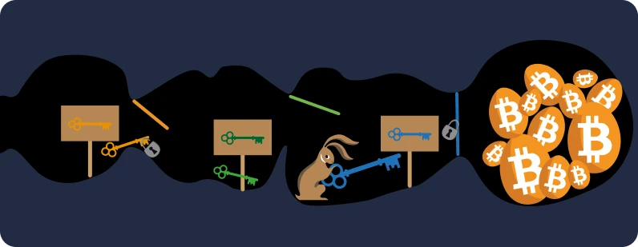

Tabbatacce, amfani daban-daban na bukatar alabe Bitcoin daban-daban, kuma babu wata halitta mai dacewa da duka.

### Tsaro ya dace a sauya

Adadin daya yake son barwa a kan matsayin tsaro mai yawa ya danganta da kowace mutum. Ga wasu, barin 1 BTC a kan jakar kudi mai zafi ya dace, yayin da, ga wasu, shi ne kuma kuskure. A kowace halin, idan kake son tsara adadin karami, muna shawarar ka kar a yi amfani da kudi mai yawa don tsara ta hanyar sayen jakar kudi ta fizikanci. Kuma, ka tuna cewa yin wahala da matsayin tsaron da samun damar bitcoins naka zai iya kasancewa laifi, musamman idan ka kuskure a sarrafa dubban jakunan kudinka.

A ƙarshe, samar da bitcoin ɗin kai ne abu ne mai muhimmanci don tabbatar da alheri na kudi. An shawarci a yi amfani da aljihu na waya don biyan bukatun kowace rana kuma ajiya mai sanyi, ko "safiya," don adana kudade masu yawa. Kungiyoyi, a gefe guda, ya kamata su yi amfani da tsarin sashi mai yawa, ko "multisig," don samar da tsaro mai yawa da rarraba. Yana da muhimmanci kuma a kiyaye daga ayyukan kula da kudaden, wadanda zasu iya kara matsalolin tsarin kudi na gargajiya.

Da wannan a zuciyarmu, yanzu zamu iya zuwa ga sashi na gaba inda muka bayyana yadda za a kirkira alamar Bitcoin. Duk da haka, idan kana so ka ci gaba da bincike akan batun tsaro, za ka iya karanta wannan [makala ta DarthCoin](https://asi0.substack.com/p/bitcoin-soyez-votre-propre-banque).

## Saitin Wata Alaburka

<chapterId>615519eb-4565-557d-86a0-021badf7616f</chapterId>

Tsaro na kuɗin Bitcoin ɗinku na da muhimmanci sosai, kuma kuskure mai ƙarami zai iya samar da matsaloli mara kyau. Don haka ne muna buƙatar koyi da hanyoyin mafi kyau da za'a bi a lokacin kafa alamar kuɗin Bitcoin mai sabo.

Da fatan ka lura cewa akwatin darasi na BTC102 zai taimaka maka wajen wucewa wannan matakin.

https://planb.network/courses/f3e3843d-1a1d-450c-96d6-d7232158b81f
### Wannan matakin bai da dariya ba ne!

Yayin da ka gina alabe, aikin na yanzu yake samar da makullinka na asali, wanda ya ke nuni da jerin kalmomi 12/24 (wanda ake kira "kalmomin noma" ko "kalmomin gano"): kalmomin ne suke ba da damar shiga asusunka. Idan wannan makulli ya bayyana ga wani na uku, za ka yi la'akari da asusunka da suka da alaƙa da shi a matsayin wanda aka cire. Don haka, yayin da ka ke gina alabarka, ya kamata ka bi wadannan dokokin:


- Rufe dukkanin kamarori.
- Kada ka dauki hoton jerin maganganu.
- Kada ka shigar da shi a kan kwamfuta ko wayar.
- Kada ka ajiye shi a matsayin sanya lamba ko aiko mishi ta hanyar SMS.
- Kada ka bar maganganunka ba a hange a kan gado.
- Kada ka boye jerin kalmominka a wani wurin da ba a sani ba.

Kuna ya take ka dauki takarda mai tsinke ko ka buga wannan [template](https://bitcoiner.guide/backup.pdf), kuma ka rubuta jerin kalmomi da alƙalami, bi wajen da aka nuna makiyan da kuma kyau. Ka san cewa idan alƙalar ya ƙare lokacin, za ka rasa kuɗinku. Don haka, ya kamata ka kiyaye wannan takarda daga wadannan abubuwan da suke iya halaka ita, kamar ruwa ko wuta.

Don Allah ka sami misali na yadda za a tattara takardar nan a kasa: kalmomin suna wofi, don haka ka yi amfani da su ba!

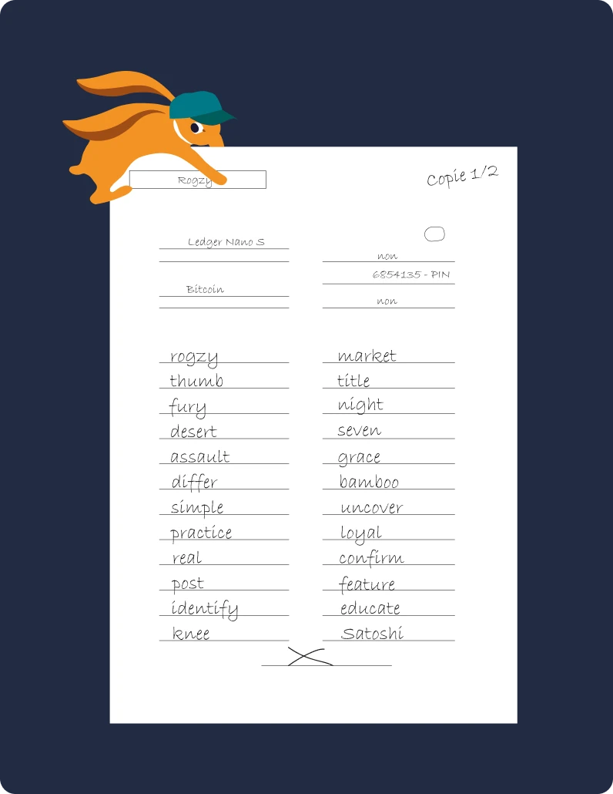

### Shawarwari mu game da yin shi daidai

Kuma, tabbata ka yi kuskure a lokacin da ka ke kwafin, domin iya sa al'ummar ka su yi wahala don karantawa kuma su kasance ba sa iya mayar da kuɗin. Kuma, bayan da ka kaɗa kalmomin, shawara ce ka yi kwafin na biyu kuma ka ajiye shi a wani wurin daban da na farko. Hakan na tabbatar da cewa ka samu kwafin idan na farko ya rasa ko ya bata.

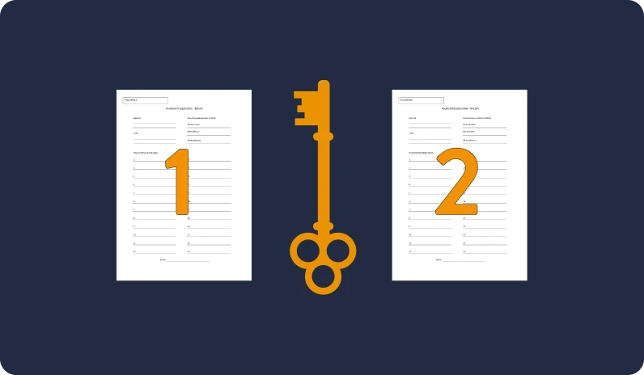

Jerin kalmomi ya kamata a ajiye su a wani wuri mai tsaro da za ka iya tuna da sauki. Kada ka yi amfani da tsare-tsare masu wahala wanda zai iya jawo manta da su.

**Kalmar ka = kuɗin ka.**

'Cold' da kuma 'hot' wallets suna amfani da hanyar jerin kalmomi a matsayin hanya ta gaba don ajiye makulli masu zaman kansu. Saboda haka, za ka iya shigar da kalmomin mnemonic naka a cikin kowane software ko na'urar da ta dace don mayar da hankalinka. Daga bangaren daya, muna shawarar ka da kuma ka yi amfani da wallets da ba su ba da seed phrase, domin za su iya bukatar ka ba su asusun, adireshin imel, ko, mafi yawa, ID.

**HAKKURI: Rahoton jerin 12/24 kalmomi ba a ciki ya kamata ya yi maka alamar hankali.**

Idan kana so ka gano, matakan gaba daya, yadda za ka kafa alamar ka da kuma samun bitcoin na farko, muna kuma shawarar ka karanta wannan wasiƙa na biyu:

https://planb.network/courses/f3e3843d-1a1d-450c-96d6-d7232158b81f
## Tsallake Janar na Lokaci

<chapterId>f58cd446-c202-5eff-aab7-e61cc40e5c06</chapterId>

Kamar kowace irin tattalin arziki, an gane bitcoin ɗinku tsakanin rasa, sata, da kuma ƙarƙashin, musamman a tsawon lokaci. Amincewa da bitcoin ɗinku yana buƙatar wasu sani na fasaha da fahimtar hanyoyin da suka shafi tsaro, wanda yake bude hanyar zuwa ga biyu na babban hanyoyi: a rubuta bitcoin ɗinku akan allo na ƙarfe kuma kafa tsari na gudanarwa.

### Yin bita a cikin gashi

Daya na samar da kudin Bitcoin ɗin ka a mafi tsawon lokaci ita ce ka yi rubutun kalmar sirri na ka akan wani abu mai ƙarfi kamar hadin gwiwa, ta hanyar kirkirar kwafin jiki na makullin ka wanda yake da ƙarfi kan rauni na ruwa da wuta.

Daban-daban na hanya akwai: wasu daga cikinsu suna da kudin kasa, kamar "Blockmit", yayin da wasu zasu bukaci kayan aiki mai ban mamaki. Kuna iya bincika wannan batu a cikin [tutorials](https://planb.network/en/tutorials/wallet) na makarantar mu.

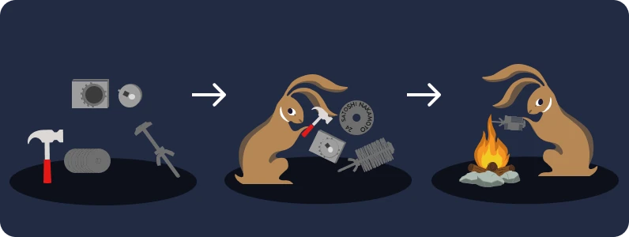

### Yi wa'azi akan gabaɗaya!

Tare da wannan koyon farko, kirkirar shiri na gudanar da kudin Bitcoin bayan mutuwarka shine matakin muhimmi don tabbatar da cewa an kula da kudin Bitcoin naka daidai bayan mutuwarka. Wannan shiri ya hada da rubutawa takardar da ke bayyana halin kudaden da kake da su, hanyoyin samun su, da bayanan siffar mutanen da kake amincewa da su wajen gudanar da su. Yana da muhimmanci kuma a yi magana akan gudanar da kudin Bitcoin da wakilin tabbatar da cewa an bi umarnin la'akari, ko da yake mutumin ba zai taba amincewa da kula da kudin Bitcoin naka ba.

Idan ka so ka ci gaba da bincike akan batun tsarin gudanarwa na bitcoins ɗinka, muna shawarar ka karanta littafin Pamela Morgan mai taken [Cryptoasset Inheritance Plan](https://planb.network/resources/books/28) ko kuma ka shiga cikin koyon BTC102, inda muke ba da shawarar yadda za a kirkira tsarin ɗinka.


### Tsaro na sirri na muhimmanci

A kudin daidaita samfuran ko samar da shiri na gudanarwa, tsaro na sirri shi ne wani batu mai muhimmanci wajen tsaro mai tsawon lokaci na bitcoin ɗinku. Misali, ya fi kyau ka sayi bitcoin ba tare da bayar da bayanin kanku ba don rage hargitsin kama da sunan ko bin diddigin kuɗin ɗinku ta hanyar wadanda suke da kayan aiki na gaskiya.

A kan mamaki, ya na da muhimmanci ka ki yi magana da kowa game da bitcoins ɗinka. Ba mu iya tuna yadda wannan fasahar za ta kasance a gaba ba, don haka yin tsaro game da mulkinsa shi ne zabi mai kyau: ba ka son ka yi wa kanka ko aljihunka nuni.

Kamar yadda, kada ka yi magana akan cikakkun bayanai akan tsarin tsaro na bitcoin a taron ko da wasu da ba ka sani ba...

### Bayani akan Tsaro na Alamar Bitcoin

Bitcoin wallets suna ne manyan software da ke baka damar adana bitcoins da kuma yin ayyuka. Akwai nau'ikan daban-daban:


- katin wayar hannu ko na kwamfuta, mai sauki ga kudade ƙarami da kuma / ko rashin daidaituwa na yau da kullum;
- ƙwafin jiki, wanda ya dace sosai don adana bitcoins a tsawon lokaci na tsakiya da na dogon lokaci;
- multisig wallets, wadanda suke fi wahala na sarrafa da suke bukatar alamomi daban-daban don yin ayyuka.

Yayin da kake gina aljihu, dole ne ka farka da ajiye jerin kalmominka na 12 ko 24 akan takarda ko kwamfuta. Wannan maganganun mnemonic yana ba ka damar mayar da aljihinka ta kowane aikace-aikacen aljihu na Bitcoin. San cewa wanda ya samu damar shiga cikin wannan jerin to ya samu damar shiga cikin kuɗin ka.

A cikin duniyar Bitcoin, mulkin kudi ya yi madaidaici da alhakin mutum, hakan yasa ya zama dole a tsara samun damar shigar da kuma ajiye kayan aiki. Don samun wannan, ya kamata ka bi wadannan shawarwari:


- Ƙirƙira wani tsari na gudanarwa don tabbatar da cewa masu neman ka su iya samun kuɗin idan akwai matsala.
- Kada ka bar Bitcoin ɗinku akan adireshin canja wurin, domin za su iya kasancewa suna da wuya ga kallon ɗanɗano.
- Sauya matakin tsaro na gare ku zuwa bukatunku da kuma amfani, don za ku zabi kyakkyawa tsakanin alamar Bitcoin da suka wanzu.

Yanzu da muka bayyana asusun Bitcoin da kuma yadda ake tsaro su, a babban babban da za mu yi, za mu duba fasahar fasahar Bitcoin. Saurin kuma, fahimtar asusun Bitcoin zai inganta fahimtarka kan yadda ake aiki da shi, wanda zai baka damar amfani da shi da kyau.

# Siffar na fasaha na Bitcoin.

<partId>a86d7439-e7a2-5f21-b1e9-6b5e23ca265b</partId>

## Fara waƙar Bitcoin

<chapterId>b7561082-8943-519d-95d1-a5f60dd2686d</chapterId>

### Ya fara da wani ƙaramin tarihi.

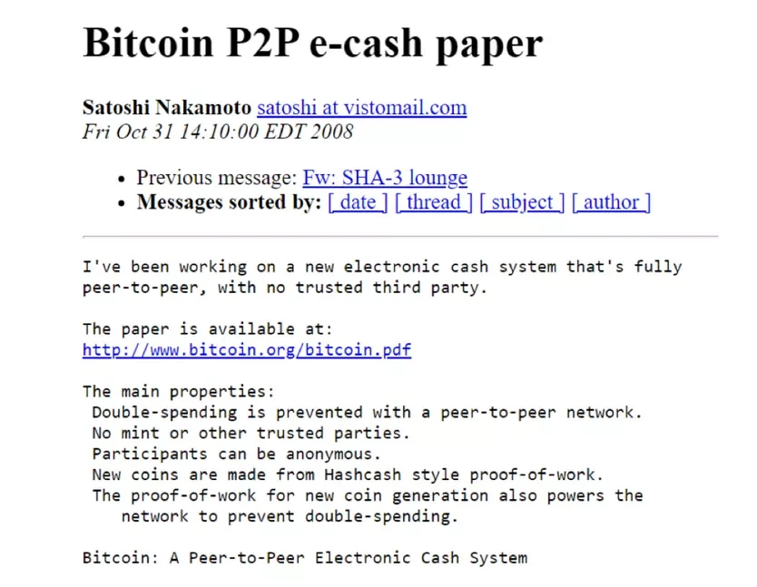

31 ga Oktoba, 2008 ya nuna faruwar sabon fasahar kudi mai zaman kansa wadda ake kira Bitcoin. A wannan rana, wanda ba a san shi ba mai suna Satoshi Nakamoto ya nuna sabon abin da ya yi ga duniya ta hanyar imel da ya aika zuwa jerin adireshin imel na cypherpunks, al'umma ce na masu sha'awar tsaro ta hanyar amfani da yanar gizo. Wannan imel ya dauki takardar da ake kira "White Paper", wadda ta nuna yadda ake aiki da Bitcoin.

Wannan shiri ba ya samar da sha'awar da take ba nan take, mafi yawan saboda kashe-kashen da suka gabata a kokarin kirkirar tsarin kudi na zamani. Alamar haka, wannan Takardar Baya ta zama misali ga masu amfani da Bitcoin kuma ta kasance abin tattaunawa a cikin al'ummar Bitcoin a cikin shekaru.

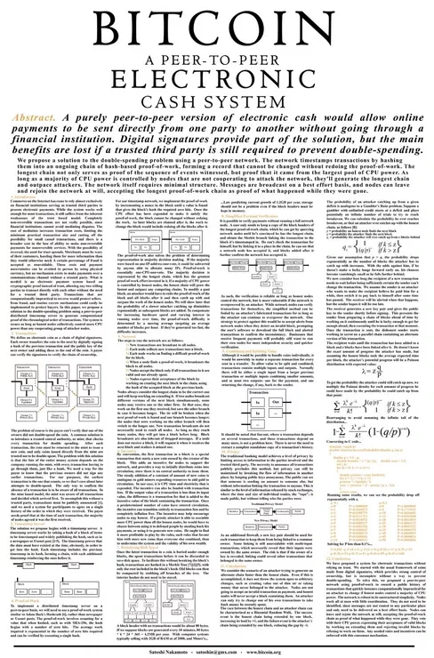

A ranar 3 ga Janairu, 2009, Satoshi ya fara aiki da cibiyar Bitcoin ta hanyar kirkirar farkon block, wanda aka fi sani da "Genesis block", wanda ya nuna farawa ga blockchain na Bitcoin. Wannan block yana dauke da sakon da ya nuna burin Bitcoin: "03/jan/2009 Shugaban makarantar kasa a kan hanyar biyan kudin makamai na biyu."

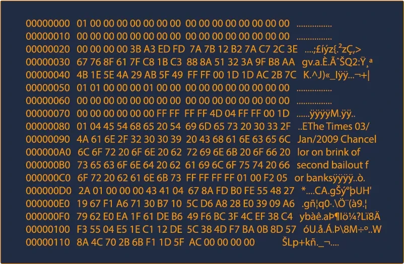

> "Za mu iya ci gaba da yaki mai girma a cikin yakin bindiga kuma samu ci gaba"
> "sabon yankin 'yanci na shekaru da dama." - Satoshi Nakamoto


### Protokolin Bitcoin ya tashi rayuwa

A ranar 9 ga Janairu, 2009, Satoshi ya sanar da fitarwa na Bitcoin 0.1.0 version. Ba da jimawa ba, Hal Finney ya dauki software din kuma ya shiga cibiyar, wanda ya nuna cewa akwai biyu nodes kuma, don haka, biyu miners a cikin cibiyar. Finney ya kuma tabbatar da wannan mataki ta hanyar tweeting, 'Running Bitcoin'. A ranar 12 ga Janairu, 2009, an yi Bitcoin na farko na 10 BTC tsakanin Satoshi da Hal Finney, kuma za ka iya samun shi da sauki, idan ka komo cikin block 170.


Sha'awar kan Bitcoin ya ƙara yawa da sauri, hakan ya haɗa da mutane da yawa su gwada shi, su shiga cikin hira, su gyara kuskuren, kuma su yi tunani akan lamuran da ya dauka kan adalci, tattalin arziki, da kuma falsafanci. Mutane sun kasance cikin wani ƙarfi mai yawa har ma da Satoshi ya kirkira taron BitcoinTalk a ranar 22 ga Nuwamba, 2009, don ya sa a iya yin irin wannan nau'in hada-hada.

Zauren ya zama wurin magana mai kyau ga masu amfani da Bitcoin, har ma da yawa haka ne da alamun da memes da alamomi da suka shafi Bitcoin suka fito daga ciki, kamar [logo na Bitcoin](https://bitcointalk.org/index.php?topic=64.0), madaidaicin [Hodl](https://bitcointalk.org/index.php?topic=375643.0), ko kuma [Ranar Pizza](https://bitcointalk.org/index.php?topic=137.msg1195).

**Kuna ka san?** A ranar 22 ga watan Mayu, 2010, Laszlo Hanyecz ya yi tarihi ta hanyar neman sayar da pizza biyu don 10.000 BTC: wannan shi ne lokacin farko da aka yi amfani da Bitcoin don sayar da kayayyaki na jiki.

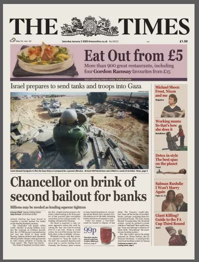

### Rashin wani Satoshi Nakamoto

A shekara ta 2010, yayin da Bitcoin ta fara samun hankali na kafofin yada labarai, Satoshi ya yanke shawara ya nufi nesa ta hanyar sanar da rahotonsa a cikin rubutun hira a kan ranar 12 ga Disamba, 2010. A ranar 23 ga Afrilu, 2011, ya yi magana ta karshe da ya sani a cikin sakon imel, sannan ya bace, ya bar halittarsa a hannun al'umma.

> "Gwamnatin tana da kyau a yankan kai na tsakiyar tushen"
> shafukan da ake kula da su kamar Napster, amma shafukan kwararru kamar P2P
> "Gnutella da Tor suna da kai a kansu." - Satoshi Nakamoto
Ko da yake Satoshi bai kasance ba, Bitcoin ya ci gaba da bunkasa: tarihin Bitcoin ya rubuta kowane minti 10, kuma tsarin ya ci gaba da aiki har yanzu kamar yadda aka yi niyyar. Ba tare da wani tsoro, shakka, ko shawara ba, Bitcoin ya ci gaba da gudanar da hanyar, tare da samun damar yin amfani da shi a kan layi sosai. A gaskiya, a cikin wannan [shafin yanar gizo](https://bitcoinuptime.com/), Bitcoin ya kasance aiki kuma ya ci gaba da gudanarwa ba tare da samun matsaloli masu yawa a cikin 99.988% na lokacin da aka kirkira shi.

Don wasu, Bitcoin an tsara shi kamar wani abu mai kama da [mycelium](https://brandonquittem.com/bitcoin-is-the-mycelium-of-money/), yayin da wasu ke ganin shi kamar [black hole](https://dergigi.com/). Ka so ko ka ki, Bitcoin yana cigaba da kasancewa, tare da tsawon lokacin da ya dauki 10 minti a kowace block, kamar bugun tsarin kudi mai sabo.

Don sanin karin bayani akan rubutattun Satoshi Nakamoto, muna shawarar ka karanta ["Littafin Satoshi"](https://planb.network/en/resources/books/98) ta Phil Champagne ko kuma fim ɗin ARTE mai suna "Le mystaire Satoshi".


> "Masifar gabatar da adadin kudin gaskiya shine duk wani aminci da ake bukata don aiki da shi. Bankin tsakiya ya kamata a amince da shi ba zai manta da kudin ba, amma tarihin kudin fiat yana cike da karya aminci. An kamata a amince da bankuna su tsara kudinmu da su mayar da shi ta hanyar lantarki, amma suke neman shi a cikin kwayoyin kashi na bashi da kadan a cikin kwamfuta" - [Satoshi Nakamoto](https://satoshi.nakamotoinstitute.org/posts/p2pfoundation/1/)
Yanzu da muna da bayani, a yi nazari kan yadda aiki na Bitcoin ke aiki a gaba daya.

## Bitcoin Transactions

<chapterId>03482644-5473-590b-975b-b43bb65eac21</chapterId>

Lamarin Bitcoin shine kawai motsin rai na bitcoins ta hanyar amfani da adireshin Bitcoin. Don bayyana wannan tsari, mu kawo muku biyu daga cikin manyan mutane: Alice da Bob. Alice na son samun bitcoins, yayin da Bob ya riga ya samu wasu.

### Mataki 1 - Kafa na ciniki ta hanyar alƙawari

Don Bob ya koma bitcoins zuwa ga Alice, dole ne ta ba shi daya daga cikin adireshinta na Bitcoin, wadanda suka kasance kawai ga aljihun nata na Bitcoin. Kamar yadda key na sirri ana amfani da shi don samar da key na jama'a, nan gaba kuma anan ana amfani da shi don samar da adiresoshin.

A matsayin maganganu, lokacin da Alice ta bude aljihunta kuma ta nuna "karɓa", lambar QR ko adireshi (kamar wannan bc1q7957hh3nj47efn8t2r6xdzs2cy3wjcyp8pch6hfkggy7jwrzj93sv4uykr) zai nuna. Hakan na aiki kamar 'Bitcoin IBAN' nata, wanda ta sanya wa Bob.

Bayan, Bob yin cinikin ta hanyar buɗe alamar Bitcoin nasa kuma na nemi "aika". Sai ya kwafa kuma ya mika adireshin Alice cikin filin da ake bukata, ya sanya yawan da yake so ya aika, kuma ya yanke shawarar kan cinikin da za'a biya, wanda ke aiki kamar mayar da hankali ga mai gina don ya hada cinikin a cikin block na gaba. A gaskiya, yawan cinikin da Bob ya biya, mafi girma damar shi ne na samun cinikin ya shiga cikin block na gaba da ake ƙara wa blockchain, wato, takardar da ke kula da duk cinikin Bitcoin a jama'a kuma ba za a iya canzawa ba.

Don samar da cin amana, Bob ya kamata ya rubuta shi da makullinsa na asali don tabbatar da cewa shi ne mai daidaita na bitcoins da yake so ya canja wurin. Wannan mataki na kullun yana aiki otomatik a kan aljihun waya, ko kuma yana dauke da tsari a kan aljihunka na jiki: "Kuna tabbatar kuna so ku aika X zuwa Y? Ee ko a'a".


**Me ya mu biyan kuɗi?** Kuɗin suna da muhimmanci don ƙirƙirar kasuwa ta kyauta don hada mu'amala a cikin blokoji. A gaskiya, blokin yana da girma 1 MB (wanda ya ƙara zuwa 4MB bayan sabuntawa na Segwit), don haka yawan mu'amalolin da za'a iya "saka" a cikin blokin ya kai kusan dubu ɗaya na mu'amala a kowace bloki. Girman mu'amala ya danganta da ingancinsa. Don haka, mu'amalolin da suke da wuya suna biyan kuɗi mafi girma.

### Mataki na biyu: Yayin da ake yin aiki ta hanyar yanayin da suka wuce

A wannan matakin, an kirkira cinikin kuma jakin Bob zai raba shi da hanyar Bitcoin. Don yin haka, jakinsa zai yi magana da node na hanyar Bitcoin, wanda zai yada wannan bayanin ga wasu nodes. Wannan irin tsari yana ba da damar hanyar gaba dukkanin su ga wannan sabon ciniki kuma su dauka shi a lissafi.

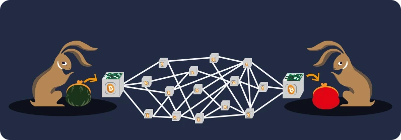

A wannan lokaci, ko da wannan cinikin ya san da dukkan mutane (ta hanyar amfani da kayan aiki mai suna Mempool), ba za a iya ganin shi da tabbacin ba har sai ya shiga cikin block ta hanyar mai gina, wanda shi kadai ne wanda yake tabbatar da cinikayya ta hanyar hada su a cikin blockchain.

A gaskiya ne, masu noma suna da muhimmancin tattara ayyuka masu inganci da ba a tabbatar da su ba don su hada su cikin wani block. A karshe, dole ne su ware wani tsarin fasaha a wani tsari da ake kira "shaida na aiki" don block din su zai kasance na gaba a cikin blockchain na Bitcoin.

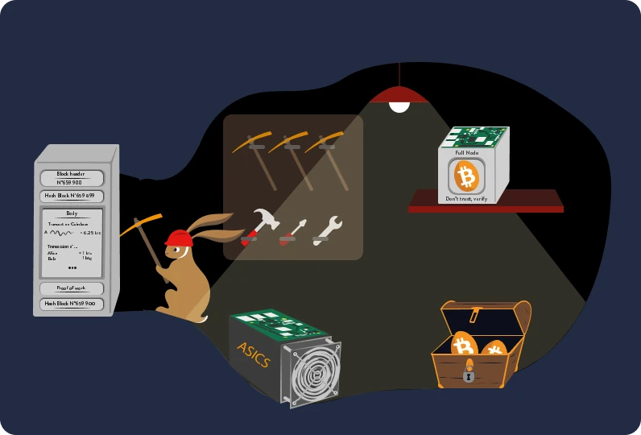

### Mataki 3: An yi amfani da cinikin a cikin wani bloki ta hanyar wani mai yin adireshi.

Tsarin aiki na gaskiya ya bukata nemo wani "hash" mai kyau ga block da ake tambayi: ka tuna shi kamar wani alamar kwararriyar da aka haɗa da block, wanda ya kunshi haruffa na 256. Kyauwar wannan hash na iya dangantawa da yawan wahalar Bitcoin network (za mu yi magana game da hakan a karshe). Don yanzu, ka yi la'akari da cewa wani mai gina ya sami wani block mai kyau, kuma aikin Bob zuwa Alice ya shigar da shi ciki. Sai, sabon block mai kyau an ƙara shi zuwa cikin blockchain, littafin da ya hada duk masu amfani da Bitcoin.

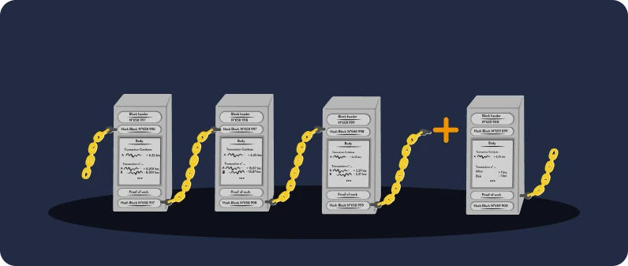

### Mako 4: Tushen wani ne daidai da kuma an tabbatar da shi ta hanyar nodin da Alice ke danganta da shi.

A wannan matakin, ake ganin cinikin ya dace: mai sayarwa zai yanzu yada sabon toshe zuwa hanyar shafinsa, kuma jakar Alice za a sabunta ta.

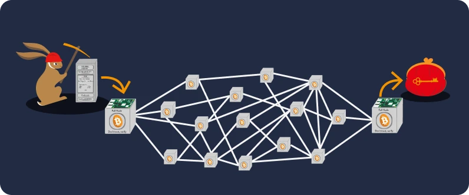

**Sanarwa:** Ko da yake an sanar da Alice cewa ta sami bitcoins a daya daga cikin adreshinta, akwai shawara a yi la'akari da cinikin kawai bayan ya sami **shida** tabbatarwar. Hakan na nufin cewa an yi amfani da shida makamai na daban akan makaman da ke cikin cinikin Bob. A maganganun, cinikin da ya wuce a cikin blockchain, ya zama mafi tsarkaka.

### Me ya muhimmancin wannan aikin?

Tsarin cinikayya na Bitcoin ya kasance babban gaba da aiki tare da tare, ba tare da wani mai aminci da za'a iya aminta ba.

Bob ya aika shawararsa zuwa cibiyar sadarwa ta Bitcoin, kuma idan wani mai gina ya fitar da blockin da ke da shawarar Bob, Alice zata iya farawa tunanin cewa bitcoins sun kasance nata. Babu bukatar aminci a kowane mako na kawo karshen mikiya ta bitcoin: dokokin protokolin da kuma kudaden da ake samu daga ciniki kadai suna da karfi sosai don aikata laifin cikin tsarin Bitcoin.

A gaskiya, masu amfani suna canza mulkin kudadensu ta hanyar sa hannu a kan ayyukansu da makamantansu na asali. A gefen sauran, masu noma suna da ikon yin abin da suke so, kuma masu amfani suna ci gaba da sarrafa ikon su ta amfani da nodoci na Bitcoin don tabbatar da sabon blokoci da kuma ayyukansu da aka hada ciki. Kowane node yana da kwafin ko rubutaccen kwafin da aka rubuta, don haka, hanyar da nodoci na Bitcoin suka yi ta hanyar daidaita tsarin ne gaskiya.

Saboda haka, domin Bitcoin network ya kasance kamar babu, duk wani kwafi na blockchain a kan duk Bitcoin nodes ya kamata a share, wanda hakan na iya kasancewa ba sauki ba ne saboda yadda ake yin gaba da nodes din da kuma wahalar da ake fuskanta na kama su a fili.

Yi a dubi hakanan yadda nodin Bitcoin ke aiki.

## Bitcoin Nodes

<chapterId>8533cebc-f799-528b-89df-8d75d4c37f1c</chapterId>

Nodes suna ne abin da ya dace a cikin tsarin Bitcoin, domin suna yi wa ayyukan da yawa muhimmanci:


- Yin kariya da kwafin Bitcoin blockchain
- Yanayin ayyuka
- Sauke bayanai zuwa wasu nodoci
- Akwai amfani da dokokin Bitcoin.

Don haka, kowane na'ura mai gudanar da software na Bitcoin, wanda ake kira Bitcoin node (da yawa ake amfani da [Bitcoin Core](https://bitcoin.org/en/bitcoin-core/)), ya taimaka wajen yaduwar hanyar.

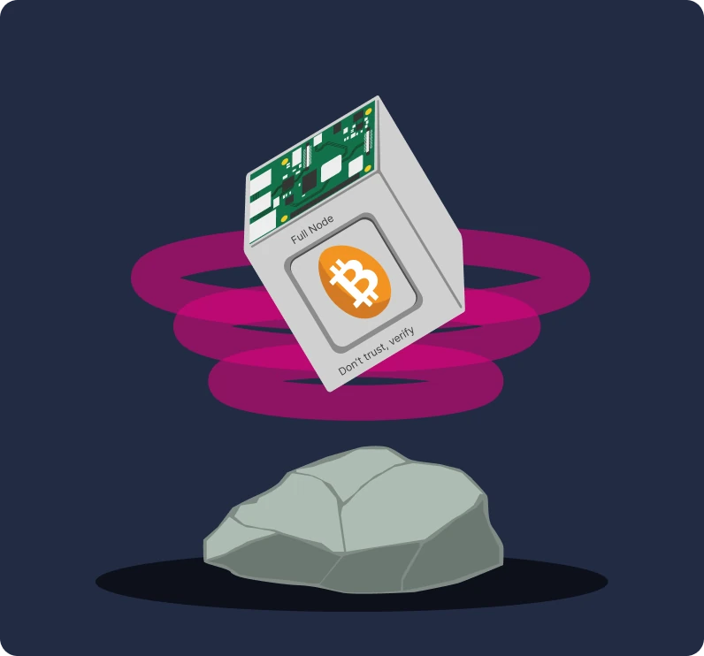

### Nodoci ne cikakken tushen Bitcoin.

Kowane node na dauke da kwafi na blockchain, wanda yana ba da izini na tabbatar da ciniki kuma yana hana kowace kokarin cin hanci. Tashin hankalin da aka tsayar da shi na network yana ba da Bitcoin karfi mai yawa da ƙarfi. A gaskiya, don tsayar da Bitcoin protocol, dukkan nodes a duniya dole su kashe. Don bayaninka, a watan Satumba 2023 an samu kusan [45,000 nodes](https://bitnodes.io/nodes/all/) da aka tsayar da su a duniya.

Noduna suna iya tabbatar da gaskatawar blocks da yanayin biyan kuɗi saboda suke bi da dokokin tarayya na Bitcoin. Dokokin nan suna ƙaddara tsarin kuɗin Bitcoin, kamar yadda adadin kuɗin mai sayarwa (wanda zamu yi magana akan shi cikin ƙarin bayani a ɓangaren gaba) da adadin bitcoin a cikin tafiyar. A haka, noduna suke aiki kamar tsarin shari'a na hanyar, saboda duk masu amfani da hanyar suke bi da dokokin guda, don haka suke tabbatar da cikakkunin tsarin Bitcoin. Dokokin tarayya ba su kara canza ba, idan aka yi, saboda yin canji, ake buƙatar yardar duk noduna.

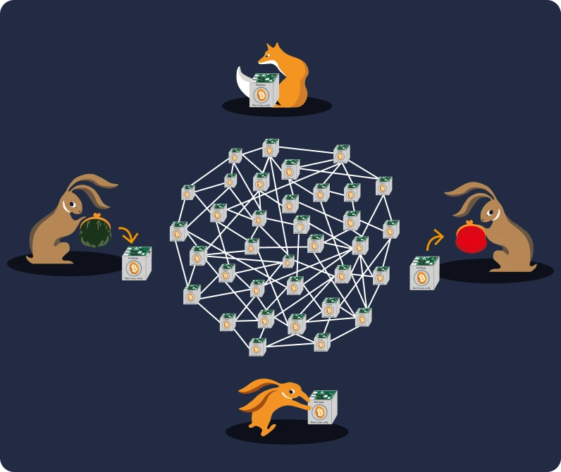

Shugabancin cikin tsarin yana wuce sakamakon wannan koyon asali, amma ya kamata a lura da cewa kowace mai amfani da node na Bitcoin zai iya yanke shawara akan wane dokoki zai bi. Mai amfani zai iya zaɓar biyan bukatar dokokin daban (ya yi sauye-sauye kan lambar), amma idan wannan sauye-sauyen ya cire dokokin gaskiya na yanzu, to node din ba zai kasance ɓangaren Bitcoin ba. Saboda haka, sauye-sauyen babba suna da wuya kuma suna bukatar hadin gwiwa tsakanin dubu na masu amfani da daban-daban na ra'ayi da sha'awar, wanda ke sa su ba da sabuntawa da ake ganin 'fiye' ga duk masu amfani da Bitcoin.

### Yaya node ke nuna kamar yadda take?

Akwai wasu zaɓuɓɓuka da dama idan kana so ka sanya node na ka, tare da nauyin kula da dama. Za ka iya kawai gudanar da software na Bitcoin Core a kan kwamfutarka, amma zai bukaci wurin ajiye da yawa, domin blockchain din yana da ~500GB. Don fuskantar wannan matsala, za ka iya zaɓar kawai rufe mafi ƙarshe na N blocks a cikin tunanin da ka yi ta hanyar ƙirar "node na pruned". Ga wannan ƙari na biyu, nauyin shi ya yi kasa saboda node din ya kasance aiki ne kawai idan ka bukata shi.

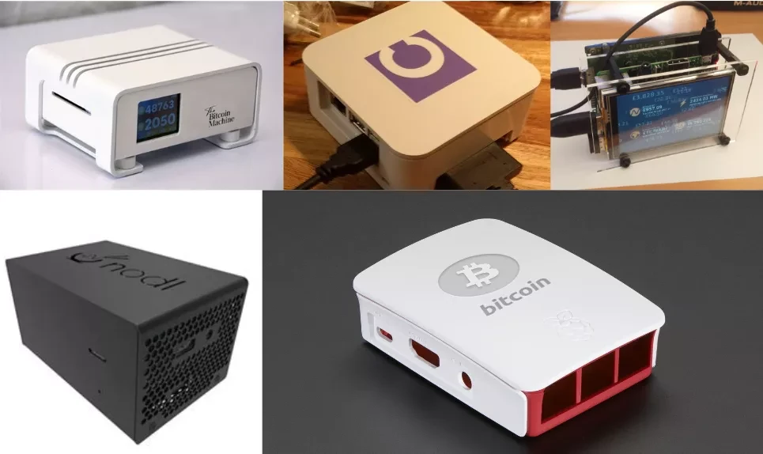

Wani zaɓi na biyu shine amfani da wani na'ura mai alaƙa na musamman don wannan bukatar, kamar Raspberry Pi 4 da SSD mai yawa (kamar ~1TB). Wannan zaɓi na biyu ya fi karɓa kuɗi idan akwai buƙatar sayen na'urar, amma yana nufin kasa da €10,00 a shekara a kan cin amfani da wutar lantarki.

Daga wani kallon hanyar daidaito, tunanin 1 block na 1MB kowace 10 minti, ya daidaita kamar 5GB a kowace wata.

### Nodes dodo su kasance samuwa ga duk wanda ya so!

Farashin da ake iya biya da samunwa na Bitcoin node a cikin adadin kayan aiki, ajiya, da hanyar sadarwa shine siffa mai muhimmanci sosai, domin ya taimaka wajen yaduwar hanyar sadarwa.

Lalle ne, kowa yana da dalilin kyauta na gudanar da node! Tsadar da kokarin sun kasance kadan idan aka kwatanta da ribar da ake samu. Kawai ya kamata ka fara wannan tafiyar da kuma shiga cikin dubu da yawa na masu amfani da Bitcoin don su yi Bitcoin network tare.

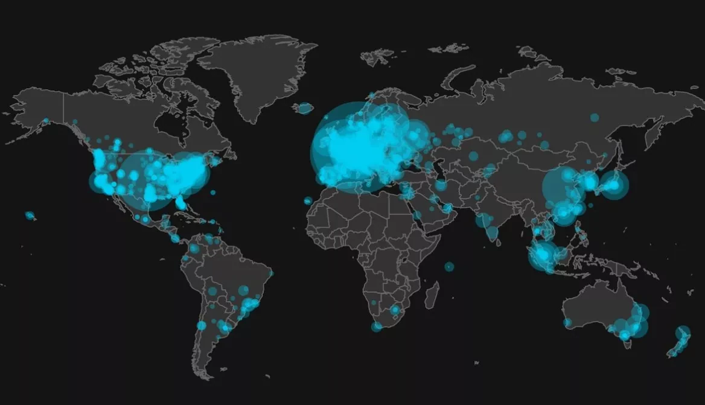

A kan gaba, idan kayan aikin suna da nauyi 100 sau fiye da yadda suke, za mu iya yin amfani da adadin cinikayya 100 sau fiye da yadda suke a kowace minti 10, amma aikin Bitcoin zai bukaci disk na harda da nauyi 50TB, bandwidth na fiye da 500GB/na wata, da kuma wani abu na kayan aiki da zai iya tabbatar da cinikayya dubu da dama a cikin minti 10. A wannan matsayin mai yiwuwa da kayan aikin da suka fiye da 100 sau, aikin Bitcoin ba zai zama mai sauƙi ga mutum na yau da kullun ba, wanda zai hana tsarin daidaito da kuma kadaidaitar cinikayya da dokokin tarayya.

Don haka, an tsara mulkin daidaitawa don ya ba mutane da yawa damar gudanar da Bitcoin nodes na su. A gaskiya, shekarar 2017 ta yi alamar yaki mai tsanani wanda aka fi sani da "yakin girman block". Wannan yaki ya hada wadanda suka so su gyara Bitcoin ta hanyar girma girman block don karawa iko na transaction (masu gina, dandalin canja wurin, da hukumomi) da wadanda suka nema ajiye kudin kudin da karfin masu amfani (nodes da masu amfani). A ƙarshe, na biyu ne ya lashe.

Bayan wannan nasara, manyan hanyoyin suka kunna sabuntawa mai suna SegWit, wanda ya bude hanyar aikin Lightning Network, shafin biyan kuɗi na Bitcoin da ake gudanarwa nan da nan kamar matakin na biyu na blockchain na Bitcoin. Wannan matsala ta nuna cewa masu amfani, ta hanyar manyan hanyoyinsu, suna da iko gaskiya cikin Bitcoin, wanda yake ba su damar tashi tsaye ga gidauniyoyi masu girma a lokacin da ba su daidaita ba.

## Yan kasa

<chapterId>dbb8264a-7434-57e4-9d1b-fbd1bae37fdf</chapterId>

**Masu noma suna tsara hanyar sadarwa kuma suna ƙara shawarwari zuwa cikin blokan. Suna amfani da wutar lantarki ta hanyar na'urorin ASIC don lura da aikin tabbatar da gaskiya na Bitcoin.**

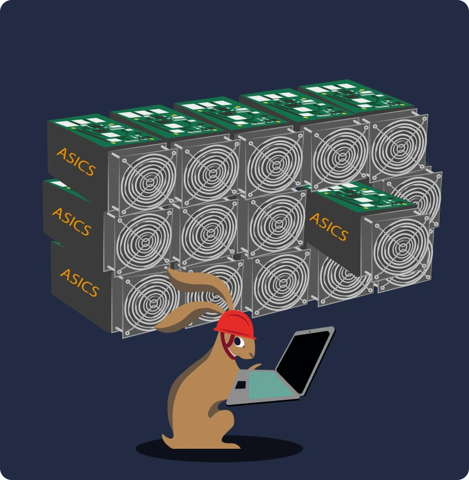

### Bayani na kan Cikakken Aiki

"Shaida na Aiki" (POW) shine tarihin tsaro na Bitcoin protocol. Ita ce tushe na komai kuma ta yi rawa mai yawa a cikin teoriyar wasan Bitcoin.

Don sanin yadda ake aiki, ka yi tunanin bincike mai yawan mutane inda kowa zai iya shiga ciki. Manufar ita ce, samun lambar da ta ba mai lashe damar rubuta wani bincike mai kyau, kuma samun albashi a cikin Bitcoin. Wannan lambar mai sauƙi ne don tabbatar da ita ta hanyar amfani da aikin hash na SHA-256, amma mai wahala don samu: masu shirya (masu bincike) zasu gwada miliyoyi da miliyoyi na dama, kamar 1, 52, 2648, 26874615, 15344854131318631, da dai sauransu, har su samu wadda ta dace.

Idan da aka zaba lambari ta dace: Jackpot! Idan ba haka ba, binciken ya ci gaba.

Don samar da yawan kokarin, za su yi amfani da na'urorin musamman wadanda ake kira ASICs, wadanda suke da nauyin kalkulaton miliyoyi na dukkanin damar a kowace sekond (adadin dukkanin kokarin an kira shi "HashRate"). Don aiki da wadannan na'ura, akwai bukatar cin yawa na wutar lantarki. Don haka, POW ya canza lantarki zuwa kudi, ya hada duniyar gaskiya da duniyar fasaha don samar da kudin farko da aka samu ta hanyar lantarki.

Mashinai suna aiki da tsawon lokaci, kuma bayan tsawon minti 10 daidai, mai nasara ya fito: wannan ma'aikaci ya samu nasarar samun hashin daidai wanda ya kasa kasaɗin matsakaicin. Mai nasara mai girma da kuma kawai zai sa alamar sabon block na tsayin lokacin, ya ƙara shi ga blockchain. Suna karɓar lafayoyinsu kuma su dawo don su gwada nasarar raba block na gaba. Wannan tsari ya kasance ana yi shi na shekaru fiye da goma, da mai nasara ya tabbatar da ayyukan Bitcoin kowace minti 10 yayin da yake tabbatar da ayyukan da suka gabata, hakan yana sa Bitcoin blockchain ya zama mai ƙarfi da tsaro.

Duk 2016 blocks (kamar kullum biyu makonni), **sauyi na wuya** yana gyara wasan raba kasa na mining bisa ga yawan masu shiga. Wannan gyara na da muhimmanci saboda yawan masu mining da karfin kwamfutarsu na iya canza sosai a lokacin. Don tabbatar da lokacin da ake so ya zama na block, hanyar yana gyara matakin wuyar bisa ga yadda aka mine na 2016 blocks na gaba. Idan an mine su da sauri, wuyar ta karu, hakan yana sa shi ya zama wuya samun hash din daidai. A kan bangaren da ya fi, idan an mine su da hankali, wuyar ta ragu, hakan yana sa shi ya zama sauki.


### Yanayin hada-hada yana ci gaba ne

Shekarar da suka wuce, masu noma suna amfani da kayan aiki na kwamfuta mai inganci don samar da yawa hash kamar yadda yake da wuya a kowane lokaci (HashRate) yayin da suke ci gaba da amfani da kashi mai yawa a hanya mai inganci. Masu noma na farko kamar Satoshi ko Hal Finney suna noma da kawai CPU su, sannan wasu suka fara noma da katin kwamfutarsu. A yanzu haka, masu noma suna amfani da ASICs (Application-Specific Integrated Circuit): na'urorin da aka tsara ne kawai don aikawa da algorithmin SHA256.


Hashrate na tsarin Bitcoin yana nuna adadin kokarin da aka yi a kowane sekondi don samun block na gaba. Yau ma ya wuce 500 TH/s, wanda shi ne 500,000 biliyan kokawa a kowane sekondi! Quanto mafi girma na hashrate na duniya, hakan yana sa wani mai aikata laifi ya samu ikon gudanar da ayyukan mining a kan kashi daya kuma ya yi amfani da kuɗin sa fiye da sau daya (matsalar biyan kuɗi sau biyu). Don haka, ya fi kyau aiki da dokokin tsarin Bitcoin fiye da aikata laifi a kan su.

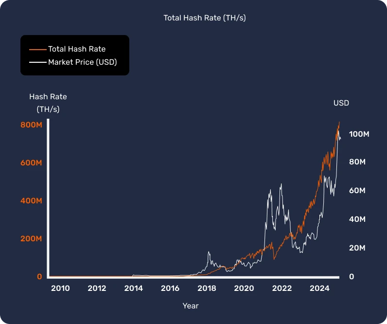

### Me ya samuwa a cikin wani block?

Sararin block ɗin yana ƙunshe da wasu abubuwan kamar irin lokacin, manufar matsakaicin, lamba na ƙarshe na block, sigogin da aka amfani da su, da tsokaci na Merkle na shawarwarin da suka gabata.

**Aikiyar daidaita** shine koyaushe na farko da aka hada a cikin block: yana dauke da albashi na mai yin aiki na mai tabbatar da aiki. Sai anan za su zo da ayyukan da aka tabbatar da su. Masu yin aiki za su zaɓi suka shigar da ayyukan da suke ba su riba fiye da yawa, wato ayyukan da suka ƙasa da suka fiye da kudade.

### Bayar da na 'yan gona

Farkon, an gani ya samu biyan buƙata lokacin da ya sami blockin da ya dace. Wajen cikakken bayani, an biya shi a cikin hanyoyi biyu:


- ta hanyar tallafawa (bitcoins da aka buga saboda) da aka hada a cikin block;
- ta hanyar ra'adin ciniki daga cinikin da aka hada a cikin block.

Yawan adadin tallafin anan ne daidai da dokokin tarayya kuma ya danganta da Epoch: **block reward = block subsidy + transaction fees**.

Lalle, domin farkon kwadaye, tallafin kwadaye ya kasance 50 bitcoins. Kowace 210,000 kwadaye (kamar kowace shekaru 4), wannan adadin ya raba biyu. Yau (a 2024), muna cikin Zamanin 5, wanda ke nufin cewa tallafin shi ne 3.125 bitcoins. A karshe, wannan shi ne tsarin da ke fitar da sabbin bitcoins a cikin tsarin. Tallafin ya rage da lokaci, har sai ya hada da iyaka na fitarwa na bitcoins 21 miliyan. An yi sadaukarwa da bitcoins miliyan 19.4, wanda ya fi 92%.

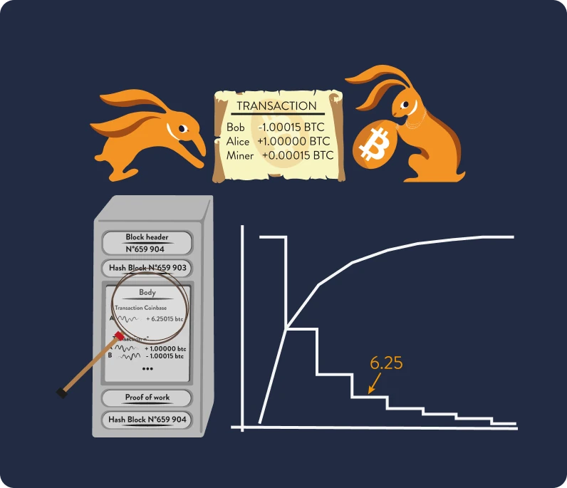

Na biyu hanyar biyan kudin kudin yana da bayani akan adadin da masu amfani suka zaɓa na kudin ciniki, wanda ke nuna damuwar mai amfani don samun cinikinsa a cikin block na gaba. Saboda mai adana yana so ya ƙara kudinsa, zai ga dama ya gabatar da cinikayya da kudaden ciniki masu yawa.

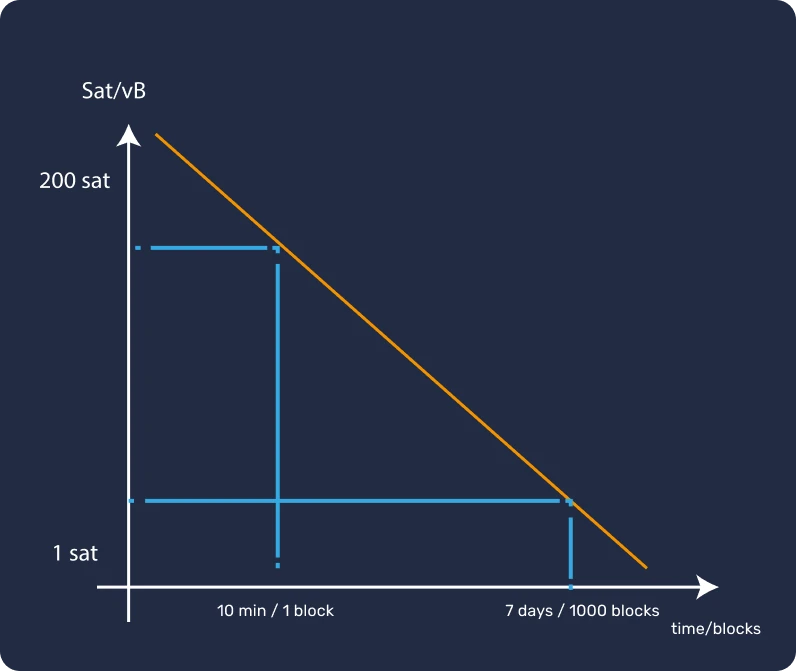

Don samar da tsarin kasuwancinsu, wanda ya danganta da kyaututtukan da suke samu ga kowace block mai kyau, masu noma suna kafa kungiyoyi ta hanyar "bunkasa teku", inda suka hada kayayyakin fasahar da suke da shi.

### Me ya zama yi haka duk wannan?

A karshe, sabon salo na Bitcoin shine ya bayyana wata hanyar magance matsalar biyan kudi sau biyu ta hanyar amfani da blockchain mai amfani da Shaida na Aiki tare da wani matsakaicin wuya. A cikin duniyar fasaha, ra'ayin mulki ya bambanta da na duniyar halitta. A gaskiya, a cikin duniyar fasaha, komai zai iya kama da kuma maida, wanda yake haifar da khatara na amfani da dukiya na fasaha mai daraja sau fiye da sau daya. Masu amincewa na tsakanin juna, kamar manyan bankuna, an kirkira su don magance wannan matsalar fasaha kuma tabbatar da cewa lokacin da ake canja dukiya, ba zai zama na mai aiko ba.

Amma yaya za a yi wannan ba tare da wani mai aminci ba? Wannan matsala ta yi bayani sosai ta hanyar matsalar 'yan jami'an Byzantine, wani matsala na haɗa bayanai a cikin tsarin inda wasu 'yan wasa ba za a iya amincewa da su ba. A matsalar 'yan jami'an Byzantine, ɗungurin jami'an ya kamata su haɗa hari kan birni, amma wasu zasu iya kasancewa masu karya wadanda ke neman haɗaure shiri. Wani yunkurin shi ne don jami'an masu gaskiya su sami ƙoƙarin cewa za su hari ko su bincike, duk da cewa suna karɓar sakonin da za su iya kasancewa suna ƙarya daga masu karya.

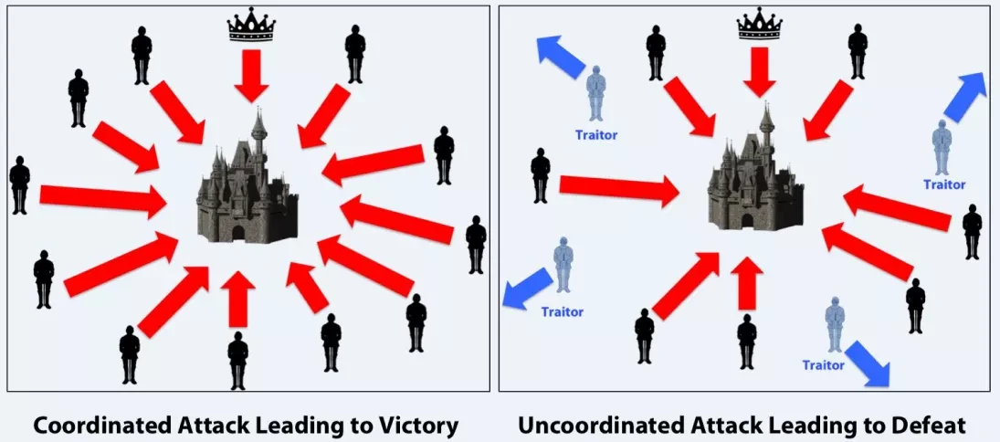

Bitcoin shi ne irin wani hanya don lissafa wannan matsala, ko kuma don wuce ta. "Majeneralan" Bitcoin, ko mai gina, suna fitar da blocks (na bayanai) kuma nodin Bitcoin na tabbatar da cinikayya ta hanyar amfani da dokokin tarayya don tabbatar da gaskiya na bayanai. Babban bambancin kudin iya tsaro tsakanin samar da bayanai da tabbatarwa ya tabbatar da aminciyar bayanai, ba tare da wani uku mai aminciya ba.

Masu gina su ne na tsaro na Bitcoin network. Ta hanyar amfani da iya domin samar da hashes, suka gina kwalliya wanda yake da wahala sosai ga mai aikata laifi don sake rubuta tarihin ciniki, kuma wannan kariyar tattalin arziki ta hana sauran su aiki ba da gaskiya ba.

Ko da na halin da aka yi 51% shiga, inda wani mai aiki zai samu fiye da rabin hashrate, hanyar zai kasance tsaro domin mai aikin dole ne ya amfani da yawan iko kamar yadda dukkanin masu aiki suka hada don ya kokarin gyara blockchain. Wannan tsarin aiki mai bukatar iko ne wanda ke tabbatar da tsaron hanyar.

### A takaice

Taronin na wasa da aka amfani da shi ga Bitcoin yana kawar da masu yin aiki da ba su da gaskiya, wadanda suke amfani da na'urorin ASIC don yin aiki da samun albashi idan su yi nasara. Wadannan, suna shiga cikin tarayyar masu yin aiki don raba iko da su da samun albashi mai yawa amma mai karanci. Koda kuwa aikin yin Bitcoin yana bukatar karfin wutar lantarki, shi ne na muhimmanci ga aiki da tsaro na cibiyar sadarwa na Bitcoin. Tsarin aiki mai gaskiya da fasahar blockchain sun magance matsalar biyan kudi sau biyu da tabbatar da gaskiya na bayanai ba tare da amincewa da wani mai aminci ba. Koda kuwa samar da bayanai yana bukatar amfani da wutar lantarki mai yawa, tabbatar da bayanai yana bukatar kudin da ba shi da muhimmanci. Wannan matsalar ta kara tabbatar da tsaro na cibiyar sadarwa, yana sa ta fi daidai don amince da dokokin tarayya maimakon kokarin karya su.

Idan ka so ka yi bincike mafi ƙarancin kan batun yin adireshin Bitcoin, za ka iya duba MIN 201 mu. Za ka gano yadda ake aiki da muhimmin Proof-of-Work, da kuma yadda adireshin yin adireshi ke aiki. Mun kuma bayyana yadda za a canza ASIC zuwa mai zafi, wanda zai bai wa gida ka zafi yayin da ka ke adireshin satoshis na farko!

https://planb.network/courses/ce272232-0d97-4482-884a-0f77a2ebc036
## Bitcoin da Sinadarin Lura

<chapterId>4b227ae6-443a-5739-b443-60b7931130d9</chapterId>

A cikin sashi na baya, muka fahimci cewa tsaro na Bitcoin protocol ya danganta da amfani da wutar lantarki mai yawa don samar da laifin ciniki na musamman ba tare da wanda za'a iya amincewa da shi ba. A cikin ka'idojin zamani, farashin wutar lantarki na yau da kullun ana yi mishi kwatanta da amfani da wutar lantarki na ƙasa ƙarama. Amma shin wannan kwatanta na da kyau? Shin ya da kyau mu fahimci dalilai a gaban irin wannan kudade?

### Kudin kudaden Bitcoin.

Farko, mu duba lafiyar yanayin da yankin yake da shi. Mai yin yanki ya kamata ya sami na'ura kamar ASIC da wani mabiya na iko na layi don taimaka wa wannan na'urorin. ASICs an yi su ne da aluminiyam kuma za a iya sake amfani da su ko a sake su don wani bukatar na biyu (kamar yadda aka nuna a cikin shirin Attakaï da aka bayyana a cikin koyar mu na MIN201), wanda ya canza Antminer S9 zuwa mai gaba da wuta). Babban damuwa ita ce amfani da iko.

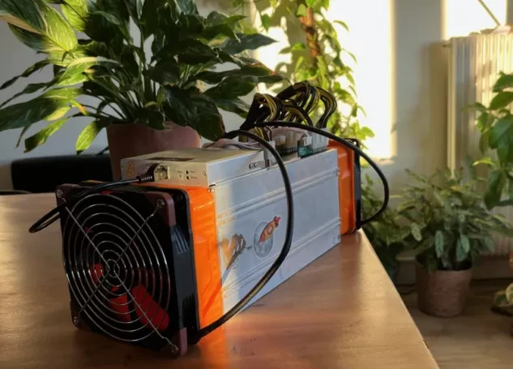

Amfanin lantarki yana nufin kusan duk abubuwan da ake biyan kuɗi ga mai mayar da kudi. Saboda haka, an yi waɗanda suka mayar da kudi goyon baya su nemo wani mabiya mai sauqi na lantarki, don haka za su iya zuwa wurare inda ake kafa masana'antu na lantarki amma ba a halle su ga cibiyar lantarki na yankin ba. A wannan hali, waɗanda suka mayar da kudi suke aiki kamar mai sayar da abinci na ƙarshe, wanda yake ba da damar samar da kuɗi ga masana'antu na lantarki kafin a haɗa su da cibiyar lantarki. Lokacin da suka haɗa, buƙatar lantarki za ta ƙara, wanda zai ƙara farashin kuma ya sa ba zai yi amfani ga waɗanda suka mayar da kudi su samu lantarki a wuraren ba. Tun da za a iya motsa kayan aiki da sauri, waɗanda suka mayar da kudi za su yanke shawarar daukar kayan aikin su kuma zauna a wurare da suke nesa inda buƙatun suke kasa kuma haka kuma farashin, mafi yawanci a wurare inda za su iya samun lantarki daga masana'antu na lantarki mai kyau.

### Maganganar da ba zai kare ba

Don haka, magana akan matsalar da Bitcoin ke yi wa yanayi na yau da kullun ya zama wani abu da ba a gane shi ba, saboda rashin sanin amfani da shi. Ba za a iya kwatanta Bitcoin da kawai kudin da ake amfani da shi a kowace ciniki ba, domin manyan hadaddiyar hanyar da suka tabbatar da cibiyar hanyar na yanzu da ta tarihi, kuma cinikin an hada su kuma ba duka su ne daidai ba. Wannan yana da alaka da matsalar da Lightning Network ke yi ba a dauke da shi ba. Wadanda suka ce cewa Bitcoin ke amfani da karfi mai yawa suna da niyyar siyasa ko suna neman sayar da kundin blockchain na su. Sau da yawa, an yi amfani da dalilin yanayi don tabbatar da cewa an hana Bitcoin.

Yana da muhimmanci a bayyana cewa Bitcoin, kamar wani sabon samarwa, yana ba da hanya ga mutane da suke rayuwa a karkashin muguwar kudin kasa ko gwamnati mai ci gaba. A matsayin mafita ta karshe, Bitcoin yana ba da hanya zuwa yancin kudin kasa ta hanyar karya tsarin kasa da kuma kaidojin asusun kudi. Ba kawai kudin kasa ba, Bitcoin yana aiki kamar hanya na sadarwa da kuma alamar yancin rayuwa, kuma iko da ake yi a kan kudin kasa na masu noma yana da muhimmanci a cikin kare wannan yancin rayuwa, yana ba da damar fita daga tsarin kudin kasa da aka girmama da bashi da kuma halartar kudin kasa ta hanyar bankuna na tsakiya.


Ga wadanda ke zaune a ƙasashen da suka da matakan tafiyar kudi mai yawa, Bitcoin itace al'amura ta rayuwa. Yana ba da hanya don samun rayuwa a matsayin kudi mai yawa. Wannan kuma, Bitcoin yana ba da tsarin kudi mai adalci da kuma kwarai, yana ba da miliyoyin mutane a duniya damar samun al'amurran kudi. Da wannan kalubale, shin an yarda da amfani da wutar lantarki?

### Bitcoin zai iya kasancewa alheri mai kyau ga yanayin yanayi

Karshe, ya zama dole mu yi magana akan hukuncin tattalin arziki da kuma yanayin inganci na karɓar Bitcoin.

Da ake kwatanta shi da tsarin kudi na yanzu, na biyu, saboda yadda yake kara girma da cin abinci da bashi, yana da matsaloli mai yawa. Yawan yin amfani da bashi, fitarwa ta kudi ta banki, da kuma aikin adana kashi na rabin kashi suna taimakawa wajen kara bashi, kuma saboda haka, cin abinci ya yi yawa.

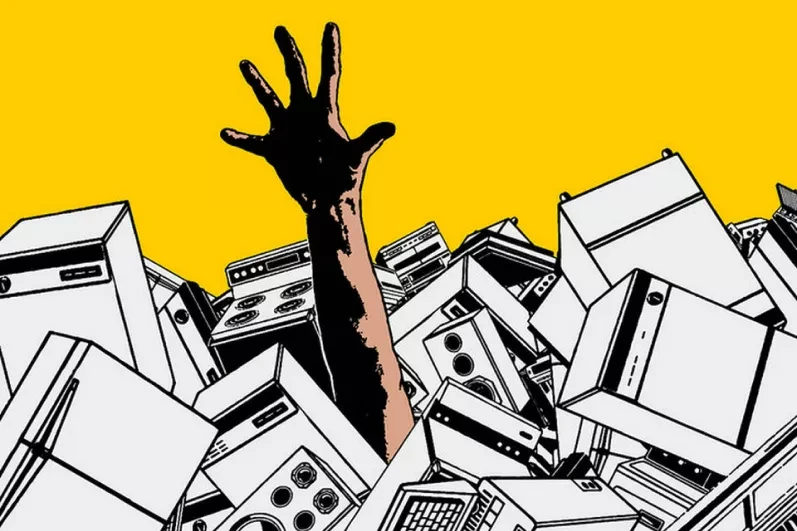

Akwai buƙatar gyara tsarin kuɗi don nuna ƙunciyar al'adunmu tare da ƙunciyar kuɗinmu. Hakan zai ƙara daukar aiki mai kyau da kuma tunani mai tsawon lokaci. Sai dai, tattalin arziki, ta hanyar ƙara amfani da kuma dauki nauyi, yana da tasiri mafi ƙaranci a kan yanayin yanayi a nisan lokaci.

Tsarin kudi na yanzu ya hada da ra'ayin tattalin arziki na Keynesian, wanda, ba kamar tattalin arziki na Austrian ba, bai dauki hankali kan yanayin lokaci da kuma al'amuran da suka shafi lokaci da kuma kayayyaki. A magana ta wani hali, kudin da babu iyakarsa ba zai iya wakiltar kayayyakin da suka kasa a wajenmu na duniya ba.

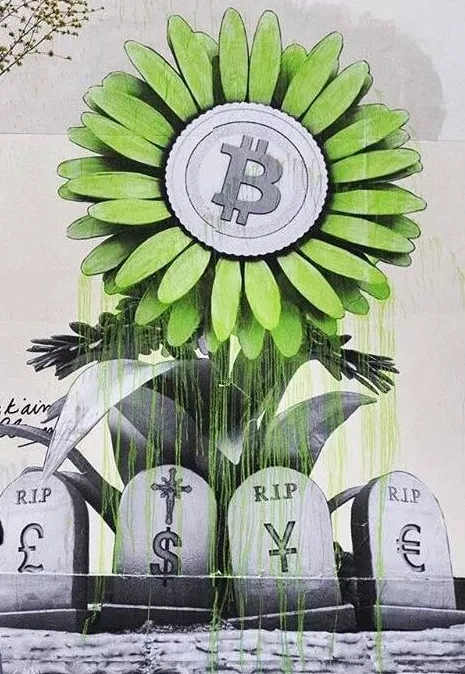

A kan gaba, 'yan siyasa suna da kallo na mafita a kan lokaci guda, kuma suke bukatar ci gaba na tattalin arziki don su zabi sabo, don haka ba su iya magance matsalolin yanayin gashin kai a nisan lokaci ba. A gefe, karɓar kuɗin daidai kamar Bitcoin shine mafita mai yiwuwa wadda zata iya ba mutane ikon tattalin arziki.

Ba su yarda cewa Bitcoin yana goyon bayan amfani da wutar mai tsakiya. Misali, wutar da ake yi wa wuta a wuraren madubin mai, domin rage cin zarafi, za a iya kashe ta hanyar masu yin Bitcoin, domin methane zai iya canza zuwa wutar lantarki domin taimaka wa na'urorin yin Bitcoin, wanda yana da alaka da ingancin yanayi.

**Biyo da daya daga cikin dokokin Bitcoin: Kada ka amini, tabbata ne kanka!**

### Tace takardun samfuran na fasahar Bitcoin

Satoshi Nakamoto ya fitar da tsarin Bitcoin a Janairu 2009, wanda ya ci gaba da bunkasa na gode ga al'umma mai yawa na masu inganta, masu noma, da masu amfani da nodoci na Bitcoin. Ta hanyar ginshikar da kopy na su na blockchain na Bitcoin, wanda ke cike da bayanan ayyukan dukkanin Bitcoin, nodoci ne zasu tabbatar da gaskiya na ayyukan biyan kuɗi a kan dokokin tarayya na Bitcoin. Hakan ya hada da tabbatar da cewa masu noma sun fitar da kundin da ke cike da ayyukan biyan kuɗi masu tsawaita.

A kananan, wani bloki yana samun halitta kowace minti 10, kuma mai mayar da wani hashi mai kyau ga blokin da zai biyo bayan ya samu lambar da aka tsara ta hanyar tsarin, tare da kudaden cinikin daga duk cinikayya da aka hada a cikin blokin mai kyau. Tun da ake ganin sakamakon algorithmin hashing (SHA256) don wani shigarwa ba zai iya tabbatarwa ba, aikin noma yana hada da gina blokan da yawa kuma a gwada ko hashinsu ya dace ko ba. Amma, don tabbatar da cewa lokacin tsakanin biyu na blokan yana tsayawa (~10 mintuna) ba tare da yawan masu noma da karfin kwamfutarsu ba, matsalar samun wani hashi mai kyau ta sauya kowace blokan 2016, kusan kowace makon 2. Masu noma sun ci gaba da gina kwamfutoci mai amfani da SHA256 a cikin lokaci, wadanda aka kira ASICS, don kara karfin hashin kowace joule, wanda ke nufin yawan kokarin kowace sekondi da kowace iya aiki.

Don haka wadanda suke noma su zama samarwa da riba sosai a cikin ayyukansu, ya kamata su sami wutar lantarki mai kudin kudade, wanda yana yanzu a wurare da suka nisa, cikin gidajen tashar jirgin ruwa da ba a hada da cibiyar lantarki ba. Mai noma yana aiki kamar mai sayarwa na karshe, kuma, idan kudin kudade na wutar lantarki ya karu saboda karuwar bukata, mai noma zai koma aiki wurin da ya dace.

Don haka, tsarin Bitcoin shi ne tsarin kuɗi da ba a iya cire shi ba kuma ba a iya dakatar da shi saboda kowace sashi na tsarin ya samu yankin a duk fadin duniya. Misali, akwai fiye da 40,000 na nodin Bitcoin a duk fadin duniya. Dokokin tarayya na Bitcoin suna daidai haka kuma yawan samar da riba idan aka bi su fiye da kokarin yin kuskure a cikinsu, kuma don haka babu bukatar aminci tsakanin masu amfani. Bitcoin babu shugaba kuma ba a iya dakatar da shi. Ko da yake akwai damar daidaita damfara don kaucewa Bitcoin, wannan hanyar na da tasiri mai yawa kan tsarin. Maimakon haka, babu hakimi ko gwamnati da za ta iya cire ko dakatar da Bitcoin.

# Yaya ka Samun Bitcoin?

<partId>517e1bb7-f032-51a0-930a-a91fe5148d3f</partId>

## Bitcoin Ba Ya Barci Ba!

<chapterId>d5e35e41-ea26-5478-8eb9-07daf9dff508</chapterId>

Farashin Bitcoin yana da alamar canja wurin da yawa. Dabi'arsa zata iya canja sosai idan akwai canje-canje a kasuwa ko a lokacin da ake cin gwiwa da kuma lokacin da ake cin kasa, kamar yadda yake da kasuwannin kudi na wasu.

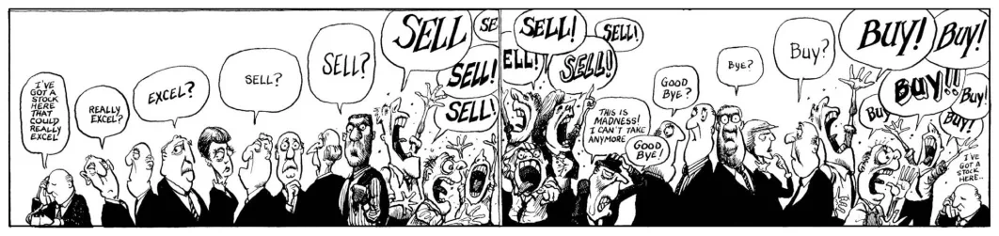

Don haka ne kawai, mutane ke son sayi komai a lokacin daya kuma su sayar da komai a lokacin daya. **Bitcoin ba ya kaucewa halin jiki ba.**

### Fahimtar da yawaitar ayyuka

Buguwar kafa da kuma tashe-tashen Bitcoin na da alaka mai yawa da kungiyoyin 'yan wasa da suka kawo shi cikin tsarin sa.


- Masu gaskatawa:

Masu amfani da Bitcoin na farko sun hada da masu sha'awar fasaha, cypherpunks, yan kasuwa, da masu sha'awar zinari. Kungiyoyin nan sun yi niyyar zuwa shi saboda darajar sa kamar kudi mai amfani na elektronik, tsawon sa da ake yi, da tsarin kudin da ba za a iya canzawa ba.


- Tsarin yanar gizo mai duhu & masu laifi

Sai, amfani da Bitcoin ya yaye zuwa kasuwancin yanar gizo na dark web kamar Silk Road, saboda irin halin da ba a iya kula da shi da kuma sunan mai rarraba, wanda ya kuma kawo waɗanda suka wuce wannan dandali, ciki har da wasu mutane da suka shiga ayyukan laifi. Amma, ya kamata a yi maida hankali cewa shi ne yadda ake amfani da kayan aiki, ba kayan aikin da ya ke tsara dokar ba. Amfani da Bitcoin a hanyar laifi ba ya sa mutum ya zama dan laifi ba; sai dai, shi ne ayyukan da za a iya sanya a matsayin laifin. Misali, amfani da Bitcoin don siyan kayan magani na iya zama laifi ko ba laifi, ya yi amfani da dokokin da ke tsara yankin inda ake yi wa cinikin.


- Frenzy na ICO da kuma zuwan jama'a ta yau da kullun.

Shekarar 2017 an shaida ta da wani babban kumbura na tsatsa a duniyar cryptocurrency, musamman da fara dubatar da dubu da yawa na Initial Coin Offerings (ICOs). Duk da haka, da yawa daga cikin wannan sabon cryptocurrencies babu wani aiki na gaskiya ko amfani, kuma suka iya ɓace da sauri. Wannan kumbura na 2017 an bi ta da wani gyara mai ƙarfi a 2018-2019.


- Babin NFT da DeFi

Sai kuma a 2020, kasuwar ta fuskanci wani kuma da ya kai farashin Bitcoin zuwa $60,000. Wannan kuma ya bambanta da na baya saboda yawan yin amfani da dama, ciki har da masu kudin kasa da kungiyoyi babba. Duk da haka, kamar yadda ya faru da kuma na baya, gyare-gyare masu muhimmanci ke biyo bayan farin ciki na farko ya kare.

### Bitcoin da rashin tsaro

Tuni da tarihin kwanaki, yana da kyau a ce cewa tsawon lokacin tattalin arzikin Bitcoin na daidaita da tsawon lokacin tsakanin biyu halvings, watakila ne saboda halving event yana aiki kamar mashi ta hanyar rage samar da sabbin bitcoins na'ura.

Wadannan yawaitar sauyawa mai yawa sun ba da Bitcoin suna da suna kamar abu mai sauyi sosai, wanda yana kawo rasa sosai ga masu amfani da shi. Koda kuwa farashin ya ragu da 10%, 20% ko kuma 50% cikin kwanaki, ya kamata a sani cewa tsarin Bitcoin da kansa bai shafi sauyawar farashin ba.

Wannan rashin tsaro mai yawa yana da karɓa yau da kullun daga masu aiki da Bitcoin kuma zai iya kawo sauki ta hanyoyi da dama kamar yadda suke da kariya ta tattara kudi (stablecoins), gaskiya mai tsawo (hodling), ko kawai ta hanyar kaucewa wata hatsari ta daukar kudi 100% a cikin Bitcoin ba tare da fahimtar ba. Don haka, fahimtar dalilin da ke sa farashin Bitcoin ya canza sosai shi ne abin da ya dacewa don ci gaba a wannan harka, domin a ƙarshe, shi ne yawan canja farawa da kungiyoyi da ke taimakawa wajen kawar da kasuwa zuwa wani daraja. Amma, ya kamata a lura cewa yayin da Bitcoin ke yin girma da kuma gudummawa, rashin tsaro ya zama mai rauni.

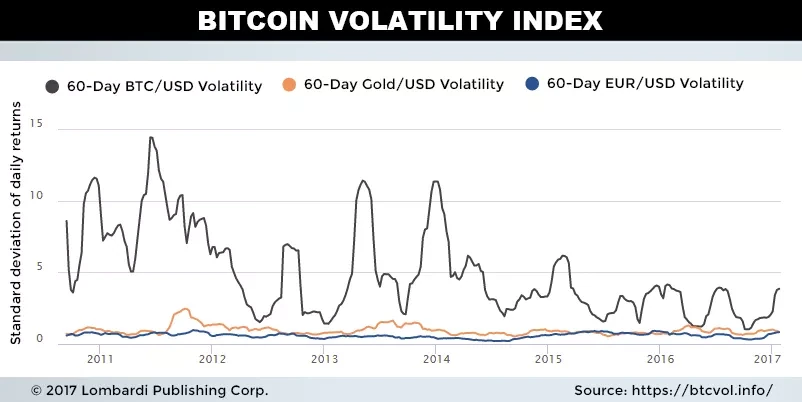

Koda btc/dollar ta yin yawaita a cikin lokaci mai tsawo, bitcoin, saboda adadin da ya kasa na bitcoins 21 miliyan da tsarin raba shi biyu (raba halin kudin halitta kowace shekara 4 a tsawon lokaci), yana bi ta hanyar samuwa a cikin hanyar da ta fi karfin inganci. Kuma, kamar kowace abu na tattalin arziki, bitcoin na da alaka da tsare-tsaren tattalin arziki wanda ke hada da lokutan murna, kumburin yawaita, da gyare-gyare. Wannan halin ya fi yawa a cikin fasahar da ke fitowa, inda kasuwar ba ta yawaita ko ta inganci ba ne.

### Kasuwa mai yau da kullun

Wadannan kungiyoyin babban kuma na tsadar kudin da suka shafi duniya, domin an samu wani abu mai yawa da ya samu irin wannan tsadar na kudin a jere. Wannan halin zai iya amsa da cewa Bitcoin ba kawai babban kuma ne da zai fadi ba. Sai dai, yana aiki kamar kudaden da ake amfani da su a duniya baki daya. Tsarin Bitcoin ya yi mataki sosai saboda iya aiki a kan matsayi na duniya, 24/7, wanda ke jawo matsaloli masu yawa ga hukumomin kudi da ke kokarin shirya shi.

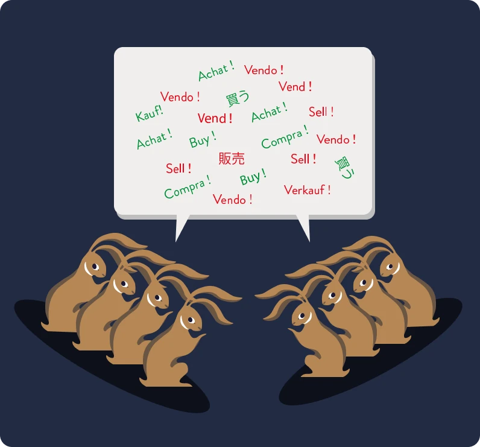

Yau, Bitcoin yana ci gaba da rayuwa kuma yana girma fiye da yadda ake hada shi da kasuwar gargajiya, kuma aikin shigar da Bitcoin ETFs, tsarin mulki mai sauki, da kayan aiki na samar da kuma adana suna taimakawa wajen samar da wannan tashin hankali mai kyau. Bitcoin YA KUMA CI GABA da rayuwa bayan binciken nasa na bula-bula, don haka, watau ba wani iska bane a karshe!


## Sami da Bitcoins ta hanyar Aiki

<chapterId>be2d83be-406f-582c-83ca-6aa905ff7b04</chapterId>

### Ana tattalin tattalin kasuwa ke ci gaba

Bitcoin zai iya ganin kamar kayan aiki don samar da tattalin arziki na gaba ga kudade na fiat, domin akwai damar sayar da abubuwa ko ayyuka kuma a biya a cikin bitcoin. An yi amfani da Bitcoin don ayyuka, ba tare da bukatar zuwa kan dandali na canja-sheka ba, amma kawai tafi daga jakar Bitcoin zuwa wata.

Tashar Bitcoin ke nan da take ci gaba a wasu yankuna na duniya, kamar a El Salvador, inda Bitcoin ta zama kudi da ake amfani da shi tun daga shekarar 2021. A duk fadinmu akwai wasu mutane, kungiyoyi, da kuma hukumomi da suka fara karɓar Bitcoin a matsayin kudi na biyan bukatunsu ko ayyukansu.

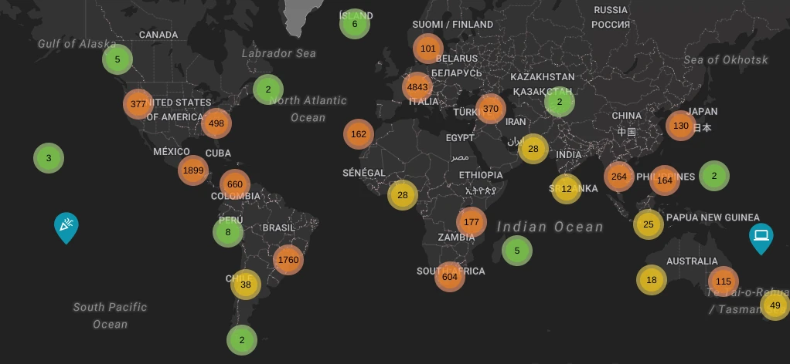

Karin, an shiri mai amfani da bayanai da kuma aiki tare ya fara aiki, [BTCMap](https://btcmap.org/map#2/21.28937/5.46680), don saukaka amfani da Bitcoin a cikin mu'amala ta yau da kullun. Wannan dandamali ya dauki duk masu sayar da suke karɓar Bitcoin, da kuma al'ummomin Bitcoin dukkanin duniya, don haka zaka iya ziyarci shafinsu don gano tsarin Bitcoin a kusa da kai. Haka nan, koda da matsalolin da shakka, akwai kwarewargu kamar BTCMap da suka taimaka wajen sa Bitcoin kasuwa ta zama mai sauƙi da dacewa ga kowa.

### Me ya kamata mu yarda da Bitcoin maimakon sayen shi?

Don samun bitcoins, za ka iya sayen su a kan dandamali da ake tsare su ta hanyar kungiyoyi kamar AMF (Autorité des Marchés Financiers) a Faransa, ko Securities & Exchange Commission (SEC) a Amurka, amma wannan hanya na nufin ake biyan buƙata na ayyukan ka. Wata hanya wani don samun bitcoins ita ce ta karɓar su a matsayin hanya biyan buƙata ga kayayyakin ko ayyukan da ka ke ba da su, hakanan za ka iya samun bitcoins ta hanyar aikinka ba tare da damuwa akan farashin Bitcoin ba.

Karin haka, amincewa da Bitcoin a matsayin mai sayarwa yana da al'umma da dama, ciki har da karewa daga gagarumar hukunci, rage kudaden ciniki, karawa da inganci, karewa daga tashin hali, da kuma yancin kudi da kudin kasa.

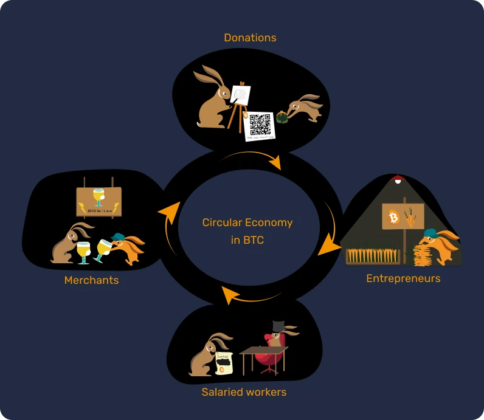

### Yaya za ka ci gaba?

Don samun Bitcoin, akwai bukatar a yi karatu akan samfuran da suka wuce da za a zaba wanda ya dace da kasuwancinka. Babu samfurin da ya kamata sosai, kuma anan akwai bukatar a dauki wasu abubuwa a hankali don zaba, kamar yadda ake tsammanin zai kasance yawan cinikin, bajeti da aka baiwa, kuma irin kasuwancin (kan layi ko na gaskiya).

Zamu yi bayani akan wannan batu a cikin wata hanya ta daban, amma don sauya shi zuwa mai sauƙi, za mu iya la'akari da wasu rukunoni na kasuwanci kuma haka nan kuma da makamantansu.


- Makamancin yanayi na lalacewa: OpenNode

https://planb.network/tutorials/merchant/merchant/open-node-e69a0c1c-47f7-4932-8494-e6f26c3c9784

- Makamancin taimako ga kasuwanci: Swiss Bitcoin Biya

https://planb.network/tutorials/merchant/merchant/swiss-bitcoin-pay-2-a78b057e-ed11-47ac-860c-71019fcb451a

- Ƙari mai sauƙiwa ga gida masu girma ko masu sha'awar bitcoin: BTCpay Server

## Adana da Bitcoin

<chapterId>1d9570c6-5b63-51a6-b87c-7bdb0fc4aa87</chapterId>

### Wani gargaɗi kafin a fara!

Bitcoin ya zama asali na musamman na tattalin arziki, hakan yana da alaka da adadin da ya kasa da bukatun da suka karuwa. Duk da haka, sayen Bitcoin yana da hatsari da suke bukatar hankali na musamman. Don haka, an shawarci ka yi bincike na kanka kuma ka koyi karin bayani akan batun don ka sani da fasaha akan fasahar kafin ka yi amfani da kudin da ka da shi.


- Kawai dauki abin da kake iya rasa.
- Bitcoin shine abu mai tsanani na yau da kullun a tattalin arzikin, kuma kudinsa zai iya ragu zuwa 0.
- Ayyukan da ya gabata ba wani alamar da ake iya aminta na ayyukan da za su zo ba ne.
- Tuntube wakilinka na kasuwanci idan akwai buƙatar.

**Shirin ₿ Network bai ba da shawarar daukar kudi ba, kuma babu wani abu da aka fada nan da za'a iya ganin shi kamar haka ba**

### Mini Jerin Kwallo kafin a dauki tafiyar

Kafin ka fara siyan Bitcoin, tabbata ka da:


- Ƙafafun kayan aiki mai tsaro.
- Ƙarin sanin kan Bitcoin.
- Tsarin adana da za'a bi.
- Ganinwar da aka yi na tsawon lokaci.

Idan da matakai bai bayyana ba, sani cewa aikin BTC102 zai taimaka maka wajen tsaro da samar da bitcoin ɗin naka na farko. Anan, za mu kawai latsa kan babban abin da ya shafi harkar.

A cikakken magana, akwai biyu tambayoyi da za ka tambayi kansa:


- Shin kana so ka a karɓi tsarin samun abubuwan da kake bukata ne ko kuma ka karɓi duk abin da kake bukata a lokacin guda daya?
- Shin kuna bukatar amfani da dandamali mai daidaito ko wanda ba a daidaita ba?

### Ƙirar da hanyoyi


- Dala Kudi Tsada

A tattalin hanyar yiwuwa ta hada da sayen sayayya, wanda ke nufin sayen yawan Bitcoin a lokutan da suka dawo. Wannan hanyar ta rage farashin a lokacin kuma ta ba da ci gaba a yawan Bitcoin da aka mallaki. Ita ce mafita mai kyau ga adadin da ake so, kuma ta rage damuwa game da yiwuwar farashin Bitcoin. Bayan a kafa ta, za ka iya manta da ita kuma ka kalla yadda daukakanka ke ci gaba.


**Kiyaye da UTXOs**: Ka tuna da gudanar da UTXOs a aljihun ku daga lokaci zuwa lokaci. Wannan aiki na da muhimmanci ga kula da kudi na bitcoins da kuma kiyaye ka daga biyan bukata mai yawa lokacin ayyuka.


- Sayarwa ta rashin tsammani

Wataccen aikin da za'a yi a lokacin daya zai iya kasancewa sayarwa mai sauri, wanda ake amfani da shi don samun damar zuwa ga Bitcoin nan take. Ko kuma shi ne sayarwa lokacin da ya ragu ko amfani da bonus, zaɓin shi ne na kai. Za ka bukatar tashi da jin dadin ka kuma danna button na sayarwa.

A cikin wannan halin, ya kamata ka kasance kyan gani da kula da ra'ayinka, domin farashin bitcoin zai iya zama mai sauya sosai. A gaskiya, FOMO (Tsoro na Rasa Abin da Ake So) da FUD (Tsoro, Sha'awar Tsammani, Sha'awar Tsammani) suna cikin makiyanka mafi girma! Ka tuna da zama lafiya da bi umarnin da ka tsara da gaba, domin kawar da yin magana da rashin tsoro da zai iya zama laifiya.

### Wane ne muke yi guda bitcoin daga?

Akwai yawa hanyoyi na samun bitcoins, kowace ta da dokokin da ta ke daidaita da yankin. Wasu dandamali na bukatar bayani na tabbatarwa (KYC), yayin da wasu ba su da bukatar. Don haka, ya kamata ka fahimci dokokin da ke daidaita da kowace dandamali.


- DCA tsinkayen

Yadda muka bayyana a sama, hanyar da ake amfani da ita wajen samar da bitcoins itace Dollar Cost Averaging (DCA), wadda take hada da sayen kudaden karami a lokaci-lokaci. Dama daga cikin dandalin yanar gizo suna ba da wannan aiki, kamar wadanda aka mayar da su a kan [shafinmu na musamman](https://planb.network/tutorials/exchange). A kaddamar da DCA, fitarwa zuwa aljihunka na yanzu haka take faruwa, hakan na nufin zaka kasance da sarautar dukiyarka yanzu haka.

Yau, kusan duk samfuran DCA suna da inganci da kuma biyan bukata da suka kai kusan daidai, don haka zaɓin zai danganta da yiwuwar a cikin ƙasar ka.


- Dandalin Makera

Don samar da daukaka, dandamali da aka yiwa ilimi kamar Kraken, Bitstamp, da Paymium an gudanar da su. Suna ba da mahimmanci da tsaro ga cinikin yawa.

Amfani da su mai sauƙi kuma ya wanzu ga duk wanda:

1. Kafa a asusun KYC/\*

2. Mika kudi zuwa asusunka

3. Sayi bitcoin

4. Cire Bitcoin zuwa alamar ka

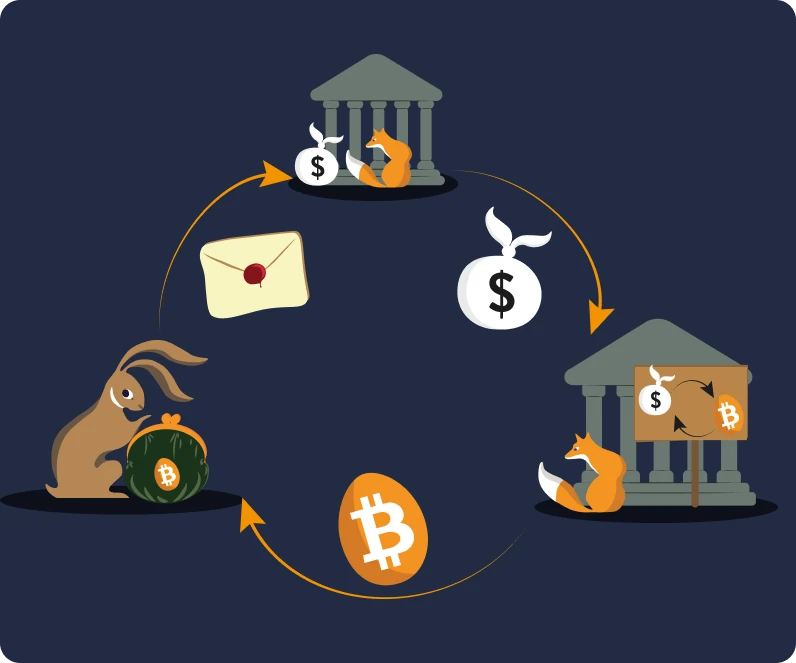

Bayanin sayen, akwai wata shawarar da za'a yi don kashe bitcoins daga kan dandalin canja wurin nan take don rage hanyoyin da 'yan sanda suke amfani da su don kama ko kulle kudaden. Ka san cewa kudaden da ake biya don kashewa zasu iya zama sama, wanda kuma zai iya kai har zuwa euro 25 a kan dandalin da ake amfani da shi.

**Sanarwa da Abokin Ciniki (KYC) na bukatar abokan ciniki su bayar da tabbacin kansu domin kare kai tsaye a kan biyan kudin kai hari, kaucewa haraji, da cin hanci kudi.**

Yana da muhimmanci a gane cewa KYC shine batun muhawara mai muhimmanci a cikin kungiyar Bitcoin. Yayin da mutane da yawa ke jadawa akan aiki mai kyau, akwai damuwa da yawa da suka shafi shi. A cikin koyarwa da kuma abubuwan da muke bayarwa a cikin makarantar mu, muke shawarar masu amfani da fasaha su kauce wa dandalin da suke bukatar KYC, domin akwai zaɓuɓɓukan da suke da mafita da suka kai ga kariya.

### Solutions mara KYC

Karinƙiyar, akwai wasu [kasuwanni](https://planb.network/tutorials/exchange) inda za'a iya sayar da sayen bitcoins a cikin canji na gaba-gaba. A gaskiya, za ka iya lura da wadannan:


- Bitcoin ATM
- Fadakarwa ta jiki da masu sha'awar bitcoin na wasu
- Ilimomin da ba a tsara dandamali ba
- Makamancin makamai na adireshin juna
- Neobanks mai aiki a cikin kasashen da suka yarda da Bitcoin.

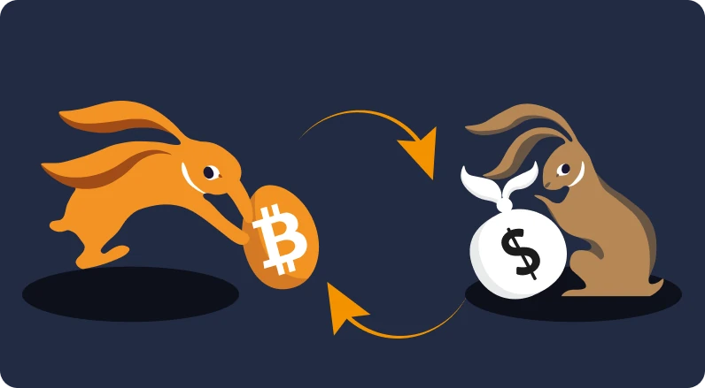

Karshe, ya kamata a lura cewa dokokin haraji zai iya bambanta a kan hukuncin, don haka muna da wuya ka duba dokokin a kasarka kafin ka dauki wani mataki da zai iya sa ka cikin kunci.

## Hyper-bitcoinization

<chapterId>b7275d31-3b60-5fb7-b9f5-030097010553</chapterId>

### Yakin da yaki ya fara ne kawai!

Kamar yadda kowane sabon fasaha, amfani da Bitcoin yana biyan hanyar S, wanda yake nuna yadda ake ci gaba daga masu amfani na farko zuwa yin amfani da shi a tsakanin al'umma. Mun tafi shekarar masu amfani na farko, kuma alamomi sun nuna damar yin amfani da Bitcoin a tsakanin al'umma. Bayan k'arshe, shi ne fasaha mai yaduwa da ba za a iya dakatar da ita ba. Daga ɗaya bangaren, El Salvador ta dauki matakin mai tsanani na yin amfani da Bitcoin kamar kudi da ake amfani da shi a kan hukunci. A gefen sauran kasashe, suka amsa da hana shi kuma suka haramta amfani da shi, wanda hakan ke nuna cewa yin amfani da Bitcoin yana da wahala kuma yana daidaita da tarihin al'umma, tarihin kasar, da kuma yadda kasar ke gani.


Tashiwararwarin Bitcoin ya sa kamfanoni, jami'o'i, masu kula da dokar, da mutane su dauki wannan sabon fasahar a hankali. Ana bukatar kirkirar kayan aiki masu sabuntawa, a sauya hanyoyin bincike, kuma a ci gaba da bunkasa domin tabbatar da rayuwarsu. Wannan matakai ya haifar da tambayoyi da yawa da suka shafi yankuna da dama, ciki har da fasaha, teoriya na wasan kwaikwayo, tattalin arziki da siyasa ta kudi, ilimin kwamfuta, falsafa, iya, dokoki, da kula da dokar. A karshe, Bitcoin shine wani abu mai yawa na ilimi.


### Bitcoin shine 0 zuwa 1

A ƙarshe, muna kira ku yi tunani akan wannan sabon babban ƙarƙashin kuɗin. Akwai yawa da za a bincika tare da Bitcoin da ya yi wahala sosai don gane duk abin da ke faruwa a lokacin daya. Ku dauki lokacin ku, Bitcoin ba zai ƙare ba. Sai dai, babban ƙarƙashin ya fara ne kawai. Muna ganin cewa muna iya ƙirƙirar duniya da muke so mu amince da shi ga ƴayenmu: duniya inda mulkin mutum shi ne hakkoki, inda tsaro ya amince da shi ta hanyar ƙarƙashin, kuma inda ba a yi wasa da kuɗi ba. Muna fatan cewa, tare, za mu iya samun wannan.

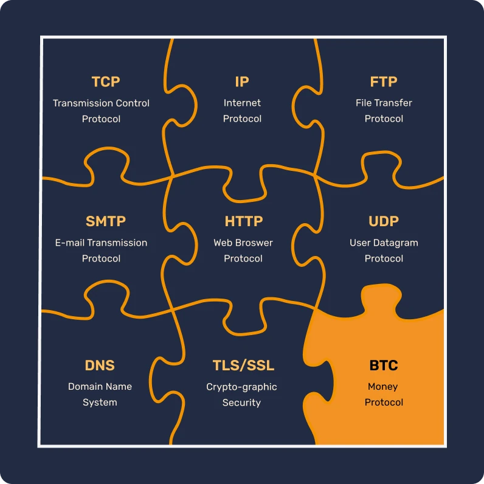

Idan ka so ka yaye sanin ka akan Bitcoin, wannan ne lokacin daidai: yawan marubuta, masu tunani, da masu rubutu sun kirkira abubuwan koyi akan Bitcoin. A shekarun baya, muna shigar da kuma rarraba ayyukan nan don samar da [makarantar kayayyaki](https://planb.network/resources) ga wadanda suka fi son sanin. A cikin wannan sashi, za ka samu shirye-shiryen bidiyo, shafuffukan yanar gizo, ma'udata, koyarwa, littattafai, da sauran abubuwa.

> "Ina ganin cewa Intanetin zai zama daya daga cikin manyan ikon da za su rage rawar gwamnati. Abinda ya rasa, amma da za a ci gaba da shi, shi ne kuɗin sadarwa mai amfani - hanyar da a kan Intanetin za ka iya motsa kuɗi daga A zuwa B ba tare da A sanin B ko B sanin A ba." - Tsokaci na Milton Friedman a 1999
# Mafita na Bitcoin: Tsarin Lightning

<partId>899fd35e-39e6-5a25-a73e-6fed6e725094</partId>

## Ƙanƙarin Shaida zuwa Hanyar Lantarki

<chapterId>b403f1e4-f1ff-572b-a242-9b58cb3736d0</chapterId>

Yanzu da muna da asusun Bitcoin, zamu kawo mako na biyan kuɗi da ke amfani da tsarin Bitcoin don samar da mu'amala mai sauri: Lightning Network!

Ka san cewa abin da ke nan kawai shine bayani na jumla, don haka, idan kana so ka fahimci shi a cikin kashi mafi girma, muna kira ka ka duba takardarmu na LNP201.

### A cikin gawar kaura

Lightning Network shine sabon fasaha ne mai tashi tsaye wanda ya canza ganinmu na Bitcoin, domin ya magance matsalar yaduwar Bitcoin.

Don samun fahimtar cikakken hanyar Lightning Network, ya kamata mu fahimci yadda Bitcoin ke ci gaba da bunkasa a cikin tare na kayan aiki: taren farko shi ne blockchain, kuma na biyu shi ne Lightning Network.

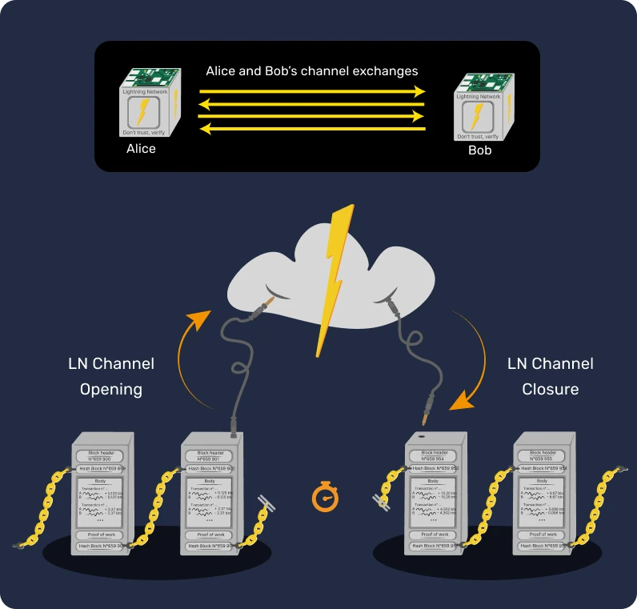

### Blockchain ba za ta ci gaba da yawaita har abada ba

Lightning Network ya tabbatar da kuma aikawa a 2017 don warware matsalar daidaitawa na Bitcoin, domin yana ba da damar ayyukan Bitcoin da suka yi sauri, da kuma kudin da ya rage.

Matsalar ƙarfin yawaita na nuni ga wani matsala na amfani da tsarin kudi mai iya samar da yawa mafi girma na cinikayya a kowane lokaci don amfani da yawa mafi girma. Wannan matsala ta danganta da trilemma na blockchain. Ka yi tunani akan wani murabba'in da yawaita, tsaro, da ƙarfin yawaita a matsayinsa na uku.

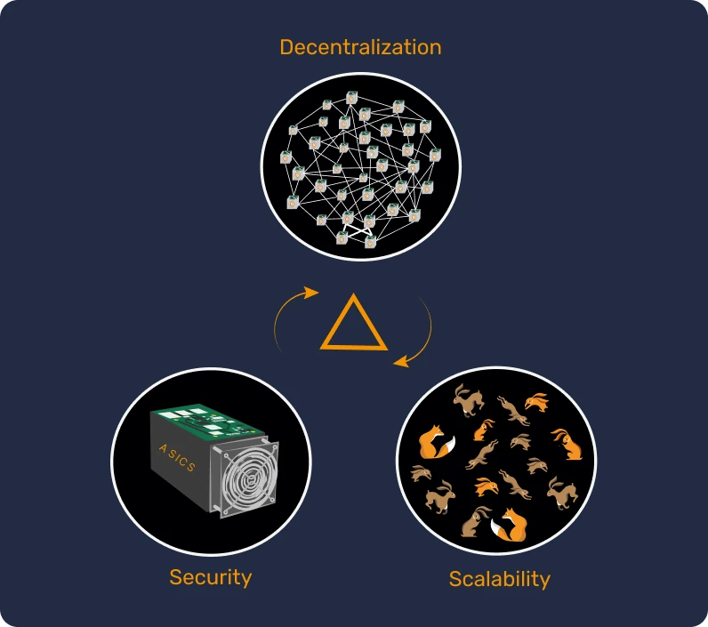

A cikin shi, tsarin da ya dace da blockchain zai iya cimma kawai biyu daga cikin wadannan siffofin. A cikin tsarin Bitcoin, masu noma sun yi zaɓuɓɓukan don nuna raguwar kuma tsaro. Daga ɗaya gefe, girman block na 1MB da lokacin tsakanin biyu blocks (a tsawon minti 10 a kan gaggawa) yana ba da damar gudanar da node na Bitcoin a kudin da ya kasa, yana nuna raguwar. Daga gefen biyu, samar da blocks ta hanyar Shaida-na-Aiki yana sa gaskiya a cikin tsarin ya kasance da kudin yawa, yayin da yake saukar da tabbatarwa ta hanyar nodes na network kuma yana nuna tsaro. Amma, zaɓuɓɓukan nan sun sa wani iyaka kan lambar yawan ayyuka a cikin block, wanda ya kai kawai ayyuka na ɗaya-ɗaya a kowane lokaci. Lambar nan na daidai lokacin da aka kwatanta da iko na masu amfani da kwamfuta kamar VISA (1700/s), amma wannan iyaka na da bukata don ayya da Bitcoin a hanya mai karya gaskiya da babu wanda ake aminta. Alamar haka, wadanda ke noma akan Bitcoin suna tunanin wannan matsala tun daga farko.

### Haske a matsayin wani tusa a sama

Bayan shekaru da yawa da kuma kokarin da aka yi sau da yawa, an samu tsarin Lightning. Ta hanyar amfani da adadin bayanai na wasu, wannan tsarin yana kafa shafin biyan kuɗi na gaba-gaba ta hanyar amfani da tsaro da kuma kariya na tsarin biyan kuɗi na Bitcoin. Shafin Lightning yana aiki kamar shafin hanyoyin biyan kuɗi, yana ba da damar aikace-aikacen biyan kuɗi da kudaden kasa ga mai aika, kuma ya kuma ƙirƙira hanyoyin canja kuɗi tsakanin mutane da ba su da alaƙa ta hanyar kai tsaye ba.

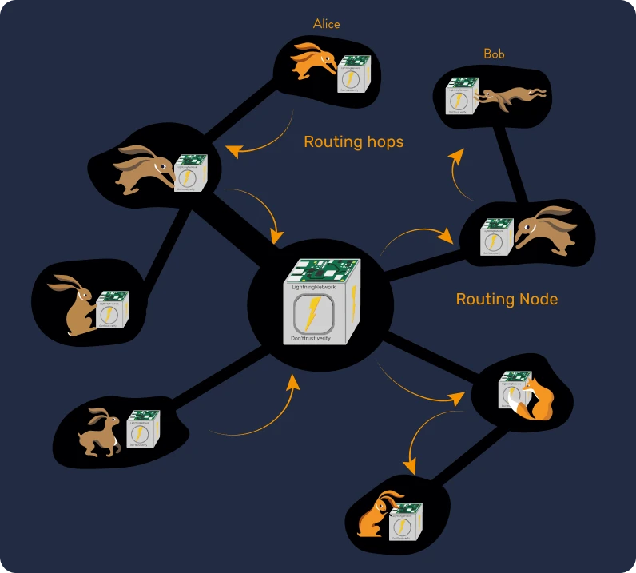

Hanyoyin kudi na gargajiya kamar Western Union, bankuna masu tsarin kasa, Visa, da Mastercard zasu iya rufe idan basu karɓi fasahar Lightning Network ba, wadda ke fi karfin hali da kuma fi amfani da tsarin biyan kuɗi na yanzu. A gaskiya, Lightning Network na ba da damar yin amfani da kudin da ba za a iya ƙirƙirarwa tsakanin ɗan'uwan biyu da suka rika raba hanyar, wanda ke kai wa kawai kudin da ake buƙatar don sanar da kafa hanyar, maimakon a kowace hanyar biyan kuɗi.

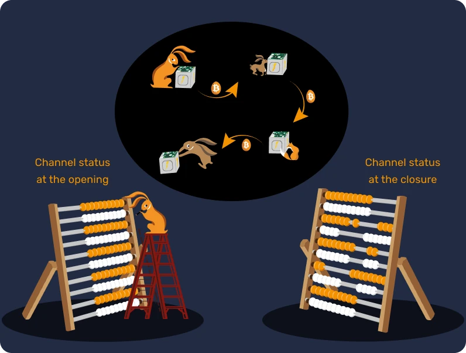

Ayyukan ciniki suna tsare ta hanyar fasaha da kuma ta hanyar karfin da masu noma suke amfani da shi a kan Bitcoin. Zasu iya aiki nan take, ba tare da iyaka da wuraren ba, da kudaden da suke kasa sosai (kamar yadda suke kusan kasa da 0.5%).

A takaice, Lightning Network shi ne kokarin da ya yi amfani da tsarin biyan kuɗi mai inganci don sayar da siye a cikin Bitcoin. Akwai alamu da yawa na Lightning wallets da za ka iya samun a cikin bangarorinmu na koyon sani ko ta hanyar koyonmu na Lightning Network.

Idan ka so ka wuce wannan gabatarwa kuma ka fahimci duk yadda Lightning Network ke aiki, muna shawarar ka karanta wannan kyakkyawan koyi na Fanis Michalakis akan lambar:

https://planb.network/courses/34bd43ef-6683-4a5c-b239-7cb1e40a4aeb
## Amfani da Hanyar Adadin Lantarki

<chapterId>684e31f9-ebd1-51b6-91c0-1e6a315f1141</chapterId>

Kamar yadda mu ka kalli kafin nan, tsarin Bitcoin, ko da yake ya yi sabon halin, yana fuskantar matsaloli masu yawa a kan yadda zai iya magance dukiyar mu ta yau da kullun. Don magance wannan matsaloli, aka shawarci Lightning Network kuma tun daga nan ya ci gaba da bunkasa zuwa cikakkun yankuna daban-daban, duk da suka iya aiki tare da juna:


- Core-lightning ta Blockstream
- Eclair ta Acinq
- LND ta hanyar latsa da wuta

Wannan hanyar sadarwa ta jama'a zuwa jama'a na nufin taimakawa da cinikayya masu yawa (da kima da kadan) wanda za a iya yin shi ba daidai ba saboda tsada da tsawon lokaci mai tsanani a kan blockchain na Bitcoin.

### Me ya kasance amfani da hanyar sadarwa?

Wannan fasahar ta bude kofa ga yawan amfani da za'a iya yin da Bitcoin wanda ba a iya samun su ba saboda bukatun da ake bukata don tabbatar da tsaro da kuma kasa-kashe na Bitcoin. Cikin wadannan amfani na kullum, za mu iya ambaton adireshin da za'a iya samun nan da nan a cikin kasuwanci na jiki da kuma na yanar gizo, kudin kiran kai don biyan kuɗi a lokaci guda, da kuma sadaka mai ƙarami don masu ƙirƙirar abubuwa. Ta hanyar samar da cibiyar shiga da ke daidaita, tsaro, da kuma biyan kuɗi mai ƙarami (mai karancin kashi 0.5%), an iya samun yawan tsarin kasuwanci da ba a taba tunanin su ba. Hakan ya zama dole ne saboda cibiyar shiga ta aiki ta amfani da satoshis (sats), ƙananan ƙashi na Bitcoin.

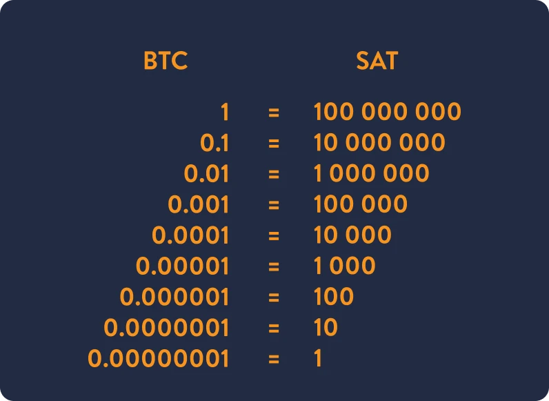

Harsashin fasaha na wasan bidiyo yana ba da misali mai sha'awa wajen yadda Lightning Network zai iya amfani da shi don canza tsarin kasuwanci na yanzu. Tsarin "skin in the game" shi ne wani ra'ayi da ya samu yawan sha'awa a wannan matakai. Ya na nufin da hannu a cikin nasara na wasan. A gaskiya, Lightning Network yana ba da damar wa 'yan wasa su yaudara kudade gajeru ne lokacin da suke buga wasanni, kamar satoshi guda (wanda yake kamar rabin kobo na euro) don samar da hannu a cikin nasara da ke kara girma yawan amfani da bots.

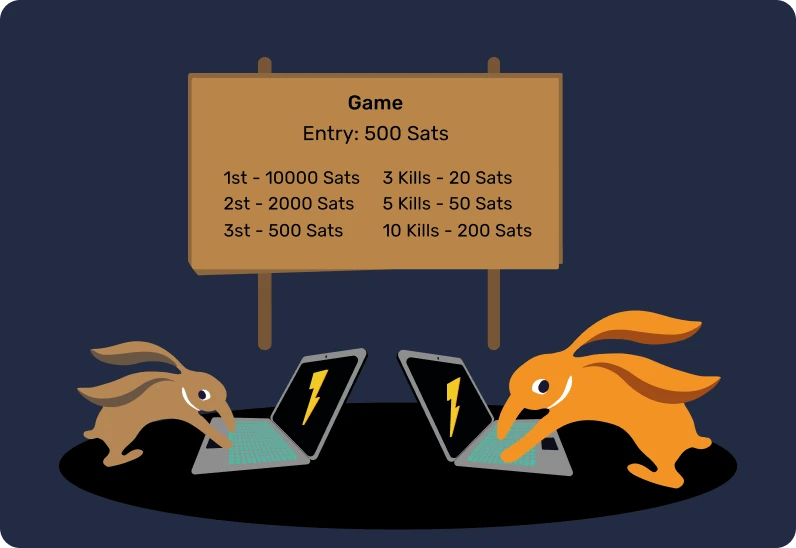

A cikakken magana, nan gaba na cinikayya masu ƙarami tare da Bitcoin na da kyau saboda sabuntawa kamar Lightning Network. Yayin da wannan fasahar ta ci gaba da bunkasa da gamsuwa, za mu iya sauraron ganin aikace-aikace sabo da dama da za su fito a gaba mai zuwa.

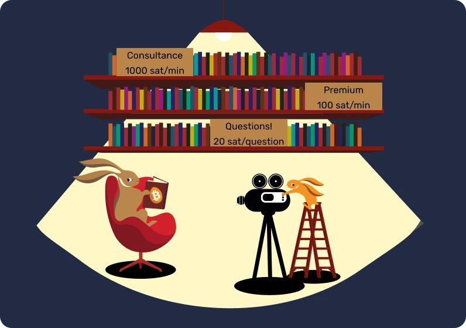

Wani misali zai iya kasancewa "kudin da ake tara": ta hanyar Lightning Network, za mu iya yin matakan karamar kudi kowane minti (wanda zai iya kasancewa ba tare da wanda za mu amince da shi ba), wanda yake buɗe kofar yin gwajin da tsarin tattalin arziki inda masu amfani suke biyan kudin abubuwan da suka amfani da su, bisa ga yadda suka amfani da su. Har ma zai iya kasancewa a yi amfani da wannan tsari don ajalawa abubuwa. A cikin irin wannan tsari, kudin ana raba shi ne ta hanyar wani fasali da aka saba da shi, tsakanin masu gudanar da harkokin wani aiki ko samfurin. Wannan zai iya sauya yadda muke tunani akan tsarin biyan kudi: maimakon biyan kudin abun a kowace wata don wani aiki, za a iya biyan masu amfani kowane minti, ko har kowane dakika, don lokacin da suke amfani da aikin. Irin wannan tsarin tattalin arziki zai iya samar da matsaloli masu yawa ga masu ƙirƙirar abubuwa, wadanda za su samu kudin don su ƙirƙira abubuwan da suke daukar hankalin masu amfani.


A ƙarshe, Lightning Network yana buɗe damammaki da yawa na amfani ga masu amfani da Bitcoin. Tsarin tattalin arziki da damar kasuwanci da suka fito daga wannan sun kasance da yawa da daban-daban, kuma muna kira ku duba da kanku ta hanyar gwada aikace-aikacen podcast [Fountain](https://www.fountain.fm/), wanda yana ba ku damar samun sats ɗaya ko biyu don sauraren shirye-shiryenku na podcast!

## Pilo Mai na ko Pilo Shuwa?

<chapterId>c81cdb45-6aa9-5462-9835-c4852084b2cc</chapterId>

Yadda Morpheus ya fada wa Neo: "Ka karɓi kwayar cutar blue, labarin ya ƙare, ka tashi a cikin ƙirjinka, kuma ka gaskata komai da kake so ka gaskata. Ka karɓi kwayar cutar ja, ka tsaya a cikin Wonderland, kuma na nuna maka yadda rami na zomo ya yi ƙasa." Shin kuna jin dadin bincike a kan rami na Bitcoin? Ku yi ƙyama, domin ku iya sake samun damar ku na tattalin arziki!

### Zamani na fasaha daidaita da ma'ana na gaba

Teknoloji yana kara kara, kuma babu wanda zai iya tabbatar da abubuwan da za su faru a nan gaba da tabbacin. Hadin gwiwa na duniya da kuma ilimin kwararru suna ci gaba da bunkasa, kuma sanin da mutum zai samu ta hanyar yanar gizo yana kara yawa sosai a lokaci.

Idan da mu dauki AI a matsayin misali, wannan fasahar sun wuce ko sun kusa da samun nasarar mutum a cikin yawan hanyoyi, kamar wasan bidiyo, samar da hotuna da rubutu, da kuma bincike bayanai. Wani ma'ana mai yawa shine cewa a kan 80% na ayyuka za su shiga baya saboda AI da kuma aiki na atomatik. Saboda haka, akwai yawan zaɓuɓɓukan da suka wuce mu, kamar da kaucewa da ci gaban fasahar ko amfani da kudin da ake samu daga samun ci gaba a aiki da AI ya haɗa.

Muna da wasu tambayoyi masu muhimmanci da za mu tambaya kansa:


- Yaya za mu gudanar da al'umma inda ake samun aiki ne 80% zasu rufe?
- Yaya za mu mayar da halin jama'a?
- Akwai bukatar malamai da yawa haka?
- Zaɓaɓɓen siyasa, siyasa, da kuma al'amarin mutane na atomatik ba a yi magana da su sosai ba.

Nasara, yanar gizo, streaming, da VR zasu canza ilimi. Za mu iya samun wani nau'in ilimi mai yawa ga dukkan 'yan makaranta na Faransa da gwamnati ke kula da shi kuma malamai da ba su yi waƙaƙken bayani ba amma su kai ga dalibai. Yara za su iya shiga cikin duniyar fasaha kuma a kai su ga koyarwa ta tarihi.


- Ina ne iyaka tsakanin malami da kuma bayani na AI?
- Yaya za mu tabbatar da al'umma da take rayuwa cikin arziki?

Wadannan tambayoyin asali na gaba na gaba dole ne su yi magana kuma su karɓi shawarar tare.

Me ya alaka da Bitcoin? Kamar yadda yanar gizo ta yi sabon salo a hanyoyin sadarwa, Bitcoin na nufin sabon salo na fasaha ga tsarin kafa kungiyoyi na babban girma, wanda yana ba mu damar canja rayuwa ba tare da mu amincewa da wani na gaskiya ba. Shin muna so mu hana ci gaban fasahar tsarin kudi, ko muna so mu yarda da damuwar samar da kudin kasa ta hanyar samun ribar da za a iya samuwa ta hanyar amfani da Bitcoin da Lightning protocols?

### Me ya ke al'amuran kudi a gaba?

Wannan maganganu na kuma souro tambayoyi akan wane ya kamata ya dauki, ya yarda, da kuma bin kudin da muke amfani da shi. Manufar ita ce ta tsara tsakanin tsarin da aka rufe da shugabannin da ba a zaba ba ko tsarin buɗe ba tare da masu aminci na uku, inda adalci ke gabatarwa.


- Shine kudi ne irin dangantaka na kansa?
- Shin da za'a hana masu murabus suyi amfani da asusun su ba tare da umarnin Kotun Sarauta ba?
- Wane ne ya tabbatar da tsarin kudi?
- Yaya mutum zai kasance mai sarauta akan kuɗinsa kuma ya amince da wani mai aminci na uku?
- Za'a iya aika kuɗi zuwa bangaren duniya mai wuya ba tare da biyan bukata ko masu tsara ba?

Yin karɓar sababbin fasahohin zai iya haifar da kasuwancin girma a duniya baki ɗaya. Shin, za mu yarda da kiyayyar kudi ta hanyar kasa? Hargitsi na kasashen waje na da alakar tattalin arziki da siyasa. Shin, ya daidai a amfani da masu kudi na tsakiya kamar Western Union, wanda kuma ana bukatar biyan kudin har zuwa 25% a matsayin kudade? Mu gaskata cewa a cikin duniya mai ƙarancin wayar salula, kudin ya kamata a yi masa gudummawa kuma a gan shi a matsayin abin da ya dacewa al'umma maimakon gwamnati ko masu kudi na ɓoye.

Tambayar kan wane ya kamata ya rike tsarin banki na muhimmanci ne saboda dokokin wasan banki ba su kasance daidai da kuma fahimtar duk wanda ya sha, wanda yake ba da damar wani kungiyar 'yan siyasa da masu kula da tsarin su rike shi, don haka akwai bukatar a tambayi ko kasuwar hanya ta yadda ta kasance ko wani kungiyar masana su na da ikon kan shi.

### Yancinmu na cikin hatsari.

Dole ne ya kamata a tambayi game da tsallaken magana: wane ne mai sanin abin da ya kamata a tsallake ko ba a tsallake ba? Labarai ya canja matsayinsa akan bayanai da dama kuma wadanda aka tsallake a baya ba a ke tsallake su yau ba.


- Wane ne ke yanke shawara akan wane ne tsayin hana magana ko yada labarai?
- Wane ne mai hannun aljanna a kan tsarinmu?

Mu mika da tabbacin cewa yarda da tsallaken magana zai iya kawo kasa ga damar magana da kuma hakkokin taron, domin hakan zai iya samar da matsalar a kan sabuntawa da kuma damar yin abin da ake so. Sanya tsallaken magana na iya kasancewa wahala ba tare da samar da al'amarin da ba zai iya zama ba. Don haka, wane kungiya zai samu ikon tsallake magana? Al'amari ya yi wahala, kuma yana da wahala a yanke shawara kan wanda ya kamata a hana ko ba a hana ba.

Akwai mutane 2.4 biliyan a duniya ba tare da asusun banki ba, wanda hakan na haifar da rashin daidaito a kan yankin. A gefen sauran, Bitcoin yana ba da damar ayyuka daidaito, ba tare da kallon matsayinka na al'umma ko matsayinka siyasa ba. Tsarin shi ba shi da siyasa kuma ba shi ba wa shugabannin ko wasu mutane masu tasiri damar kariya ba, yana tabbatar da cewa kowa yana da damar kawo ci gaba, maimakon yin sa a kan wasu su kasance a kai yayin da wasu suka bar a baya. Shin, kowane mutum ya kamata ya sami damar amfani da kudin kowace iri, ba tare da kallon matsayinka na al'umma ba? Ya kamata mu yi la'akari da irin duniya da muke so mu barwa 'ya'yanmu, kuma muna so mu yi duniya mai bukatar inda suke iya sarrafa kudinsu yadda suke so.

Bitcoin na da muhimmanci kuma ba a yi la'akari da shi kamar wasan kwaikwayo ba, don haka ya kamata a ci gaba da tambayoyi akan Bitcoin daidaito daidai daidai daidai daidai daidai daidai daidai daidai daidai daidai daidai daidai daidai daidai daidai daidai daidai daidai daidai daidai daidai daidai daidai daidai daidai daidai daidai daidai daidai daidai daidai daidai daidai daidai daidai daidai daidai daidai daidai daidai daidai daidai daidai daidai daidai daidai daidai daidai daidai daidai daidai daidai daidai daidai daidai daidai daidai daidai daidai daidai daidai daidai daidai daidai daidai daidai daidai daidai daidai daidai daidai daidai daidai daidai daidai daidai daidai daidai daidai daidai daidai daidai daidai daidai daidai daidai daidai daidai daidai daidai daidai daidai daidai daidai daidai daidai daidai daidai daidai daidai daidai daidai daidai daidai daidai daidai daidai daidai daidai daidai daidai daidai daidai daidai daidai daidai daidai daidai daidai daidai daidai daidai daidai daidai daidai daidai daidai daidai daidai daidai daidai daidai daidai daidai daidai daidai daidai daidai daidai daidai daidai daidai daidai daidai daidai daidai daidai daidai daidai daidai daidai daidai daidai daidai daidai daidai daidai daidai daidai daidai daidai daidai daidai daidai daidai daidai daidai daidai daidai daidai daidai daidai daidai daidai daidai daidai daidai daidai daidai daidai daidai daidai daidai daidai daidai daidai daidai daidai daidai daidai daidai daidai daidai daidai daidai daidai daidai daidai daidai daidai daidai daidai daidai daidai daidai daidai daidai daidai daidai daidai daidai daidai daidai daidai daidai daidai daidai daidai daidai daidai daidai daidai daidai daidai daidai daidai daidai daidai daidai daidai daidai daidai daidai daidai daidai daidai daidai daidai daidai daidai daidai daidai daidai daidai daidai daidai daidai daidai daidai daidai daidai daidai daidai daidai daidai daidai daidai daidai daidai daidai daidai daidai daidai daidai daidai daidai daidai daidai daidai daidai daidai daidai daidai daidai daidai daidai daidai daidai daidai daidai daidai daidai daidai daidai daidai daidai daidai daidai daidai daidai daidai daidai daidai daidai daidai daidai daidai daidai daidai daidai daidai daidai daidai daidai daidai daidai daidai daidai daidai daidai daidai daidai daidai daidai daidai daidai daidai daidai daidai daidai daidai daidai daidai daidai daidai daidai daidai daidai daidai daidai daidai daidai daidai daidai daidai daidai daidai daidai daidai daidai daidai daidai daidai daidai daidai daidai daidai daidai daidai daidai daidai daidai daidai daidai daidai daidai daidai daidai daidai daidai daidai daidai daidai daidai daidai daidai daidai daidai daidai daidai daidai daidai daidai daidai daidai daidai daidai daidai daidai daidai daidai daidai daidai daidai daidai daidai daidai daidai daidai daidai daidai daidai daidai daidai daidai daidai daidai daidai daidai daidai daidai daidai daidai daidai daidai daidai daidai daidai daidai daidai daidai daidai daidai daidai daidai daidai daidai daidai daidai daidai daidai daidai daidai daidai daidai daidai daidai daidai daidai daidai daidai daidai daidai daidai daidai daidai daidai daidai daidai daidai daidai daidai daidai daidai daidai daidai daidai daidai daidai daidai daidai daidai daidai daidai daidai daidai daidai daidai daidai daidai daidai daidai daidai daidai daidai daidai daidai daidai daidai daidai daidai daidai daidai daidai daidai daidai daidai daidai daidai daidai daidai daidai daidai daidai daidai daidai daidai daidai daidai daidai daidai daidai daidai daidai daidai daidai daidai daidai daidai daidai daidai daidai daidai daidai daidai daidai daidai daidai daidai daidai daidai daidai daidai daidai daidai daidai daidai daidai daidai daidai daidai daidai daidai daidai daidai daidai daidai daidai daidai daidai daidai daidai daidai daidai daidai daidai daidai daidai daidai daidai daidai daidai daidai daidai daidai daidai daidai daidai daidai daidai daidai daidai daidai daidai daidai daidai daidai daidai daidai daidai daidai daidai daidai daidai daidai daidai daidai daidai daidai daidai daidai daidai daidai daidai daidai daidai daidai daidai daidai daidai daidai daidai daidai daidai daidai daidai daidai daidai daidai daidai daidai daidai daidai daidai daidai daidai daidai daidai daidai daidai daidai daidai daidai daidai daidai daidai daidai daidai daidai daidai daidai daidai daidai daidai daidai daidai daidai daidai daidai daidai daidai daidai daidai daidai daidai daidai daidai daidai daidai daidai daidai daidai daidai daidai daidai daidai daidai daidai daidai daidai daidai daidai daidai daidai daidai daidai daidai daidai daidai daidai daidai daidai daidai daidai daidai daidai daidai daidai daidai daidai daidai daidai daidai daidai daidai daidai daidai daidai daidai daidai daidai daidai daidai daidai daidai daidai daidai daidai daidai daidai daidai daidai daidai daidai daidai daidai daidai daidai daidai daidai daidai daidai daidai daidai daidai daidai daidai daidai daidai daidai daidai daidai daidai daidai daidai daidai daidai daidai daidai daidai daidai daidai daidai daidai daidai daidai daidai daidai daidai daidai daidai daidai daidai daidai daidai daidai daidai daidai daidai daidai daidai daidai daidai daidai daidai daidai daidai daidai daidai daidai daidai daidai daidai daidai daidai daidai daidai daidai daidai daidai daidai daidai daidai daidai daidai daidai daidai daidai daidai daidai daidai daidai daidai daidai daidai daidai daidai daidai daidai daidai daidai daidai daidai daidai daidai daidai daidai daidai daidai daidai daidai daidai daidai daidai daidai daidai daidai daidai daidai daidai daidai daidai daidai daidai daidai daidai daidai daidai daidai daidai daidai daidai daidai daidai daidai daidai daidai daidai daidai daidai daidai daidai daidai daidai daidai daidai daidai daidai daidai daidai daidai daidai daidai daidai daidai daidai daidai daidai daidai daidai daidai daidai daidai daidai daidai daidai daidai daidai daidai daidai daidai daidai daidai daidai daidai daidai daidai daidai daidai daidai daidai daidai daidai daidai daidai daidai daidai daidai daidai daidai daidai daidai daidai daidai daidai daidai daidai daidai daidai daidai daidai daidai daidai daidai daidai daidai daidai daidai daidai daidai daidai daidai daidai daidai daidai daidai daidai daidai daidai daidai daidai daidai daidai daidai daidai daidai daidai daidai daidai daidai daidai daidai daidai daidai daidai daidai daidai daidai daidai daidai daidai daidai daidai daidai daidai daidai daidai daidai daidai daidai daidai daidai daidai daidai daidai daidai daidai daidai daidai daidai daidai daidai daidai daidai daidai daidai daidai daidai daidai daidai daidai daidai daidai daidai daidai daidai daidai daidai daidai daidai daidai daidai daidai daidai daidai daidai daidai daidai daidai daidai daidai daidai daidai daidai daidai daidai daidai daidai daidai daidai daidai daidai daidai daidai daidai daidai daidai daidai daidai daidai daidai daidai daidai daidai daidai daidai daidai daidai daidai daidai daidai daidai daidai daidai daidai daidai daidai daidai daidai daidai daidai daidai daidai daidai daidai daidai daidai daidai daidai daidai daidai daidai daidai daidai daidai daidai daidai daidai daidai daidai daidai daidai daidai daidai daidai daidai daidai daidai daidai daidai daidai daidai daidai daidai daidai daidai daidai daidai daidai daidai daidai daidai daidai daidai daidai daidai daidai daidai daidai daidai daidai daidai daidai daidai daidai daidai daidai daidai daidai daidai daidai daidai daidai daidai daidai daidai daidai daidai daidai daidai daidai daidai daidai daidai daidai daidai daidai daidai daidai daidai daidai daidai daidai daidai daidai daidai daidai daidai daidai daidai daidai daidai daidai daidai daidai daidai daidai daidai daidai daidai daidai daidai daidai daidai daidai daidai daidai daidai daidai daidai daidai daidai daidai daidai daidai daidai daidai daidai daidai daidai daidai daidai daidai daidai daidai daidai daidai daidai daidai daidai daidai daidai daidai daidai daidai daidai daidai daidai daidai daidai daidai daidai daidai daidai daidai daidai daidai daidai daidai daidai daidai daidai daidai daidai daidai daidai daidai daidai daidai daidai daidai daidai daidai daidai daidai daidai daidai daidai daidai daidai daidai daidai daidai daidai daidai daidai daidai daidai daidai daidai daidai daidai daidai daidai daidai daidai daidai daidai daidai daidai daidai daidai daidai daidai daidai daidai daidai daidai daidai daidai daidai daidai daidai daidai daidai daidai daidai daidai daidai daidai daidai daidai daidai daidai daidai daidai daidai daidai daidai daidai daidai daidai daidai daidai daidai daidai daidai daidai daidai daidai daidai daidai daidai daidai daidai daidai daidai daidai daidai daidai daidai daidai daidai daidai daidai daidai daidai daidai daidai daidai daidai daidai daidai daidai daidai daidai daidai daidai daidai daidai daidai daidai daidai daidai daidai daidai daidai daidai daidai daidai daidai daidai daidai daidai daidai daidai daidai daidai daidai daidai daidai daidai daidai daidai daidai daidai daidai daidai daidai daidai daidai daidai daidai daidai daidai daidai daidai daidai daidai daidai daidai daidai daidai daidai daidai daidai daidai daidai daidai daidai daidai daidai daidai daidai daidai daidai daidai daidai daidai daidai daidai daidai daidai daidai daidai daidai daidai daidai daidai daidai daidai daidai daidai daidai daidai daidai daidai daidai daidai daidai daidai daidai daidai daidai daidai daidai daidai daidai daidai daidai daidai daidai daidai daidai daidai daidai daidai daidai daidai daidai daidai daidai daidai daidai daidai daidai daidai daidai daidai daidai daidai daidai daidai daidai daidai daidai daidai daidai daidai daidai daidai daidai daidai daidai daidai daidai daidai daidai daidai daidai daidai daidai daidai daidai daidai daidai daidai daidai daidai daidai daidai daidai daidai daidai daidai daidai daidai daidai daidai daidai daidai daidai daidai daidai daidai daidai daidai daidai daidai daidai daidai daidai daidai daidai daidai daidai daidai daidai daidai daidai daidai daidai daidai daidai daidai daidai daidai daidai daidai daidai daidai daidai daidai daidai daidai daidai daidai daidai daidai daidai daidai daidai daidai daidai daidai daidai daidai daidai daidai daidai daidai daidai daidai daidai daidai daidai daidai daidai daidai daidai daidai daidai daidai daidai daidai daidai daidai daidai daidai daidai daidai daidai daidai daidai daidai daidai daidai daidai daidai daidai daidai daidai daidai daidai daidai daidai daidai daidai daidai daidai daidai daidai daidai daidai daidai daidai daidai daidai daidai daidai daidai daidai daidai daidai daidai daidai daidai daidai daidai daidai daidai daidai daidai daidai daidai daidai daidai daidai daidai daidai daidai daidai daidai daidai daidai daidai daidai daidai daidai daidai daidai daidai daidai daidai daidai daidai daidai daidai daidai daidai daidai daidai daidai daidai daidai daidai daidai daidai daidai daidai daidai daidai daidai daidai daidai daidai daidai daidai daidai daidai daidai daidai daidai daidai daidai daidai daidai daidai daidai daidai daidai daidai daidai daidai daidai daidai daidai daidai daidai daidai daidai daidai daidai daidai daidai daidai daidai daidai daidai daidai daidai daidai daidai daidai daidai daidai daidai daidai daidai daidai daidai daidai daidai daidai daidai daidai daidai daidai daidai daidai daidai daidai daidai daidai daidai daidai daidai daidai daidai daidai daidai daidai daidai daidai daidai daidai daidai daidai daidai daidai daidai daidai daidai daidai daidai daidai daidai daidai daidai daidai daidai daidai daidai daidai daidai daidai daidai daidai daidai daidai daidai daidai daidai daidai daidai daidai daidai daidai daidai daidai daidai daidai daidai daidai daidai daidai daidai daidai daidai daidai daidai daidai daidai daidai daidai daidai daidai daidai daidai daidai daidai daidai daidai daidai daidai daidai daidai daidai daidai daidai daidai daidai daidai daidai daidai daidai daidai daidai daidai daidai daidai daidai daidai daidai daidai daidai daidai daidai daidai daidai daidai daidai daidai daidai daidai daidai daidai daidai daidai daidai daidai daidai daidai daidai daidai daidai daidai daidai daidai daidai daidai daidai daidai daidai daidai daidai daidai daidai daidai daidai daidai daidai daidai daidai daidai daidai daidai daidai daidai daidai daidai daidai daidai daidai daidai daidai daidai daidai daidai daidai daidai daidai daidai daidai daidai daidai daidai daidai daidai daidai daidai daidai daidai daidai daidai daidai daidai daidai daidai daidai daidai daidai daidai daidai daidai daidai daidai daidai daidai daidai daidai daidai daidai daidai daidai daidai daidai daidai daidai daidai daidai daidai daidai daidai daidai daidai daidai daidai daidai daidai daidai daidai daidai daidai daidai daidai daidai daidai daidai daidai daidai daidai daidai daidai daidai daidai daidai daidai daidai daidai daidai daidai daidai daidai daidai daidai daidai daidai daidai daidai daidai daidai daidai daidai daidai daidai daidai daidai daidai daidai daidai daidai daidai daidai daidai daidai daidai daidai daidai daidai daidai daidai daidai daidai daidai daidai daidai daidai daidai daidai daidai daidai daidai daidai daidai daidai daidai daidai daidai daidai daidai daidai daidai daidai daidai daidai daidai daidai daidai daidai daidai daidai daidai daidai daidai daidai daidai daidai daidai daidai daidai daidai daidai daidai daidai daidai daidai daidai daidai daidai daidai daidai daidai daidai daidai daidai daidai daidai daidai daidai daidai daidai daidai daidai daidai daidai daidai daidai daidai daidai daidai daidai daidai daidai daidai daidai daidai daidai daidai daidai daidai daidai daidai daidai daidai daidai daidai daidai daidai daidai daidai daidai daidai daidai daidai daidai daidai daidai daidai daidai daidai daidai daidai daidai daidai daidai daidai daidai daidai daidai daidai daidai daidai daidai daidai daidai daidai daidai daidai daidai daidai daidai daidai daidai daidai daidai daidai daidai daidai daidai daidai daidai daidai daidai daidai daidai daidai daidai daidai daidai daidai daidai daidai daidai daidai daidai daidai daidai daidai daidai daidai daidai daidai daidai daidai daidai daidai daidai daidai daidai daidai daidai daidai daidai daidai daidai daidai daidai daidai daidai daidai daidai daidai daidai daidai daidai daidai daidai daidai daidai daidai daidai daidai daidai daidai daidai daidai daidai daidai daidai daidai daidai daidai daidai daidai daidai daidai daidai daidai daidai daidai daidai daidai daidai daidai daidai daidai daidai daidai daidai daidai daidai daidai daidai daidai daidai daidai daidai daidai daidai daidai daidai daidai daidai daidai daidai daidai daidai daidai daidai daidai daidai daidai daidai daidai daidai daidai daidai daidai daidai daidai daidai daidai daidai daidai daidai daidai daidai daidai daidai daidai daidai daidai daidai daidai daidai daidai daidai daidai daidai daidai daidai daidai daidai daidai daidai daidai daidai daidai daidai daidai daidai daidai daidai daidai daidai daidai daidai daidai daidai daidai daidai daidai daidai daidai daidai daidai daidai daidai daidai daidai daidai daidai daidai daidai daidai daidai daidai daidai daidai daidai daidai daidai daidai daidai daidai daidai daidai daidai daidai daidai daidai daidai daidai daidai daidai daidai daidai daidai daidai daidai daidai daidai daidai daidai daidai daidai daidai daidai daidai daidai daidai daidai daidai daidai daidai daidai daidai daidai daidai daidai daidai daidai daidai daidai daidai daidai daidai daidai daidai daidai daidai daidai daidai daidai daidai daidai daidai daidai daidai daidai daidai daidai daidai daidai daidai daidai daidai daidai daidai daidai daidai daidai daidai daidai daidai daidai daidai daidai daidai daidai daidai daidai daidai daidai daidai daidai daidai daidai daidai daidai daidai daidai daidai daidai daidai daidai daidai daidai daidai daidai daidai daidai daidai daidai daidai daidai daidai daidai daidai daidai daidai daidai daidai daidai daidai daidai daidai daidai daidai daidai daidai daidai daidai daidai daidai daidai daidai daidai daidai daidai daidai daidai daidai daidai daidai daidai daidai daidai daidai daidai daidai daidai daidai daidai daidai daidai daidai daidai daidai daidai daidai daidai daidai daidai daidai daidai daidai daidai daidai daidai daidai daidai daidai daidai daidai daidai daidai daidai daidai daidai daidai daidai daidai daidai daidai daidai daidai daidai daidai daidai daidai daidai daidai daidai daidai daidai daidai daidai daidai daidai daidai daidai daidai daidai daidai daidai daidai daidai daidai daidai daidai daidai daidai daidai daidai daidai daidai daidai daidai daidai daidai daidai daidai daidai daidai daidai daidai daidai daidai daidai daidai daidai daidai daidai daidai daidai daidai daidai daidai daidai daidai daidai daidai daidai daidai daidai daidai daidai daidai daidai daidai daidai daidai daidai daidai daidai daidai daidai daidai daidai daidai daidai daidai daidai daidai daidai daidai daidai daidai daidai daidai daidai daidai daidai daidai daidai daidai daidai daidai daidai daidai daidai daidai daidai daidai daidai daidai daidai daidai daidai daidai daidai daidai daidai daidai daidai daidai daidai daidai daidai daidai daidai daidai daidai daidai daidai daidai daidai daidai daidai daidai daidai daidai daidai daidai daidai daidai daidai daidai daidai daidai daidai daidai daidai daidai daidai daidai daidai daidai daidai daidai daidai daidai daidai daidai daidai daidai daidai daidai daidai daidai daidai daidai daidai daidai daidai daidai daidai daidai daidai daidai daidai daidai daidai daidai daidai daidai daidai daidai daidai daidai daidai daidai daidai daidai daidai daidai daidai daidai daidai daidai daidai daidai daidai daidai daidai daidai daidai daidai daidai daidai daidai daidai daidai daidai daidai daidai daidai daidai daidai daidai daidai daidai daidai daidai daidai daidai daidai daidai daidai daidai daidai daidai daidai daidai daidai daidai daidai daidai daidai daidai daidai daidai daidai daidai daidai daidai daidai daidai daidai daidai daidai daidai daidai daidai daidai daidai daidai daidai daidai daidai daidai daidai daidai daidai daidai daidai daidai daidai daidai daidai daidai daidai daidai daidai daidai daidai daidai daidai daidai daidai daidai daidai daidai daidai daidai daidai daidai daidai daidai daidai daidai daidai daidai daidai daidai daidai daidai daidai daidai daidai daidai daidai daidai daidai daidai daidai daidai daidai daidai daidai daidai daidai daidai daidai daidai daidai daidai daidai daidai daidai daidai daidai daidai daidai daidai daidai daidai daidai daidai daidai daidai daidai daidai daidai daidai daidai daidai daidai daidai daidai daidai daidai daidai daidai daidai daidai daidai daidai daidai daidai daidai daidai daidai daidai daidai daidai daidai daidai daid

### Bitcoin: tsarin mai inganci

Yadda muka ga a cikin babban babi na baya, tsarin Bitcoin yana daidaita ga duk masu amfani da shi. Ta hanyar ka'idojin tarayya da kimiyya, za mu iya rubuta cinikayya a cikin littafin haske na duniya, wanda ke tabbatar da kudi na kudi ba tare da wani mai aminci na uku ba. Kayan aiki na biyu (da kuma nan gaba, da RGB) ana amfani da shi don karfin hanyar sadarwa da bunkasa sababbin ayyuka.

Bitcoin yana da dukkanin siffofin da ya kamata wajen zama kudi mai inganci da lafiya: zai iya raba, a iya kawo shi nan da nan, ba a iya cire shi, kudin tabbatarwa na ƙasa, da tattalin arzikin kudin da aka tsara zuwa miliyan 21 na shekaru masu zuwa. Bitcoin yana da wani suna mai rarraba kuma zai iya canzawa a duk inda a duniya ba tare da izini daga wani abu ba. Kawai kuna buƙatar samar da makullanku na asali kuma tuna da cewa "Ba makullanku ba, ba bitcoins naku ba".

An haɗaɗe ne da daban-daban kungiyoyi, daga masu rubutun tsari, zuwa masu yawaitar kasuwanci, har zuwa kasashen duniya. Amma, Bitcoin na dukkan mutane, kuma yawan masu amfani yana karuwa, haka kuma yawan nodin Bitcoin da ke aiki kamar masu kula da tarihin ciniki, suna tabbatar da ceton kudin.

Bitcoin ba za a iya dakatar da shi kuma ba za a iya cire shi daga cikin harkar kuma. Wannan shine murnar zaman lafiya wanda ke canza tsarin kuɗi da kuma samar da damar samun kuɗi ga duk wanda ya so. Masu amfani za su iya samun bitcoins ta hanyar karɓar su don ayyukansu ko ta hanyar sayen su ta hanyoyin da ake tsare ko ba a tsare ba. Za su iya adana kuɗadensu a cikin alƙawarinsu, aikace-aikacen wayoyin hannu, ko kayayyakin jiki, ba tare da bukatar masu aminci ba. Bitcoin na goyon bayan gaskiya, yanci, da alhakin mutum: kamar yadda ake cewa "Kada ka amini, tabbatar da shi".

Satoshi ya kirkira Bitcoin a shekarar 2008 don ya shawarci canji a cikin tsarin kudi, ta hanyar canjin kudin, domin ya san cewa samun damar samun kudi mai sauƙi da "mai yiwuwa" ya sa a yi rashin adalci. Bitcoin hakanan shine mafi kyau don gina tsarin kudi mai daidaito, domin ya ba da damar fitar da tsarin banki. A ƙarshe, ita ce wani abu na al'umma wanda ke kira mu su kasance cikin ƙungiyar zaman lafiya.

Shin kuna jin kai?

# Makonni

<partId>9ed4b454-2950-40b4-a56b-68d109689a82</partId>

## Samanoni & Kimiyya

<chapterId>585729e2-b0ab-51b5-89ec-593e3ea22c57</chapterId>

<isCourseReview>gaskiya ne</isCourseReview>

## Zauren Gabatarwa

<chapterId>8410e961-3841-5abf-a51d-04fc0139dd59</chapterId>

<isCourseExam>gaskiya ne</isCourseExam>

## Makonni

<chapterId>dfc534be-44a9-5e8c-9c98-e51ef0554e91</chapterId>

<isCourseConclusion>gaskiya</isCourseConclusion>