# अपने पहले बिटकॉइन की यात्रा

Bitcoin इकोसिस्टम में अभूतपूर्व और शानदार विकास हो रहा है। Satoshi नाकामोटो के आविष्कार से चल रहे तकनीकी, आर्थिक और सामाजिक बदलाव हर दिन तेज होते जा रहे हैं, और धीरे-धीरे एक नई दुनिया के दरवाज़े खोल रहे हैं, जिसका आप अभी पूरा फायदा उठा सकते हैं।

Bitcoin रैबिट होल में गोता लगाना एक रोमांचक बौद्धिक साहसिक कार्य है जो आपकी आलोचनात्मक सोच को उत्तेजित करेगा और आपकी कई मान्यताओं को चुनौती देगा। यह खोज न केवल आपको Bitcoin के काम करने के तरीके की गहरी समझ देगी, बल्कि आपकी व्यक्तिगत स्वतंत्रता को वापस पाने, आपकी गोपनीयता की रक्षा करने और वास्तविक वित्तीय संप्रभुता प्राप्त करने का एक वास्तविक अवसर भी प्रदान करेगी।

आपको इस सफर में सही तरीके से मार्गदर्शन देने के लिए, मैंने यह पूरी तरह से मुफ़्त कोर्स बनाया है। यहाँ सिर्फ़ Bitcoin पर ध्यान दिया गया है। कोई असंबंधित बातें नहीं, दूसरी क्रिप्टोकरेंसी का ज़िक्र नहीं, बस साफ़, सटीक और सीधी-सादी जानकारी।

यह कोर्स आपको अपनी सीखने की प्रक्रिया पर पूरा नियंत्रण देने के लिए बनाया गया है, जिससे आप Bitcoin को अपनी गति से एक्सप्लोर कर सकते हैं और वो रास्ता चुन सकते हैं जो आपकी रुचियों और लक्ष्यों के अनुकूल हो।

+++
# परिचय

<partId>008c49b7-5e17-5973-87f2-ba28429b2697</partId>

## कोर्स का विहंगावलोकन

<chapterId>bfc96999-0ee1-5c41-8297-1b629f50cffc</chapterId>

BTC102 में आपका स्वागत है! अगर आपने पहले ही BTC101 पूरा कर लिया है, तो आपने Bitcoin तकनीक के पीछे के मुख्य सिद्धांतों को समझ लिया होगा जो इसे इतना क्रांतिकारी बनाते हैं। अब, BTC102 के साथ, उस ज्ञान को व्यवहार में लाने का समय आ गया है। यह कोर्स आपको कदम दर कदम आपकी खुद की Bitcoin योजना बनाने में मदद करेगा।

आगे के अध्यायों में, हम आपको **अपने पहले बिटकॉइन प्राप्त करने**, उन्हें सही तरीके से **सुरक्षित** करने और इस तेजी से बढ़ते इकोसिस्टम में आत्मविश्वास से पहला कदम बढ़ाने के** व्यावहारिक तरीकों के बारे में मार्गदर्शन देंगे।

https://planb.network/courses/2b7dc507-81e3-4b70-88e6-41ed44239966

हालांकि Bitcoin को 16 साल से भी ज़्यादा हो चुके हैं, लेकिन यह इंडस्ट्री अभी भी युवा, डायनामिक और आज़ादी में गहराई से जमी हुई है। इसका बेसिक प्रोटोकॉल पूरी तरह से डिसेंट्रलाइज़्ड है और किसी भी सेंट्रल अथॉरिटी के कंट्रोल का विरोध करता है, जिससे इकोसिस्टम को नैचुरल और ऑर्गेनिक तरीके से ग्रो करने की आज़ादी मिलती है।

जहां यह आज़ादी नवाचार और अवसरों की एक अद्भुत लहर को बढ़ावा देती है, वहीं इसमें कुछ जोखिम भी शामिल हैं, जैसे कि ठगी, आम गलतियाँ और वे ख़तरे जो अक्सर ज्ञान की कमी से पैदा होते हैं। इस कोर्स का मुख्य लक्ष्य है आपको इस नए इकोसिस्टम में आत्मविश्वास और सुरक्षा के साथ आगे बढ़ने में मदद करना।

इसे हासिल करने के लिए, BTC102 कोर्स को कई सेक्शन में बांटा गया है, हर एक सेक्शन Bitcoin के साथ आपकी यात्रा के एक अहम पहलू पर फोकस करता है:

पहला सेक्शन, "Bitcoin को समझने के लिए जरूरी बातें", आपको आगे के रास्ते के लिए अच्छी तरह तैयार करता है। आप Bitcoin इकोसिस्टम में मौजूद हो सकने वाले स्कैम्स और फाइनेंशियल फ्रॉड से जुड़ी मुख्य समस्याओं को पहचानना सीखेंगे। फिर हम ऑनलाइन सुरक्षा की बुनियादी बातों पर चर्चा करेंगे।

आखिर में, मैं आपको कुछ प्रैक्टिकल टिप्स दूंगा जो खासकर शुरुआती लोगों के लिए बनाए गए हैं, ताकि Bitcoin के साथ पहली बार काम करते समय आम गलतियों से बचा जा सके।

दूसरा सेक्शन, "समझें कि आप किसमें उतर रहे हैं", Bitcoin के बारे में आपकी समझ को और गहरा करेगा। हम एक रिव्यू से शुरुआत करेंगे ताकि यह सुनिश्चित हो सके कि आप मूलभूत अवधारणाओं को पूरी तरह समझ गए हैं।

फिर, हम समझाएंगे कि Bitcoin तकनीकी, आर्थिक और सामाजिक दृष्टिकोण से क्यों मूलभूत रूप से महत्वपूर्ण है, जिससे आपके विश्वास को इसके मूल्य में और मजबूती मिलेगी। आप Bitcoin उद्योग को समग्र रूप से भी जानेंगे: इसके प्रमुख खिलाड़ी, इसका संगठन, और सालों में इसका विकास। अंत में, हम Bitcoin इकोसिस्टम की परतदार संरचना (layered architecture) पर चर्चा करेंगे, जो इस बात को समझने के लिए एक अहम अवधारणा है कि यह सिस्टम अपने मूल प्रोटोकॉल की अखंडता से समझौता किए बिना कैसे नवाचार करता रहता है।

तीसरा सेक्शन, "अपनी योजना बनाना", Bitcoin के लिए आपके निजी तरीके पर केंद्रित है। हम चार मुख्य श्रेणियों से आपका यूजर प्रोफाइल तय करने में मदद करके शुरुआत करेंगे:

- होल्डर*, Bitcoin को लंबे समय तक होल्ड करने पर फोकस किया हुआ ;
- स्टैकर*, जो नियमित और व्यवस्थित तरीके से खरीदारी करता है;
- उस यूज़र* को, जो Bitcoin को रोज़ाना इस्तेमाल करना प्राथमिकता देता है;
- और आखिर में *पैरानॉयड*, जो अपनी संपत्ति और प्राइवेसी को पूरी तरह सुरक्षित रखने के लिए मैक्सिमम सिक्योरिटी चाहता है।

हम आपको एक ऐसी रणनीति लागू करने में मार्गदर्शन करेंगे जो आपके प्रोफाइल के अनुरूप हो और आपके व्यक्तिगत लक्ष्यों को प्राप्त करने में मदद करे।

आखिर में, चौथा सेक्शन, "अपने वारिसों और दौलत की सुरक्षा," एक बेहद अहम मुद्दे पर चर्चा करता है जिसे अक्सर नज़रअंदाज़ कर दिया जाता है: कैसे सुनिश्चित करें कि अगर कुछ अप्रत्याशित हो जाए तो आपका Bitcoin आपके प्रियजनों को मिल जाए। आप सीखेंगे कि Bitcoin इनहेरिटेंस प्लान कैसे बनाया और सेट अप किया जाता है, ताकि आपकी दौलत आपकी ज़िंदगी के बाद भी सुरक्षित रहे।

इस कोर्स के अंत तक, आपके पास Bitcoin इकोसिस्टम को आत्मविश्वास से इस्तेमाल करने के सभी प्रैक्टिकल टूल्स होंगे और आप इसके सबसे एडवांस्ड यूजर्स में से एक बन जाएंगे!

Bitcoin की दुनिया में अपनी यात्रा शुरू करने के लिए तैयार हो? चलो शुरू करते हैं!

# Bitcoin को समझने के लिए पूर्व-आवश्यकताएँ

<partId>4481fc4b-0f83-489e-ad07-81517c5d6bad</partId>

## घोटाले और वित्तीय धोखाधड़ी

<chapterId>8af2948b-2ab5-54c4-862c-3414b8a285a2</chapterId>

Bitcoin इकोसिस्टम और इसका आसपास का माहौल अभी भी अपेक्षाकृत नया और कम नियंत्रित है, यह देश पर निर्भर करता है। हालांकि यह आज़ादी बड़े अवसर खोलती है, लेकिन यह वित्तीय धोखाधड़ी, घोटालों और तरह-तरह के हेरफेर के लिए भी उपजाऊ ज़मीन तैयार करती है। इसीलिए पहला अध्याय बेहद महत्वपूर्ण है: आम ग़लतियों को समझने से आप उनसे बच पाएंगे। आपकी वित्तीय सुरक्षा सबसे पहले है, क्योंकि एक बुरा अनुभव सिर्फ़ आपको ही नहीं, बल्कि पूरे Bitcoin समुदाय को प्रभावित करता है।

### जीडब्ल्यू-22 बनाम क्रिप्टो: अंतर समझना

आगे बढ़ने से पहले, दो बिल्कुल अलग दुनियाओं को साफ-साफ अलग करना ज़रूरी है:

- **Bitcoin इकोसिस्टम** साउंड मनी (सुदृढ़ मुद्रा) के विचार पर केंद्रित है, जो मजबूत विकेंद्रीकरण, दीर्घकालिक स्थिरता, गोपनीयता और व्यक्तिगत संप्रभुता पर बनाया गया है। 2009 में लॉन्च होने के बाद से, Bitcoin वैश्विक स्तर पर समर्पित डेवलपर्स के समुदाय द्वारा समर्थित होकर विश्वसनीय और सुरक्षित रूप से काम कर रहा है। यह कोई अस्थायी चलन नहीं, बल्कि एक स्थिर और सुस्थापित प्रोटोकॉल है जिसे समय के साथ मूल्य बचाए रखने के लिए डिज़ाइन किया गया है।

- दूसरी तरफ, **क्रिप्टोकरेंसी इंडस्ट्री** काफी बड़ी है और इसमें हजारों अलग-अलग प्रोजेक्ट्स शामिल हैं, जिनमें से हर एक का अपना टोकन होता है। यह जगह अक्सर तेज इनोवेशन, हाइप और शॉर्ट-टर्म फाइनेंशियल स्पेक्युलेशन से चलती है। इनमें से कई प्रोजेक्ट्स सेंट्रलाइज्ड होते हैं, कम सुरक्षित होते हैं और ज्यादा रियल वैल्यू ऑफर नहीं करते—चाहे कितने भी बोल्ड वादे और चमकदार मार्केटिंग क्यों न हो।

अगर आप Bitcoin के बारे में बेहतर समझना चाहते हैं कि यह कहाँ से आया है और दूसरे प्रोजेक्ट्स से वाकई कैसे अलग है, तो मैं सुझाव दूंगा कि आप Bitcoin के इतिहास पर यह फ्री फॉलो-अप कोर्स बाद में जरूर देखें:

https://planb.network/courses/a51c7ceb-e079-4ac3-bf69-6700b985a082

जैसा कि आप जानते हैं, Plan ₿ Network प्लेटफॉर्म पूरी तरह से Bitcoin के लिए समर्पित है। हालाँकि, दूसरी क्रिप्टोकरेंसी के साथ इसके अंतर को समझने से आप बेकार और कभी-कभी धोखाधड़ी वाले प्रोजेक्ट्स से जुड़ी मुश्किलों से बच सकते हैं।

### मुख्य धोखे जिनसे बचना चाहिए

यहाँ आपकी यात्रा के दौरान आपके सामने आने वाले कुछ सबसे आम घोटाले हैं:

#### पिरामिड स्कीम और पोंज़ी स्कीम

ये क्रिप्टो दुनिया के कुछ सबसे आम घोटाले हैं। पोंज़ी स्कीम में, पहले वाले भागीदारों को नए लोगों के पैसे से भुगतान मिलता है; किसी असली निवेश या प्रोडक्ट से नहीं। कोई वास्तविक वैल्यू क्रिएट नहीं हो रही होती। ये सिस्टम तभी तक चलता है जब तक नए लोग जुड़ते रहें। जैसे ही नए भागीदारों का फ्लो कम होता है, पूरा घोटाला धराशायी हो जाता है।

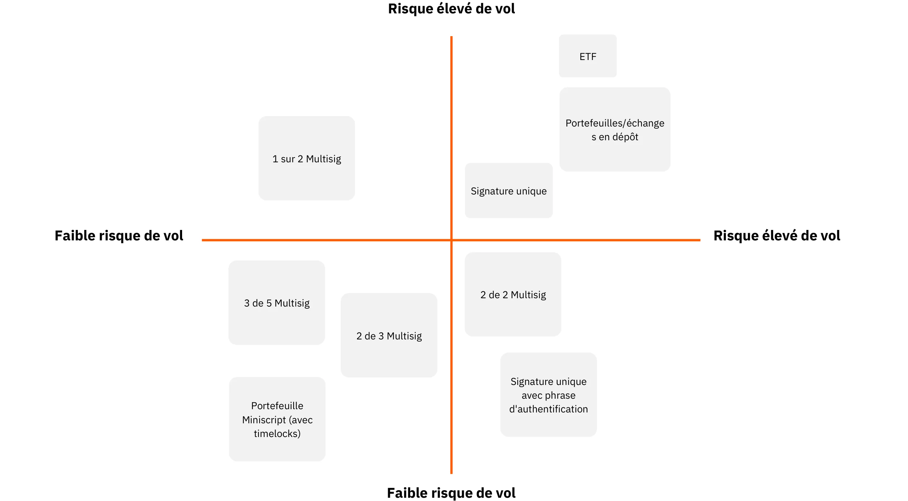

ये स्कैम आमतौर पर इन चीज़ों से भरे होते हैं :

- अवास्तविक वादे जैसे कि गारंटीड रिटर्न (जैसे 20% गारंटीड रिटर्न);
- निवेश किए गए फंड निकालने में देरी या दिक्कतें आना;
- नए मेंबर्स को भर्ती करने के लिए मजबूत प्रोत्साहन ताकि सिस्टम चलता रहे;
- वादा किए गए रिटर्न के असली स्रोत के बारे में पूरी तरह से पारदर्शिता की कमी।

आखिरकार, सभी पिरामिड और पोंजी योजनाएँ असफल होने के लिए अभिशप्त हैं। इनकी मूल कमजोरी यह है कि इन्हें पुराने निवेशकों को रिटर्न देने के लिए लगातार नए निवेशकों को जोड़ते रहना पड़ता है। समय के साथ, यह जरूरत गणितीय रूप से पूरी करना असंभव हो जाता है क्योंकि सिस्टम के बढ़ने के साथ नए सदस्यों की जरूरत घातांकीय रूप से बढ़ती जाती है। एक नाजुक मोड़ आने पर, भागीदारों को शक होने लगता है, भरोसा उठ जाता है, और पूरा पिरामिड धराशायी हो जाता है। इस स्तर पर, आखिरी में जुड़ने वाले लोग, जो अक्सर सबसे कम जानकार होते हैं, अपना पूरा निवेश गँवा बैठते हैं और उसे वापस पाने का कोई रास्ता नहीं होता, जबकि आयोजक या शुरुआती निवेशक आमतौर पर पहले ही अपना पैसा निकालकर सिस्टम से बाहर हो चुके होते हैं।

क्रिप्टोकरेंसी की दुनिया में, पोंजी स्कीम कई रूप ले सकती हैं, जो अक्सर अपनी धोखाधड़ी वाली प्रकृति को तकनीकी या वित्तीय मुखौटे के पीछे छुपाने के लिए बनाई जाती हैं। ये घोटाले नए टोकन ऑफर या इनिशियल कॉइन ऑफरिंग (आईसीओ) के रूप में दिख सकते हैं, जहां एक नई क्रिप्टोकरेंसी को जनता को बेचकर फंड जुटाया जाता है। "Blockchain," "स्मार्ट कॉन्ट्रैक्ट्स," या "स्टेकिंग" जैसे तकनीकी शब्दों के पीछे, कुछ प्रोजेक्ट असल में जटिल पिरामिड स्कीम छुपाए होते हैं। कुछ दूसरे संदिग्ध क्रिप्टो-एसेट्स को ऐसी कम्पनसेशन सिस्टम के साथ जोड़कर ऊंचे रिटर्न का वादा करते हैं, जो पूरी तरह से नए निवेशकों के लगातार आने पर निर्भर करती है।

हाल ही में, पोंजी स्कीम्स डिसेंट्रलाइज्ड फाइनेंस (DeFi) की दुनिया में भी फैल गई हैं। हालांकि DeFi का मकसद बिना किसी बिचौलिए के वित्तीय सेवाएं देना है, लेकिन कुछ प्रोजेक्ट्स इसका इस्तेमाल अपने घोटालों को झूठी वैधता देने के लिए करते हैं। कुछ DeFi प्लेटफॉर्म Exchange में क्रिप्टोकरेंसी डिपॉजिट्स के लिए ऑटोमेटेड प्रोटोकॉल्स में ज़्यादा, गारंटीड रिटर्न्स का वादा करते हैं। ये आकर्षक वादे अक्सर अस्पष्ट और ना-जाँचे जा सकने वाले मैकेनिज़्म पर आधारित होते हैं, जिनमें घोटाले के लिए खास तौर पर बनाए गए टोकन्स शामिल होते हैं। असल में, इन सिस्टम्स का कोई टिकाऊ बिज़नेस मॉडल नहीं होता—रिटर्न्स बस नए यूज़र्स के फंड्स से चुकाए जाते हैं, बिल्कुल पारंपरिक पोंजी स्कीम की तरह। जब भरोसा कम होने लगता है या नए पार्टिसिपेंट्स का आना कम हो जाता है, तो ये सिस्टम्स टूट जाते हैं, जिससे बेख़बर निवेशकों को भारी नुकसान होता है।

कृपया ध्यान दें कि इस कोर्स की सामग्री केवल शैक्षिक उद्देश्यों के लिए है और इसे वित्तीय सलाह के रूप में नहीं समझा जाना चाहिए। आपकी वित्तीय सुरक्षा इस बात पर निर्भर करती है कि आप हर वित्तीय निर्णय लेते समय सतर्क, संदेहशील और अच्छी तरह से सूचित रहें।

सबसे बेहतर सुरक्षा यह है कि हमेशा यह सरल सवाल पूछें: "वादा किया गया रिटर्न असल में कहाँ से आता है?" अगर जवाब साफ नहीं है, तो तुरंत भाग जाओ।

#### पंप और डंप

ये स्कैम एक एसेट की कीमत को कृत्रिम रूप से बढ़ाने से जुड़ा होता है—अक्सर कम लिक्विडिटी वाले क्रिप्टोकरेंसी टोकन की—एक समन्वित मार्केटिंग अभियान के जरिए, जो आमतौर पर निवेशकों के एक समूह द्वारा चलाया जाता है। टिपिकल पंप एंड डंप स्कीम इस पैटर्न का पालन करती है:

- एक ग्रुप जिसमें अंदरूनी लोग या प्रभावशाली हस्तियाँ होती हैं, चुपके से टारगेट की गई एसेट की बड़ी मात्रा को जमा कर लेते हैं।
- फिर वे generate को लेकर एक जोरदार प्रचार अभियान शुरू करते हैं, हाइप बनाते हैं और कीमत बढ़ा देते हैं।
- आम जनता, FOMO (फियर ऑफ मिसिंग आउट यानी पीछे रह जाने का डर) के चलते, बड़ी संख्या में उस एसेट को खरीदने लगती है, जिससे कीमत और भी ऊपर चढ़ जाती है।
- हाइप के चरम पर, अंदरूनी लोग एक ही बार में अपनी होल्डिंग्स बेच देते हैं।
- कीमत गिर जाती है, और देर से आने वालों को भारी नुकसान होता है।

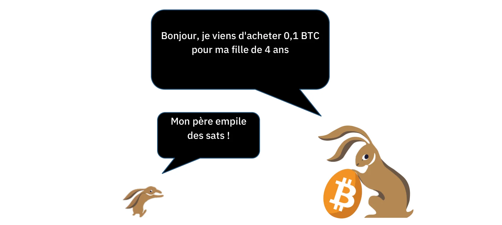

यह ध्यान रखना ज़रूरी है कि 'पंप एंड डंप' स्ट्रैटेजीज़ कई देशों में गैरकानूनी हैं और इन्हें मार्केट मैनिपुलेशन का एक रूप माना जाता है। इसके बावजूद, ऐसी स्कीमें खासकर क्रिप्टोकरेंसी के क्षेत्र में ज़ोरों पर हैं, जहां रेगुलेशन अभी भी पीछे है।

टेलीग्राम, डिस्कॉर्ड या अन्य सोशल मीडिया प्लेटफॉर्म्स पर प्राइवेट "सिग्नल" ग्रुप्स से खास सावधान रहें। ये अक्सर इन्फ्लुएंसर्स या स्वयंभू विशेषज्ञों द्वारा चलाए जाते हैं, जिनमें से कुछ एंट्री फीस भी वसूलते हैं। हालांकि ये ग्रुप्स एक्सक्लूसिव निवेश के अवसर देने का दावा करते हैं, लेकिन हकीकत इससे कहीं ज्यादा एकतरफा होती है: सिर्फ आयोजकों को फायदा होता है, जबकि ज्यादातर भागीदारों का पैसा डूब जाता है।

यह सच है कि कुछ लोग इस तरह के बाजार के हेराफेरी से थोड़े समय के लिए फायदा उठा सकते हैं, लेकिन उनकी कामयाबी सिर्फ किस्मत और सही टाइमिंग पर आधारित होती है। लंबे समय में, यह स्कीमें टिकाऊ नहीं होतीं। इनमें लगातार हाई-रिस्क वाली भागीदारी और धोखाधड़ी वाले सेटअप में बार-बार शामिल होना पड़ता है, जो आखिरकार फ्लॉप हो ही जाते हैं।

इससे भी बुरा, ये एक खतरनाक भ्रम पैदा करते हैं: ये विश्वास कि बिना वित्तीय प्रणालियों को समझे जल्दी और आसानी से पैसा कमाया जा सकता है। यह सोच न सिर्फ व्यक्तियों को जोखिम में डालती है, बल्कि पूरे क्रिप्टोकरेंसी इकोसिस्टम की विश्वसनीयता को भी कमजोर करती है।

इन सभी वजहों से, सबसे अच्छी रणनीति यही है कि निवेश के प्रति गंभीर और विचारशील दृष्टिकोण अपनाया जाए। यह दृष्टिकोण वित्तीय शिक्षा, मूलभूत बातों की मजबूत समझ और लंबी अवधि के नजरिए पर आधारित होना चाहिए।

धैर्य से अपना ज्ञान बढ़ाकर, आप भावनात्मक हेरफेर और अवास्तविक वादों से बहुत कम प्रभावित होंगे; और उन वित्तीय जालों से बचने के लिए बेहतर तरीके से तैयार होंगे जो असली नुकसान का कारण बन सकते हैं।

#### दान, लॉटरी और नकली उपहार घोटाले

ये धोखाधड़ी का तरीका है जो Exchange में मुफ्त Bitcoin या दूसरे इनाम का वादा करता है, बदले में आपसे पहले थोड़ी रकम भेजने को कहता है। याद रखना ज़रूरी है: कोई भी सही व्यक्ति या संस्था आपसे क्रिप्टोकरेंसी पहले भेजने को नहीं कहेगी और बदले में ज़्यादा देने का वादा करेगी।

धोखेबाज अक्सर मशहूर हस्तियों (जैसे Elon Musk या दूसरे सेलिब्रिटी) की नकल करके सोशल मीडिया पर शिकार बनाते हैं। किसी भी अकाउंट या वेबसाइट से जुड़ने से पहले उसकी असलियत ज़रूर चेक करें, और कभी भी ऐसे ऑफर पर भरोसा न करें जो बहुत ज़्यादा उदार या सच से ज़्यादा अच्छे लगते हों।

कभी-कभी, ये घोटाले "अग्रिम शुल्क" धोखाधड़ी के रूप में सामने आते हैं। आपसे किसी इनाम या पुरस्कार (पैसा, कोई उत्पाद, या सेवा) का वादा किया जाता है, लेकिन पहले आपसे शिपिंग, टैक्स, या लेनदेन लागत जैसी चीजों के लिए एक शुल्क अदा करने को कहा जाता है। एक बार भुगतान कर देने के बाद, घोटालिया गायब हो जाता है, और वादा किया गया इनाम कभी नहीं मिलता।

#### शिटकोइन्स और क्रिप्टोकरेंसी ऑफर पर

केंद्रीकृत क्रिप्टो-करेंसी प्रोजेक्ट्स कभी-कभी यूजर्स को आकर्षित करने के लिए मुफ़्त टोकन ("*एयरड्रॉप्स*") देते हैं। ये टोकन आमतौर पर बहुत कम या बिल्कुल भी वास्तविक मूल्य नहीं रखते और इनका मुख्य उद्देश्य लोकप्रियता का भ्रम पैदा करना या सट्टेबाज़ी को बढ़ावा देना होता है। इस तरह के प्रचार ऑफ़र्स के साथ बेहद सावधान रहें; ये अक्सर मार्केटिंग के जाल होते हैं, असली मौक़े नहीं।

#### पहचान की चोरी और फ़िशिंग

हमलावर अक्सर नकली वेबसाइटें, सोशल मीडिया अकाउंट्स या धोखे भरे ईमेल का इस्तेमाल करके आपके पैसे चुराने की कोशिश करते हैं। ये स्कैम किसी भी संचार चैनल के जरिए आ सकते हैं: ईमेल, सोशल नेटवर्क, फोन कॉल, यहां तक कि पुराने जमाने के डाक के जरिए भी...

लिंक पर क्लिक करने या कोई कार्रवाई करने से पहले, हमेशा भेजने वाले की पहचान दोबारा जांच लें। अगर शक हो, तो दिए गए लिंक का इस्तेमाल करने के बजाय वेबसाइट पर मैन्युअली जाएं। सबसे महत्वपूर्ण बात, अपनी प्राइवेट कीज़ या पासवर्ड किसी के साथ कभी शेयर न करें।

#### जीडब्ल्यू-32 हार्डफोर्क्स

पिछले कुछ सालों में, Bitcoin ने कई *Hard फोर्क्स* का अनुभव किया है, जिसके कारण मूल क्रिप्टोकरेंसी के वैकल्पिक संस्करण बन गए। सीधे शब्दों में कहें तो, *Hard Fork* नेटवर्क में एक विभाजन है जो दो अलग-अलग ब्लॉकचेन को जन्म देता है, और ये दोनों विभाजन के पल तक एक ही इतिहास साझा करते हैं। ये फोर्क्स आमतौर पर तब होते हैं जब डेवलपर समुदाय या Bitcoin के बड़े इकोसिस्टम का एक हिस्सा मूल प्रोटोकॉल में बड़े बदलाव लाना चाहता है, लेकिन सर्वसम्मति नहीं बना पाता। अपने विचारों को छोड़ने के बजाय, वे Bitcoin का एक नया संस्करण (बदले हुए नियमों के साथ) लॉन्च करने का फैसला करते हैं, उम्मीद करते हैं कि यूजर्स और माइनर्स उनके Fork को फॉलो करना चुनेंगे।

सभी *Hard फोर्क्स* धोखाधड़ी वाले नहीं होते, क्योंकि कुछ तो समुदाय के भीतर तकनीकी या विचारधारात्मक मतभेदों की वजह से पैदा होते हैं। हालाँकि, कुछ फोर्क्स व्यावसायिक हितों या फिर बेईमानी के मकसद से चलाए जाते हैं। इन हार्डफोर्क्स के सबसे मशहूर उदाहरण हैं **Bitcoin कैश (BCH)** और **Bitcoin Satoshi विज़न (BSV)**। ये वैकल्पिक करेंसियाँ, जो क्रमशः 2017 और 2018 में लॉन्च हुई थीं, अक्सर दावा करती हैं कि ये असली Bitcoin के "बेहतर वर्ज़न" हैं। ये बढ़े हुए ब्लॉक साइज़ की वजह से कम ट्रांजैक्शन फीस या फिर तेज़ ट्रांजैक्शन जैसे फायदे बताती हैं। मगर, ये तकनीकी बदलाव सुरक्षा, विकेंद्रीकरण और मजबूती के मामले में बड़े समझौते करते हैं; Elements जो Bitcoin के बुनियादी सिद्धांतों से टकरा सकता है।

तकनीकी अंतरों से परे, ये वैकल्पिक करेंसी अक्सर भ्रम का फायदा उठाकर अनजान निवेशकों को आकर्षित करती हैं। ये ऐसे मार्केटिंग तरीके अपना सकती हैं जो नए लोगों को जानबूझकर गुमराह करने के लिए बनाए गए हों, जो सोचते हैं कि वे असली Bitcoin (BTC) खरीद रहे हैं।

इस जाल में फंसने से बचने के लिए, हमेशा जिस करेंसी को खरीद रहे हैं उसकी पुष्टि कर लें। असली Bitcoin का टिकर **BTC** है, जबकि Bitcoin कैश और इसके डेरिवेटिव्स अलग एक्रोनिम्स का इस्तेमाल करते हैं, जैसे BCH या BSV।

#### बेईमान इन्फ्लुएंसर्स और नकली गुरु

जैसे-जैसे क्रिप्टोकरेंसी मेनस्ट्रीम हो रही है, सोशल मीडिया पर "*क्रिप्टो गुरु*", खुद को एक्सपर्ट बताने वाले और इन्फ्लुएंसर्स की बाढ़ आ गई है। हालांकि कुछ सच में ज्ञानवर्धक जानकारी देते हैं, लेकिन ज्यादातर अपनी पहुंच का फायदा उठाकर संदिग्ध प्रोजेक्ट्स या खतरनाक (और कई बार सीधे-सीधे झूठे) ट्रेडिंग स्ट्रैटेजी बेचते हैं।  

ये लोग आमतौर पर अपने फायदे के लिए ऐसा करते हैं, अक्सर किसी खास टोकन या प्लेटफॉर्म को प्रमोट करने के लिए उन्हें सीधे या छुपे तरीके से पैसे मिलते हैं।

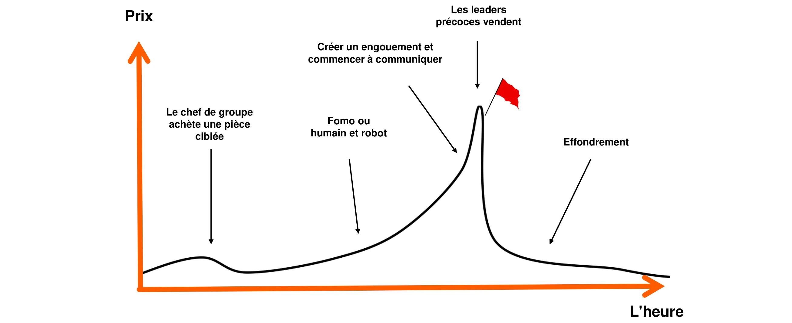

ये इन्फ्लुएंसर्स अक्सर नए लोगों को आकर्षित करने के लिए पुराने तरीकों का इस्तेमाल करते हैं: वो झूठे या नकली फाइनेंशियल रिजल्ट्स दिखाते हैं (जिन्हें साबित करना मुश्किल होता है), अपनी "कामयाबी" के सबूत के तौर पर शानो-शौकत भरी लाइफस्टाइल फ्लॉन्ट करते हैं, और "जादुई" निवेश स्ट्रैटेजी बेचते हैं। इनका मकसद होता है FOMO पैदा करना - यानी "फियर ऑफ मिसिंग आउट" - ताकि लोग जल्दबाजी में गलत फैसले लें और बिना सोचे-समझे पैसा लगा दें।

यह समझना ज़रूरी है कि इन लोगों की ज़्यादातर "मुफ़्त" सलाह वास्तव में कभी मुफ़्त नहीं होती। उदारता के नाटक के पीछे अक्सर एक चालाक रणनीति छुपी होती है जो लोगों को संदिग्ध चीज़ें खरीदने की तरफ़ धकेलती है। और अगर कुछ इन्फ्लुएंसर सच्चे भी हों, तो उनके नतीजों को दोहराना लगभग नामुमकिन होगा; उनकी कामयाबी अक्सर ख़ास समय, अंदरूनी जानकारी, या ऐसी परिस्थितियों पर निर्भर करती है जो आपके पास बिल्कुल नहीं हैं।

कुछ इन्फ्लुएंसर आपको प्राइवेट, पेड ग्रुप्स में ज्वाइन करने के लिए बुला सकते हैं, जहां वे एक्सक्लूसिव ट्रेडिंग सिग्नल्स या अंदरूनी टिप्स शेयर करने का दावा करते हैं जो जल्दी और आसान मुनाफे का वादा करते हैं। असलियत में, ये ग्रुप्स ज्यादातर आयोजकों को ही फायदा पहुंचाते हैं। वे अक्सर अपने फॉलोअर्स को लिक्विडिटी (नकदी) का स्रोत बनाते हैं, यानी खुद के फायदे के लिए एसेट्स को ऑफलोड करते हैं। सब्सक्राइबर आमतौर पर पैसे गंवा बैठते हैं, क्योंकि वे उन अंदरूनी लोगों जितनी तेजी से प्रतिक्रिया नहीं कर पाते जो इन ट्रेड्स को प्लान करते हैं (पंप एंड डंप स्कीम्स वाले सेक्शन को देखें)।

इस हकीकत को देखते हुए, बेईमान इन्फ्लुएंसर्स के जाल में न फंसने के लिए यहां कुछ अच्छी आदतें बताई गई हैं:

- किसी भी क्रिप्टो निवेश सुझाव के साथ बहुत सावधान रहें।**

एक भरोसेमंद और जानकार व्यक्ति कभी भी आपको खुद से रिसर्च किए बिना क्रिप्टोकरेंसी खरीदने के लिए दबाव नहीं डालेगा।

- पैसे देकर सीखने वाले ट्रेडिंग या निवेश के कोर्स हमेशा अच्छी क्वालिटी के नहीं होते।**

इनमें से कई कोर्स जोखिम भरी या बहुत ही सरल रणनीतियों को बढ़ावा देते हैं; अक्सर वही जानकारी जो आप ऑनलाइन मुफ्त में पा सकते हैं।

- कोई भी गारंटीड तरीका नहीं है जिससे किसी के ट्रेड्स को कॉपी करके बिल्कुल वही नतीजे मिलें।**

हर निवेश की रणनीति व्यक्तिगत परिस्थितियों, समय, ज्ञान और दूसरे कारकों पर निर्भर करती है जिन्हें बिल्कुल वैसा ही दोहराया नहीं जा सकता।

- ऐसी सलाह से खास तौर पर सावधान रहें जो बहुत ज़्यादा अच्छी लगे।

अवास्तविक वादे या गारंटीड मुनाफ़ा लगभग हमेशा हेराफेरी के संकेत होते हैं। याद रखें: सिर्फ़ इसलिए कि कोई आत्मविश्वास से कुछ कहता है, इसका मतलब यह नहीं कि वह सच है।

हमेशा याद रखो, Bitcoin या क्रिप्टो इकोसिस्टम में तुम्हें जो भी मिलेगा, उसका अपना निजी मकसद होगा; चाहे वो साफ-साफ बताया गया हो या बातों के बीच छुपा हो। बिल्कुल निष्पक्ष जानकारी जैसी कोई चीज़ नहीं होती। यहां तक कि ये कोर्स, BTC102, का भी एक साफ मकसद है - *Bitcoin की बेहतर समझ को बढ़ावा देना।*

इसीलिए हर कंटेंट के पीछे छुपे असली मकसद को समझना बेहद ज़रूरी है। और इंटरनेट का ये सुनहरा नियम कभी न भूलें:

*अगर कोई चीज़ या सेवा मुफ़्त लगे, तो समझ लो कि तुम ही उसकी कीमत हो।*

आखिरकार, आपका सबसे अच्छा बचाव है खुद की जानकारी, स्वस्थ संदेह, और सबसे ज़रूरी, खुद से तथ्यों को जाँचने की आदत।

### धोखाधड़ी से कैसे बचें

**ऑनलाइन सुरक्षित रहने के लिए, खासकर क्रिप्टो की दुनिया में, इन मुख्य सिद्धांतों को याद रखें:**

- अंधविश्वास न करें: "*भरोसा न करें, जांच करें*" ;
- गारंटीड या बहुत ज़्यादा रिटर्न के वादों पर शक करो;
- कभी भी अपनी प्राइवेट कीज़ किसी के साथ शेयर मत करो;
- Bitcoin (या किसी भी क्रिप्टो) को अज्ञात पतों पर मत भेजो;
- अगर शक हो, तो रुक जाओ। एक कदम पीछे हटो और एक्शन लेने से पहले सोचो। FOMO तुम्हारा सबसे बड़ा दुश्मन है;
- पैसे देने वाले ट्रेडिंग ग्रुप या कम्युनिटी से बचें जो नामुमकिन वादे करते हैं;
- ज़्यादातर ऑनलाइन देने वाले या "मुफ्त" लॉटरी स्कैम होते हैं या पूरी तरह से ठगी होती है;
- लंबे समय में, जुआ खेलने की बजाय सीखने से हमेशा ज़्यादा फायदा होता है।

स्कैम से खुद को बचाना आपकी संपत्ति को सुरक्षित रखने का पहला और ज़रूरी कदम है, लेकिन यह काफी नहीं है। मजबूत डिजिटल सुरक्षा बनाए रखना भी उतना ही अहम है। इसीलिए, अगले अध्याय में हम जानेंगे कि आप अपनी ऑनलाइन सुरक्षा को कैसे मजबूत कर सकते हैं और डिजिटल दुनिया में सुरक्षित रहने के लिए कौन-से बेस्ट प्रैक्टिसेज़ अपनाने चाहिए।

## ऑनलाइन सुरक्षा

<chapterId>f0873bf2-6a6f-5485-bb7a-d84be14f404d</chapterId>

जैसे ही तुम Bitcoin में कदम रखोगे, तुम्हें जल्दी समझ आ जाएगा कि बेसिक साइबर सिक्योरिटी वैकल्पिक नहीं—बल्कि ज़रूरी है। स्कैम और फ्रॉड तो केवल बर्फ़ का सिर्फ़ टिप हैं। गलती से डेटा लॉस हो जाना, मैलवेयर और कम्प्रोमाइज़्ड पासवर्ड्स भी उतने ही ख़तरनाक हो सकते हैं, ख़ासकर जब तुम अपनी खुद की कुंजियाँ मैनेज कर रहे हो।

यह अध्याय आपको डिजिटल सुरक्षा बढ़ाने और ऑनलाइन स्पेस में खुद को सुरक्षित रखने के लिए कुछ आसान, प्रैक्टिकल स्टेप्स बताता है।

अगर तुम्हें और गहराई में जाना है, तो Plan ₿ Network का SEC101 कोर्स Bitcoin यूज़र्स के लिए खास तौर पर डिज़ाइन की गई साइबर सिक्योरिटी स्ट्रैटेजी की पूरी जानकारी देता है।

https://planb.network/courses/99c46148-7080-4915-a7e0-9df0e145cd47

### साइबर सुरक्षा क्यों जरूरी है

Bitcoin आपको सीधे अपने पैसे रखने की ताक़त देता है (बैंकों के बिना), बिना किसी बिचौलिए के। लेकिन इस तरह की वित्तीय आज़ादी के साथ गंभीर ज़िम्मेदारी भी आती है: अगर सुरक्षा में चूक की वजह से आपका BTC चोरी हो जाता है, तो लेन-देन को पलटने का कोई रास्ता नहीं है। पारंपरिक बैंकिंग के उलट, यहाँ कोई हेल्प डेस्क नहीं, कोई धोखाधड़ी का दावा नहीं, और न ही आपको बचाने के लिए कोई बीमा है।

इसके अलावा, Bitcoin का आर्थिक मूल्य इसे एक बहुत ही महत्वपूर्ण लक्ष्य बना देता है। अगर कोई हैकर आपके Wallet को हैक कर लेता है, तो वह तुरंत आपके पैसे को अपने कंट्रोल वाले Address में ट्रांसफर कर सकता है (बिना किसी सवाल के, और वापस पाने का कोई रास्ता नहीं)।

### एक साफ़-सुथरा, आधुनिक कंप्यूटर

व्यक्तिगत सुरक्षा का एक सबसे अनदेखा पहलू है अपने ऑपरेटिंग सिस्टम और सॉफ्टवेयर को अपडेट रखना। कई अपडेट्स ज्ञात कमजोरियों को ठीक करते हैं जिन्हें हैकर्स एक्सप्लॉइट कर सकते हैं। कुछ लोग परफॉरमेंस इश्यूज़ के डर से अपडेट्स से बचते हैं, लेकिन असली खतरा पुराने सॉफ्टवेयर चलाने में है जिसे तोड़ने के तरीके हैकर्स को पहले से पता होते हैं।

यह भी बेहद सलाह दी जाती है कि एक भरोसेमंद एंटीवायरस का इस्तेमाल करें। विंडोज़ पर, अधिकांश यूज़र्स के लिए बिल्ट-इन विंडोज़ डिफेंडर आमतौर पर काफी होता है। अगर आपको अतिरिक्त फीचर्स या मन की शांति चाहिए, तो कास्परस्की जैसे कमर्शियल ऑप्शन्स भी उपलब्ध हैं। मैकओएस पर, मालवेयर खतरे ऐतिहासिक रूप से कम आम हैं **लेकिन बिल्कुल नहीं** इसलिए सतर्क रहना अभी भी समझदारी है।

सिस्टम अपडेट्स और एंटीवायरस प्रोटेक्शन के अलावा, शक्की वेबसाइट्स या तथाकथित "यूनिवर्सल" डाउनलोड पोर्टल्स से सॉफ्टवेयर डाउनलोड करने में बहुत सावधान रहें। जब आपको किसी टूल या एप्लिकेशन की जरूरत हो, हमेशा सीधे ऑफिशियल सोर्स से ही डाउनलोड करें; इससे मालवेयर वाले नकली सॉफ्टवेयर इंस्टॉल होने का खतरा काफी कम हो जाता है।

एक और स्मार्ट आदत है किसी भी सॉफ्टवेयर को अपने कंप्यूटर पर इंस्टॉल करने से पहले उसकी असलियत और सत्यता की जांच करना। अगर आपको नहीं पता कि ये कैसे करते हैं, तो घबराइए मत - हमारे पास इस प्रक्रिया को समझाने के लिए एक विस्तृत ट्यूटोरियल है:

https://planb.network/tutorials/computer-security/data/integrity-authenticity-21d0420a-be02-4663-94a3-8d487f23becc

आखिर में, अपने ज़रूरी डेटा की नियमित बैकअप लेते रहें। अचानक फेल होने, हैकिंग या गलती से डिलीट होने की स्थिति में फाइलों की एक कॉपी रखने के लिए एक एक्सटर्नल Hard ड्राइव या SSD अच्छा विकल्प है। बाद में आप खुद को धन्यवाद देंगे।

अगर आपको क्लाउड सॉल्यूशन पसंद हैं, तो Proton Drive जैसी सुरक्षित सेवा का उपयोग करने पर विचार करें। बस यह सुनिश्चित कर लें कि आप जो भी विकल्प चुनें, वह आपकी प्राइवेसी का सम्मान करे और मजबूत एन्क्रिप्शन प्रदान करे।

https://planb.network/tutorials/computer-security/data/proton-drive-03cbe49f-6ddc-491f-8786-bc20d98ebb16

एक बहुत ही सुझाई गई बैकअप स्ट्रैटेजी है "3-2-1 नियम"। यह आपके डेटा को गलती से खोने, साइबर अटैक या प्राकृतिक आपदाओं से बचाने के लिए बनाई गई है।

विचार सीधा है:

- अपने **जरूरी डेटा** की **कम से कम 3 कॉपी** जरूर रखें,
- उन्हें **कम से कम 2 अलग-अलग प्रकार के मीडिया** पर स्टोर करें (जैसे, एक बाहरी Hard ड्राइव और क्लाउड स्टोरेज),
- और यह सुनिश्चित करें कि **उनकी 1 कॉपी ऑफ-साइट स्टोर की गई हो** (आपके मुख्य स्थान से भौतिक रूप से अलग)।

यह तरीका बहुत मजबूत है और अगर कुछ गंभीर गलत हो जाता है तो भी आपका डेटा सुरक्षित रहता है।

### आईडी का सपना खत्म करने का हल

लोगों के हैक होने की सबसे बड़ी वजहों में से एक है कमज़ोर पासवर्ड का इस्तेमाल करना। बहुत सारे यूज़र आज भी एक ही पासवर्ड को कई अकाउंट्स में इस्तेमाल करते हैं, या ऐसे पासवर्ड चुनते हैं जिन्हें आसानी से अंदाज़ा लगाया जा सकता है। पासवर्ड मैनेजर इस समस्या का बिल्कुल सही समाधान है।

एक पासवर्ड मैनेजर आपको यह सुविधा देता है:

- **अपने सभी पासवर्ड सुरक्षित रूप से** एक एन्क्रिप्टेड वॉल्ट में स्टोर करें
- जीडब्ल्यू-53 लंबे, जटिल और अनोखे पासवर्ड** हर अकाउंट के लिए अपने-आप बनाता है
- एक ही मास्टर पासवर्ड** का इस्तेमाल करें, सब कुछ सुरक्षित तरीके से एक्सेस करने के लिए

पासवर्ड मैनेजर के साथ, आपको फिर कभी "पासवर्ड भूल गए?" वाला बटन दबाने की ज़रूरत नहीं पड़ेगी या कमज़ोर, बार-बार इस्तेमाल किए गए पासवर्ड्स पर निर्भर नहीं रहना पड़ेगा। साथ ही, ज़्यादातर पासवर्ड मैनेजर आपके सभी डिवाइसों (डेस्कटॉप, फोन, टैबलेट) पर बिना किसी दिक्कत के सिंक हो जाते हैं और लॉगिन फॉर्म्स को अपने आप भर देते हैं, जिससे सुरक्षित एक्सेस बिना मेहनत के और आसानी से हो जाता है।

बहुत सारे पासवर्ड मैनेजर मौजूद हैं, लेकिन मैं आपकी जरूरतों के हिसाब से दो अच्छे ऑप्शन्स बता सकता हूँ। अगर आपको कुछ ऐसा चाहिए जो आसान हो और मल्टीपल डिवाइसेस पर बिना किसी दिक्कत के सिंक हो जाए, तो Bitwarden एक बेहतरीन विकल्प है:

https://planb.network/tutorials/computer-security/authentication/bitwarden-0532f569-fb00-4fad-acba-2fcb1bf05de9

अगर आप अपना सब कुछ अपने डिवाइस पर ही रखना चाहते हैं, तो KeePass एक बढ़िया विकल्प है:

https://planb.network/tutorials/computer-security/authentication/keepass-f8073bb7-5b4a-4664-9246-228e307be246

### 2FA: डबल सुरक्षा

Bitcoin में, आप अपने खुद के बैंक हो। इसका मतलब है कि आप अपनी सुरक्षा टीम भी खुद ही हैं। मजबूत पासवर्ड होने के बावजूद, जीरो रिस्क जैसी कोई चीज़ नहीं होती - इसीलिए टू-फैक्टर ऑथेंटिकेशन (2FA) चालू करना बहुत जरूरी है।

2FA एक दूसरा Layer सुरक्षा लेयर जोड़ता है, जिसमें Google Authenticator या Authy जैसे ऐप द्वारा जनरेट किया गया टाइम-बेस्ड वन-टाइम कोड (आमतौर पर 6 डिजिट का) माँगा जाता है। तो अगर कोई आपका पासवर्ड भी हासिल कर ले, तो भी वो आपके फोन तक फिजिकल एक्सेस के बिना आपके अकाउंट में नहीं घुस सकता।

https://planb.network/tutorials/computer-security/authentication/authy-a76ab26b-71b0-473c-aa7c-c49153705eb7

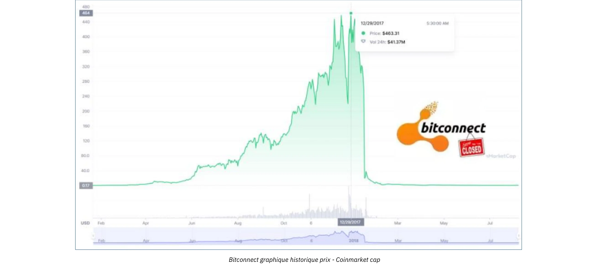

जब आप 2FA चालू करते हैं, तो अपने ऐप का रिकवरी की (recovery key) एक सुरक्षित जगह पर ज़रूर सेव कर लें। अगर आपका फोन खो जाए या बदल जाए, तो यह की आपके कोड्स को वापस पाने में मदद करेगा।  

SMS या ईमेल वाला 2FA कुछ न होने से तो बेहतर है, लेकिन यह बहुत कम सुरक्षित होता है। SIM स्वैप अटैक (जहाँ कोई आपका फोन नंबर हाईजैक कर लेता है) से इस तरह की सुरक्षा आसानी से बायपास हो सकती है।

जो लोग सुरक्षा को और भी बढ़ाना चाहते हैं, उनके लिए YubiKey जैसी फिजिकल कुंजियाँ और भी ज़्यादा सुरक्षा प्रदान करती हैं।

https://planb.network/tutorials/computer-security/authentication/security-key-61438267-74db-4f1a-87e4-97c8e673533e

### आपकी निजता की सुरक्षा

प्राइवेसी और साइबर सुरक्षा का गहरा संबंध है: जितनी ज़्यादा जानकारी आप खुलेआम छोड़ते हैं, उतना ही आप निशाना बनने की आशंका बढ़ाते हैं।

एक **VPN** (*वर्चुअल प्राइवेट नेटवर्क*) आपके आईपी Address को छुपाने और आपके इंटरनेट ट्रैफिक को एन्क्रिप्ट करने का एक सरल लेकिन कारगर तरीका है। हालाँकि यह आपको पूरी तरह से गोपनीय नहीं बनाता (क्योंकि VPN प्रदाता अभी भी आपकी गतिविधि देख सकता है), लेकिन यह आप पर नज़र रखने या आपकी ब्राउज़िंग आदतों को ट्रैक करने की कोशिश करने वालों के लिए काफी मुश्किल ज़रूर खड़ी कर देता है।

कुंजी यह है कि एक भरोसेमंद VPN प्रदाता चुनें जो:

- आपकी निजी जानकारी की जरूरत नहीं है
- BTC के जरिए भुगतान की अनुमति देता है
- एक सख्त नो-लॉग्स पॉलिसी है

हमारे पास Plan ₿ Network पर कई ट्यूटोरियल्स उपलब्ध हैं जो आपको VPN सेटअप करने में आसानी से मदद कर सकते हैं। मैं खासतौर पर IVPN या Mullvad की सलाह दूंगा:

https://planb.network/tutorials/computer-security/communication/ivpn-5a0cd5df-29f1-4382-a817-975a96646e68

https://planb.network/tutorials/computer-security/communication/mullvad-968ec5f5-b3f0-4d23-a9e0-c07a3e85aaa8

ऑनलाइन अपनी प्राइवेसी को सुरक्षित रखने के ज़रूरी कदमों में ये भी शामिल हैं:

- **एन्क्रिप्टेड मैसेजिंग प्लेटफॉर्म्स** जैसे कि Signal, SimpleX या Session का इस्तेमाल करके;
- गोपनीयता पर ध्यान देने वाले ब्राउज़र जैसे Firefox, Brave, या Tor (बेहतर गुमनामी के लिए) का उपयोग करें;

https://planb.network/tutorials/computer-security/communication/tor-browser-a847e83c-31ef-4439-9eac-742b255129bb

- **सुरक्षित मेलबॉक्स** जैसे कि ProtonMail का इस्तेमाल करके;

https://planb.network/tutorials/computer-security/communication/proton-mail-c3b010ce-254d-4546-b382-19ab9261c6a2

- **अपनी फाइलों को एन्क्रिप्ट करना** Windows के लिए Bitlocker या VeraCrypt (जो कि मल्टी-प्लेटफॉर्म पर उपलब्ध है) जैसे टूल्स की मदद से।

https://planb.network/tutorials/computer-security/data/veracrypt-d5ed4c83-7c1c-4181-95ea-963fdf2d83c5

### कदम-दर-कदम प्रगति

साइबर सुरक्षा एक बहुत बड़ा काम लग सकता है, और शुरुआत करने वालों के लिए यह बहुत जटिल लगने की वजह से घबरा जाना और हार मान लेना आसान है। असली चाल है इसे धीरे-धीरे करके आगे बढ़ाना। कुछ आसान से शुरुआत करें, जैसे कि एक पासवर्ड मैनेजर इंस्टॉल करना। खुद को कुछ हफ़्ते इसके साथ सहज होने का समय दें, फिर अगले कदम पर बढ़ें: जैसे कि अपने किसी एक अकाउंट पर 2FA (टू-फैक्टर ऑथेंटिकेशन) चालू करना।

जैसे-जैसे आप इन टूल्स के साथ और आत्मविश्वासी होते जाएंगे, आप और एडवांस्ड प्रैक्टिसेज़ जोड़ने के लिए तैयार हो जाएंगे, जैसे कि सेकेंडरी ईमेल का इस्तेमाल करना, ProtonMail पर स्विच करना, VPN सेटअप करना, या ज़रूरत पड़ने पर Tor के साथ ब्राउज़िंग करना।

जैसे-जैसे आप Bitcoin की दुनिया में गहराई तक जाते हैं, आप देखेंगे कि Wallet के मूल्य के बढ़ने के साथ जोखिम भी बढ़ते हैं। मजबूत सुरक्षा आदतें बनाना, अपनी प्राइवेसी को सुरक्षित रखना और सही टूल्स सेट अप करना न सिर्फ आपको मन की शांति देगा, बल्कि Bitcoin की संप्रभुता को भी मजबूत करेगा।

संक्षेप में: साइबर सुरक्षा को कम मत समझो, बेसिक चीज़ें सेट करने का समय निकालो, और याद रखो कि नियमितता सबसे ज़रूरी है। अच्छी डिजिटल आदतें न होने पर, बेहतरीन टूल्स भी कुछ ख़ास नहीं कर पाएंगे।

और [हमारे कंप्यूटर सुरक्षा ट्यूटोरियल्स](https://planb.network/tutorials/computer-security) को Plan ₿ Network पर जरूर देखें।

अगले अध्याय में, मैं आपको Bitcoin की यात्रा पर आत्मविश्वास से शुरुआत करने में मदद करने के लिए कुछ और टिप्स शेयर करूँगा; साथ ही उन ग़लतियों से बचने के तरीके भी बताऊँगा जो नए लोगों को अक्सर परेशान कर देती हैं।

## नए लोगों के लिए सुझाव

<chapterId>33134b3f-92c1-5185-afb6-88599e47e801</chapterId>

Bitcoin में शामिल होना रोमांचक हो सकता है; लेकिन इसमें कुछ जोखिम भी हैं। क्रिप्टो की दुनिया किसी और चीज़ से अलग है; कीमतों में अचानक उतार-चढ़ाव, नई तकनीक, और छोटी-मोटी गलतियों या खराब निवेश के कारण अपने पैसे हमेशा के लिए गंवाने का डर - ये सभी चीज़ें नए यूजर्स को ध्यान में रखनी चाहिए।

इस अध्याय में, मैं कुछ व्यावहारिक सलाह और सामान्य मार्गदर्शन साझा करूँगा, खासकर उन लोगों के लिए जो अपने पहले कदम उठा रहे हैं, विशेष रूप से जो अपनी पहली खरीदारी कर रहे हैं या वित्तीय निवेश की व्यापक दुनिया का पता लगा रहे हैं।

यहां कुछ मुख्य बिंदु हैं जिन पर हम साथ में चर्चा करेंगे:

- **शिटकोइन** और बेकार क्रिप्टोकरेंसी से सावधान रहें;
- केवल **वही पैसा निवेश करें जिसे आप खो सकते हैं**;
- **ट्रेडिंग** और **इन्वेस्टिंग** के बीच का अंतर जानें;
- अपने निवेश के **टैक्स प्रभावों** के बारे में जागरूक रहें;
- अपने **रिकवरी फ्रेज़** को ध्यान से सुरक्षित रखें;
- विनम्र रहो और **धीमी चाल चलो** (सुरक्षा का हिस्सा है समझदारी);
- लंबे समय के बारे में सोचो**, थोड़ा पीछे हटकर देखो और धैर्य रखो (इसे एक मैराथन की तरह समझो, स्प्रिंट नहीं)।

### कुछ आम गलतियाँ जिनसे बचना चाहिए

Bitcoin सबके लिए खुला है, लेकिन इसका मतलब यह नहीं कि आप बिना तैयारी के इसमें कूद पड़ें। यहां नए लोगों द्वारा की जाने वाली कुछ क्लासिक गलतियां हैं:

**तकनीकी गलतियाँ:**

- अपना seed पासफ्रेज़ खोना:** आपका रिकवरी फ्रेज़ (आमतौर पर 12 या 24 शब्दों का) ही एकमात्र तरीका है जिससे आप अपने Bitcoin तक पहुँच सकते हैं अगर आपके Wallet के साथ कुछ हो जाता है। अगर आप इसे खो देते हैं, तो आपके फंड्स हमेशा के लिए चले जाएँगे;
- अपने बिटकॉइन्स को किसी तीसरे पार्टी प्लेटफॉर्म पर रखना:** अगर आपके सिक्के किसी केंद्रीकृत प्लेटफॉर्म पर हैं, तो असल में वो आपके नहीं हैं। आपको हैकिंग, प्लेटफॉर्म फेलियर, यहाँ तक कि फंड जब्त होने जैसे खतरों का सामना करना पड़ सकता है;
- **प्राइवेसी को नज़रअंदाज़ करना:** आपकी प्राइवेसी की सुरक्षा करना, आपकी संपत्ति को सुरक्षित रखने का एक मुख्य हिस्सा है। सार्वजनिक रूप से यह बताना कि आपके पास कितना Bitcoin है, आपको निशाना बना सकता है;
- **ऑनलाइन सुरक्षा की कमी:** अपने डिवाइस को बेसिक सुरक्षा (जैसे अपडेट्स, मजबूत पासवर्ड, या 2FA) से सुरक्षित न करना आपको हमलावरों के लिए एक आसान निशाना बना देता है; और इसकी वजह से आप सब कुछ खो सकते हैं।

**आर्थिक गलतियाँ:**  

(Note: The translation "आर्थिक गलतियाँ" is a direct and natural way to say "Financial mistakes" in colloquial Hindi. It keeps the meaning intact while sounding conversational.)

- **जितना खो सकते हो उससे ज़्यादा निवेश मत करो**: कभी भी कर्ज़ में न पड़ो या अपने किराए के पैसे Bitcoin में न लगाओ। तुम्हारी बुनियादी आर्थिक स्थिरता हमेशा पहले आनी चाहिए।

- **ट्रेडिंग और इन्वेस्टिंग में फर्क न जानना**: ट्रेडिंग के लिए समय, स्किल और गंभीर इमोशनल डिसिप्लिन की जरूरत होती है। लॉन्ग-टर्म इन्वेस्टिंग शुरुआती लोगों के लिए ज्यादा आसान है।

- **टैक्स भूल जाना**: हर देश की क्रिप्टो के लिए अपने टैक्स के नियम होते हैं। इन्हें नज़रअंदाज़ करने से आगे चलकर मुश्किल हो सकती है।

- **FOMO का शिकार होना**: मिस होने के डर से जल्दबाजी में खरीदारी करना आमतौर पर गलत समय और गलत फैसलों की वजह बनता है। धैर्य ही आपका सबसे बड़ा साथी है।

### एक निवेश रणनीति को परिभाषित करना

अपना पहला Satoshi खरीदने से पहले, यह समझना बेहद ज़रूरी है कि आप Bitcoin में क्यों और कैसे निवेश कर रहे हैं। इसका मतलब है कि आपके पास अपनी व्यक्तिगत स्थिति और लंबे समय के लक्ष्यों के अनुसार एक स्पष्ट वित्तीय योजना होनी चाहिए।

शुरुआत अपने **बजट** को सही-सही तय करने से करें। कोई भी अंक बिना सोचे-समझे मत चुन लीजिए। अपनी महीने की आमदनी का हिसाब लगाइए, फिर उसमें से अपने फिक्स्ड खर्च (जैसे किराया, लोन, टैक्स, बिजली-पानी के बिल) और रोज़मर्रा के खर्च (खाना-पीना, आना-जाना, मनोरंजन, वगैरह) को घटा दीजिए। जो बचेगा, वही आपकी बचत है और सिर्फ़ इसी हिस्से से आपको निवेश करने के बारे में सोचना चाहिए।

इस तरह से करने से आप अपनी आर्थिक स्थिति को जोखिम में नहीं डालते, खासकर अगर बाजार में गिरावट आ जाए। एक सोची-समझी रणनीति ही दीर्घकालिक मजबूती की नींव होती है।

एक बार आपका बजट तय हो जाए, तो सोचें कि आप कैसे निवेश करना चाहते हैं। शुरुआती लोगों के लिए सबसे आसान और व्यापक रूप से सुझाई जाने वाली विधि है डॉलर कॉस्ट एवरेजिंग (DCA), जिसमें आप नियमित अंतराल पर (हफ्ते में, महीने में, आदि) Bitcoin की एक निश्चित मात्रा खरीदते हैं। यह रणनीति समय के साथ आपकी औसत प्रवेश कीमत को संतुलित करने में मदद करती है और कीमतों में उतार-चढ़ाव के भावनात्मक प्रभाव को कम करती है। यह ज्यादातर लोगों, खासकर नए निवेशकों के लिए एक समझदार तरीका है।

फिर, खुद से पूछो: मेरा समय सीमा क्या है?

क्या आप मार्केट में जल्दी-जल्दी एंट्री और एक्जिट करना चाहते हैं (ट्रेडिंग)? या फिर आप Bitcoin को कई सालों तक होल्ड करने वाले लॉन्ग-टर्म माइंडसेट (होडलर) के साथ ज्यादा अलाइन्ड हैं? अगर आप होडलर हैं, तो शायद आप रोज़ाना की प्राइस स्विंग्स को लेकर कम चिंतित होंगे और लॉन्ग-टर्म सिक्योरिटी और सेल्फ-कस्टडी पर ज्यादा फोकस करेंगे। अगर आप ट्रेडिंग कर रहे हैं, तो आप शॉर्ट-टर्म मार्केट नॉइज़, हाई रिस्क और तेज़ी से डिसीजन लेने के स्ट्रेस के संपर्क में ज्यादा रहेंगे। कोई एक ही जवाब सबके लिए सही नहीं है, लेकिन अपने खुद के अप्रोच को जानने से आपको डिसीजन लेने में मदद मिलेगी।

सबसे ज़रूरी बात, निवेश के फैसले भावना या डर के आधार पर ना लें। पहले से एक रणनीति बनाएं, उसे लिख लें, और उस पर टिके रहें।

अगर तुम्हें अभी भी संदेह है, **तो सीखना शुरू करो।**

Bitcoin पर कुछ घंटे बिताकर एक्सप्लोर करो, Plan ₿ Network पर मिलने वाले फ्री रिसोर्सेज चेक करो, कुछ किताबें पढ़ो, बस ट्राई करने के लिए पाँच यूरो डाल दो, और ऑनलाइन कुछ अच्छा कंटेंट देखो। जिज्ञासु बने रहो। जितना कम्फर्टेबल तुम होते जाओगे, उतना ही आसान होगा अपनी स्ट्रैटेजी पर दोबारा विचार करना, अपने तरीके को ठीक करना और आत्मविश्वास के साथ आगे बढ़ना।

### बीटीसी की उतार-चढ़ाव को समझना

Bitcoin अपने भारी कीमत उतार-चढ़ाव के लिए मशहूर है। कुछ ही दिनों में 10%, 20%, या फिर 50% का उछाल आम बात है। नए निवेशकों के लिए, यह अस्थिरता भ्रमित करने वाली हो सकती है। बुल रन (तेजी के दौर) में जोश में बह जाना या मंदी में घबरा जाना आसान है - और यही गलत फैसलों की वजह बनता है, जैसे कि नुकसान उठाकर शेयर बेच देना।

इसीलिए निवेश करने से पहले **Bitcoin की अस्थिरता को समझना और स्वीकार करना** बेहद ज़रूरी है। ये कीमतों के उतार-चढ़ाव कोई गड़बड़ी नहीं, बल्कि एक परिपक्व हो रही संपत्ति की खासियत हैं। अगर ये अचानक होने वाले बदलाव आपकी नींद उड़ा रहे हैं या आपको भावुक फैसले लेने पर मजबूर कर रहे हैं, तो शायद आपने अपने सहज सीमा से ज़्यादा जोखिम ले लिया है। ऐसे में, एक कदम पीछे हटकर अपनी रणनीति और जोखिम सहनशीलता को फिर से जाँचें। अपनी पोज़ीशन को कम करने में हिचकिचाएँ नहीं, जब तक आपको ज़्यादा आराम महसूस न हो।

सबसे बड़ी बात, जितना गंवाने का दम हो उससे ज्यादा कभी न लगाएं। Bitcoin खरीदने के लिए कर्ज लेने से बचें (खासकर अगर आप अभी भी बुनियादी बातें सीख रहे हैं)। मजबूत नींव छोटे-छोटे समझदार कदमों से बनती है, बेफिक्र दांव लगाने से नहीं।

### अपने Bitcoin और Wallet को मैनेज और सुरक्षित करना

Bitcoin की सबसे ताकतवर (और अक्सर कम आंकी जाने वाली) खूबियों में से एक है **सेल्फ-कस्टडी**। सेल्फ-होस्टेड Wallet के साथ, आप अकेले अपने फंड्स के जिम्मेदार होते हैं। ये वॉलेट्स आमतौर पर एक **रिकवरी फ्रेज़** (जिसे seed फ्रेज़ भी कहते हैं) से बनते हैं, जो 12 या 24 शब्दों की एक सीरीज़ होती है और आपके BTC तक पूरी पहुंच देती है। अगर आप यह फ्रेज़ खो देते हैं (या कोई और इसे हासिल कर लेता है), तो आपके बिटकॉइन्स हमेशा के लिए चले जाते हैं। **कोई कस्टमर सपोर्ट नहीं। कोई रीसेट बटन नहीं।**

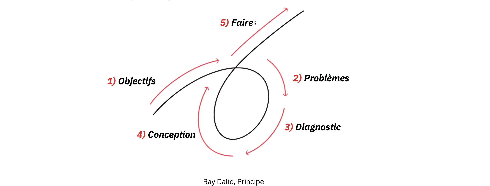

इसीलिए Bitcoin का सुनहरा नियम है:

"***जिनकी चाबी नहीं, उनके सिक्के नहीं***"। अगर आपके पास अपनी प्राइवेट कीज़ का सीधा कंट्रोल नहीं है, तो आप असल में अपने Bitcoin के मालिक नहीं हैं। एक्सचेंज भले ही शुरुआत में आसान लगें (खासकर नए लोगों के लिए), लेकिन वे आपकी चाबियाँ अपने पास रखते हैं। इसका मतलब है कि अगर प्लेटफॉर्म हैक हो जाए, आपका अकाउंट फ्रीज़ कर दे, या दिवालिया हो जाए, तो आपके पैसे खतरे में पड़ सकते हैं।"

इस जोखिम से बचने के लिए, **अपना खुद का Wallet** सेट करना बेहद सलाह दिया जाता है, जहाँ सिर्फ आपके पास रिकवरी फ्रेज़ की पहुँच हो। इस फ्रेज़ को हमेशा **हाथ से लिखकर** और **ऑफ़लाइन** किसी सुरक्षित जगह पर रखना चाहिए। कुछ यूज़र्स तो **एक से ज़्यादा बैकअप** भी रखते हैं, जिन्हें अतिरिक्त सुरक्षा के लिए अलग-अलग जगहों पर स्टोर किया जाता है।

**अपनी रिकवरी फ्रेज़ को कभी भी इंटरनेट से जुड़े डिवाइस या क्लाउड में स्टोर न करें**।

**एक ही हैक या डेटा ब्रीच से अपूरणीय नुकसान हो सकता है।**

अगर आप अपने Bitcoin का Ownership लेने के लिए तैयार हैं और रिकवरी फ्रेज़ को सुरक्षित रखने के बेस्ट प्रैक्टिसेज़ के बारे में और जानना चाहते हैं, तो मैं ज़ोरदार सलाह दूंगा कि ये आर्टिकल ज़रूर पढ़ें:

https://planb.network/tutorials/wallet/backup/backup-mnemonic-22c0ddfa-fb9f-4e3a-96f9-46e2a7954270

### गोपनीयता और विवेक

आज के डिजिटल दुनिया में, **चुप्पी या सावधानी को अक्सर नजरअंदाज कर दिया जाता है**; लेकिन यह सुरक्षित रहने का एक अहम हिस्सा है, खासकर जब बात Bitcoin की हो। जितना खुलकर आप अपने होल्डिंग्स के बारे में बात करेंगे, उतना ही आप स्कैमर्स, साइबर क्रिमिनल्स, या फिर ब्लैकमेल जैसे पुराने खतरों का निशाना बन सकते हैं।

दुनिया भर में ऐसे कई मामले सामने आए हैं जहां बड़ी मात्रा में BTC रखने वाले लोगों का अपहरण या हमला किया गया है।

**अपने Bitcoin Stash की शेखी न मारें**; चाहे सोशल मीडिया पर हो या आम बातचीत में। संवेदनशील वित्तीय जानकारी उजागर करने का कोई फायदा नहीं है, और जोखिम वास्तविक हैं।

यह भी समझदारी है कि **अपनी ऑनलाइन गतिविधियों को अलग-अलग हिस्सों में बाँट लें**। जैसे कि:

- Bitcoin से जुड़ी किसी भी चीज़ के लिए एक अलग ईमेल Address का इस्तेमाल करो, अपने पर्सनल या वर्क अकाउंट्स से अलग।
- फ़िशिंग के प्रयासों, संदिग्ध लिंक्स और नकली वेबसाइटों से सावधान रहें जो भरोसेमंद प्लेटफ़ॉर्म्स की नकल करते हैं।
- सावधान रहो! समझदारी और सतर्कता ही अक्सर तुम्हारी सबसे अच्छी सुरक्षा होती है।

अगर आप Bitcoin प्राइवेसी के बारे में और गहराई से जानना चाहते हैं, तो हमारे Year 2 Privacy Course में आगे बढ़ने की सलाह देते हैं। यहाँ आप अपनी पहचान और गतिविधियों को सुरक्षित रखने के और भी उन्नत तरीके सीखेंगे:

https://planb.network/courses/65c138b0-4161-4958-bbe3-c12916bc959c

### कर प्रभाव

भले ही यह एक विकेंद्रीकृत मुद्रा है, **Bitcoin आपके देश के कर कानूनों और नियमों से मुक्त नहीं है**। हर अधिकार क्षेत्र का क्रिप्टोकरेंसी से होने वाले मुनाफे पर कर लगाने का अपना तरीका होता है।

कुछ जगहों पर, बिक्री के समय मुनाफे पर कैपिटल गेन टैक्स लगता है। कहीं आपको हर ट्रेड की जानकारी देनी पड़ सकती है, और कुछ जगहों पर कम आम नियम लागू होते हैं, जैसे वेल्थ टैक्स या सोशल कंट्रीब्यूशन।

किसी भी बड़े लेन-देन से पहले, टैक्स प्रोफेशनल से सलाह लेना या सरकारी गाइडलाइन्स चेक करना बेहद ज़रूरी है। पहले से अपने टैक्स के बारे में जानकारी ले लेने से बाद में होने वाली दिक्कतों (जैसे जुर्माना, ऑडिट या सज़ा) से बचा जा सकता है, खासकर अगर आप बड़ी बिक्री या पोर्टफोलियो में बदलाव की योजना बना रहे हैं।

### ट्रेडिंग, इन्वेस्टिंग और होल्डिंग में अंतर

Bitcoin के बारे में अक्सर लोगों के दिमाग में गलतफहमियां होती हैं; सबसे आम गलत धारणा यह है कि यह ट्रेडिंग के जरिए अमीर बनने का शॉर्टकट है। लेकिन यह समझना जरूरी है कि ट्रेडिंग, इन्वेस्टिंग और होल्डिंग में बहुत फर्क होता है - हर तरीके का अपना अलग माइंडसेट, स्किलसेट और रिस्क लेवल होता है।

- ट्रेडिंग :**  

(Note: The term "ट्रेडिंग" is commonly used in Hindi for "Trading," especially in financial/business contexts. The colon (**:**) is preserved as per the original formatting.)

सच कहूँ तो:**शायद आपको ट्रेडिंग नहीं करनी चाहिए।**

ट्रेडिंग में शॉर्ट-टर्म स्पेकुलेशन (कभी-कभी लीवरेज के साथ) शामिल होता है जिसका मकसद Bitcoin की कीमतों के उतार-चढ़ाव से मुनाफा कमाना होता है। हालांकि यह आकर्षक लग सकता है, लेकिन सफल ट्रेडिंग के लिए एडवांस्ड टेक्निकल नॉलेज (जैसे चार्ट एनालिसिस और रिस्क मैनेजमेंट), इमोशनल डिसिप्लिन, और मार्केट पर लगातार नज़र रखने की ज़रूरत होती है। यह मानसिक रूप से थकाऊ और टाइम-कंज्यूमिंग है, और Hard सच्चाई यह है कि **ज्यादातर शुरुआती लोग पैसे गंवा देते हैं** क्योंकि वे इसकी असली मुश्किलों को कम आंकते हैं।

जैसा कि वॉरेन बफे ने मशहूर तरीके से कहा:

"**अगर तुम किसी शेयर को दस साल तक रखने को तैयार नहीं हो, तो दस मिनट के लिए भी रखने के बारे में सोचो मत।**"

Bitcoin कोई जल्दी अमीर बनने वाली योजना नहीं है।

- **निवेश (Investment):**  

(नोट: "Investment" को हिंदी में "निवेश" कहते हैं, जो पैसा या संसाधन किसी चीज़ में लगाने को दर्शाता है ताकि भविष्य में फायदा मिल सके।)

निवेशक मध्यम से लंबी अवधि का नजरिया रखते हैं, Bitcoin को इस विश्वास के साथ खरीदते हैं कि इसकी कीमत समय के साथ बढ़ेगी (महीनों, सालों या फिर दशकों तक)। बेशक, इसमें जोखिम तो है ही, क्योंकि Bitcoin की कीमत में काफी उतार-चढ़ाव हो सकता है। लेकिन यह तरीका आम तौर पर ज्यादा शांत और ज्यादातर लोगों के लिए बेहद व्यावहारिक है, खासकर उनके लिए जो रोजाना घंटों चार्ट्स में जुटे रहना नहीं चाहते।

- होल्डिंग (जीडब्ल्यू-100) :**  

(Note: The term "Holding" is kept as is since it's a technical or brand name, and "HODL" is transliterated to "जीडब्ल्यू-100" in Hindi while preserving the original format.)

"HODL" शुरू में "hold" की टाइपो (typing mistake) थी, जो जल्दी ही Bitcoin कल्चर का हिस्सा बन गई। आज, यह एक सम्मान का प्रतीक है।

होल्डर्स बहुत लंबे समय के लिए इसमें होते हैं; कभी-कभी दस साल या उससे भी ज्यादा। वे अपने Bitcoin को सुरक्षित रखते हैं और बस इंतज़ार करते हैं, Bitcoin के लॉन्ग-टर्म पोटेंशियल में उनका पूरा विश्वास होता है। उन्हें दिन-प्रतिदिन के प्राइस स्विंग्स या बेयर मार्केट से कोई फर्क नहीं पड़ता। उनकी सोच सीधी है: जमा करो, सुरक्षित रखो, और बैठे रहो।

|          | Trading | Investment | Holding |
| ---------------------- | ----------- | -------------- | --------------- |
| Leverage | Yes  | No | No |
| Timeframe | Short-term | Medium-term | Very long-term |
| Asset Type | Contracts | Actual BTC | Actual BTC |
| Risk Level | Very high | High | High |
| Difficulty | Very Hard | Hard | Hard |
| learning curve | Long learning curve | Long learning curve | Long learning curve |
| Potential Loss | UnLimited | Limited | Limited |
| Best For | A few experienced users | Most People | Long-term Believers |

### सीखते रहो

पैसों के बारे में, निवेश के बारे में और वित्तीय प्रणाली कैसे काम करती है, इसके बारे में खुद को शिक्षित करने के लिए कभी भी जल्दी (या देर) नहीं होती। आपको एक्सपर्ट बनने या हर तकनीकी विवरण में जाने की ज़रूरत नहीं है; बस एक मजबूत, बड़ी तस्वीर वाली समझ होना काफी है ताकि आप सही निर्णय ले सकें और उन वित्तीय उत्पादों से बच सकें जो आपके हित में नहीं होते (जिन्हें अक्सर बैंक या सलाहकार बढ़ावा देते हैं)।

एक बेहतरीन शुरुआत है रॉबर्ट टी. कियोसाकी की किताब *रिच डैड, पुअर डैड*। यह किताब अपने आसान स्टाइल और बुनियादी सबक के लिए मशहूर है; जैसे कि एसेट्स और लायबिलिटीज़ के बीच का फर्क समझना, और क्यों फाइनेंशियल एजुकेशन लॉन्ग-टर्म आज़ादी के लिए ज़रूरी है।

अगर आप और गहराई में जाने के लिए तैयार हैं, तो *The Investors Podcast* जैसे पॉडकास्ट निवेश, बाजार और आर्थिक सिद्धांतों पर ज्ञानवर्धक चर्चाएं प्रदान करते हैं। वे कभी-कभी Bitcoin को भी कवर करते हैं, जिससे यह उन लोगों के लिए एक अच्छा अगला कदम बन जाता है जो समझना चाहते हैं कि Bitcoin व्यापक वित्तीय परिदृश्य में कैसे फिट बैठता है।

### ध्यान में रखने के सुनहरे नियम

समाप्त करने के लिए, यहां कुछ सदाबहार सिद्धांत हैं जिन्हें हर बिटकॉइनर (खासकर नौसिखिये) को ध्यान में रखना चाहिए:

- **नियम नंबर 1**: जितना खोने का जोखिम उठा सकते हो, उससे ज़्यादा कभी निवेश मत करो। Bitcoin एक अस्थिर संपत्ति है। मुनाफे के पीछे भागते हुए अपनी आर्थिक स्थिरता को दाँव पर मत लगाओ। तुम्हारी बुनियादी ज़रूरतें और मानसिक शांति हमेशा पहले आनी चाहिए।
- **नियम नंबर 2**: हाइप या चमत्कारी सलाह पर आँखें बंद करके भरोसा मत करो। ट्रेंड्स और चमकदार वादों को नज़रअंदाज़ करो। बजाय इसके, अच्छी तरह सोच-समझकर और तर्कसंगत फैसले लो। अगर शक हो, तो एक रात सो जाओ; अपने भरोसेमंद लोगों से इस पर बात करो। जल्दबाज़ी में महंगी गलतियाँ करने से बेहतर है धीरे-धीरे और समझदारी से आगे बढ़ना।
- **नियम नंबर 3**: एक योजना बनाओ और लंबे समय के लक्ष्य पर टिके रहो।

लगातार मेहनत, धैर्य और अनुशासन आपको छोटे-मोटे उत्साह से कहीं आगे ले जाएगा। बड़े-बड़े सपने देखने की बजाय टिकाऊ तरक्की पर ध्यान दो। गलतियों से बचो और छोटी-छोटी जीत को समय के साथ बढ़ने दो।

इन सिद्धांतों का पालन करके, आप Bitcoin में निवेश को अधिक स्पष्टता और शांति के साथ समझ पाएंगे। हां, Bitcoin अस्थिर है, और शुरुआत में यह डरावना लग सकता है; लेकिन सावधानी, धैर्य और संयमित दिमाग से इसे अपनाया जाए, तो इसकी संभावनाएं नकारी नहीं जा सकती। अपना ज्ञान बढ़ाने के लिए समय निकालें, जरूरत पड़ने पर अपनी रणनीति को दोबारा देखें, और सबसे बढ़कर यह याद रखें: डर या बेसब्री से जल्दबाजी करने के बजाय धीरे-धीरे और स्थिर प्रगति हमेशा बेहतर होती है।

# जो तुम करने जा रहे हो, उसे समझना

<partId>a42355a3-9dd8-57ed-b590-32a333fe09ea</partId>

## 5 मिनट में Bitcoin

<chapterId>ae122ad9-9b4d-5229-9038-e1b99d5cfc83</chapterId>

इस कोर्स में, हमारा मुख्य मकसद है आपको अपने पहले बिटकॉइन खरीदने और सुरक्षित करने में मार्गदर्शन देना। लेकिन प्रैक्टिकल स्टेप्स में कूदने से पहले (जैसे BTC कैसे खरीदें, कौनसा वॉलेट इस्तेमाल करें, वगैरह) ये ज़रूरी है कि एक कदम पीछे हटकर Bitcoin आखिर है क्या, इसे समझा जाए। Bitcoin की असली प्रकृति को समझने से आप देख पाएंगे कि लाखों लोग इस टेक्नोलॉजी की तरफ क्यों भाग रहे हैं, और इतने नए और अस्थिर एसेट में अपनी पूँजी लगाने से पहले बेसिक्स समझना क्यों ज़रूरी है।

सालों से, Bitcoin को एक वैश्विक मौद्रिक नेटवर्क के रूप में पहचान मिली है। इसे "डिजिटल गोल्ड", "ट्रस्ट प्रोटोकॉल" और यहाँ तक कि "समानांतर वित्तीय प्रणाली" भी कहा जाता है। लेकिन इन शब्दों का वास्तव में क्या मतलब है? इसका जवाब देने के लिए, हम Bitcoin के मूल को करीब से देखेंगे: इसकी उत्पत्ति की कहानी, तकनीकी आधार, मौद्रिक गुण और इसका संभावित प्रभाव; न केवल व्यक्तियों पर, बल्कि पूरी वैश्विक वित्तीय प्रणाली पर।

### मूल: एक परियोजना जो एक लंबे समय से चले आ रहे सवाल से जन्मी

#### साइफरपंक्स और बैंकिंग नियंत्रण से परे एक सिस्टम का आविष्कार

Bitcoin एक रात में नहीं बना। यह क्रिप्टोग्राफी, कंप्यूटर साइंस और मौद्रिक सिद्धांत में दशकों के शोध और प्रयोग का नतीजा है। 2009 में लॉन्च होने से पहले, कई प्रोजेक्ट्स (जैसे eCash, b-money, Bit Gold और RPOW) ने डिजिटल करेंसी बनाने की कोशिश की। सभी को एक ही मूल समस्या का सामना करना पड़ा: बिना किसी केंद्रीय प्राधिकरण पर निर्भर हुए, एक विकेंद्रीकृत सिस्टम में डबल खर्च को कैसे रोका जाए।

वो चुनौती 2008 के आखिर तक अनसुलझी रही, जब Satoshi नाकामोतो नाम के किसी शख्स ने Bitcoin का वाइट पेपर पब्लिश किया। कुछ महीने बाद, Bitcoin के ओपन-सोर्स सॉफ्टवेयर का पहला वर्जन लाइव हुआ, जिसने एक ऐसा सिस्टम लॉन्च किया जो बैंकों या सरकारों से बगैर काम कर सकता था।

यह प्रोजेक्ट Cypherpunk के विचारों से काफी प्रभावित था; डेवलपर्स और विचारकों का एक समुदाय जो ऑनलाइन व्यक्तिगत स्वतंत्रता की सुरक्षा के लिए क्रिप्टोग्राफी के इस्तेमाल में विश्वास रखता था। उनके लिए, गोपनीयता और विकेंद्रीकरण तकनीकी पसंद नहीं, बल्कि विचारधारात्मक ज़रूरतें थीं। Bitcoin इन आदर्शों का सबसे सफल प्रतीक बनकर उभरा: एक पीयर-टू-पीयर मौद्रिक नेटवर्क जिसे कोई भी इस्तेमाल कर सकता था, जिस पर किसी का नियंत्रण नहीं था, और जिसे हर कोई सत्यापित कर सकता था।

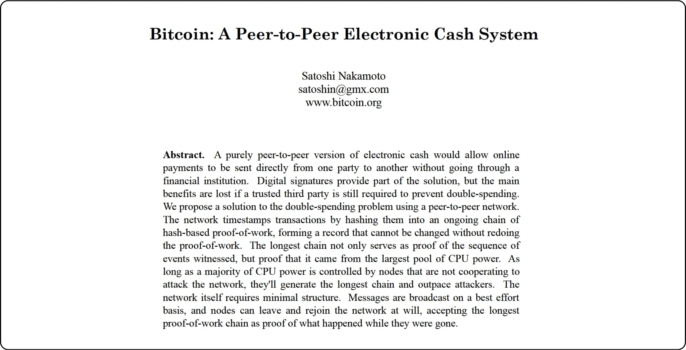

साइफरपंक्स एक अनौपचारिक, अंतरराष्ट्रीय समुदाय है जो ऑनलाइन व्यक्तिगत स्वतंत्रता की रक्षा के लिए क्रिप्टोग्राफी के उपयोग की वकालत करता है। वे व्यक्ति के निजता के अधिकार में दृढ़ विश्वास रखते हैं; खासकर ऐसी दुनिया में जहां सरकारी निगरानी और कॉर्पोरेट डेटा शोषण तेजी से बढ़ रहा है।

Cypherpunk आंदोलन की जड़ें 1990 के दशक की शुरुआत में हैं, जब सिलिकॉन वैली में मीटअप्स के दौरान क्रिप्टोग्राफर्स, प्रोग्रामर्स और लिबर्टेरियन्स के समूहों ने क्रिप्टोग्राफी के राजनीतिक प्रभावों को खोजना शुरू किया। इस समुदाय में सबसे प्रमुख आवाज़ों में से एक थे टिम मे, जिन्होंने 1988 में क्रिप्टो एनार्किस्ट मैनिफेस्टो लिखा; एक मूलभूत पाठ जिसमें एक ऐसी दुनिया का विज़न था जहां एन्क्रिप्शन व्यक्तियों को सरकारों और केंद्रीकृत नियंत्रण से परे काम करने का सशक्तिकरण देगा।

इस आंदोलन में एक बड़ा मील का पत्थर 1992 में आया, जब साइफरपंक्स मेलिंग लिस्ट बनी। यह एक ऐसा मंच था जहाँ गोपनीयता और क्रिप्टोग्राफी पर विचार, प्रोजेक्ट्स और राजनीतिक चर्चाएँ फल-फूल सकती थीं। फिर 1993 में, एरिक ह्यूज ने "साइफरपंक्स मैनिफेस्टो" प्रकाशित किया, जो एक संक्षिप्त परंतु प्रभावशाली घोषणापत्र था जिसने इस समुदाय के मिशन और विश्वासों को स्पष्ट रूप से व्यक्त किया।

एक डिजिटल करेंसी का विचार जो किसी भी केंद्रीय अथॉरिटी (जैसे Bitcoin) से स्वतंत्र रूप से काम करती है, Cypherpunk के फिलॉसफी में गहराई से जुड़ा हुआ है।

#### वित्तीय संकट के बाद का पल

Bitcoin बस ऐसे ही नहीं आ गया। यह एक बहुत खास वक्त पर बनाया गया था - सीधे 2008 के वैश्विक आर्थिक संकट के बाद। अमेरिकी हाउसिंग मार्केट का गिरना और सबप्राइम लोन संकट ने बड़े बैंकों को फेल कर दिया और पूरी फाइनेंशियल सिस्टम में लोगों का भरोसा हिला दिया।

इसी डर और अनिश्चितता के माहौल में Bitcoin का जन्म हुआ। रचनाकार, जिसे Satoshi नाकामोटो के नाम से जाना जाता है, ने Bitcoin Blockchain के पहले ब्लॉक, जिसे Genesis ब्लॉक कहा जाता है, में एक बहुत ही प्रतीकात्मक संदेश शामिल किया। संदेश था:

> **"द टाइम्स 03/जनवरी/2009 चांसलर बैंकों के लिए दूसरे बेलआउट के कगार पर"**  

(Note: The translation keeps the newspaper name "The Times" in English as it's a proper noun, while the rest is translated into colloquial Hindi. The date format is adjusted to Hindi style with "जनवरी" for "January." "Chancellor" is transliterated as "चांसलर" since it's a title, and "bailout" is written as "बेलआउट," a commonly understood term in Hindi financial contexts.)

यह सिर्फ एक तारीख या तकनीकी नोट नहीं था; यह एक शांत लेकिन ताकतवर विरोध था। इसने दिखाया कि Bitcoin को कुछ बिल्कुल अलग बनाने के लिए डिज़ाइन किया गया था: एक ऐसी वित्तीय प्रणाली जो बैंकों, बेलआउट्स या सरकारी फैसलों पर निर्भर नहीं करती।

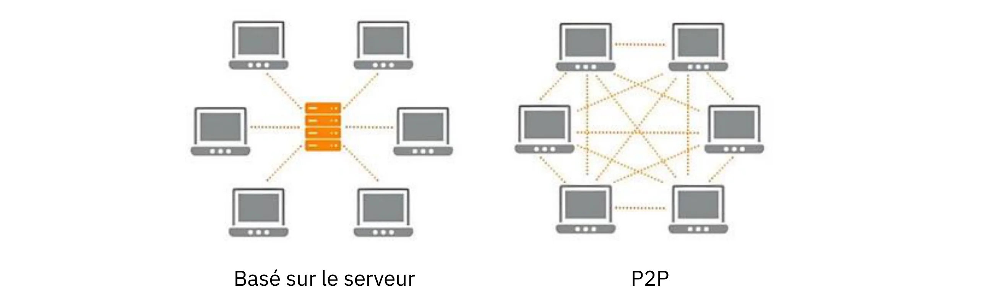

बहुत से लोग इसे Bitcoin का लक्ष्य मानते हैं: एक ऐसा तरीका पेश करना जिससे बिना किसी बिचौलिए के मूल्य का हस्तांतरण किया जा सके, जो स्पष्ट नियमों द्वारा नियंत्रित हो न कि केंद्रीय बैंकों या सरकारों के अक्सर अस्पष्ट फैसलों से।

Bitcoin की उत्पत्ति के बारे में आपकी जानकारी को गहरा करने के लिए, हम इस विषय पर एक मुफ्त, व्यापक और अच्छी तरह से प्रलेखित प्रशिक्षण पाठ्यक्रम प्रदान करते हैं:

https://planb.network/courses/a51c7ceb-e079-4ac3-bf69-6700b985a082

### एक विकेंद्रित नेटवर्क जो मूल्य ट्रांसफर करता है

#### पीयर-टू-पीयर और कोई केंद्रीय संस्था नहीं

Bitcoin को "पीयर-टू-पीयर इलेक्ट्रॉनिक कैश सिस्टम" के रूप में परिभाषित किया गया है। इसका मतलब है कि कोई भी उचित सॉफ्टवेयर (Bitcoin नोड) का उपयोग करके नेटवर्क से जुड़ सकता है और बिना किसी केंद्रीय सर्वर पर निर्भर हुए सीधे अन्य उपयोगकर्ताओं के साथ इंटरैक्ट कर सकता है। इस विकेंद्रीकरण का लक्ष्य किसी एकल संस्था (जैसे बैंक, सरकार, या बड़ी कंपनी) को सिस्टम को नियंत्रित, सेंसर, या रोकने से रोकना है। Bitcoin 24/7 काम करता है, वैश्विक स्तर पर, और बिना किसी शर्त के सभी के लिए सुलभ है।

सीधे शब्दों में, Bitcoin नेटवर्क में हर एक भागीदार (जिसे "नोड" कहते हैं) के पास Ledger ट्रांजैक्शन की पूरी कॉपी होती है, जिसे Blockchain कहा जाता है। जब कोई नया ट्रांजैक्शन होता है, तो उसे नेटवर्क पर ब्रॉडकास्ट कर दिया जाता है। माइनर्स फिर इन ट्रांजैक्शन्स को ब्लॉक्स में ग्रुप करके कन्फर्म करते हैं, जिन्हें चेन के अंत में जोड़ दिया जाता है (इसीलिए इसे "Blockchain" नाम मिला है)।

#### जीडब्ल्यू-131: एक लेखा जीडब्ल्यू-132

Blockchain को एक विशाल लेखा-जोखा (Ledger) समझिए, जहाँ हर लाइन एक लेन-देन को दर्शाती है। पारंपरिक बैंकिंग सिस्टम में, डेटाबेस बैंक के सर्वर पर स्टोर होता है, जो चाहे जब भी बदलाव कर सकते हैं। वहीं, Bitcoin में **सभी बदलाव पूरे नेटवर्क पर वैलिडेट किए जाते हैं**: एक बार ट्रांजैक्शन्स का नया ब्लॉक Blockchain में जोड़ दिया जाता है, तो बाद में उसे बदलना लगभग नामुमकिन हो जाता है। यह विकेंद्रीकृत वैलिडेशन Bitcoin के Ledger को सुरक्षित और पारदर्शी बनाता है।

### माइनर्स और Proof-of-Work की भूमिका

#### ब्लॉक्स कैसे बनते हैं: Mining

Mining वह प्रक्रिया है जिसमें कंप्यूटर (या बड़े Mining फार्म) Bitcoin के लेन-देन इतिहास को सुरक्षित करने और नए ब्लॉक बनाने के लिए **कम्प्यूटेशनल पावर** योगदान करते हैं। माइनर्स एक गणितीय पहेली को हल करने के लिए प्रतिस्पर्धा करते हैं—खासकर, Hash का आंशिक टकराव ढूंढना। इस प्रक्रिया में काफी ऊर्जा और संसाधन लगते हैं। जब एक Miner वैध समाधान ढूंढ लेता है, तो वह ब्लॉक को नेटवर्क पर प्रसारित करता है, जो इसे सत्यापित करके वैध मान लेता है।

इनाम के तौर पर, Miner को नए बनाए गए बिटकॉइन (जिसे ब्लॉक सब्सिडी कहते हैं) मिलते हैं, साथ ही उस ब्लॉक में शामिल सभी लेन-देन के ट्रांजैक्शन फीस भी मिलते हैं।

#### जीडब्ल्यू-143: घटता हुआ ब्लॉक सब्सिडी

Bitcoin की कमी सुनिश्चित करने के लिए, ब्लॉक सब्सिडी को हर 210,000 ब्लॉक्स (लगभग हर चार साल) में आधा करने का प्रोग्राम किया गया है। इस घटना को "Halving" के नाम से जाना जाता है। जब Bitcoin लॉन्च हुआ था, तब माइनर्स को हर ब्लॉक पर 50 BTC मिलते थे। 2025 तक यह इनाम घटकर 3.125 BTC रह गया है और समय के साथ यह और कम होता जाएगा।

आखिरकार, साल 2140 तक, सब्सिडी शून्य हो जाएगी, क्योंकि Bitcoin का कुल Supply 21 मिलियन सिक्कों तक सीमित हो जाएगा। यह पूर्वानुमेय जारी करने की प्रक्रिया भौतिक वस्तुओं जैसे सोने की कमी की नकल करती है; यही एक वजह है कि Bitcoin को अक्सर **डिजिटल गोल्ड** कहा जाता है।

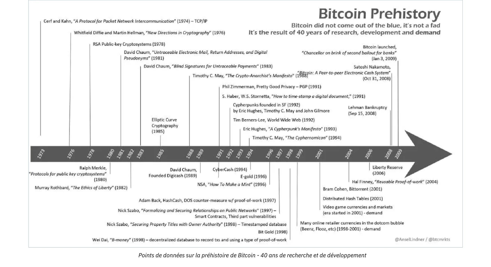

### जीडब्ल्यू-148 मौद्रिक गुण

#### कमी और एक निश्चित मौद्रिक नीति

Bitcoin का सबसे ताकतवर फीचर्स में से एक है इसकी *पूर्वानुमेय और अपरिवर्तनीय मौद्रिक नीति*। पारंपरिक फिएट करेंसी (जैसे डॉलर, यूरो या येन) के विपरीत, जिन्हें सेंट्रल बैंक मनमर्जी से प्रिंट कर सकते हैं (जिससे अक्सर मुद्रास्फीति या आर्थिक विकृतियाँ पैदा होती हैं), Bitcoin अपने कोड में एम्बेडेड नियमों के एक पारदर्शी सेट के तहत काम करता है।

कुल मिलाकर सिर्फ़ 21 मिलियन बिटकॉइन ही होंगे, और नए सिक्के जारी होने की दर नेटवर्क में हर किसी को पहले से पता होती है।

कोई भी सरकार, संस्था या व्यक्ति अकेले इस Supply कैप या वितरण नियमों को बदल नहीं सकता। इन नियमों में बदलाव करने का एकमात्र तरीका है Bitcoin के प्रोटोकॉल को बदलना; और उसके लिए भी नेटवर्क के अधिकांश आर्थिक भागीदारों की सहमति जरूरी होगी।

यह अंतर्निहित कमी उन लोगों के लिए एक बड़ा आकर्षण है जो अप्रत्याशित मौद्रिक नीतियों से बचना चाहते हैं या मुद्रास्फीति के माध्यम से अपनी क्रय शक्ति के धीरे-धीरे क्षरण से बचना चाहते हैं। समय के साथ, यह वित्तीय सोच में एक बदलाव का प्रतिनिधित्व कर सकता है, जहां Bitcoin जैसी अपस्फीतिकारक संपत्ति में बचत करना पारंपरिक, मुद्रास्फीति-प्रवण मुद्राओं पर निर्भर रहने की तुलना में अधिक आकर्षक हो जाता है।

#### विभाज्यता और पहुँच

Bitcoin की सबसे कम सराही गई खूबियों में से एक है इसकी विभाज्यता। हर Bitcoin को 10 करोड़ यूनिट्स में तोड़ा जा सकता है, जिन्हें सातोशी (या संक्षेप में Sats) कहा जाता है। इसका मतलब है कि शुरुआत करने के लिए आपको हजारों यूरो या डॉलर खर्च करने की जरूरत नहीं; आप सिर्फ कुछ यूरो के बराबर Bitcoin खरीद सकते हैं, यहाँ तक कि बेहद छोटे हिस्से भी।

### खुलापन और पारदर्शिता

#### एक सार्वजनिक प्रोटोकॉल, जिसे सभी द्वारा सत्यापित किया जा सकता है

Bitcoin एक सार्वजनिक, **ओपन-सोर्स** प्रोटोकॉल पर चलता है (खासकर [Bitcoin Core](https://github.com/Bitcoin/Bitcoin) के जरिए)। इसका मतलब है कि इसका कोड किसी के लिए भी जांचने, ऑडिट करने और सुधारने के लिए मुफ्त में उपलब्ध है। इसमें कोई छुपे हुए मैकेनिज्म या बंद सिस्टम नहीं हैं; Bitcoin कैसे काम करता है, इसके बारे में सब कुछ खुले में है।

ये level का transparency backdoors डालना या secret changes करना बेहद मुश्किल बना देता है। कोई भी जिसके पास technical skills हैं, वो node चला सकता है, development में contribute कर सकता है, या compatible tools बना सकता है। Bitcoin में trust code और consensus के जरिए कमाया जाता है, centralized control से नहीं।

यह पारदर्शिता Bitcoin प्रोटोकॉल पर लोगों के भरोसे की एक मुख्य वजह है; यह डेवलपर्स के एक छोटे समूह को नेटवर्क को अपने फायदे के लिए मनमाने ढंग से बदलने से रोकता है। Bitcoin एक सरल लेकिन ताकतवर सिद्धांत पर काम करता है: अगर आप प्रस्तावित बदलावों से सहमत नहीं हैं, तो आप अपने सॉफ्टवेयर को अपडेट न करने के लिए आज़ाद हैं। कुछ मामलों में, इससे कोई दिक्कत नहीं होगी; आप नेटवर्क के बाकी हिस्सों के साथ सिंक में बने रहेंगे। लेकिन दूसरे मामलों में, इससे Hard Fork नामक स्थिति पैदा हो सकती है, जहां नेटवर्क दो हिस्सों में बंट जाता है, और Bitcoin का एक नया वर्जन बन जाता है। ठीक यही 2017 में Bitcoin (BTC) और Bitcoin कैश (BCH) के बीच बंटवारे के दौरान हुआ था।

हालांकि इस तरह का शासन धीमा और कभी-कभी अव्यवस्थित हो सकता है, लेकिन यह एक ताकत भी है; यह सुनिश्चित करता है कि कोई भी एक इकाई अकेले नियंत्रण नहीं ले सकती, जिससे Bitcoin स्थिर, तटस्थ और केंद्रीकरण का विरोध करने वाला बना रहता है।

#### व्यक्तिगत सत्यापन: नोड्स

Bitcoin किसी को भी Blockchain की सटीकता जांचने की अनुमति देता है, अपने कंप्यूटर या सर्वर पर एक "नोड" चलाकर। इसका मतलब है Bitcoin कोर सॉफ्टवेयर (या Bitcoin प्रोटोकॉल का कोई अन्य वर्जन) डाउनलोड करना और 2009 से सभी लेन-देन और ब्लॉक्स को वेरिफाई करना। एक बार आपका नोड सेटअप हो जाए और सिंक हो जाए, तो यह Blockchain की एक पूरी कॉपी बन जाता है और नेटवर्क को सपोर्ट करने में मदद करता है।

हालांकि यह तरीका थोड़ा ज्यादा टेक्निकल है, लेकिन यह सबसे ज्यादा डिमांडिंग यूजर्स को तीसरे पक्षों पर भरोसा न करने का विकल्प देता है। नोड चलाने से यूजर्स कंसेंसस प्रोसेस में हिस्सा ले सकते हैं और सेंसरशिप से मुक्त रह सकते हैं, जो नेटवर्क की सुरक्षा और विकेंद्रीकरण में सीधे योगदान देता है।

### उपयोग के मामले

#### एक लचीला, सीमा-पार भुगतान तरीका

अपने विकेंद्रीकृत स्वभाव की वजह से, Bitcoin चौबीसों घंटे काम करता है, जिस पर सीमाओं या टाइम जोन का कोई असर नहीं पड़ता। जहाँ पारंपरिक बैंकिंग ढाँचे की कमी है, वहाँ Bitcoin को अक्सर पैसे भेजने या प्राप्त करने के लिए एक तेज़, सस्ता समाधान के तौर पर इस्तेमाल किया जाता है, बिना महँगे बिचौलियों पर निर्भर हुए। हालाँकि लेन-देन शुल्क नेटवर्क भीड़ के आधार पर अलग-अलग हो सकते हैं, लेकिन आमतौर पर ये बैंकों द्वारा अंतरराष्ट्रीय ट्रांसफर पर लिए जाने वाले शुल्क से काफी कम होते हैं। इसके अलावा, Layer-2 जैसे समाधान, जैसे कि Lightning Network, Bitcoin लेन-देन को और भी तेज़ और सस्ता बना देते हैं।

#### एक मूल्य का भंडार

इसकी कमी (केवल 21 मिलियन BTC तक सीमित) और अंतर्निहित मजबूती के कारण, Bitcoin को अक्सर दीर्घकालिक बचत का सुरक्षा कवच माना जाता है। हालांकि कम समय में इसकी कीमत में उतार-चढ़ाव हो सकता है, लेकिन शुरुआत के बाद से Bitcoin की कीमत साल दर साल आम तौर पर बढ़ती ही रही है। कुछ निवेशक BTC इस विश्वास से खरीदते हैं कि यह मूल्य संचय का साधन बन सकता है, खासकर मुद्रास्फीति या वित्तीय संकट के समय में।

#### एक वित्तीय आज़ादी और मज़बूती का साधन

निवेश के अलावा, Bitcoin वित्तीय संप्रभुता की सुरक्षा का एक तरीका प्रदान करता है। अधिनायकवादी शासन वाले देशों या जहां मौद्रिक प्रतिबंध अधिक हैं, वहां Bitcoin Wallet (निजी कुंजियों के साथ) रखने से एक प्रकार की स्वतंत्रता मिलती है। कोई भी इन BTC को ब्लॉक या जब्त नहीं कर सकता, बशर्ते धारक अपना रिकवरी फ्रेज सुरक्षित रखे।

यह खासियत उन लोगों को खासतौर पर आकर्षित करती है जो सेंसरशिप या बैंक अकाउंट फ्रीज़ होने के डर से जूझ रहे हैं। यह उन आबादियों के लिए भी प्रासंगिक है जो हाइपरइन्फ्लेशन की मार झेल रहे हैं, जैसे वेनेज़ुएला या ज़िम्बाब्वे में, जहाँ स्थानीय मुद्रा (जो तेज़ी से गिर रही थी) की तुलना में BTC रखना ज़्यादा स्थिर साबित हुआ।

### अभी बहुत दूर जाना है

जीडब्ल्यू-169 को एक "जीरो टू वन" माना जा सकता है: यह पारंपरिक वित्तीय प्रणालियों से एक क्रांतिकारी ब्रेक है। इतिहास में पहली बार, एक वैश्विक मौद्रिक नेटवर्क जो सभी के लिए सुलभ है, बिना किसी केंद्रीय अथॉरिटी के काम कर रहा है। यह सेंसरशिप-रोधी और प्राइवेट लेनदेन को संभव बनाता है।

फिर भी, एक दशक से भी ज़्यादा समय बीत जाने के बाद, Bitcoin अब भी बहसें और जोश पैदा कर रहा है। इसका इस्तेमाल बढ़ रहा है, दूसरी पीढ़ी के Layer समाधान (जैसे Lightning Network) लेन-देन की गति बढ़ाने और फीस कम करने के लिए सामने आ रहे हैं, और दुनिया भर के व्यवसाय नए उपयोग के तरीके आज़मा रहे हैं। ऐसा लगता है कि Bitcoin आने वाले दशकों तक भुगतान प्रणालियों और यहाँ तक कि पैसे को देखने के हमारे नज़रिए को प्रभावित करता रहेगा।

अगर आप अपनी जानकारी और बढ़ाना चाहते हैं, तो आप Plan ₿ Network पर BTC101 कोर्स ले सकते हैं, जो Bitcoin के टेक्निकल और इकोनॉमिक बेसिक्स को और गहराई से समझाता है।

https://planb.network/courses/2b7dc507-81e3-4b70-88e6-41ed44239966

Bitcoin के इस परिचय के बाद (जो शायद 5 मिनट से थोड़ा ज्यादा लंबा हो गया!), अब आप बिटकॉइन खरीदने और सुरक्षित करने के बारे में बेहतर तरीके से सोच सकते हैं। कोर्स के आने वाले अध्यायों में, हम Bitcoin के महत्व, इसके उद्योग के कामकाज, और इसकी विभिन्न परतों के विकास पर गहराई से चर्चा करेंगे। अगले भाग में, हम यह बताएंगे कि अपनी खुद की व्यक्तिगत योजना कैसे बनाएं।

## Bitcoin क्यों महत्वपूर्ण है?

<chapterId>d4327ac4-9ff8-5192-b542-cb78c0bd0aa7</chapterId>

Bitcoin इतना महत्वपूर्ण क्यों है? यही इस कोर्स का मुख्य सवाल है। चाहे वह आपकी पढ़ाई से जुड़ा हो या आपकी निवेश रणनीति से, Bitcoin के महत्व को स्पष्ट रूप से समझे बिना, आपके प्लान से भटकने का खतरा है। लक्ष्य यह है कि हमेशा Bitcoin के मूल सिद्धांतों को ध्यान में रखें ताकि आपकी रणनीति आपकी मान्यताओं के साथ मेल खाती रहे।

### एक सार्वभौमिक मुद्रा

बराक ओबामा ने एक बार Bitcoin को "आपकी जेब में एक स्विस बैंक" कहा था, और इसके पीछे अच्छी वजह थी। Bitcoin हर किसी को एक जैसे मौके देता है, चाहे वो कोई भी हो। चाहे आप एक टीनएजर हों, एक राष्ट्रपति, हॉन्ग कॉन्ग का प्रदर्शनकारी, या फ्रांस का "येलो वेस्ट" - हर किसी को एक समान प्रोटोकॉल और टूल्स तक पहुंच मिलती है:

- मुफ्त और असीमित वॉलेट बनाएं (Bitcoin के साथ, हम वास्तव में "अकाउंट्स" के बारे में बात नहीं करते, बल्कि "वॉलेट्स" के बारे में बात करते हैं)।
- कहीं भी, किसी को भी पैसे भेजें।
- कोई पहचान या प्रशासनिक प्रक्रिया की जरूरत नहीं।
- सभी के लिए सुलभ, चाहे उम्र, लिंग, धर्म, देश या आय स्तर कोई भी हो।
- आपकी मर्ज़ी के मुताबिक़ गोपनीयता और पारदर्शिता उपलब्ध।
- कोई बिचौलिए या छुपे हुए शुल्क नहीं।
- Bitcoin इंटरनेट का ही हिस्सा है, यानी जिसके पास भी इंटरनेट की सुविधा है वो इसे इस्तेमाल कर सकता है।

Bitcoin को लोगों की असली "जनता की मुद्रा" माना जा सकता है, यह एक वैकल्पिक मौद्रिक प्रणाली है जो किसी केंद्रीय प्राधिकरण पर निर्भर नहीं करती और मनमाने फैसलों के बजाय अपरिवर्तनीय नियमों पर आधारित है। इसका खुला और सुलभ स्वरूप इसे दुनिया भर के अरबों लोगों के लिए एक क्रांतिकारी उपकरण बनाता है, चाहे वे पारंपरिक बैंकिंग प्रणाली से बाहर हों या बस एक अधिक स्वायत्त विकल्प की तलाश में हों।

यह हमें एक बुनियादी, लगभग दार्शनिक सवाल की ओर ले जाता है जो Bitcoin के प्रशंसकों को दो मुख्य विश्वदृष्टियों में बाँट देता है। एक तरफ, कुछ लोग Bitcoin को वित्तीय समावेशन को बढ़ावा देने का एक समाधान मानते हैं, जो अरबों बिना बैंक वाले लोगों को आखिरकार एक वैश्विक मौद्रिक बुनियादी ढाँचे तक पहुँच प्रदान करता है। दूसरी तरफ, कुछ लोग Bitcoin को एक वित्तीय मुक्ति का उपकरण मानते हैं जिसका उद्देश्य बैंकिंग प्रणाली में पहले से ही शामिल, लेकिन जो इसकी निर्भरता से मुक्त होना चाहते हैं और अपने पैसे पर पूर्ण नियंत्रण वापस पाना चाहते हैं, अरबों लोगों के लिए एक रास्ता प्रदान करना है। यह विचार हमारे ध्यान के योग्य है, और हम बाद में इस पर और विस्तार से चर्चा करेंगे।

### मुद्रा संकट से सुरक्षा

सदियों से, दुनिया ने मौद्रिक संकटों का सामना किया है जिनका आबादी पर विनाशकारी प्रभाव पड़ा है। अरबों लोग अभी भी खराब तरीके से प्रबंधित मौद्रिक नीतियों के परिणामों से पीड़ित हैं, जहां पैसे Supply और ब्याज दरों का हेरफेर व्यवस्थागत असंतुलन पैदा करता है। ये संकट सिर्फ यादृच्छिक घटनाएं नहीं हैं—ये एक ऐसी व्यवस्था का नतीजा हैं जो हस्तक्षेप और पैसे तथा समय के मूल्य के हेरफेर पर बनी है।

ये संकट कई अलग-अलग रूप ले सकते हैं। उदाहरण के लिए, हाइपरइन्फ्लेशन (महंगाई की चरम स्थिति) लोगों की खरीदने की क्षमता को धीरे-धीरे खत्म करके मुद्रा का सफाया कर देता है; जैसा कि जिम्बाब्वे और वेनेजुएला जैसे देशों में देखा गया। वहीं दूसरी ओर, सख्त मौद्रिक नियंत्रण धन तक पहुंच को सीमित कर सकते हैं और लोगों की आर्थिक आजादी छीन सकते हैं, जैसा कि ग्रीस और लेबनान में बैंकिंग प्रतिबंधों के दौरान हुआ।

और आखिरकार, जब सरकारें अपनी राष्ट्रीय मुद्राओं का अवमूल्यन करती हैं, तो यह धीरे-धीरे लोगों की बचत को खत्म कर देती है; यह उनकी संपत्ति पर एक अदृश्य लेकिन लगातार बोझ की तरह होता है। कई मायनों में, यह एक छुपे हुए टैक्स की तरह काम करता है। जब तक मौद्रिक नीति केंद्रीय अधिकारियों के हाथों में रहती है, ये चक्र दोहराते रहने के लिए अभिशप्त हैं।

Bitcoin मौद्रिक अस्थिरता के इस चक्र का एक साहसिक विकल्प पेश करता है। सरकारी मुद्राओं के विपरीत, यह अपरिवर्तनीय, गणित-आधारित नियमों पर बना है जो सहमति से लागू होते हैं; सरकारों या केंद्रीय बैंकों द्वारा नहीं। इसका जारी होना पूर्वानुमेय है और लगभग 21 मिलियन सिक्कों तक सीमित है, जो इसे समय के साथ अपना मूल्य बनाए रखने के लिए डिज़ाइन किए गए सुदृढ़ मुद्रा का एक रूप बनाता है। चूंकि यह सेंसरशिप का विरोध करता है, कोई भी संस्था पर निर्भर हुए बिना मूल्य संग्रहीत और स्थानांतरित कर सकता है। और इसकी विभाज्यता और पोर्टेबिलिटी के कारण, यह सुलभ और व्यावहारिक दोनों है; कहीं भी, किसी के लिए भी वित्तीय बुनियादी ढांचा।

**क्या आप जानते हैं?** इतिहास भर में दुनिया भर में कम से कम 56 हाइपरइन्फ्लेशन के मामले दर्ज किए गए हैं। इनमें से कई मामलों में पूरी अर्थव्यवस्थाएँ धराशायी हो गईं, लोगों की जमा पूँजी खत्म हो गई, और लाखों लोग अत्यधिक गरीबी में धकेल दिए गए। इससे भी बुरी बात यह है कि ये मौद्रिक विफलताएँ अक्सर राजनीतिक उथल-पुथल का कारण बनीं; कभी-कभी तानाशाही शासन की ओर ले जाती हैं, जैसा कि 1920 के दशक में जर्मनी और 1970 के दशक में चिली में हुआ था।

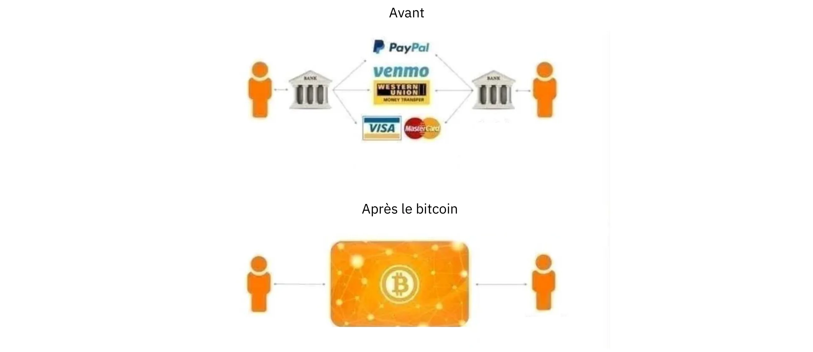

हैंके, एस. एच., और क्रुस, एन. (2013). *विश्व हाइपरइन्फ्लेशन*. आर. पार्कर और आर. व्हापल्स (सं.), द हैंडबुक ऑफ मेजर इवेंट्स इन इकोनॉमिक हिस्ट्री में. रूटलेज पब्लिशिंग. से प्राप्त: https://ssrn.com/abstract=2130109

फिएट करेंसी (सरकारी मुद्रा) का गिरना कोई इतिहास की गलती नहीं है; यह एक ऐसा पैटर्न है जो बार-बार दोहराता है। आज, Bitcoin एक रास्ता देता है: सरकारी नियंत्रण वाली मौद्रिक प्रणालियों से बाहर निकलकर अपनी संपत्ति को सुरक्षित रखने का एक अनोखा मौका। अब सवाल यह नहीं कि क्या एक और संकट आएगा, बल्कि यह कि वह कब आएगा। Bitcoin के साथ, आपके पास अब इन विनाशकारी चक्रों से बाहर निकलने और पारदर्शिता, पूर्वानुमेयता और व्यक्तिगत संप्रभुता पर आधारित एक मौद्रिक प्रणाली चुनने का विकल्प है।

### राज्य नियंत्रण और अन्याय के खिलाफ एक जवाब

दुनिया भर में बढ़ती आर्थिक असमानता हमेशा से सामाजिक अशांति और राजनीतिक चरमपंथ के उभार के लिए उपजाऊ ज़मीन रही है। इतिहास बताता है कि जब अमीर और गरीब के बीच की खाई बहुत ज़्यादा चौड़ी हो जाती है, तो यह अक्सर तनाव, संकट और यहाँ तक कि तानाशाही शासन के उदय का कारण बनती है। इन खतरों के सामने, अपनी वित्तीय आज़ादी की रक्षा करना कोई विलासिता नहीं है; यह उन सभी के लिए एक ज़रूरत है जो अपनी स्वायत्तता बनाए रखना और अपने परिवार के भविष्य को सुरक्षित करना चाहते हैं।

लेकिन एक ऐसी दुनिया में जहां सरकार संपत्ति और लेन-देन पर पूरा नियंत्रण रख सकती है, आपकी बचत को सुरक्षित रखने के लिए वास्तव में क्या विकल्प बचते हैं?

- बैंक खाते** पल भर में फ्रीज़ किए जा सकते हैं, एक साधारण सरकारी आदेश से ज़ब्त हो सकते हैं, या ज़्यादा मौद्रिक पाबंदियों के ज़रिए खाली किए जा सकते हैं।

- सोना**, हालांकि हज़ारों सालों से मूल्य संचय का साधन रहा है, लेकिन यह Hard से विभाजित होता है, ले जाने में असुविधाजनक है, और आपातकालीन संकट की स्थितियों में इस्तेमाल के लिए अव्यावहारिक है।

- कैश**, हालांकि गुमनाम है, लेकिन भारी-भरकम होता है, ज़ब्त करने में आसान है, और महंगाई की वजह से इसकी कीमत लगातार गिरती जाती है।

लेकिन Bitcoin सिर्फ एक प्रैक्टिकल टूल से कहीं ज्यादा है। यह **एक शांतिपूर्ण विरोध** भी है; एक ऐसी फाइनेंशियल सिस्टम से आज़ादी का ऐलान जो मनमानी ताकत, केंद्रीकरण और सिस्टमैटिक असमानता पर टिकी है। Bitcoin को चुनने का मतलब है हेराफेरी, मूल्य गिराने और निगरानी को ठुकराना। यह आपकी **संप्रभुता** वापस लेने, अपने भविष्य को सुरक्षित करने और अपनी दौलत पर खुद का कंट्रोल रखने के अधिकार की रक्षा करने की बात है।

इस नज़रिए से, Bitcoin सिर्फ टेक्नोलॉजी नहीं है। यह प्राकृतिक नियम का एक औज़ार है, एक तरीका है जिससे लोग अपने मौलिक अधिकारों को माँग सकते हैं, तब भी जब देश के कानून उन अधिकारों को नकार देते हैं। यह लोगों को ताकत वापस देता है, क्रांति के ज़रिए नहीं, बल्कि कोड के ज़रिए।

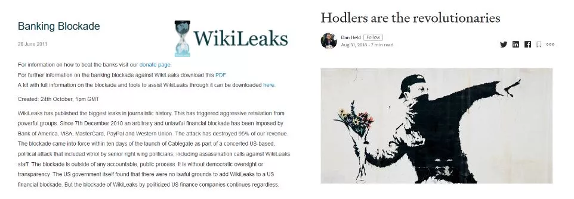

**क्या आप जानते हैं**? Bitcoin छद्मनामी है, गुमनाम नहीं। उपयोगकर्ता Wallet पते बना सकते हैं बिना अपनी असली पहचान उजागर किए, जिससे वे पारंपरिक बैंकिंग प्रणाली से बाहर धन भेज और प्राप्त कर सकते हैं।

हालांकि, आम धारणा के विपरीत, Bitcoin पूरी तरह से गुमनामी नहीं देता। हर लेन-देन Ledger (जिसे Blockchain कहा जाता है) पर दर्ज होता है, जिसे कोई भी एक्सेस और वेरिफाई कर सकता है। भले ही Wallet एड्रेस नामों से न जुड़े हों, लेकिन अगर सही प्राइवेसी प्रैक्टिस न अपनाई जाए तो यूजर की फाइनेंशियल एक्टिविटी को ट्रेस और एनालाइज किया जा सकता है।

### मुद्रा और बैंकिंग भ्रष्टाचार का समाधान

केंद्रीय बैंक, अपनी विस्तारवादी मौद्रिक नीतियों के जरिए, लगातार आपकी क्रय शक्ति को कम कर रहे हैं। मुद्रास्फीति और अत्यधिक मुद्रा छपाई (जिसे अक्सर मात्रात्मक सहजता या Quantitative Easing के नाम से छुपाया जाता है) के माध्यम से वे धीरे-धीरे चलन में मौजूद मुद्रा के मूल्य को पतला कर देते हैं। यह एक अदृश्य कर की तरह काम करता है जो साल दर साल उन लोगों की संपत्ति को कम करता रहता है जो सरकारी मुद्रा में बचत करते हैं।

आम धारणा के उलट कि मुद्रास्फीति एक प्राकृतिक आर्थिक घटना है, यह असल में एक मौद्रिक नियंत्रण उपकरण है; जो आम जनता को धीरे-धीरे गरीब बनाता है, जबकि वित्तीय संपत्ति रखने वालों को फायदा पहुँचाता है।

अगर आपकी दौलत गैर-मौद्रिक संपत्तियों (जैसे रियल एस्टेट, बॉन्ड्स, या स्टॉक्स) में सुरक्षित नहीं है, तो समय के साथ आपकी बचत का मूल्य निश्चित रूप से कम हो जाएगा। वहीं, वित्तीय साधनों तक पहुंच रखने वाले लोग अपनी दौलत बढ़ाते रहते हैं, जिससे आर्थिक अभिजात वर्ग और समाज के बाकी लोगों के बीच की खाई और चौड़ी होती जाती है।

यह सिस्टम में कोई खराबी नहीं है; यह एक जानबूझकर बनाया गया तरीका है। सेंट्रल बैंक और सरकारें इसका इस्तेमाल करके कृत्रिम तरीके से आर्थिक विकास को बढ़ावा देती हैं और लोगों को लगातार खर्च करने और कर्ज बढ़ाने की तरफ धकेलती हैं।

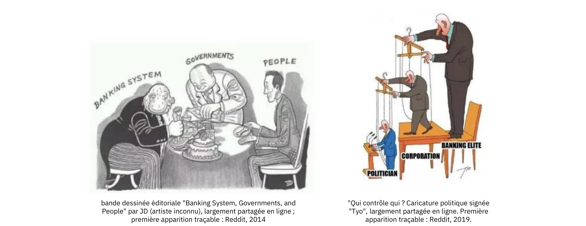

हमारी आधुनिक वित्तीय प्रणाली कर्ज़ के एक चक्र पर बनी है; जहाँ उधार लेना सिर्फ़ प्रोत्साहित नहीं किया जाता, बल्कि व्यावहारिक रूप से अनिवार्य होता है। लोग अपनी जीवनशैली बनाए रखने के लिए कर्ज़ लेते हैं, और फिर खुद को एक ऐसी प्रणाली में फँसा पाते हैं जहाँ उन्हें बैंकों को ब्याज चुकाना पड़ता है - वही बैंक जो हवा से पैसा बनाते हैं। यह कोई संयोग नहीं है; यह एक ढाँचागत डिज़ाइन है जिसका मकसद आम नागरिकों की कीमत पर वित्तीय संस्थानों को फ़ायदा पहुँचाना है।

सिस्टम सेंट्रल बैंक के प्रभाव और मौद्रिक Supply को मनमाने ढंग से नियंत्रित करने की उनकी अनियंत्रित शक्ति से भ्रष्ट हो चुका है। **Bitcoin ही विकल्प है।**

फिएट करेंसी के उलट, Bitcoin सहमति से लागू किए गए नियमों से चलता है। इसकी Supply की अधिकतम सीमा तय है; कभी भी 21 मिलियन बिटकॉइन से ज्यादा नहीं होंगे (असल में, इश्यू के तरीके की वजह से थोड़े कम)। कोई सरकार, सेंट्रल बैंक या एकल आर्थिक संस्था इस लिमिट को बदल नहीं सकती।

इसका मतलब है कि Bitcoin एक अनुमानित मौद्रिक ढांचे के तहत काम करता है; जहाँ मुद्रास्फीति न सिर्फ पारदर्शी है, बल्कि डिज़ाइन किया गया है कि जब आखिरी Bitcoin माइन हो जाएगा तो यह पूरी तरह खत्म हो जाएगी।

पहले के समय में, सोना बेलगाम मुद्रा विस्तार पर एक अंकुश का काम करता था। लेकिन 1971 में गोल्ड स्टैंडर्ड के खत्म होने के बाद से, कोई भी राष्ट्रीय मुद्रा (चाहे डॉलर हो, यूरो हो या येन) किसी ठोस संपत्ति से समर्थित नहीं रही। यह अलगाव केंद्रीय बैंकों को बिना किसी रोक-टोक के पैसा छापने की खुली छूट देता है, जिससे दशकों तक जोरदार मौद्रिक विस्तार, बार-बार एसेट बबल और बार-बार आने वाले वित्तीय संकटों का रास्ता साफ हुआ।

जब आप बैंक में पैसा जमा करते हैं, तो वह असल में आपका नहीं रह जाता।

ज़्यादातर लोगों को यह पता नहीं होता: बैंक अकाउंट में रखा पैसा तकनीकी तौर पर आपकी संपत्ति नहीं होता। कानूनी और व्यावहारिक रूप से, यह एक कर्ज़ होता है जो आप बैंक को दे रहे होते हैं; जिसे बैंक अपने कामकाज और निवेश के लिए आज़ादी से इस्तेमाल कर सकता है।

यह सिस्टम फाइनेंशियल इंस्टीट्यूशंस पर अंधे भरोसे पर बना है, लेकिन इसमें गंभीर खतरे हैं:

- अगर तुम्हारा बैंक डूब गया, तो तुम्हारा पैसा भी डूब सकता है।** डिपॉजिट इंश्योरेंस स्कीम होने के बावजूद, इतिहास बताता है कि सिस्टमैटिक क्राइसिस के दौरान ये गारंटी भी फेल हो सकती है।
- अगर आपका बैंक आपके पैसों तक पहुंच रोक दे, तो आप अपने खुद के पैसे निकाल या इस्तेमाल नहीं कर पाएंगे**। ये पहले कई बार हो चुका है; जैसे ग्रीस, लेबनान और अर्जेंटीना के आर्थिक संकट के दौरान, या कनाडा में ट्रकर विरोध प्रदर्शन जैसे राजनीतिक दमन के समय।

Bitcoin एक बिल्कुल अलग तरीका पेश करता है; खुला, निष्पक्ष और भ्रष्टाचार से मुक्त। इसके नियम सर्वसम्मति से तय किए गए हैं और नेटवर्क के सभी सदस्यों पर समान रूप से लागू होते हैं।

यहीं पर मूल सिद्धांत आता है:

**"तुम्हारी चाबी नहीं, तुम्हारा Bitcoin नहीं।"**  

(Note: "Bitcoin" is kept as is since it appears to be a model or code name. The phrase is a direct and colloquial Hindi translation of the original, maintaining the same tone and structure.)

अगर आपके बिटकॉइन की प्राइवेट कीज़ पर आपका कंट्रोल नहीं है, तो आप असल में उनके मालिक नहीं हैं। वो किसी तीसरे पार्टी के हाथ में हैं; जैसे बैंक में रखी हुई फिएट करेंसी। लेकिन अगर आप अपनी प्राइवेट कीज़ खुद रखते हैं, तो आप और सिर्फ आप अपने फंड्स पर पूरा कंट्रोल रखते हैं। कोई संस्था, कोई सरकार, कोई अथॉरिटी आपके एक्सेस को फ्रीज़, जब्त या रिस्ट्रिक्ट नहीं कर सकती।

यही वो चीज़ है जो Bitcoin को पारंपरिक वित्तीय प्रणाली की कमज़ोरियों और ज़्यादती के मुकाबले एक ताकतवर विकल्प बनाती है: मौद्रिक संप्रभुता।

### जीडब्ल्यू-203: एक राजनीतिक आंदोलन?

Bitcoin व्यक्तियों और वित्तीय संस्थानों के बीच ताकत के संतुलन को नया आकार देता है। यह किसी को भी अपने पैसे पर पूरा नियंत्रण रखने, अपनी बचत को महंगाई से बचाने और सरकारों द्वारा लगाए गए मौद्रिक प्रतिबंधों से मुक्त होने का अधिकार देता है। एक खुली और सीमारहित प्रणाली के रूप में, Bitcoin एक न्यायसंगत विकल्प प्रदान करता है; जो सभी के लिए सुलभ है, चाहे सामाजिक स्थिति, राष्ट्रीयता या मूल कुछ भी हो।

Bitcoin को अपनाना साउंड मनी (स्वस्थ मुद्रा) को चुनना है। यह मौजूदा वित्तीय प्रणाली के मुद्रास्फीति और कर्ज़ से चलने वाले तंत्र में सिर्फ एक और पहिया बने रहने से इनकार है। यह व्यक्तिगत संप्रभुता का कदम है और मौद्रिक भ्रष्टाचार तथा धन के क्षरण के खिलाफ शांतिपूर्ण प्रतिरोध है।

बिटकॉइनर्स हर तरह के लोगों में से आते हैं, फिर भी उनकी एक साझी दृष्टि है: एक ऐसी दुनिया जहाँ मौद्रिक संप्रभुता संस्थाओं के बजाय व्यक्तियों के हाथों में हो। इनमें शामिल हैं:

- साइफरपंक्स**, जो गोपनीयता का समर्थन करते हैं और निगरानी का विरोध करते हैं;
- दबाए हुए नागरिक**, अधिनायकवादी शासन और पूंजी नियंत्रण से शरण चाहने वाले;
- अराजकतावादी**, जो Bitcoin को राज्य नियंत्रण से मुक्ति का एक साधन मानते हैं;
- ऑस्ट्रियन इकोनॉमिस्ट्स**, सॉउंड मनी और सरकारी हस्तक्षेप से आज़ादी की वकालत करते हैं;
- इंजीनियर, वित्तीय विशेषज्ञ, और अभिव्यक्ति की स्वतंत्रता के समर्थक**, जो इस नए मौद्रिक प्रतिमान के गहरे सामाजिक प्रभावों को पहचानते हैं।

Bitcoin को डिज़ाइन से ही राजनीतिक और विचारधारात्मक विभाजनों से परे बनाया गया है। यह न तो वामपंथी है न दक्षिणपंथी, न ही स्वतंत्रतावादी या सामूहिकतावादी। यह एक तटस्थ प्रोटोकॉल है, जिसे नियमों (शासकों नहीं) द्वारा संचालित किया जाता है जो सभी पर समान रूप से लागू होते हैं। फिर भी, इसका मात्र अस्तित्व वैश्विक वित्तीय स्थिति को चुनौती देता है। Bitcoin प्रतिरोध का प्रतीक बन गया है क्योंकि लोगों ने इसे फिएट मुद्राओं और केंद्रीकृत वित्तीय ढांचे के विकल्प के रूप में अपनाया है; ये ऐसी प्रणालियाँ हैं जिन्हें तेजी से अन्यायपूर्ण, हेरफेर योग्य और बहिष्कार करने वाला माना जा रहा है।

Cypherpunk के दिमाग के लिए, Bitcoin सिर्फ एक डिजिटल संपत्ति से कहीं ज्यादा है। यह एक ऐसी दुनिया में गोपनीयता के धीरे-धीरे खत्म होने के खिलाफ खड़ा है, जहां नकदी के गायब होने को अक्सर "सुरक्षा" के बहाने सही ठहराया जाता है।

Bitcoin सेंसरशिप-रोधी, पीयर-टू-पीयर डिजिटल लेनदेन को सक्षम बनाता है; बिना किसी बिचौलिए या गेटकीपर के। जैसा कि Satoshi नाकामोटो ने कल्पना की थी, यह नकदी के डिजिटल समकक्ष प्रदान करता है: Exchange मूल्य को स्वतंत्र रूप से हस्तांतरित करने का एक तरीका, बिना किसी अनुमति के।

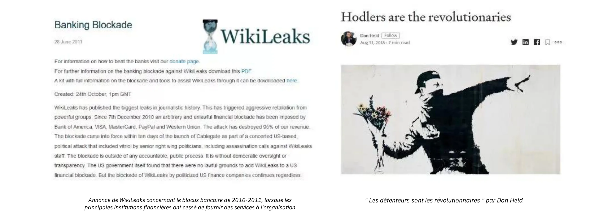

जीडब्ल्यू-213 कोई संगठन या राजनीतिक पार्टी नहीं है, लेकिन इसमें एक शक्तिशाली दार्शनिक संदेश छिपा है। यह व्यक्ति और राज्य के बीच के रिश्ते को नए सिरे से परिभाषित करता है, साथ ही केंद्रीय बैंकों के मुद्रा निर्माण और आर्थिक नियंत्रण के एकाधिकार को चुनौती देता है।

चाहे स्वतंत्रता सेनानियों ने अपनाया हो या फिर वे लोग जो सिर्फ अपनी खरीदने की क्षमता को बचाना चाहते हैं, Bitcoin एक नए युग की शुरुआत का प्रतीक है; एक ऐसा युग जहां वित्तीय संप्रभुता एक बुनियादी मानव अधिकार बन जाती है, जो सभी के लिए सुलभ हो।

अब जब हम Satoshi नाकामोटो के आविष्कार के गहरे महत्व को समझ चुके हैं, अगला अध्याय हमें इस प्रोटोकॉल के इर्द-गिर्द बने एक अद्भुत उद्योग में ले जाएगा; एक ऐसा पूरा इकोसिस्टम जो वित्त, प्रौद्योगिकी और समाज को नया आकार दे रहा है।

## Bitcoin उद्योग को समझना

<chapterId>e106c6f1-d75b-5a62-b245-0ea2e4d02ef8</chapterId>

2009 में गुमनाम रचनाकार Satoshi नाकामोतो द्वारा लॉन्च किए जाने के बाद से, Bitcoin ने एक बिल्कुल नए उद्योग के उदय को प्रेरित किया है; जिसकी वर्तमान वैल्यू अरबों डॉलर में है। अपने अपेक्षाकृत छोटे इतिहास के बावजूद, इस इकोसिस्टम ने विस्फोटक वृद्धि का अनुभव किया है, पिछले एक दशक में तेजी से विकसित हुआ है। हर दिन, नए खिलाड़ी (संस्थागत निवेशकों और चुस्त स्टार्टअप्स से लेकर टेक दिग्गजों तक) इस तेजी से फैलते क्षेत्र में अपना दावा जमाने के लिए भारी पूंजी और संसाधन डाल रहे हैं।

आज, Bitcoin एक ऐसे नाज़ुक मोड़ पर पहुँच गया है जहाँ से वापसी नहीं है। सरकारें, केंद्रीय बैंक, फिनटेक कंपनियाँ और पारंपरिक वित्तीय संस्थान अब इसे नज़रअंदाज़ नहीं कर सकते। चाहे वो नियमन के ज़रिए हो, सतर्कता से अपनाने के ज़रिए हो, या फिर सीधे टकराव के ज़रिए—अब सभी को Bitcoin के वैश्विक अर्थव्यवस्था पर पड़ने वाले अनिवार्य प्रभाव का एहसास हो चुका है।

### एक वैश्विक उद्योग का जन्म

Bitcoin एक क्रांतिकारी अविष्कार है, जैसे शून्य से सीधे एक पर पहुंच जाना। यह पुराने पैसे के सिस्टम से पूरी तरह अलग है। कुछ लोगों के लिए, यह एक खतरा है; उनकी सत्ता और विशेषाधिकारों के लिए चुनौती। उनके लिए, Bitcoin एक पैंडोरा का बॉक्स है जिसे कभी नहीं खोलना चाहिए था, और वे इसे रोकने के लिए हर संभव तरीका अपनाएंगे।

हालांकि, कुछ लोग Bitcoin को एक पीढ़ी में एक बार मिलने वाला अवसर मानते हैं: व्यक्तिगत स्वतंत्रता का साधन, वैश्विक वित्तीय प्रणाली को बदलने वाला उत्प्रेरक, और एक अधिक पारदर्शी व न्यायसंगत विकल्प का रास्ता। ये वो निर्माता, अपनाने वाले और योगदानकर्ता हैं (वो लोग जो भविष्य को आकार दे रहे हैं)।

**Bitcoin** खुद ही निष्पक्ष रहता है। यह इजाज़त नहीं माँगता। यह मंज़ूरी नहीं पूछता।

**वो बस है।**  

(Note: The translation captures the simplicity and existential tone of the original phrase in a natural, colloquial Hindi way.)

इस अध्याय में, हम Bitcoin उद्योग को आगे बढ़ाने वाले प्रमुख खिलाड़ियों के बारे में जानेंगे। इस बढ़ते हुए इकोसिस्टम की गतिशीलता को समझने और इसके अवसरों व चुनौतियों को बेहतर तरीके से नेविगेट करने के लिए उनकी भूमिकाओं, प्रेरणाओं और आपसी संवाद को समझना ज़रूरी है।

### ऑल्टकॉइन्स का बढ़ता प्रसार

तकनीकी तौर पर बात करें तो, एक नया क्रिप्टोकरेंसी बनाना बेहद आसान है; इसमें बस कुछ मिनट लगते हैं और कोई खास नवाचार की ज़रूरत नहीं होती। असली चुनौती बनाने में नहीं, बल्कि उसकी वैल्यू में होती है। और डिजिटल एसेट्स की दुनिया में वैल्यू पूरी तरह से मार्केट द्वारा तय होती है; यूजर्स के विश्वास और डिमांड से।

दिसंबर 2019 में, CoinMarketCap पर सिर्फ 5,000 टोकन्स लिस्टेड थे। 2025 तक, ये संख्या लाखों में पहुँच गई है - NFTs, डिसेंट्रलाइज्ड फाइनेंस (DeFi), और ढेरों दूसरे ऐप्लिकेशन्स (कुछ वैध, बहुत से संदिग्ध) की बदौलत। ये टोकन्स हर रूप में मौजूद हैं: कुछ खुद को करेंसी बताते हैं, कुछ सिक्योरिटीज़ की तरह काम करते हैं, प्लेटफॉर्म यूटिलिटीज़, साइडचेन्स, या फिर डिजिटल आर्ट के टोकनाइज्ड वर्ज़न।

लेकिन साफ-साफ कहें तो: **ये क्रिप्टोकरेंसीज़ में से ज़्यादातर बस घोटाले हैं।**

चमकदार टेक्नोलॉजी और आकर्षक ब्रांडिंग के पर्दे के पीछे, इनमें से कई प्रोजेक्ट्स आक्रामक मार्केटिंग रणनीतियों से चलते हैं जिनका एक ही मकसद होता है — **आपका Bitcoin निचोड़ लेना**। ये निवेशकों के लालच और अज्ञानता का फायदा उठाते हैं, क्रांतिकारी टेक या गारंटीड रिटर्न के बारे में मनमोहक कहानियाँ गढ़ते हैं; ऐसे दावे जो ज्यादातर जांच-पड़ताल में खरे नहीं उतरते।

बिल्कुल, इस शोरगुल भरे समंदर में, कुछ चुनिंदा प्रोजेक्ट्स सच में नई सीमाएँ तोड़ने की कोशिश करते हैं। कुछ असली तकनीकी चुनौतियों (जैसे स्केलेबिलिटी, प्राइवेसी, प्रोग्रामेबिलिटी) को हल करने पर ध्यान देते हैं और शायद पूरे क्षेत्र के लिए कुछ बहुमूल्य विचार दे जाएँ। समय के साथ, इनमें से कुछ प्रयोग उपयोगी नवाचारों का रास्ता खोल सकते हैं।

लेकिन मूल सवाल यही बना हुआ है:

**क्या ये नवाचार Bitcoin के बाहर भी फल-फूल सकते हैं?**

अब तक, एक सच साफ दिखता है: Bitcoin ही एकमात्र ऐसी वास्तविक डिसेंट्रलाइज्ड, सेंसरशिप-रजिस्टेंट डिजिटल करेंसी है, जो एक ग्लोबल नेटवर्क और बढ़ते अपनाव से समर्थित है। दूसरे ऑल्टकॉइन्स के विपरीत, Bitcoin किसी केंद्रीकृत कंपनी के सहारे नहीं चलती, न ही कुछ डेवलपर्स और शुरुआती निवेशकों द्वारा नियंत्रित होती है। यही एकमात्र प्रोजेक्ट है जिसने हजारों घंटों की रिसर्च, डेवलपमेंट और लगातार सुधार की मेहनत का वजन कमाया है।

| Feature               | Bitcoin                  | Altcoins (99.9% of them)       |
| ---------------------|--------------------------|--------------------------------|
| **Liquidity**         | High                     | Low                            |
| **Adoption (Real-World)** | Global and growing       | Very limited                   |
| **Team**              | Decentralized and robust | Centralized and opaque         |
| **Reputation**        | Strong and globally recognized        | Varies, often questionable     |
| **Infrastructure**    | Stable and secure        | Unstable and vulnerable        |
| **Decentralization**  | Yes                      | Rarely                         |
| **Scam Risk**             | No                       | Very likely                    |
| **Real utility?**     | Yes                      | Debatable                      |

**गुमराह करने वाले दावों से सावधान रहें जैसे कि:**

- "जीडब्ल्यू-227, जीडब्ल्यू-228 नहीं"
- "XRP अगला Bitcoin है"  

(Note: Since "Bitcoin" appears to be a code/ticker name without a direct Hindi equivalent, it has been kept as-is in the translation for accuracy.)
- "लाइब्रे, Bitcoin की जगह लेगा"
- "मेरा प्रोजेक्ट Bitcoin का बेहतर वर्जन है"
- "सेंट्रल बैंक डिजिटल करेंसीज़ Bitcoin को बेकार कर देंगी"

किसी भी Altcoin में अपना समय या संसाधन निवेश करने से पहले, खुद अपनी रिसर्च कर लो क्योंकि हम यहां उसके लिए नहीं हैं।

**हम यहाँ सिर्फ Bitcoin और सिर्फ Bitcoin को कवर करने आए हैं।**

### प्रमुख संस्थाओं द्वारा अपनाया गया

2017 के ICO बूम के बाद, संस्थानों ने Blockchain में गंभीर रुचि दिखानी शुरू कर दी; लेकिन अक्सर यह समझे बिना कि वास्तव में इसे क्रांतिकारी क्या बनाता है। अब केंद्रीय बैंक और सरकारें सेंट्रल बैंक डिजिटल करेंसी (CBDC) पर शोध कर रही हैं, ताकि वित्तीय बुनियादी ढांचे को आधुनिक बनाया जा सके और साथ ही उपयोगकर्ता लेनदेन पर पूरा नियंत्रण बनाए रखा जा सके। स्वीडन, यूरोपीय संघ, रूस और चीन जैसे देशों में पहले से ही इस तरह की परियोजनाएं चल रही हैं।

टेक दिग्गज भी इस रेस में कूद पड़े हैं। फेसबुक (अब मेटा) ने अपनी स्टेबलकॉइन पहल, लिब्रा शुरू की, जिसका मकसद फिएट करेंसी के एक बास्केट द्वारा समर्थित एक डिजिटल करेंसी बनाना था। लेकिन प्रोजेक्ट को तुरंत रेगुलेटरी विरोध का सामना करना पड़ा और आखिरकार इसे छोड़ दिया गया।

| Feature                    | Bitcoin | Altcoins | Facebook-Coin | FedCoin |
|---------------------------|---------|----------|---------------|---------|
| **Public**                | Yes     | Varies   | No            | No      |
| **Open**                  | Yes     | Varies   | No            | No      |
| **Borderless**            | Yes     | Varies   | No            | No      |
| **Neutral**               | Yes     | Varies   | No            | No      |
| **Censorship-resistant**  | Yes     | Varies   | No            | No      |

भले ही इन पहलों का मार्केटिंग धमाकेदार हो, लेकिन ये Bitcoin से टक्कर नहीं ले सकतीं; ये उसकी भाषा की नकल तो करती हैं, मगर उसके मूल सिद्धांतों को ठुकरा देती हैं। ये आज़ादी के लिए नहीं, बल्कि अनुपालन के लिए बनाई गई हैं। ये निजता की सुरक्षा के बजाय निगरानी बढ़ाने के लिए डिज़ाइन की गई हैं। ये नियंत्रण को और मज़बूत करती हैं, बजाय इसे बांटने के।

फेसबुक का लिब्रा कभी भी मौजूदा व्यवस्था को चुनौती देने के लिए नहीं बना था; यह सिस्टम के साथ काम करने के लिए डिज़ाइन किया गया था। इसके उलट, Bitcoin पूरी तरह से उस सिस्टम से बाहर मौजूद है। यह किसी की इजाज़त नहीं माँगता। यह किसी भरोसे पर निर्भर नहीं करता। और यह एक दशक से भी ज़्यादा समय से बिना किसी नेता, डाउनटाइम या केंद्रीय नियंत्रण के बिना बिल्कुल सही चल रहा है।

### नियमन और सरकारी दृष्टिकोण

Bitcoin, अपने स्वभाव से ही, पारंपरिक ढांचों से बाहर काम करता है। यह किसी केंद्रीय प्राधिकरण पर निर्भर नहीं करता और न ही किसी एक इकाई द्वारा इसे नियंत्रित या बदला जा सकता है। लेकिन हालांकि प्रोटोकॉल खुद विनियमन से मुक्त है, इसके साथ इंटरैक्ट करने वाले प्रतिभागी (एक्सचेंजेस, बिज़नेसेस और यूज़र्स) अभी भी राष्ट्रीय कानूनों के अधीन हैं।

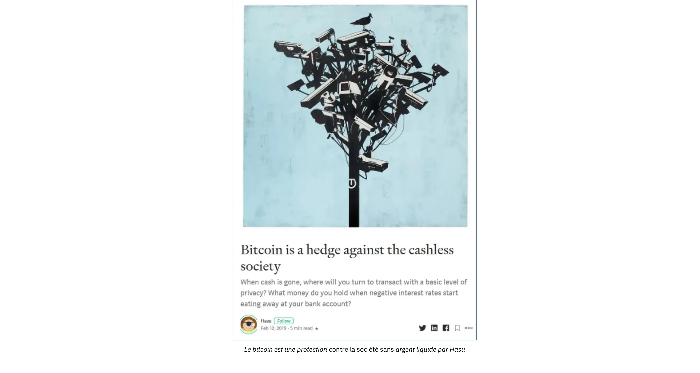

चूंकि Bitcoin एक वैश्विक नेटवर्क है, इसलिए अलग-अलग देशों ने इस पर बिल्कुल अलग-अलग तरीकों से प्रतिक्रिया दी है:

- कुछ देश भारी पाबंदियाँ लगाते हैं**, जैसे कि चीन, जो इसके इस्तेमाल को रोकने की कोशिश करता है लेकिन कभी पूरी तरह से रोक नहीं पाता।

- कुछ अन्य देश, जैसे स्विट्ज़रलैंड या कनाडा, अधिक स्वागतपूर्ण माहौल प्रदान करते हैं**, Bitcoin को एक खतरे के बजाय एक अवसर के रूप में देखते हैं।

- ज़्यादातर अभी भी अनिर्णय की स्थिति में हैं**, नियमों के साथ प्रयोग कर रहे हैं और नवाचार व निगरानी के बीच संतुलन बनाने की कोशिश कर रहे हैं।

सरकारें और संस्थाएं अक्सर Bitcoin को सही तरीके से वर्गीकृत करने में संघर्ष करती हैं (क्या यह पैसा है, संपत्ति है, या कुछ बिल्कुल नया?)। इसका नतीजा यह होता है कि नियम अक्सर प्रतिक्रियात्मक, असंगत और लगातार बदलते रहते हैं। अगर आप Bitcoin से जुड़े हैं, तो अपने स्थानीय नियमों के बारे में जागरूक रहना बेहद जरूरी है; खासकर जब बात टैक्स, बैंकिंग सुविधाओं और अनुपालन नियमों की हो।

### बैंकों का Bitcoin पर रुख

पारंपरिक वित्तीय प्रणाली के मुख्य आधार होने के नाते, बैंक Bitcoin को अपने आर्थिक मॉडल के लिए सीधा खतरा मानते हैं, जो वित्तीय प्रवाह के बिचौलियेपन और नियंत्रण पर केंद्रित है। यही वजह है कि दुनिया भर के कई बैंकों ने Bitcoin का इस्तेमाल करने वाले व्यवसायों और व्यक्तियों पर पाबंदियां लगा दी हैं। कुछ तो क्रिप्टोकरेंसी क्षेत्र में काम करने वाली कंपनियों के खाते बंद कर देते हैं या सेवाओं तक पहुंच सीमित कर देते हैं, जिसके पीछे अक्सर मनी लॉन्ड्रिंग रोकथाम (AML) और आतंकवादी वित्तपोषण (CTF) से जुड़ी चिंताएं बताई जाती हैं।

हालांकि, Bitcoin को एक प्रतिद्वंद्वी के रूप में देखा जाता है, लेकिन इनमें से कई बैंक Blockchain के रिसर्च और डेवलपमेंट में सक्रिय रूप से निवेश कर रहे हैं। वे Bitcoin के नवाचारों का फायदा उठाने की कोशिश कर रहे हैं, बिना अपना नियंत्रण छोड़े। उन्हें समझ आता है कि Blockchain में बड़ी संभावनाएं हैं, लेकिन वे चाहते हैं कि इसे अपने मौजूदा ढांचे में कैसे शामिल किया जाए, बजाय इसके कि Bitcoin के विकेंद्रीकृत, खुले मॉडल को अपनाया जाए।

### क्रिप्टोकरेंसी एक्सचेंज और जीडब्ल्यू-246 कस्टडी

एक्सचेंज Bitcoin इकोसिस्टम में एक अहम भूमिका निभाते हैं, जो फिएट करेंसी और Bitcoin के बीच पुल का काम करते हैं। ये यूजर्स को Bitcoin खरीदने, बेचने और कभी-कभी दूसरे डिजिटल एसेट्स के साथ ट्रेड करने की सुविधा देते हैं। लेकिन, सभी एक्सचेंज एक जैसे नहीं होते, और जरूरी है कि आप अपनी जरूरतों के मुताबिक सही एक्सचेंज चुनें जोखिम को कम करते हुए। Exchange का इस्तेमाल करने से पहले ये मुख्य बातें ध्यान में रखें:

- एक मजबूत और सुरक्षित होने की प्रतिष्ठा ;
- पर्याप्त तरलता ताकि बिना अत्यधिक मूल्य उतार-चढ़ाव के तेजी से ट्रेडिंग सुनिश्चित हो सके;
- जवाबदेह और कुशल ग्राहक सेवा;
- एक यूजर-फ्रेंडली Interface जो लेन-देन को आसानी से नेविगेट करने में मदद करता है;
- एक विकल्प स्वचालित आवर्ती खरीदारी (ARP) के लिए;
- आसान, मुफ्त में बिटकॉइन को अपने निजी Wallet में निकालें।

जो एक्सचेंज स्थानीय नियमों का पालन करते हैं, उन्हें आमतौर पर सख्त **"नो योर कस्टमर"** (KYC) प्रोटोकॉल का पालन करना पड़ता है, जिसमें यूजर्स को सेवाओं का उपयोग करने से पहले पहचान दस्तावेज़ प्रदान करने होते हैं। हालांकि ये प्रक्रियाएं अवैध गतिविधियों को रोकने के लिए बनाई गई हैं, लेकिन ये Bitcoin द्वारा दी जाने वाली निजता को प्रभावित कर सकती हैं।

KYC प्लेटफॉर्म सुरक्षा के बहाने आपकी निजी जानकारी इकट्ठा करते हैं। यह डेटा सरकारों द्वारा आपके वित्तीय लेन-देन पर नज़र रखने और कुछ ऑपरेशन्स तक आपकी पहुंच को रोकने के लिए इस्तेमाल किया जा सकता है।

हालांकि, KYC के बिना भी बिटकॉइन हासिल करने के कुछ विकल्प मौजूद हैं:

- P2P खरीदने के प्लेटफॉर्म जैसे कि Bisq, Robosat, LNP2PBot, Peach, HODL HODL, वगैरह।
- सीधे नकद खरीदारी, जैसे कि स्थानीय Bitcoin मीटअप्स में;
- KYC के बिना विनियमित खरीद प्लेटफॉर्म, जो दुर्लभ हैं लेकिन कुछ देशों में उपलब्ध हैं।
- जीडब्ल्यू-255 एटीएम;
- Exchange में बिटकॉइन के लिए काम कर रहा हूँ;
- जीडब्ल्यू-257 बिटकॉइन्स।

कई तरह के प्लेटफॉर्म होते हैं, हर एक का अपना खास इस्तेमाल होता है:

- पीयर-टू-पीयर Exchange प्लेटफॉर्म्स (P2P)**

ये प्लेटफॉर्म यूजर्स को बिना किसी सेंट्रलाइज्ड बिचौलिए के सीधे एक-दूसरे से बिटकॉइन खरीदने और बेचने की सुविधा देते हैं। इनमें ज्यादा प्राइवेसी होती है, खासकर क्योंकि ये KYC के बिना चलते हैं। आप लोकल सेलर्स ढूंढ सकते हैं जिनके साथ आप आमने-सामने लेन-देन कर सकते हैं या फिर ऑनलाइन पेमेंट के तरीके (SEPA, Revolut, Wise, वगैरह) इस्तेमाल कर सकते हैं।

**चेतावनी:** किसी भी शारीरिक लेन-देन के लिए, संभावित घोटालों से बचने के लिए एक सार्वजनिक और सुरक्षित स्थान चुनें।

https://planb.network/tutorials/exchange/peer-to-peer/bisq-v2-c1c6a702-6c16-4101-8b90-62c424017b80

https://planb.network/tutorials/exchange/peer-to-peer/hodlhodl-d7344cd5-6b18-40f5-8e78-2574a93a3879

https://planb.network/tutorials/exchange/peer-to-peer/lnp2pbot-v2-e6bcb210-610b-487d-970c-7cce85273e3c

https://planb.network/tutorials/exchange/peer-to-peer/peach-c6143241-d900-4047-9b73-1caba5e1f874

https://planb.network/tutorials/exchange/peer-to-peer/robosats-b60e4f7c-533a-4295-9f6d-5368152e8c06

- जीडब्ल्यू-261-केवल जीडब्ल्यू-260 प्लेटफॉर्म्स**

ये प्लेटफॉर्म यूजर-फ्रेंडली तरीके से काम करते हैं, जो एक सरल और पारदर्शी सेवा प्रदान करते हैं। ये सिर्फ Bitcoin के लिए हैं। ये अक्सर डॉलर-कॉस्ट एवरेजिंग (DCA) के जरिए बिटकॉइन खरीदने के समाधान पेश करते हैं और व्यक्तिगत Wallet पर ऑटोमैटिक निकासी की सुविधा देते हैं। ये खासकर शुरुआती लोगों के लिए बेहतर हैं जो बिटकॉइन को धीरे-धीरे और सुरक्षित तरीके से जमा करना चाहते हैं। उदाहरण: रिलाई, बुल Bitcoin, स्टैकिनसैट, बिटस्टैक...

https://planb.network/tutorials/exchange/centralized/bitstack-29fd71be-9570-42c6-8f6f-cd355d62e746

https://planb.network/tutorials/exchange/centralized/bull-bitcoin-europe-0ccf713e-efcd-44ec-8205-211f49ac7d53

https://planb.network/tutorials/exchange/centralized/relai-v2-30a9671d-e407-459d-9203-4c3eae15b30e

https://planb.network/tutorials/exchange/centralized/stackinsat-5af6a380-f3c6-4246-9f81-9957a16ab066

- **सामान्य-उपयोग या व्यापार-उन्मुख Exchange प्लेटफॉर्म**  

(Note: I've kept "Exchange" as is since it appears to be a model/code name. The translation maintains the original formatting with bold and line breaks.)

ये प्लेटफॉर्म्स सिर्फ Bitcoin खरीदने से आगे बढ़कर एडवांस्ड फीचर्स ऑफर करते हैं, जैसे लीवरेज और डेरिवेटिव्स। हालाँकि, हम ट्रेडिंग करने की सख्त मना करते हैं। इसके बजाय, हमारी सलाह है कि आप Bitcoin खरीदें और इसे अपने खुद के Wallet में ट्रांसफर करें। ट्रेडिंग एक हाई-रिस्क एक्टिविटी है और आमतौर पर उन लोगों के लिए सूटेबल नहीं है जो लॉन्ग-टर्म एक्यूमुलेशन पर फोकस करते हैं। ट्रेडिंग के खेल से दूर रहना अक्सर समझदारी भरा रास्ता होता है।

https://planb.network/tutorials/exchange/centralized/bitfinex-dc306d39-bd96-4ab9-a278-a322316716db

https://planb.network/tutorials/exchange/centralized/bitstamp-5a36c896-bff5-46d7-b505-ff069c3ac47c

https://planb.network/tutorials/exchange/centralized/kraken-1ef03e25-9b42-49bd-a47d-249e1a13cfc6

https://planb.network/tutorials/exchange/centralized/paymium-92603f76-b985-49ce-81e5-f4fa0df776e5

**Exchange प्लेटफॉर्म सुरक्षित वॉलेट नहीं हैं**। अपने बिटकॉइन Exchange पर छोड़ने से आपको बड़ा जोखिम होता है। कई स्थितियों में आपके फंड के खोने का खतरा हो सकता है:

- हैकिंग**: कई बिटकॉइन हैक की गई प्लेटफॉर्म्स (जैसे MtGox) से चोरी हो चुके हैं;
- सरकारी जब्ती**: सरकार किसी प्लेटफॉर्म को बंद कर सकती है और उसके यूजर्स के फंड फ्रीज कर सकती है;
- **दिवालियापन या धोखाधड़ी**: कई प्लेटफॉर्म अपने ग्राहकों का पैसा लेकर गायब हो गए हैं (जैसे FTX)।

सुनहरा नियम बहुत आसान है: **अगर आपके पास अपनी प्राइवेट कीज़ नहीं हैं, तो आपके बिटकॉइन वास्तव में आपके नहीं हैं**। अपने पैरों पर पूरा कंट्रोल रखने के लिए जल्द से जल्द अपने फंड्स को अपने निजी जीडब्ल्यू-268 में ट्रांसफर कर लें।

### वॉलेट्स, Mining और विकास: इकोसिस्टम के मुख्य आधार

#### जीडब्ल्यू-270 वॉलेट्स

Ownership और Bitcoin के दिल में है Wallet - एक खास टूल जो आपके बिटकॉइन को एक्सेस और मैनेज करने के लिए ज़रूरी प्राइवेट कीज़ को सुरक्षित रखता है। Wallet कई रूप ले सकता है: एक डेडिकेटेड हार्डवेयर डिवाइस, मोबाइल या डेस्कटॉप ऐप, या फिर एक कागज़ का टुकड़ा जिस पर की लिखी हो। ये वॉलेट आपकी डिजिटल दौलत को असली दुनिया से जोड़ते हैं, जिससे Bitcoin रोज़मर्रा की ज़िंदगी में इस्तेमाल हो सकता है।

Wallet के हर प्रकार में अलग-अलग संतुलन होता है:

- गोपनीयता
- सुरक्षा
- आसान इस्तेमाल
- कीमत

जीडब्ल्यू-275 और जीडब्ल्यू-276 उद्योग को कई श्रेणियों में बांटा गया है, जहां हर एक अलग-अलग जरूरतों और तकनीकी कौशल के स्तर को पूरा करता है:

- **Hardware Wallet निर्माता**: ये कंपनियाँ सुरक्षित कुंजी भंडारण के लिए बने भौतिक उपकरण विकसित करती हैं। कुछ ओपन-सोर्स हैं, जबकि कुछ अलग-अलग सुविधाओं और सुरक्षा स्तरों के साथ मालिकाना समाधान प्रदान करती हैं। इनमें Ledger, ट्रेज़र, कॉइनकाइट, फाउंडेशन और शिफ्टक्रिप्टो जैसे नाम प्रमुख हैं।
- **Software Wallet डेवलपर्स**: इनमें कंपनियों से लेकर स्वतंत्र डेवलपर्स तक शामिल हैं जो मोबाइल और डेस्कटॉप एप्लिकेशन्स बनाते हैं। इनके प्रोडक्ट्स यूजर एक्सपीरियंस, सुरक्षा और फीचर्स में अलग-अलग होते हैं। उदाहरणों में स्पैरो, विजार्ड सार्डिन, गैलॉय, सिनोनिम और ब्लॉकस्ट्रीम शामिल हैं।
- DIY (*खुद करो*) वॉलेट्स**:  
ये ओपन-सोर्स समाधान उन्नत उपयोगकर्ताओं के लिए हैं जो पूरा नियंत्रण और तीसरे पक्ष पर न्यूनतम निर्भरता चाहते हैं। अपना खुद का Wallet बनाने से भरोसे की निर्भरता कम होती है और सुरक्षा स्तर बढ़ सकता है। उल्लेखनीय DIY विकल्पों में Seedsigner और Specter DIY शामिल हैं।

वॉलेट्स Bitcoin में एक बुनियादी भूमिका निभाते हैं और इस कोर्स में आगे और गहराई से समझाए जाएंगे।

#### जीडब्ल्यू-282 जीडब्ल्यू-283

Mining, Bitcoin नेटवर्क का एक मुख्य कार्य है। यह सिस्टम की सुरक्षा सुनिश्चित करता है और Blockchain को चालू रखता है। माइनर्स Proof of Work नामक ऊर्जा-गहन गणनाएँ करके लेन-देन को वैलिडेट करते हैं और नेटवर्क को सुरक्षित बनाते हैं। हर नया माइन किया गया ब्लॉक Blockchain में लेन-देन का एक बैच जोड़ता है और प्रोटोकॉल के इश्यू शेड्यूल के अनुसार नए बिटकॉइन जारी करता है।

Bitcoin के शुरुआती दिनों में, Mining को एक पर्सनल कंप्यूटर से किया जा सकता था। आज, यह एक प्रतिस्पर्धी, वैश्विक उद्योग बन चुका है जहाँ बड़े वित्तीय और तकनीकी संसाधनों वाली कंपनियों का दबदबा है। सस्ते ऊर्जा स्रोतों की तलाश एक प्रमुख फोकस बन गई है, क्योंकि माइनर्स का लक्ष्य परिचालन लागत और मुनाफे को ऑप्टिमाइज़ करना होता है। Mining के ऑपरेशन अब बड़े पैमाने के औद्योगिक सुविधाओं से लेकर घरों या गैराज में चलने वाले छोटे सेटअप तक फैले हुए हैं।

Mining इकोसिस्टम में कई प्रमुख खिलाड़ी शामिल हैं:

- **हार्डवेयर निर्माता**: बिटमेन जैसी कंपनियाँ ASICs (एप्लिकेशन-स्पेसिफिक इंटीग्रेटेड सर्किट्स) डिज़ाइन और बनाती हैं, जो Mining और Bitcoin के लिए विशेष रूप से बनाए गए अति-विशिष्ट चिप्स होते हैं।
- **Mining पूल**: ये माइनर्स के समूह होते हैं जो अपनी कंप्यूटिंग पावर को मिलाकर इनाम पाने की संभावना बढ़ाते हैं। Mining की बढ़ती कठिनाई को देखते हुए, पूल ब्लॉक इनाम (नए माइन किए गए बिटकॉइन और ट्रांजैक्शन फीस) को भागीदारों के योगदान के आधार पर बाँटकर अधिक निश्चित भुगतान प्रदान करते हैं। उदाहरणों में फाउंड्री यूएसए, एंटपूल, एफ2पूल, मारा पूल और ब्रेन्स पूल शामिल हैं।
- **माइनर्स**: ये वो लोग या संगठन हैं जो Mining हार्डवेयर और सॉफ्टवेयर चला रहे हैं। एक तरफ छोटे स्तर के माइनर्स हैं जो Antminer S9 जैसी मशीनें इस्तेमाल करते हैं, और दूसरी तरफ Galaxy Digital जैसे बड़े औद्योगिक ऑपरेशन हैं, जो Mining के लिए समर्पित विशाल सुविधाओं का प्रबंधन करते हैं।

Mining अपनी ही एक दुनिया है, जिसके कई पहलू हैं जिन्हें एक्सप्लोर किया जा सकता है; टेक्निकल चैलेंजेस, इकोनॉमिक इंसेंटिव्स, और एनर्जी कंसिडरेशन्स - सभी इसमें शामिल हैं। अगर आप इस एरिया को और गहराई से समझना चाहते हैं और सच में जानना चाहते हैं कि यह कैसे काम करता है, तो हमारा MIN201 कोर्स आपको वो सब कुछ सिखाता है जो आपको जानना चाहिए।

https://planb.network/courses/ce272232-0d97-4482-884a-0f77a2ebc036

#### Bitcoin इकोसिस्टम में विकास

Bitcoin के तकनीकी विकास का केंद्र है Bitcoin Core, जो Bitcoin नोड चलाने के लिए सबसे ज्यादा इस्तेमाल होने वाला सॉफ्टवेयर क्लाइंट है। यह एक ओपन-सोर्स प्रोजेक्ट है, पूरी तरह से पारदर्शी और GitHub पर सार्वजनिक रूप से उपलब्ध: [https://github.com/Bitcoin/Bitcoin](https://github.com/Bitcoin/Bitcoin)। यहाँ कोई भी कोड की समीक्षा कर सकता है, चर्चाओं को फॉलो कर सकता है और देख सकता है कि प्रोटोकॉल कैसे विकसित हो रहा है। हालांकि अपडेट्स प्रस्तावित और बहस किए जाते हैं, लेकिन किसी को भी उन्हें अपनाने के लिए मजबूर नहीं किया जाता और यूजर्स के पास यह नियंत्रण होता है कि वे कौन सा वर्जन चलाएँ।

Bitcoin के विकास को कुछ अलग-अलग समूहों के योगदानकर्ताओं के जरिए समझा जा सकता है:

- Bitcoin कोर डेवलपर्स**, ये वो लोग हैं जो मुख्य सॉफ्टवेयर क्लाइंट को मेंटेन और इम्प्रूव करते हैं। इनमें मेंटेनर्स भी शामिल हैं, जिनके पास रिपॉजिटरी मैनेज करने की अहम जिम्मेदारी होती है। 2025 में, इनमें पाँच लोग हैं: हेनाडी स्टेपानोव, माइकल फोर्ड, अवा चौहान, ग्लोरिया झाओ और रायन ऑफस्की। इसके अलावा कंट्रीब्यूटर्स भी होते हैं जो कोड में बदलाव, बग फिक्स या सुधार प्रस्तावित करते हैं। इन प्रस्तावों को स्वीकार करने से पहले पीर रिव्यू और कम्युनिटी डिस्कशन से गुजरना पड़ता है।
- **लेयर्ड प्रोटोकॉल के डेवलपर्स**,  
यह ग्रुप Bitcoin पर आधारित तकनीकों पर काम करता है, जैसे कि Lightning Network या RGB, जिनका उद्देश्य Bitcoin की मूल संरचना को बदले बिना उसकी क्षमताओं को बढ़ाना है।
- स्वतंत्र डेवलपर्स**, ये डेवलपर्स यूजर एक्सपीरियंस को बेहतर बनाने के लिए टूल्स और ऐप्लिकेशन्स बनाने पर ध्यान देते हैं, जैसे कि Mempool.space (ट्रांजैक्शन एक्टिविटी ट्रैक करने के लिए एक विजुअल Interface) या अल्बी (ब्राउज़र और ऐप्स में लाइटनिंग पेमेंट्स इस्तेमाल करने के टूल्स)।

कोई भी Bitcoin Core में बदलाव का प्रस्ताव रख सकता है, लेकिन प्रक्रिया जानबूझकर कठिन बनाई गई है। नए विचारों को परिष्कृत करने में अक्सर सालों लग जाते हैं और इनके लिए गहरी तकनीकी समझ, व्यापक समुदाय की भागीदारी, और कई स्तरों की समीक्षा की ज़रूरत होती है। प्रस्ताव आमतौर पर **Bitcoin सुधार प्रस्ताव (BIPs)** के रूप में जमा किए जाते हैं; जिनमें से कुछ प्रोटोकॉल में शामिल ही नहीं हो पाते।

नवाचार का स्वागत है, लेकिन तभी जब वह ठोस तर्क, समुदाय की सहमति और सावधानीपूर्वक परीक्षण पर आधारित हो।

कुछ लोग जो भी मानते हों, लेकिन Bitcoin पर किसी का भी एकतरफा नियंत्रण नहीं है; यहाँ तक कि Bitcoin Core के मेन्टेनर्स का भी नहीं। उनकी भूमिका सॉफ्टवेयर रिपॉजिटरी को मैनेज करने की है, प्रोटोकॉल खुद को नहीं।

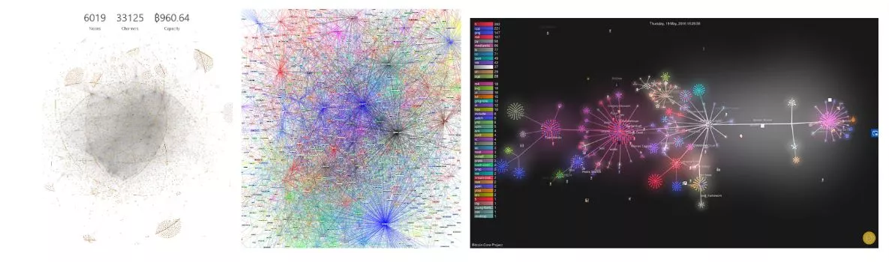

भले ही किसी मेन्टेनर ने एक विवादास्पद बदलाव को मंजूरी दे दी हो, यह नेटवर्क पर कोई असर नहीं डालेगा जब तक कि **यूजर्स द्वारा चलाए जाने वाले नोड्स** वास्तव में उस वर्जन को अपनाकर नहीं चलाते। आखिरकार, Bitcoin का कोड तभी मायने रखता है जब लोग इसे चलाना चुनते हैं।

यह भी ध्यान देने योग्य है कि **Bitcoin Core एकमात्र क्लाइंट नहीं है**। Bitcoin प्रोटोकॉल को लागू करने वाले Bitcoin Knots जैसे विकल्प भी उपलब्ध हैं, जो उपयोगकर्ताओं को अधिक विकल्प देते हैं और सिस्टम के विकेंद्रीकरण को मजबूत करते हैं:

https://planb.network/tutorials/node/bitcoin/bitcoin-knots-e04b2196-4df2-4246-86ef-c02269c29098

## Bitcoin की परतदार संरचना

<chapterId>03017765-53cf-5f14-9682-e99ca02d2241</chapterId>

Bitcoin एक ओपन सिस्टम है जिसे शुरुआत से ही मिनिमलिस्ट, मजबूत और सुरक्षित बनाया गया है। इसकी बुनियाद को बदले बिना नई कार्यक्षमता जोड़ने के लिए, आमतौर पर **प्रोटोकॉल लेयर्स** और कॉम्प्लीमेंटरी एप्लिकेशन्स जोड़कर इवोल्यूशन किया जाता है। ये इकोसिस्टम को समृद्ध करते हैं, लेकिन मुख्य सिस्टम की डीसेंट्रलाइजेशन और रेजिलिएंस को प्रभावित नहीं करते। इसी फ्लेक्सिबिलिटी की वजह से कई कंपनियों और इंडिपेंडेंट डेवलपर्स ने Bitcoin के आसपास इन्फ्रास्ट्रक्चर बनाया है, जिसमें अलग-अलग यूज़ केस के हिसाब से इनोवेशन्स शामिल हैं।

### जीडब्ल्यू-311 एक्सटेंशन जिसमें अतिरिक्त परतें जोड़ी गई हैं

यह लेयर्ड तरीका Bitcoin को बिना कोर प्रोटोकॉल बदले बेहतर बनाने देता है, जिससे मुख्य सिस्टम की स्थिरता और सुरक्षा बनी रहती है। यह तरीका इंटरनेट की तरह ही काम करता है, जहां कई प्रोटोकॉल एक-दूसरे पर बनते हैं ताकि अलग-अलग काम करने की सुविधा दे सकें, और साथ ही आपस में सही तरीके से काम भी कर पाएं।

Bitcoin इकोसिस्टम को समृद्ध करने वाले मुख्य ओवरले सिस्टम में शामिल हैं:

- जीडब्ल्यू-314**:

Lightning Network, जिसे 2016 में थैडियस ड्रायजा और जोसेफ पून ने बनाया था, एक दूसरी पीढ़ी का Layer समाधान है जिसे त्वरित और कम लागत वाले भुगतानों को सक्षम करने के लिए डिज़ाइन किया गया है। दो उपयोगकर्ता एक निजी चैनल खोल सकते हैं जहाँ वे लेन-देन कर सकते हैं, और शेष राशि केवल Blockchain पर तब अपडेट होती है जब चैनल खोला या बंद किया जाता है। चैनल के अंदर होने वाले लेन-देन off-chain पर होते हैं, जिसका मतलब है कि उन्हें अलग से Bitcoin Blockchain पर रिकॉर्ड करने की ज़रूरत नहीं होती। यह संरचना तात्कालिक लेन-देन और न्यूनतम शुल्क को सक्षम बनाती है, जो इसे कम मूल्य वाले लेन-देन के लिए आदर्श बनाती है जिन्हें त्वरित पुष्टि की आवश्यकता होती है।

मान लो तुम Bitcoin से कॉफी खरीद रहे हो जिसका आधार Layer है। पेमेंट कन्फर्म होने के लिए (और कैफे को यकीन दिलाने के लिए कि तुमने सच में पेमेंट कर दिया है) ट्रांजैक्शन को एक ब्लॉक में शामिल होना चाहिए। यह कुछ मिनट ले सकता है, यह इस बात पर निर्भर करता है कि तुमने कितना फी चुना है। टेक्निकली, मर्चेंट को पेमेंट के फाइनल होने का पूरा यकीन करने के लिए छह कन्फर्मेशन्स (लगभग एक घंटा) इंतज़ार करना चाहिए। जाहिर है, काउंटर पर खड़े होने के दौरान इतना इंतज़ार करना मुमकिन नहीं। लेकिन Lightning Network के साथ, पेमेंट सिर्फ कुछ सेकंड्स में हो जाता है; तो तुम्हारी कॉफी का पेमेंट हो जाता है और वो परोस दी जाती है इससे पहले कि वो ठंडी होने का टाइम पाए।

अगर तुम्हें यह जानने में दिलचस्पी है कि लाइटनिंग कैसे काम करती है, तो हम इस विषय पर एक बेहतरीन दूसरे साल का कोर्स ऑफर करते हैं:

https://planb.network/courses/34bd43ef-6683-4a5c-b239-7cb1e40a4aeb

- **साइडचेन्स** :  

(Note: "Sidechains" is a technical term often used as is in Hindi conversations related to blockchain technology. However, if a more colloquial translation is needed, it can be referred to as **"साइड चेन"** or **"बगल की श्रृंखला"** in a descriptive sense, but the English term is more commonly understood in tech contexts.)

साइडचेन वो ब्लॉकचेन हैं जो Bitcoin के मेन Blockchain के साथ समानांतर चलती हैं। ये एक दो-तरफ़ा पेग (two-way peg) के ज़रिए जुड़ी होती हैं, जो यह सुनिश्चित करता है कि चेन के बीच मूव होने वाली एसेट की वैल्यू वही रहे; मतलब Sidechain पर एक Bitcoin की कीमत मेन चेन पर एक Bitcoin के बराबर ही रहती है। हर Sidechain का अपना कॉन्सेंसस मैकेनिज़म होता है, जो पूरी तरह अलग हो सकता है या फिर Bitcoin पर आंशिक रूप से निर्भर भी हो सकता है।

साइडचेन का मुख्य फायदा यह है कि वे Bitcoin बेस Layer पर उपलब्ध नहीं होने वाले फीचर्स प्रदान कर सकते हैं; या उन्हें बेहतर तरीके से ऑफर कर सकते हैं। इसमें डेवलपर्स के लिए ज्यादा लचीलापन, तेज़ और/या अधिक प्राइवेट ट्रांजैक्शन्स, और अधिक ट्रांजैक्शन थ्रूपुट शामिल हैं। हालाँकि, ये फायदे देने के लिए, साइडचेन्स अक्सर Bitcoin की मेन चेन की तुलना में अलग ट्रेड-ऑफ्स करती हैं।

साइडचेन का कॉन्सेप्ट 2014 में एडम बैक, मैट कोरालो, ल्यूक डैशजेआर, मार्क फ्रीडेनबैच, ग्रेगरी मैक्सवेल, एंड्रयू मिलर, एंड्रयू पोएल्स्ट्रा, जोर्ज टिमोन और पीटर वुइले द्वारा पेश किया गया था। 2025 तक, Bitcoin इकोसिस्टम में सबसे मशहूर साइडचेन Liquid और RSK (रूटस्टॉक) हैं।

अगर आप Liquid के बारे में और जानना चाहते हैं, तो हम इस विषय पर तीसरे साल का एक एडवांस्ड कोर्स ऑफर करते हैं:

https://planb.network/courses/6d26bcff-51a3-405f-bcdd-9af8297ce727

- जीडब्ल्यू-331**

RGB एक विकेंद्रीकृत और गोपनीयता-केंद्रित Smart contract सिस्टम है जो Bitcoin और Lightning Network के ऊपर काम करने के लिए डिज़ाइन किया गया है। पारंपरिक Smart contract प्लेटफॉर्म्स के विपरीत, RGB एक Client-side Validation मॉडल का उपयोग करता है (इसका मतलब है कि पूरा Contract State off-chain में स्टोर किया जाता है, और केवल क्रिप्टोग्राफ़िक कमिटमेंट्स Bitcoin Blockchain पर पब्लिश की जाती हैं)। यह डिज़ाइन स्केलेबिलिटी और गोपनीयता दोनों को बेहतर बनाता है। RGB के साथ, यूज़र्स टोकन जारी करने, NFTs, विकेंद्रीकृत पहचान, या यहाँ तक कि DeFi एप्लिकेशन्स के लिए एडवांस्ड स्मार्ट कॉन्ट्रैक्ट्स बना सकते हैं, सीधे Bitcoin या लाइटनिंग पर।

RGB की एक खास बात यह है कि यह Double-spending से सुरक्षा प्रदान करता है, जिसे "सिंगल-यूज़ सील्स" नामक क्रिप्टोग्राफ़िक तकनीक से हासिल किया गया है। यह तरीका इस सच्चाई पर आधारित है कि Bitcoin के UTXOs (अनस्पेंट ट्रांजैक्शन आउटपुट्स) को सिर्फ़ एक बार ही खर्च किया जा सकता है। टोकन्स की असलीयत सुनिश्चित की जाती है उपयोगकर्ता द्वारा Contract के पूरे इतिहास (इसके बनने से लेकर वर्तमान स्थिति तक) की जाँच करके।

RGB के बारे में आपकी जानकारी को और गहरा करने के लिए, हम एक चौथे साल का ट्रेनिंग कोर्स ऑफर करते हैं (ध्यान दें कि यह बहुत ही टेक्निकल है):

https://planb.network/courses/3ce1d37c-05ba-4f54-aa15-7586d37b2bb7

RGB, Bitcoin पर बने कई प्रोटोकॉल्स में से सिर्फ एक है। हालांकि कुछ दूसरों के मुकाबले ज़्यादा पॉपुलर हैं, लेकिन नए प्रोटोकॉल्स अभी भी बनते जा रहे हैं। सबमें एक बात कॉमन है - हर Layer को किसी खास काम के लिए ऑप्टिमाइज़ करने का आइडिया, वो भी Bitcoin के बेस प्रोटोकॉल की इंटिग्रिटी और इम्यूटेबिलिटी को बरकरार रखते हुए।

यह लेयर्ड डिज़ाइन बाकी क्रिप्टो इंडस्ट्री से बिल्कुल अलग है, जो अक्सर एक ही प्रोटोकॉल में कई फीचर्स ठूंस देती है। Bitcoin को सिंपल और फोकस्ड रखकर, हमने इसके अटैक सरफेस को कम किया है - मतलब ज़्यादा सुरक्षा। एक लीन प्रोटोकॉल को सिक्योर, मेंटेन और स्केल करना आसान होता है। Bitcoin सिर्फ़ एक काम बेहतरीन तरीके से करने के लिए डिज़ाइन किया गया है: सॉलिड, डिसेंट्रलाइज़्ड करेंसी देना। बाकी चीज़ें (स्मार्ट कॉन्ट्रैक्ट्स, टोकन्स, पेमेंट्स वगैरह) ऊपर से लेयर की जा सकती हैं, जिससे कोर को कम्प्रोमाइज़ किए बिना इनोवेशन हो सके।  

(नोट: टेक्निकल टर्म्स जैसे "लेयर्ड डिज़ाइन", "अटैक सरफेस", "डिसेंट्रलाइज़्ड" आदि को हिंदी में उनके ओरिजिनल फॉर्म में रखा गया है क्योंकि यह इंडस्ट्री-स्टैंडर्ड टर्मिनोलॉजी है। साथ ही, कॉलोक्वियल हिंदी के लिए "ठूंस देती है", "मतलब", "सिर्फ़" जैसे शब्दों का इस्तेमाल किया गया है ताकि टोन कैजुअल रहे।)

**क्या आप जानते हैं**?  
इंटरनेट एक ही बार में नहीं बना था; यह एक-दूसरे से जुड़े प्रोटोकॉल्स के ढेर की तरह धीरे-धीरे विकसित हुआ। जैसे, TCP/IP नेटवर्क कम्युनिकेशन संभालता है, HTTP वेब को चलाता है, और कई अन्य लेयर्स अलग-अलग काम करती हैं। हर Layer अपने काम के लिए ऑप्टिमाइज़ किया गया है, जिससे एक मजबूत और मॉड्यूलर सिस्टम बनता है। Bitcoin भी इसी सिद्धांत पर चलता है। इसका बेस Layer मजबूत और मिनिमल है, और एक्स्ट्रा फंक्शनैलिटी Lightning, Liquid, या RGB जैसे लेयर्ड प्रोटोकॉल्स के जरिए जोड़ी जाती है। हर प्रोटोकॉल अलग-अलग यूजर जरूरतों को पूरा करता है, बिना बेसिक सिस्टम को छेड़े।

### Bitcoin को स्वीकार करने के लिए व्यापारी उपकरण

आजकल, जो व्यापारी Bitcoin को भुगतान के रूप में स्वीकार करना चाहते हैं, उनके पास बहुत सारे टूल्स उपलब्ध हैं। छोटे व्यवसाय जो एक सरल सेटअप चाहते हैं, उनके लिए Hot Wallet (या Lightning Wallet) का उपयोग करना अक्सर भुगतान सीधे स्वीकार करने के लिए काफी होता है। बड़े व्यवसाय जिन्हें सही लेखांकन और रिपोर्टिंग की आवश्यकता होती है, वे आमतौर पर अधिक उन्नत भुगतान प्रसंस्करण प्रणालियों को प्राथमिकता देंगे। सौभाग्य से, आपकी जरूरतों के आधार पर कई विकल्प उपलब्ध हैं।

अगर आप बिना ज्यादा मेहनत के सीधे अपने बैंक खाते में पैसा पाना चाहते हैं, तो OpenNode जैसी कस्टोडियल सेवाएं एक आसान तरीका देती हैं:

https://planb.network/tutorials/business/point-of-sale/open-node-e69a0c1c-47f7-4932-8494-e6f26c3c9784

जो व्यापारी तकनीकी रूप से ज्यादा जानकार हैं और प्रक्रिया पर पूरा नियंत्रण चाहते हैं, उनके लिए BTCPay Server एक बेहतरीन ओपन-सोर्स विकल्प है। इसका मुख्य नुकसान यह है कि इसे सेटअप और मेंटेन करने में समय लगता है, साथ ही कुछ तकनीकी ज्ञान की भी जरूरत होती है:

https://planb.network/tutorials/business/point-of-sale/btcpay-server-928eb01e-824b-4b57-a3e8-8727633beddc

बीच में ही, आपको मिलेगा Swiss Bitcoin Pay - एक यूज़र-फ्रेंडली पर मज़बूत समाधान जो आसानी, कार्यक्षमता और सुरक्षा के बीच सही संतुलन बनाता है। यह छोटे दुकानदारों से लेकर बड़े व्यवसायों तक, सभी के लिए बढ़िया काम करता है:

https://planb.network/tutorials/business/point-of-sale/swiss-bitcoin-pay-2-a78b057e-ed11-47ac-860c-71019fcb451a

Bitcoin को अपनाने से किसी भी बिज़नेस को कई प्रैक्टिकल और फाइनेंशियल फायदे मिल सकते हैं। जैसे कैश में होता है, वैसे ही Bitcoin से कस्टमर और मर्चेंट सीधे पेमेंट कर सकते हैं (पारंपरिक बैंक की ज़रूरत नहीं)। Lightning Network के ज़रिए किए गए पेमेंट तुरंत और फाइनल होते हैं, जिससे चार्जबैक का रिस्क कम हो जाता है। और जब मर्चेंट्स अपना खुद का Bitcoin रखते हैं (सेल्फ-कस्टडी), तो उन्हें ज़्यादा फाइनेंशियल आज़ादी मिलती है।

यह बैंकिंग शुल्क और पारंपरिक भुगतान टर्मिनलों की जरूरत को खत्म करके लागत कम करने में भी मदद कर सकता है; अक्सर आपको बस एक स्मार्टफोन या लैपटॉप चाहिए होता है। भले ही भुगतान प्रोसेसर शामिल हों, फीस आमतौर पर बैंकों द्वारा लिए जाने वाले शुल्क से कम होती है।

पारंपरिक मुद्राओं के विपरीत जो महंगाई के कारण समय के साथ मूल्य खो देती हैं, Bitcoin में Supply की एक निश्चित संख्या है जो 21 मिलियन सिक्कों तक सीमित है। यह इसे लंबी अवधि में व्यापार कोष को सुरक्षित रखने और विविधता लाने के लिए एक मूल्यवान संपत्ति बनाता है।

रोज़मर्रा के कामकाज में, Bitcoin भुगतान को आसान बनाता है क्योंकि इसमें नकदी की ज़रूरत नहीं होती, चोरी का खतरा कम हो जाता है और नकली नोटों की संभावना भी खत्म हो जाती है। यह एक वैश्विक मुद्रा है, जो इंटरनेशनल ग्राहकों के लिए बिल्कुल सही है क्योंकि इसमें करेंसी कन्वर्ज़न की ज़रूरत नहीं पड़ती। ऑनलाइन स्टोर्स के लिए तो Bitcoin खासतौर पर सुरक्षित और कारगर है।

इसके अलावा, Bitcoin को अपनाना एक स्मार्ट मार्केटिंग चाल हो सकती है। यह दिखाता है कि आपका बिज़नेस आगे की सोच वाला है और नए ग्राहकों को आकर्षित कर सकता है (खासकर जेन जेड जैसी युवा पीढ़ी के बीच)। यह एक कम जोखिम वाला, रणनीतिक मौका है जिसमें लागत बहुत कम है, ज्यादातर शुरुआती सेटअप तक सीमित; और अब सही टूल्स के साथ यह पहले से कहीं ज्यादा आसान हो गया है।

अगर आप जानना चाहते हैं कि Bitcoin को आपके बिज़नेस में कैसे शामिल किया जा सकता है (चाहे पेमेंट मेथड के तौर पर, ट्रेजरी एसेट के रूप में, या दोनों ही तरह से), तो हम इसके लिए एक बिगिनर-लेवल कोर्स ऑफर करते हैं:  

(नोट: Bitcoin को हिंदी में अनुवादित नहीं किया गया क्योंकि यह एक टेक्निकल/ब्रांड टर्म है जिसे ऐसे ही इस्तेमाल किया जाता है।)

https://planb.network/courses/a804c4b6-9ff5-4a29-a530-7d2f5d04bb7a

जीडब्ल्यू-367, जीडब्ल्यू-366 के एक माध्यम के रूप में तेजी से लोकप्रिय हो रहा है, जिसे कई उद्योगों में अपनाया जा रहा है। जीडब्ल्यू-365 ने भुगतान को तेज और सस्ता बना दिया है, जिससे व्यापारियों के लिए जीडब्ल्यू-367 की अपील और बढ़ गई है।

हम एक ऐसे मुकाम पर पहुँच चुके हैं जहाँ कोई भी Bitcoin इकोसिस्टम में शामिल हो सकता है; चाहे वो रोज़मर्रा की ज़िंदगी में इस्तेमाल करके, बिज़नेस में अपनाकर, शिक्षा में योगदान देकर, कोड को बेहतर बनाने में मदद करके, या नए ऐप्लिकेशन्स बनाकर।

जीडब्ल्यू-369 अब रुकने वाला नहीं है।

### मेरा नज़रिया

मैंने हमेशा "Bitcoin हाईवे" के रूपक को पारिस्थितिकी तंत्र के विकास और उसकी दिशा को समझने का सबसे सटीक और प्रभावशाली तरीका माना है। Bitcoin सिर्फ डिजिटल पैसा नहीं है; यह **एक बढ़ता हुआ वैकल्पिक वित्तीय तंत्र** है, जिसकी अपनी ताकतें और कमजोरियाँ हैं। हालांकि यह अभी नया है और चुनौतियों का सामना कर रहा है, लेकिन इसकी लचीलापन नकारा नहीं जा सकता। यह जाने वाला नहीं है। बल्कि, एक ब्लैक होल की तरह, यह धीरे-धीरे अपने आसपास की हर चीज़ को निगलता जाएगा, जब तक कि यह एक अविवादित मौद्रिक मानक न बन जाए।

Bitcoin को एक सड़क की तरह समझो जिस पर तुम गाड़ी चला रहे हो। अभी, रोज़मर्रा की ज़रूरतों (किराने का सामान खरीदना, सेवाओं के लिए पैसे देना, या गाड़ी की मरम्मत करवाना) के लिए, कभी-कभी तुम्हें इस सड़क से निकलना पड़ता है; यानी तुम अस्थायी तौर पर पुराने वित्तीय सिस्टम में वापस चले जाते हो। ऐसा इसलिए क्योंकि Bitcoin का ढांचा अभी बन रहा है, और दैनिक जीवन के कुछ हिस्से अभी भी फिएट करेंसी और बैंकों पर निर्भर हैं।

लेकिन समय के साथ, यह सड़क पूरी तरह से बनी हुई हाईवे बन जाएगी। लेकिन समय के साथ, यह सड़क पूरी तरह से बनी हुई हाईवे बन जाएगी।

मैं Bitcoin का भविष्य ऐसे ही देखता हूँ। हो सकता है यह पारंपरिक वित्तीय प्रणाली को पूरी तरह से बदल न दे, लेकिन कुछ अहम क्षेत्रों में (जैसे कि दक्षता, सुरक्षा और उपयोगकर्ता अपनाने की दर) यह उससे बेहतर प्रदर्शन करेगा, यहाँ तक कि दुनिया के ज्यादातर हिस्सों के लिए यह मानक बन जाएगा।

अगर मुझे ठीक से याद है, तो Bitcoin हाईवे का यह उदाहरण सबसे पहले Andreas Antonopoulos ने दिया था। उनकी यह दृष्टि आज भी सही साबित हो रही है, और हर कदम के साथ हम उसे जीने के और करीब पहुँच रहे हैं। [@aantonop](https://x.com/aantonop)

कोर्स में अगला कदम: हम प्रैक्टिकल होकर आपकी पर्सनल सिचुएशन और गोल्स के हिसाब से आपका "बिटकॉइनर प्रोफाइल" डिफाइन करने में मदद करेंगे।

# अपनी योजना सेट करना

<partId>3801faf6-7915-56fa-baf5-ee63ad03b7cf</partId>

## अपना प्रोफाइल चुनें

<chapterId>c5d87903-a5f2-5eec-887a-f662734ce49b</chapterId>

अब जब आपने Bitcoin के सैद्धांतिक आधार सीख लिए हैं, तो अब व्यावहारिक पक्ष की ओर बढ़ने का समय आ गया है। यह खंड आपको यह समझने में मदद करेगा कि अपने पहले बिटकॉइन कैसे प्राप्त करें, उन्हें सुरक्षित रूप से कैसे स्टोर करें, और अपनी व्यक्तिगत स्थिति के आधार पर अपनी रणनीति कैसे तैयार करें। लक्ष्य यह है कि आप पहचान सकें कि आप किस प्रकार के उपयोगकर्ता हैं ताकि आप अपनी आवश्यकताओं और सीमाओं के अनुरूप एक रणनीति अपना सकें।

Bitcoin पारंपरिक संपत्तियों जैसा नहीं है। इसके इस्तेमाल के तकनीकी और आर्थिक पहलुओं को समझने के साथ-साथ एक सोच-समझकर कदम उठाने की जरूरत होती है। फिएट करेंसी के उलट, Bitcoin व्यक्तिगत संप्रभुता के मॉडल पर काम करता है; यानी आप अपने फंड के प्रबंधन और सुरक्षा की पूरी जिम्मेदारी खुद उठाते हैं। जैसा कि हमने पिछले सेक्शन्स में चर्चा की थी, यह वित्तीय स्वायत्तता एक बड़ा फायदा है, लेकिन इसमें कुछ खास बेस्ट प्रैक्टिसेस भी जुड़ी हैं, जिन्हें हम अगले कुछ चैप्टर्स में समझेंगे।

यह कोर्स मानता है कि आप Bitcoin के साथ अभी शुरुआत कर रहे हैं। इसलिए हम सरल, शुरुआती अनुकूल समाधानों पर ध्यान देंगे जिन्हें सेट अप करना आसान है। हम Mining जैसे अप्रत्यक्ष एक्सपोजर तरीकों, Bitcoin से जुड़ी कंपनियों के स्टॉक खरीदने, या जटिल वित्तीय रणनीतियों को कवर नहीं करेंगे। यहां लक्ष्य यह है कि आपको अपनी स्थिति के अनुकूल Wallet चुनने और अपने पहले बिटकॉइन्स को सुरक्षित रूप से हासिल करने में मदद करना।

### अपना यूज़र प्रोफाइल क्यों डिफाइन करें?

बीटीसी खरीदने और मैनेज करने का कोई एक फिक्स तरीका नहीं है। हर यूज़र का अपना अलग कॉन्टेक्स्ट होता है, जो उनकी फाइनेंशियल स्थिति, टेक्निकल नॉलेज और Bitcoin को लेकर उम्मीदों पर निर्भर करता है। इसीलिए ज़रूरी है कि आप ऐसी स्ट्रैटेजी चुनें जो आपके पर्सनल प्रोफाइल के अनुकूल हो। अपने खुद के तरीके को समझने से आप बेहतर फैसले ले पाएंगे और उन आम गलतियों से बच पाएंगे जो अपनी ज़रूरतों को गलत आँकने से होती हैं।

यहाँ कुछ ऐसे फैक्टर्स हैं जिन्हें बिटकॉइन खरीदने और स्टोर करने का सबसे अच्छा तरीका ढूंढने के लिए ध्यान में रखना चाहिए:

- आप कितना निवेश करना चाहते हैं**: क्या आप थोड़ी रकम से शुरुआत करके सीखना और टेस्ट करना चाहते हैं, बिना ज्यादा रिस्क लिए? या फिर आप लॉन्ग-टर्म के लिए बड़ा निवेश करने की प्लानिंग कर रहे हैं?
- आपकी निवेश की आवृत्ति**: क्या आप एक बार में खरीदारी करके अपने फंड को तुरंत सुरक्षित करना चाहते हैं, या फिर आप डॉलर-कॉस्ट एवरेजिंग (DCA) जैसी रणनीति का उपयोग करके समय के साथ खरीदारी को फैलाना पसंद करेंगे ताकि कीमतों में उतार-चढ़ाव को कम किया जा सके?
- आप अपने बिटकॉइन के साथ क्या करना चाहते हैं**: क्या आप इसे सख्ती से लंबी अवधि की बचत के रूप में रख रहे हैं? रोज़मर्रा के भुगतान के लिए इस्तेमाल कर रहे हैं? या फिर दोनों ही थोड़ा-थोड़ा?
- **आपकी गोपनीयता पर राय**: क्या आप Bitcoin खरीदने के लिए अपनी निजी जानकारी देने और केंद्रीकृत प्लेटफॉर्म्स का इस्तेमाल करने में सहज हैं? या फिर आप गोपनीयता को प्राथमिकता देने वाले तरीकों को पसंद करेंगे, जैसे कि पीयर-टू-पीयर, नो-केवाईसी एक्सचेंज?
- आपका व्यक्तिगत, कानूनी और भौगोलिक संदर्भ**: आप जहां रहते हैं, उसके आधार पर कुछ एक्सचेंजों तक पहुंच प्रतिबंधित हो सकती है। स्थानीय कानून और टैक्स नियम भी प्रभावित कर सकते हैं कि आप अपने Bitcoin को कैसे स्टोर और इस्तेमाल करते हैं।

इनमें से हर एक चीज़ आपके लिए सही रणनीति बनाने में भूमिका निभाती है। कुछ यूज़र्स को सरलता और आसानी से इस्तेमाल करने वाली रेगुलेटेड सेवाएँ पसंद आएँगी, जबकि दूसरे लोग ज़्यादा स्वायत्तता और प्राइवेसी पर ध्यान देने वाले तरीके को तरजीह देंगे।

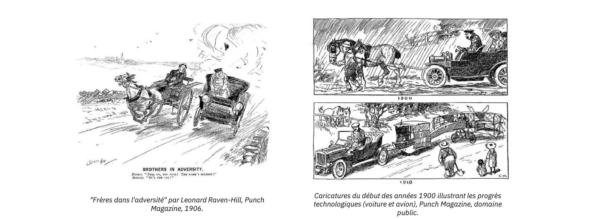

यही हम आगे जानेंगे: बिटकॉइन को हासिल करने और सुरक्षित रखने के अलग-अलग तरीके, ताकि आप अपने प्रोफाइल और लक्ष्यों के आधार पर सही फैसला ले सकें।

### आपके प्रोफाइल को परिभाषित करने के मुख्य मापदंड

अपने बिटकॉइन्स को हासिल करने और सुरक्षित रखने के लिए सही रणनीति चुनने की शुरुआत अपनी व्यक्तिगत स्थिति की ईमानदारी से जाँच करने से होती है। कई कारक इन फैसलों को प्रभावित करते हैं, जैसे कि आपके सामने आने वाले जोखिम, आपकी जीवनशैली, और आप अपने बिटकॉइन्स का इस्तेमाल कैसे करने की योजना बना रहे हैं।

#### संभावित जोखिम और खतरे

अपने बिटकॉइन्स को हासिल करने और सुरक्षित रखने के लिए सही रणनीति चुनने की शुरुआत अपनी व्यक्तिगत स्थिति की ईमानदारी से जाँच करने से होती है। कई कारक इन फैसलों को प्रभावित करते हैं, जैसे कि आपके सामने आने वाले जोखिम, आपकी जीवनशैली, और आप अपने बिटकॉइन्स का इस्तेमाल कैसे करने की योजना बना रहे हैं:

- **साइबर हमले**: अगर आपको साइबर सुरक्षा की ज्यादा जानकारी नहीं है या आप कमजोर डिवाइस इस्तेमाल कर रहे हैं, तो आप ऑनलाइन हमलों का शिकार हो सकते हैं। ऐसे में, अपने बिटकॉइन को ऑफलाइन स्टोर करना (Cold स्टोरेज) एक सुरक्षित विकल्प हो सकता है।
- **शारीरिक खतरे**: दुर्भाग्य से, शारीरिक हमले होते हैं; घर में घुसपैठ, डकैती, यहाँ तक कि अपहरण भी Bitcoin धारकों को निशाना बनाते हैं। हालाँकि ऐसी घटनाएँ अभी भी कम हैं और ज़्यादातर प्रमुख लोगों को प्रभावित करती हैं, लेकिन अपनी सुरक्षा व्यवस्था बनाते समय शुरू से ही इन पर विचार करना उचित होगा।

- **प्राकृतिक आपदाएँ**: अगर आप ऐसे इलाके में रहते हैं जहाँ जंगल की आग, बाढ़ या अन्य चरम मौसमी घटनाएँ आम हैं, तो एक मजबूत बैकअप सिस्टम होना बेहद जरूरी है जो आपकी प्राइवेट कुंजियों को सुरक्षित रखे।

- सरकारी जब्ती**: अगर आपके देश में वित्तीय नियम बहुत सख्त या अस्थिर हैं, तो आपको Bitcoin खरीदने या इस्तेमाल करने में पाबंदियाँ झेलनी पड़ सकती हैं। ऐसे हालात में, आपको निजी और नॉन-कस्टोडियल समाधानों को तरजीह देनी चाहिए।

- याद्दाश्त खोना या डेटा लॉस**: प्राइवेट कीज़ को मैनेज करने के लिए आपको संवेदनशील जानकारी स्टोर और वापस लानी पड़ती है। अगर आप भूलने की आदत या संभावित स्वास्थ्य समस्याओं को लेकर चिंतित हैं, तो मजबूत बैकअप सिस्टम लागू करना समझदारी होगी; या फिर अपने सुरक्षा प्लान में किसी भरोसेमंद व्यक्ति को शामिल कर लें।

अपनी कमजोरियों को बेहतर ढंग से समझने के लिए, इन जोखिमों में से प्रत्येक को 0 (कम) से 10 (उच्च) के पैमाने पर आंकें। यह स्व-मूल्यांकन आपको आगे बढ़ने के लिए सही सुरक्षा उपायों को प्राथमिकता देने में मदद करेगा।

#### जीवनशैली और व्यक्तिगत आदतें

आपकी रोज़मर्रा की ज़िंदगी भी बिटकॉइन को मैनेज करने में बड़ी भूमिका निभाती है। अपनी लाइफस्टाइल के मुताबिक सेटअप चुनने से चीज़ें आसान हो जाएंगी और फालतू की टेंशन से बच जाओगे।

**समय या दिलचस्पी कम है?**  
आसान, स्वचालित समाधान चुनें; जैसे निर्धारित खरीदारी जो अपने आप सुरक्षित भंडारण में ट्रांसफर हो जाए।

**टेक-सेवी या प्रैक्टिकल?** आप Multisig वॉलेट जैसे एडवांस्ड विकल्प पसंद कर सकते हैं जो ज़्यादा कंट्रोल और सुरक्षा देते हैं।

**अपनों या आने वाली पीढ़ियों के लिए निवेश?** विरासत के बारे में जल्दी सोचें। अगर आपके साथ कुछ हो जाता है, तो यह सुनिश्चित करने के तरीके हैं कि आपके बिटकॉइन सुरक्षित रूप से आगे बढ़ाए जा सकें।

**प्राइवेसी का ध्यान रखते हैं?** कुछ खरीदारी के तरीकों में व्यक्तिगत जानकारी (KYC प्लेटफॉर्म्स) की जरूरत होती है, जबकि दूसरे (जैसे पीयर-टू-पीयर या Mining) ज्यादा गोपनीयता देते हैं।

#### अपने बिटकॉइन्स का इस्तेमाल करके

आपका स्टोरेज और मैनेजमेंट स्ट्रैटेजी यह दिखानी चाहिए कि आप Bitcoin का इस्तेमाल कैसे करना चाहते हैं। शुरुआत से ही इस बारे में स्पष्ट होने से आपके फैसले आसान हो जाएंगे।

- **लॉन्ग-टर्म सेविंग्स**: आप Bitcoin को एक निवेश के तौर पर खरीद रहे हैं और इसे जल्दी इस्तेमाल करने की कोई योजना नहीं है। ऐसे में, अधिकतम सुरक्षा और एक्सेस रिस्क को कम करना सबसे ज़रूरी है।
- धीरे-धीरे जमा होना**: आप छोटी-छोटी रकम नियमित रूप से खरीद रहे हैं। डॉलर कॉस्ट एवरेजिंग (DCA) जैसी रणनीति, सुरक्षित Wallet के साथ मिलकर अच्छा काम करती है।
- रोज़मर्रा के खर्चे**: आप Bitcoin को पैसे की तरह इस्तेमाल करें। छोटे-मोटे रोज़ाना भुगतान के लिए Wallet मोबाइल का इस्तेमाल करें (शायद Lightning के साथ), और अपना ज़्यादातर Bitcoin कहीं सुरक्षित जगह पर रखें।
- **रिटायरमेंट की तैयारी या अपनी दौलत आगे बढ़ाना**: आप बाद में किसी को अपना Bitcoin ट्रांसफर करना चाहते हैं। ऐसे टूल्स का इस्तेमाल करें जो सही समय आने पर फंड ट्रांसफर करना आसान और सुरक्षित बनाएं। Multisig जैसी टाइमलॉक वाली स्ट्रैटेजी या विशेष वंशानुक्रम योजनाएं लागू की जा सकती हैं ताकि आपके फंड न तो खोएं और न ही जल्दी एक्सेस हो पाएं।

एक बार जब आप अपने जोखिमों, लाइफस्टाइल और लक्ष्यों के बारे में सोच लेंगे, तो आप अपनी Bitcoin यात्रा के लिए स्मार्ट चॉइस करने के लिए तैयार हो जाएंगे।

यहां चार मुख्य बातें तय करने के लिए हैं:

- कौन सा Wallet इस्तेमाल करें
- अपने Bitcoin को सुरक्षित कैसे करें  

1. **पासवर्ड या पिन सेट करें**  
   - डिवाइस सेटिंग्स में जाएं और एक मजबूत पासवर्ड या पिन चुनें।  

2. **बायोमेट्रिक लॉक (अगर उपलब्ध हो)**  
   - फिंगरप्रिंट या फेस अनलॉक जैसी सुविधा को एक्टिवेट करें।  

3. **डिवाइस एन्क्रिप्शन चालू करें**  
   - स्टोरेज को एन्क्रिप्ट करने के लिए सेटिंग्स में "एन्क्रिप्ट डिवाइस" विकल्प ढूंढें।  

4. **रिमोट ट्रैकिंग और वाइप सक्षम करें**  
   - "फाइंड माई डिवाइस" जैसी सर्विस को ऑन करें ताकि खोने पर लोकेशन ट्रैक कर सकें या डेटा मिटा सकें।  

5. **अनजान ऐप्स और सोर्सेस से बचें**  
   - सिर्फ विश्वसनीय ऐप स्टोर (जैसे Google Play Store) से ही ऐप्स इंस्टॉल करें।  

6. **नियमित सॉफ्टवेयर अपडेट करें**  
   - सुरक्षा पैच के लिए डिवाइस और ऐप्स को अपडेटेड रखें।  

7. **बैकअप लें**  
   - जरूरी डेटा का क्लाउड या कंप्यूटर पर बैकअप बनाएं।  

8. **पब्लिक वाई-फाई पर सावधानी**  
   - असुरक्षित नेटवर्क पर VPN का उपयोग करें या महत्वपूर्ण एक्टिविटी न करें।  

9. **थर्ड-पार्टी एक्सेस रिस्ट्रिक्ट करें**  
   - अनुमतियों की जांच करें और अनावश्यक ऐप एक्सेस को ब्लॉक करें।  

10. **फिजिकल सिक्योरिटी**  
    - डिवाइस को सार्वजनिक जगहों पर अनअटेंडेड न छोड़ें।  

⚠️ **टिप**: कभी भी पासवर्ड/पिन किसी के साथ शेयर न करें!
- तुम Bitcoin कैसे खरीदोगे?
- आप कितना लेन-देन करेंगे?

### वॉलेट और सुरक्षा रणनीतियाँ

अपने प्राइवेट कीज़ (जो आपके बिटकॉइन तक पहुंच देते हैं) को सुरक्षित रखना Bitcoin के मालिक होने और उपयोग करने का सबसे महत्वपूर्ण हिस्सा है। पारंपरिक बैंक अकाउंट की तरह नहीं, जहां कोई तीसरा पक्ष आपके फंड्स को मैनेज करता है, Bitcoin आपको पूरा कंट्रोल देता है। लेकिन इस आज़ादी के साथ ज़िम्मेदारी भी आती है: अगर आप अपने कीज़ खो देते हैं, तो आपका Bitcoin हमेशा के लिए चला जाएगा। आप कई तरह के वॉलेट इस्तेमाल कर सकते हैं। हर एक के अपने फायदे और नुकसान हैं, जो आपकी ज़रूरतों और अनुभव के स्तर पर निर्भर करते हैं।

#### जीडब्ल्यू-400 जीडब्ल्यू-399

Hot वॉलेट ऐप्स या सॉफ्टवेयर होते हैं जो इंटरनेट से जुड़े होते हैं। ये आपकी प्राइवेट कीज़ को उसी डिवाइस पर स्टोर करते हैं जहाँ इन्हें इंस्टॉल किया जाता है। ये वॉलेट रोज़मर्रा के इस्तेमाल या छोटी मात्रा में Bitcoin स्टोर करने के लिए बहुत अच्छे होते हैं।

उदाहरण: नीला Wallet, Green Wallet, गौरैया Wallet

लाइटनिंग सपोर्ट के साथ: फीनिक्स, Satoshi का Wallet, बिटकिट

**फायदे** :

- आसानी से इस्तेमाल करें और अपने पैसों तक तुरंत पहुंच पाएं।
- छोटे भुगतान और रोज़मर्रा के इस्तेमाल के लिए बढ़िया।
- कुछ लोग Lightning Network को तेज़ और सस्ते लेन-देन के लिए सपोर्ट करते हैं।

**नुकसान** :

- कम सुरक्षित: आपकी चाबियाँ इंटरनेट से जुड़े डिवाइस पर हैं, जिससे हैक होने का खतरा बढ़ जाता है।
- बड़ी मात्रा को लंबे समय तक स्टोर करने के लिए उपयुक्त नहीं।

सबसे अच्छा: शुरुआती लोगों के लिए, छोटी रकम, और बार-बार लेन-देन करने वालों के लिए।

#### हार्डवेयर वॉलेट्स

हार्डवेयर वॉलेट्स फिजिकल डिवाइसेस होते हैं जो आपकी प्राइवेट कीज़ को पूरी तरह ऑफलाइन स्टोर करते हैं। ये Hot वॉलेट्स की तुलना में ज्यादा सिक्योर होते हैं क्योंकि इनमें ऑनलाइन अटैक का खतरा कम होता है।

उदाहरण: Ledger, ट्रेज़र, कोल्डकार्ड, जेड, बिटबॉक्स

**फायदे** :

- कीज़ ऑफ़लाइन हैं = हैकर्स के लिए एक्सेस करना बहुत मुश्किल।
- सुरक्षा के लिए खास तौर पर बनाया गया।

**नुकसान** :

- इस्तेमाल करने में धीमा; आपको डिवाइस को कनेक्ट करना पड़ता है और ट्रांजैक्शन्स को फिजिकली कन्फर्म करना पड़ता है।
- आपको वह डिवाइस खरीदनी पड़ेगी, जिसकी कीमत आपको काफी पैसे देने पड़ सकते हैं।

सबसे अच्छा: लॉन्ग-टर्म होल्डर्स और बड़ी मात्रा सुरक्षित करने वालों के लिए।

#### मल्टीसिग्नेचर वॉलेट्स

Multisig (मल्टी-सिग्नेचर) वॉलेट्स में ट्रांजैक्शन को अप्रूव करने के लिए एक से ज़्यादा की की ज़रूरत होती है। इसे ऐसे समझिए जैसे किसी वॉल्ट को खोलने के लिए दो या तीन कॉम्बिनेशन चाहिए। यह सेटअप एडवांस्ड यूज़र्स, बिज़नेसेज़ या फिर उन लोगों के लिए बिल्कुल सही है जो टॉप-टियर सिक्योरिटी चाहते हैं।

उदाहरण: जीडब्ल्यू-411, कासा, स्पेक्टर, स्पैरो

**फायदे** :

- बहुत मजबूत सुरक्षा; अगर एक चाबी भी चोरी हो जाए, तो भी आपके पैसे सुरक्षित रहेंगे।
- चोरी, नुकसान या दबाव से जोखिम कम कर सकता है।
- आप चाबियों को लोगों या जगहों के बीच बाँट सकते हैं।

**नुकसान** :

- सेटअप और मैनेज करने में ज़्यादा मुश्किल।
- कई लोगों/डिवाइसों के बीच तालमेल की जरूरत पड़ सकती है।
- अगर Multisig का गलत प्रबंधन किया गया तो फंड्स के नुकसान का खतरा है ;
- शुरुआत में खरीदारी की ज्यादा लागत, हो सकता है कई हार्डवेयर वॉलेट खरीदने पड़ें।

सबसे अच्छा: पावर यूज़र्स, परिवारों, कंपनियों और हाई सिक्योरिटी वाले लॉन्ग-टर्म स्टोरेज के लिए।

#### कस्टोडियल सेवाएँ और ईटीएफ़

कुछ लोग Bitcoin को थर्ड-पार्टी सर्विसेज जैसे एक्सचेंजेस, कस्टोडियन्स, या ETFs के साथ स्टोर करना चुनते हैं। इससे आप Bitcoin में एक्सपोजर पा सकते हैं बिना खुद प्राइवेट कीज मैनेज किए। लेकिन इसमें बड़े ट्रेड-ऑफ्स होते हैं।

उदाहरण: एक्सचेंज जैसे कॉइनबेस या बाइनेंस, वित्तीय उत्पाद जैसे ब्लैकरॉक का Bitcoin ETF।

**फायदे** :

- आसानी से इस्तेमाल करें; खुद चाबियाँ या वॉलेट संभालने की ज़रूरत नहीं।
- उन लोगों के लिए उपयोगी जो सीधे Bitcoin का इस्तेमाल नहीं करना चाहते, बस निवेश का एक्सपोजर चाहते हैं।

**नुकसान** :

- तुम्हारे पास असल में तुम्हारा Bitcoin नहीं है; कस्टोडियन के पास है। अगर वे डूबे, तो तुम्हारे पैसे भी डूब सकते हैं (बस Mt. Gox या FTX यूजर्स से पूछो)।
- संभावित रूप से ज़्यादा फीस और कम गोपनीयता।
- भरोसेमंद तीसरे पक्ष पर निर्भरता, जिसका मतलब है अपनी संप्रभुता छोड़ना, Bitcoin के मुख्य फायदों में से एक;
- तुम्हें Bitcoin के सारे फायदे नहीं मिलते, खासकर प्राइवेसी और फाइनेंशियल सॉवरेन्टी के मामले में।

**सामान्य नियम: अगर तुम्हारी चाबी नहीं, तो तुम्हारे सिक्के भी नहीं।**

हम शुरुआती लोगों के लिए भी कस्टोडियल सर्विसेज की सलाह नहीं देते। अपने Bitcoin को सही तरीके से सुरक्षित करना सीखने में थोड़ा समय लगाना, किसी और की गलती की वजह से सब कुछ गंवाने से कहीं बेहतर है। लेकिन अगर आप यहाँ वॉलेट्स और की मैनेजमेंट के बारे में पढ़ रहे हैं, तो शायद आप पहले ही समझ चुके होंगे कि यह सिद्धांत क्यों महत्वपूर्ण है।

Wallet और सुरक्षा विधि का चुनाव इस बात पर निर्भर करता है कि आप कितना डेटा स्टोर कर रहे हैं, आपकी विशेषज्ञता का स्तर क्या है, और आपको कितना जोखिम महसूस हो रहा है। हालांकि, एक हाइब्रिड तरीका एक स्मार्ट विकल्प हो सकता है:

- रोज़मर्रा के लेन-देन के लिए Hot वॉलेटन फोन या लाइटनिंग Wallet का इस्तेमाल करें;
- अपने ज़्यादातर बिटकॉइन्स को सुरक्षित करने के लिए Hardware Wallet का इस्तेमाल करें, जिन्हें आप लंबे समय तक बचत के लिए रखना चाहते हैं।

अगर तुम्हारे Hot या Wallet में बहुत ज़्यादा बिटकॉइन जमा हो जाएँ, तो तुम कुछ को अपने Cold स्टोरेज में ट्रांसफर कर सकते हो। वहीं दूसरी तरफ, अगर तुम्हें रोज़मर्रा के खर्च के लिए और बिटकॉइन चाहिए, तो तुम Cold या Wallet से निकाल सकते हो।

आखिरकार, सुरक्षा काफी हद तक इस बात पर निर्भर करती है कि आप टूल्स का इस्तेमाल कैसे करते हैं। अगर आप Mnemonic फ्रेज़ खो देते हैं, उजागर कर देते हैं या कम्प्रोमाइज़ कर देते हैं, तो Hardware Wallet आपके किसी काम का नहीं रहेगा। सावधानी और अनुशासन बिटकॉइन खोने से बचाने के लिए आपका सबसे अच्छा सुरक्षा कवच है। इसके बारे में और जानने के लिए, मैं यह आर्टिकल पढ़ने की सलाह दूंगा:

https://planb.network/tutorials/wallet/backup/backup-mnemonic-22c0ddfa-fb9f-4e3a-96f9-46e2a7954270

### अधिग्रहण के तरीके और लेन-देन की मात्रा

बिटकॉइन हासिल करने के कई तरीके हैं, यह इस बात पर निर्भर करता है कि आपको कितनी प्राइवेसी चाहिए, आपके देश के नियम क्या हैं, और आप कितना बिटकॉइन खरीदना चाहते हैं। मुख्य रूप से दो तरीके हैं:

#### पहचान सत्यापन (KYC) के साथ अधिग्रहण

रेगुलेटेड प्लेटफॉर्म पर आमतौर पर Bitcoin खरीदने से पहले आपको अपनी पहचान वेरिफाई करनी पड़ती है। इसका मतलब है कि आपको अकाउंट बनाने और खरीदने-बेचने की सुविधा पाने के लिए आधिकारिक दस्तावेज़ (पासपोर्ट, आईडी, Address का प्रूफ, वगैरह) देने होंगे।

**फायदे** :

- आसान खरीदारी प्रक्रिया, जो अक्सर शुरुआती लोगों के लिए उपयुक्त होती है;
- बड़ी मात्रा में एक साथ खरीदारी की संभावना;
- अतिरिक्त सेवाओं तक पहुंच (DCA, स्वचालित रूपांतरण, आसान फिएट निकासी) ;
- हाई लिक्विडिटी के साथ खरीद और बेच की कीमतों में बहुत कम अंतर।

**नुकसान** :

- कन्वर्जन और निकासी के लिए ऊंची फीस;
- कुछ प्लेटफॉर्म जटिल होते हैं और एडवांस्ड ट्रेडिंग फीचर्स या ऑल्टकॉइन्स से आपको परेशान कर सकते हैं;
- बड़े निजता के मुद्दे।

KYC एक्सचेंजों का सबसे बड़ा नुकसान है प्राइवेसी का खतरा, जो आपकी पर्सनल सुरक्षा को भी प्रभावित कर सकता है। KYC की वजह से एक्सचेंज आपकी असली पहचान को आपके Bitcoin निकासी पते से जोड़ सकते हैं। यह जानकारी Blockchain विश्लेषण के लिए एक आदर्श शुरुआती बिंदु बन जाती है। एक बार Address की पहचान हो जाने पर, सभी संबंधित लेन-देन को ट्रैक करना संभव हो जाता है, जिससे आपकी On-Chain प्राइवेसी खतरे में पड़ जाती है। बिना किसी अतिरिक्त सुरक्षा उपाय के, आपकी सारी Bitcoin गतिविधि आप तक पहुँचाई जा सकती है।

एक और बड़ा खतरा यह है कि सरकार, रेगुलेटेड प्लेटफॉर्म्स के डेटाबेस तक पहुंच के साथ, उन लोगों को आसानी से पहचान सकती है जिन्होंने BTC खरीदा है। आज यह बात बेअसर लग सकती है, लेकिन अगर आर्थिक या राजनीतिक पाबंदियां लगाई जाती हैं तो यह एक समस्या बन सकती है। इसके अलावा, रेगुलेटेड प्लेटफॉर्म्स को किसी भी संदिग्ध लेन-देन की रिपोर्ट करनी होती है, जिससे सरकारी अधिकारियों द्वारा टार्गेटेड निगरानी की संभावना बढ़ जाती है।

साथ ही, KYC प्लेटफॉर्म बहुत सारा संवेदनशील डेटा स्टोर करते हैं, जिसमें आईडी और Address का प्रूफ शामिल है। यह डेटा अक्सर तीसरे पक्ष के प्रदाताओं को आउटसोर्स किया जाता है जो पहचान सत्यापन का काम करते हैं। अगर कोई प्लेटफॉर्म हैक हो जाता है या फेल हो जाता है, तो यह जानकारी लीक हो सकती है और फ़िशिंग, ब्लैकमेलिंग या यहाँ तक कि शारीरिक चोरी के लिए इस्तेमाल की जा सकती है। अन्य डेटा ब्रीच के मुकाबले, Bitcoin से जुड़ी लीक्स और भी ज़्यादा खतरनाक होती हैं क्योंकि इनसे पता चल सकता है कि आपके पास कीमती संपत्ति है।

तो, यह समझना ज़रूरी है कि KYC से गुज़रना कोई छोटा कदम नहीं है; **यह आपकी निजी सुरक्षा को प्रभावित करता है**। सरकारें जो ये पहचान जांचें मांग रही हैं, वे न सिर्फ़ आपके प्राकृतिक अधिकारों का उल्लंघन कर रही हैं, बल्कि आपको जोखिम में भी डाल रही हैं। हालांकि इन प्लेटफॉर्म्स का इस्तेमाल करके आप Bitcoin से शुरुआत कर सकते हैं, लेकिन आपको इसमें शामिल जोखिमों के बारे में पता होना चाहिए और बाद में Bitcoin हासिल करने के लिए non-KYC तरीकों को भी जांचना चाहिए।

#### पहचान सत्यापन के बिना अधिग्रहण (नो-केवाईसी)

गोपनीयता को प्राथमिकता देने वालों के लिए अपनी पहचान बताए बिना Bitcoin खरीदना एक विकल्प है। इस तरीके में कई तरीके शामिल हो सकते हैं:

- **एक व्यक्ति से दूसरे व्यक्ति के बीच सीधा लेन-देन (P2P)**: किसी भरोसेमंद व्यक्ति (दोस्त, परिवार, स्थानीय नेटवर्क, मीटअप्स...) से सीधे नकद में खरीदारी करने से कोई आधिकारिक लेन-देन रिकॉर्ड नहीं बनता और आप बैंकिंग सिस्टम से बाहर रहते हैं। हालांकि Bitcoin को खरीदने या बेचने का यह शायद सबसे अच्छा तरीका है, लेकिन इसमें शारीरिक हमले का खतरा होता है क्योंकि यह आमने-सामने का Exchange है।
- जीडब्ल्यू-442 प्लेटफॉर्म्स**: बिस्क, रोबोसैट्स और पीच जैसे प्लेटफॉर्म निजी व्यक्तियों के बीच बिना पहचान सत्यापन के लेन-देन को आसान बनाते हैं, जहां लेन-देन को सुरक्षित रखने के लिए एस्क्रो सिस्टम का इस्तेमाल किया जाता है। हालांकि, अगर दूसरा पक्ष सहयोग नहीं करता है तो इन प्लेटफॉर्म्स पर चोरी का खतरा बना रहता है, लेकिन एस्क्रो सेवाओं की वजह से यह खतरा काफी कम हो जाता है।
- **Bitcoin ऑटोमेटेड टेलर मशीन (एटीएम)**: कुछ एटीएम (कियोस्क) आपको नकदी से Bitcoin खरीदने की सुविधा देते हैं, हालांकि फीस अक्सर ज़्यादा होती है, और बड़े लेन-देन के लिए कुछ को आईडी वेरिफिकेशन की ज़रूरत पड़ सकती है।
- **KYC-मुक्त Exchange प्लेटफॉर्म**: कुछ प्लेटफॉर्म, खासकर स्विट्ज़रलैंड में, आपको बिना ID वेरिफिकेशन के छोटी मात्रा में Bitcoin खरीदने की सुविधा देते हैं।
- Mining**: व्यक्ति Bitcoin का माइनिंग कर सकते हैं। पुराने या छोटे मशीनों का उपयोग करके भी, बिना KYC के Bitcoin हासिल करने का एक वैकल्पिक तरीका उपलब्ध है। Mining pool से जुड़कर, आप बेसिक उपकरणों के साथ भी नियमित भुगतान प्राप्त कर सकते हैं। अधिक जानकारी के लिए, [हमारे Mining ट्यूटोरियल देखें](https://planb.network/tutorials/Mining)।
- भुगतान / वेतन बिटकॉइन में**: अगर आपका कोई व्यवसाय है, तो आप Bitcoin को भुगतान के रूप में स्वीकार कर सकते हैं। अगर आप नौकरी करते हैं, तो आपके क्षेत्र के कानूनों के आधार पर, आप Bitcoin में वेतन मांग सकते हैं। इन तरीकों से आप KYC के बिना Bitcoin प्राप्त कर सकते हैं।

**फायदे** :

- तरीके के हिसाब से, यह आपकी पहचान और Bitcoin एक्टिविटी के बीच लिंक को सीमित करके आपकी प्राइवेसी को बचाने में मदद करता है;
- सेंसरशिप, फंड फ्रीजिंग, या सरकारी हस्तक्षेप का खतरा कम करता है।
- अत्यधिक नियंत्रित वातावरण में भी Bitcoin तक पहुंच की अनुमति देता है।

**नुकसान** :

- आमतौर पर KYC प्लेटफॉर्म्स से ज़्यादा पेचीदा होता है;
- कम तरलता और कम लेन-देन;
- P2P खरीदने पर अक्सर प्रीमियम देना पड़ता है;
- निजी व्यक्तियों के बीच लेन-देन में ज़्यादा प्रतिपक्ष जोखिम (स्कैम, धोखाधड़ी, हमला, वगैरह)।

### Bitcoin के 4 तरह के यूज़र्स

हमारी चर्चा के आधार पर, हम Bitcoin के कई प्रमुख यूज़र प्रोफाइल्स पहचान सकते हैं। ये प्रोफाइल्स लचीले हैं और समय के साथ बदल सकते हैं, लेकिन ये हर प्रकार के लिए उपयुक्त रणनीतियों को स्पष्ट करने में मदद करते हैं और सही टूल्स चुनने में आपका मार्गदर्शन करते हैं।

#### 1. होल्डर

होडलर एक निवेशक है जो Bitcoin को लंबी अवधि के नजरिए से खरीदता है और कई सालों तक इसे छेड़ने का प्लान नहीं बनाता। स्टैकर के उलट, जो समय-समय पर नियमित खरीदारी करता है, होडलर आमतौर पर बड़ी, कभी-कभार की खरीदारी करता है और फिर बस अपने Bitcoin को होल्ड करके रखता है।

पसंदीदा रणनीति :

- KYC या non-KYC प्लेटफॉर्म के जरिए खरीदारी करें, यह उनकी गोपनीयता जरूरतों पर निर्भर करता है;
- Hardware Wallet पर स्टोरेज या एक्स्ट्रा सुरक्षा के लिए मल्टीसिग्नेचर सॉल्यूशन का इस्तेमाल;
- कभी-कभार होने वाले लेन-देन, Bitcoin इकोसिस्टम के साथ कम से कम संपर्क।

होडलर Bitcoin को वैल्यू का स्टोर मानता है, जैसे कोई फिजिकल गोल्ड में निवेश करता है। उनकी मुख्य चुनौती है अपने Bitcoin को सुरक्षित रखना और यह सुनिश्चित करना कि वे इसे अपने वारिसों तक पहुंचा सकें।

#### 2. स्टैकर

स्टैकर वो होता है जो धीरे-धीरे, लगातार तरीके से काम करता है। वो नियमित रूप से Bitcoin खरीदता है, अक्सर डॉलर-कॉस्ट एवरेजिंग (DCA) रणनीति के तहत।  

उसका मकसद होता है अपनी खरीदारी की कीमत को समय के साथ फैलाना और Bitcoin की उतार-चढ़ाव के असर को कम करना।

पसंदीदा रणनीति :

- KYC प्लेटफॉर्म के जरिए ऑटोमेटेड खरीदारी करें जो DCA (डॉलर-कॉस्ट एवरेजिंग) ऑफर करता है;
- फंड्स का नियमित ट्रांसफर Hardware Wallet में सुरक्षित स्टोरेज के लिए ;
- प्राइवेसी के मामले में थोड़ा संवेदनशील, लेकिन सुरक्षा और आसानी से जमा करने को प्राथमिकता देता है।

स्टैकर (Stacker) छोटी अवधि के सट्टेबाज़ी या अपने Bitcoin को बार-बार इस्तेमाल करने पर ध्यान नहीं देता। वे Bitcoin को एक लंबी अवधि की बचत योजना के रूप में देखते हैं, जो सालों या दशकों तक चल सकती है। स्टैकर को होल्डर (Hodler) से अलग बनाती है उनकी प्राप्ति की विधि और लेन-देन की मात्रा।

#### 3. सक्रिय उपयोगकर्ता

एक्टिव यूज़र Bitcoin को सिर्फ एक वैल्यू स्टोर की तरह नहीं, बल्कि Exchange के साधन के रूप में देखता है। वे इसे नियमित रूप से लेन-देन, भुगतान या सर्कुलर इकोनॉमी के हिस्से के तौर पर इस्तेमाल करते हैं।

पसंदीदा रणनीति :

- मोबाइल या डेस्कटॉप पर रोज़मर्रा के लेन-देन के लिए Hot Wallet का इस्तेमाल करें;
- Lightning Network का इस्तेमाल करें तेज़ और सस्ते भुगतान के लिए;
- एक हाइब्रिड तरीका अपनाओ, खर्च के लिए मोबाइल Wallet और बचत के लिए Hardware Wallet का इस्तेमाल करो;
- प्राइवेसी की संवेदनशीलता अलग-अलग जरूरतों के हिसाब से बदलती है।

एक्टिव यूज़र कोई उद्यमी, फ्रीलांसर या ऐसा व्यक्ति हो सकता है जो Bitcoin-फ्रेंडली माहौल में रहता हो, जहाँ रोज़मर्रा के भुगतानों के लिए Bitcoin का इस्तेमाल आम बात हो। उनकी मुख्य प्राथमिकता सुविधा होती है, जिसमें वे सुरक्षा और पहुँच के बीच संतुलन बनाने का लक्ष्य रखते हैं।

#### 4. परेशान (सनकी)  

(Note: "परेशान" translates to "disturbed" or "paranoid" in a colloquial sense, and "सनकी" is a more direct term for "paranoid" but carries a slightly stronger, informal tone.)

पैरानॉयड यूज़र एक एडवांस्ड इंसान है जो प्राइवेसी और सिक्योरिटी को सबसे ऊपर रखता है। वो Bitcoin को पर्सनल फ़्रीडम का टूल समझता है और थर्ड-पार्टी ट्रस्ट और रेगुलेशन से ख़ुद को जितना हो सके बचाना चाहता है।

पसंदीदा रणनीति :

- गैर-केवाईसी चैनलों के जरिए ही Bitcoin हासिल करें;
- BIP39 पासफ़्रेज़ और मल्टीसिग्नेचर सेटअप से बढ़े हुए वॉलेट्स का इस्तेमाल करें;
- स्टोर Bitcoin को अलग-अलग जगहों पर कई फिजिकल डिवाइसेज़ में रखो;
- गोपनीयता से समझौता करने वाले केंद्रीकृत सेवाओं से बचें।

यह प्रोफ़ाइल खास तौर पर उन लोगों के लिए है जो Bitcoin के प्रति शत्रुतापूर्ण माहौल में रहते हैं, जहाँ BTC के कब्ज़े या इस्तेमाल से प्रतिबंध लग सकते हैं। यह एक ज़्यादा जटिल तरीका है, जिसमें फंड्स तक पहुँच खोने से बचने के लिए तकनीकी दक्षता और सख्त अनुशासन की ज़रूरत होती है।

### आपके लिए कौन सा प्रोफाइल सही है?

ध्यान रखें कि ये प्रोफाइल्स एक-दूसरे से अलग नहीं हैं। आप एक से ज़्यादा के साथ खुद को जोड़ सकते हैं, और समय के साथ आपका तरीका बदल भी सकता है। उदाहरण के लिए, आप एक स्टैकर के रूप में शुरुआत कर सकते हैं और धीरे-धीरे एक एक्टिव यूज़र बन सकते हैं या फिर पैरानॉयड सिक्योरिटी माइंडसेट अपना सकते हैं। आप एक लॉन्ग-टर्म होडलर होते हुए भी अपनी रोज़मर्रा की ज़िंदगी में Bitcoin का इस्तेमाल कर सकते हैं।

**सबसे ज़रूरी बात यह है कि आपकी रणनीति आपकी मौजूदा स्थिति और लंबे समय के लक्ष्य के साथ मेल खाए।**

अगले अध्यायों में, हम इन प्रोफाइल्स में से हर एक को विस्तार से समझेंगे ताकि आप पता लगा सकें कि कौन सा आपके लिए सबसे अच्छा फिट बैठता है; और वह तरीका अपना सकें जो आपके लक्ष्यों के लिए सबसे सही हो। हम हर प्रोफाइल के अनुकूल टूल्स के बारे में भी बात करेंगे, जिससे आपको अपना खुद का अधिग्रहण और सुरक्षा योजना बनाने की बुनियाद मिलेगी।

## होल्डर: लंबे समय के लिए निवेश

<chapterId>baf1adc2-3828-5265-8ee5-130be547585c</chapterId>

Bitcoin समुदाय में, "होडलर" शब्द उस व्यक्ति को कहते हैं जो लंबी अवधि के निवेश का तरीका अपनाता है। यह शब्द सालों पहले Bitcoin टॉक फोरम पर "होल्ड" की एक मशहूर टाइपो से बना था और तब से Commitment का प्रतीक बन गया है: चाहे कुछ भी हो, अपने Bitcoin को पकड़े रहो, छोटी अवधि के बाजार के उतार-चढ़ाव पर तनाव न लेते हुए।

होल्डर्स Bitcoin के वैल्यू प्रोपोजिशन पर यकीन रखते हैं। 21 मिलियन सिक्कों के फिक्स्ड Supply के साथ, वे Bitcoin को लॉन्ग-टर्म वैल्यू स्टोर (डिजिटल गोल्ड) के तौर पर देखते हैं।

### होल्डिंग स्ट्रैटेजी क्यों चुनें?

इतिहास में देखें तो, होडलिंग (hodling) ज़्यादातर नॉन-प्रोफेशनल निवेशकों के लिए सबसे फायदेमंद तरीका रहा है। यह मार्केट का सही टाइमिंग निकालने की ज़रूरत को खत्म कर देता है, जो कि बहुत मुश्किल और इमोशनली ड्रेनेज भरा काम है। बस खरीदकर होडल करने से, होडलर्स ट्रेडिंग के स्ट्रेस और इमोशनल रिएक्शंस से होने वाले गलत फैसलों से बच जाते हैं।

Bitcoin चक्रों में चलता है; बड़े बुल रन के बाद तेज गिरावट आती है, फिर लंबे शांत दौर होते हैं। 2013 से 2025 के बीच, Bitcoin ने ऐसे कई चक्र देखे, कभी-कभी बियर मार्केट में इसकी कीमत 80% तक गिर गई। ये चरण होल्डर के धैर्य की परीक्षा लेते हैं, लेकिन जो लोग टिके रहते हैं, उन्हें समय के साथ इनाम मिला है।

इन साइकल्स को समझने से इमोशंस को मैनेज करने में मदद मिलती है। एक्सपीरियंस्ड होडलर्स जानते हैं कि टॉप पर सेल करने या बॉटम पर खरीदने की कोशिश करना एक हारी हुई गेम है। इसकी जगह, डिसिप्लिन्ड लॉन्ग-टर्म होल्डिंग ही विनिंग स्ट्रैटेजी साबित हुई है।

### होल्डर के लिए निवेश योजना

होल्डर्स एक सीधा, लंबे समय वाला तरीका अपनाते हैं: Bitcoin हासिल करो, इसे सही तरीके से सुरक्षित रखो, और छोड़ दो। वे अपने सिक्कों को ट्रेड या खर्च नहीं करते। उनका मकसद होता है कम से कम मैनेजमेंट के साथ अपने होल्डिंग्स को जमा करना और सुरक्षित रखना।

यहाँ एक पक्का प्लान है होल्डर के लिए:

#### 1. Hardware Wallet को चुनें और सेट अप करें

पहले सुरक्षा की बात करते हैं: Hardware Wallet ज़रूरी है। यह आपकी प्राइवेट कीज़ को ऑफलाइन स्टोर करता है, जिससे आपके फंड्स ऑनलाइन हमलों से सुरक्षित रहते हैं।

यहाँ कुछ वॉलेट ट्यूटोरियल्स हैं जो होडलर्स के लिए बहुत अच्छे हैं:

https://planb.network/tutorials/wallet/hardware/coldcard-q-73e86d1a-6fe6-4d8b-bb15-8690298020e3

https://planb.network/tutorials/wallet/hardware/jade-plus-green-873099a4-35ec-4be8-b31a-6e7cd6a41ec0

https://planb.network/tutorials/wallet/hardware/ledger-nano-s-plus-75043cb3-2e8e-43e8-862d-ca243b8215a4

https://planb.network/tutorials/wallet/hardware/ledger-flex-3728773e-74d4-4177-b39f-bd923700c76a

https://planb.network/tutorials/wallet/hardware/passport-74e53858-3fa2-43f9-b866-573297546236

https://planb.network/tutorials/wallet/hardware/bitbox02-6af8940f-e19b-4008-8c83-81017032608c

अपना Wallet सेटअप करने के बाद, अपने 12 या 24-शब्द वाले रिकवरी फ्रेज़ को एक मजबूत भौतिक माध्यम पर जरूर बैकअप कर लें। अपने फ्रेज़ के लिए कौन सा माध्यम चुनें, इसके बारे में अधिक जानने के लिए इस ट्यूटोरियल को फॉलो करें:

https://planb.network/tutorials/wallet/backup/backup-mnemonic-22c0ddfa-fb9f-4e3a-96f9-46e2a7954270

अतिरिक्त मन की शांति के लिए, आप सुरक्षा की परतें जोड़ सकते हैं जैसे:

- एक मल्टीसिग्नेचर Wallet जिसमें टाइमलॉक है:

https://planb.network/tutorials/wallet/desktop/liana-306ef457-700c-4fdd-b07a-8fb7a8a29f04

- एक बीआईपी39 जीडब्ल्यू-485:

https://planb.network/tutorials/wallet/backup/passphrase-a26a0220-806c-44b4-af14-bafdeb1adce7

#### 2. Bitcoin खरीदें और इसे निकालें

होल्डर्स कभी भी अपने सिक्के एक्सचेंजेस पर नहीं छोड़ते। प्लेटफॉर्म हैक हो सकते हैं, दिवालिया हो सकते हैं, या जब्त किए जा सकते हैं। जैसे ही तुम खरीदो, अपना Bitcoin सीधे अपने Hardware Wallet में ट्रांसफर कर दो।

क्योंकि होडलर्स ज़्यादा पैसा लगाते हैं, उन्हें अच्छी लिक्विडिटी वाले एक्सचेंज चाहिए। यहां कुछ ऐसे ही एक्सचेंज हैं:

https://planb.network/tutorials/exchange/centralized/bitfinex-dc306d39-bd96-4ab9-a278-a322316716db

https://planb.network/tutorials/exchange/centralized/kraken-1ef03e25-9b42-49bd-a47d-249e1a13cfc6

https://planb.network/tutorials/exchange/centralized/bitstamp-5a36c896-bff5-46d7-b505-ff069c3ac47c

https://planb.network/tutorials/exchange/centralized/bull-bitcoin-europe-0ccf713e-efcd-44ec-8205-211f49ac7d53

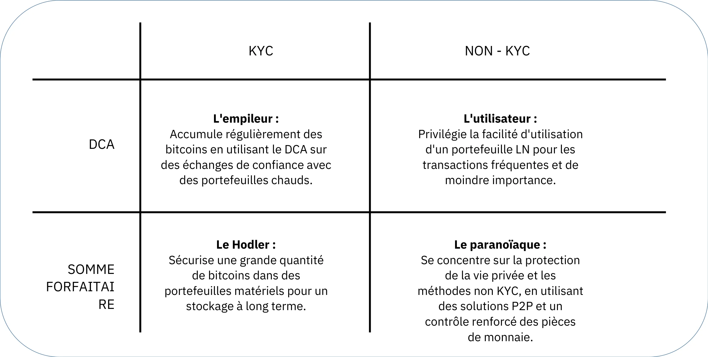

कुछ होल्डर्स हाइब्रिड तरीका भी अपनाते हैं, DCA (डॉलर कॉस्ट एवरेजिंग) का इस्तेमाल करके—यानी मार्केट के उतार-चढ़ाव को कम करने के लिए थोड़ा-थोड़ा करके नियमित खरीदारी करते रहना।

#### 3. उत्तराधिकार योजना बनाना

यह अक्सर नज़रअंदाज़ कर दिया जाता है। लेकिन Bitcoin बिल्कुल बेरहम है; अगर आपके प्राइवेट कीज़ खो जाएं, तो आपके सिक्के हमेशा के लिए चले जाएंगे। अक्षमता या मौत की स्थिति के लिए पहले से योजना बनाना बेहद ज़रूरी है।

मुख्य कदम:

- # Bitcoin तक पहुँचने का विस्तृत गाइड (अगर आप इसे एक्सेस नहीं कर पा रहे हैं)  

अगर आप अपने **Bitcoin** को एक्सेस नहीं कर पा रहे हैं, तो नीचे दिए गए स्टेप्स को फॉलो करें:  

## 1. **बेसिक चेकलिस्ट**  
✅ **इंटरनेट कनेक्शन:** सुनिश्चित करें कि आपका डिवाइस स्टेबल नेटवर्क से कनेक्ट है।  
✅ **लॉगिन क्रेडेंशियल्स:** सही यूजरनेम/पासवर्ड डालें (कैप्स लॉक चेक करें)।  
✅ **सिस्टम रिक्वायरमेंट्स:** Bitcoin के लिए मिनिमम सिस्टम रिक्वायरमेंट्स पूरी होनी चाहिए।  

## 2. **पासवर्ड रिकवरी**  
अगर पासवर्ड भूल गए हैं:  
- **"Forgot Password?"** लिंक पर क्लिक करें।  
- रजिस्टर्ड ईमेल/फोन नंबर पर OTP या रिसेट लिंक प्राप्त करें।  
- नया पासवर्ड सेट करें और फिर से लॉगिन करें।  

## 3. **ब्राउज़र/एप इश्यू**  
- **कैश & कुकीज क्लियर करें** (Chrome/Firefox/Safari में)।  
- **ब्राउज़र अपडेट करें** या दूसरा ब्राउज़र ट्राई करें (जैसे Edge, Opera)।  
- अगर मोबाइल एप से एक्सेस कर रहे हैं, तो **एप को रीइंस्टॉल** करें।  

## 4. **फायरवॉल/एंटीवायरस चेक**  
- हो सकता है आपका **फायरवॉल या एंटीवायरस Bitcoin को ब्लॉक** कर रहा हो।  
- टेम्पररी के लिए फायरवॉल डिसेबल करके चेक करें (सिर्फ टेस्टिंग के लिए)।  

## 5. **डिवाइस/नेटवर्क रिस्ट्रिक्शन**  
- अगर ऑफिस/कॉलेज नेटवर्क पर हैं, तो **Bitcoin ब्लॉक** हो सकता है।  
- **मोबाइल डेटा या VPN** का इस्तेमाल करके ट्राई करें।  

## 6. **सपोर्ट से संपर्क करें**  
अगर ऊपर दिए गए सभी स्टेप्स काम नहीं करते, तो:  
📞 **Bitcoin सपोर्ट हेल्पलाइन:** [यहाँ नंबर/लिंक डालें]  
📧 **ईमेल:** support@gw490.example.com पर अपनी डिटेल्स (यूजर आईडी, एरर मैसेज) भेजें।  

### **नोट:**  
- Bitcoin में **मेंटेनेंस/डाउनटाइम** भी हो सकता है, इसलिए ऑफिशियल सोशल मीडिया/वेबसाइट चेक करें।  
- अगर आपका अकाउंट **सस्पेंड/लॉक** है, तो सपोर्ट टीम से सीधे बात करें।  

**होपफुली, ये स्टेप्स आपको Bitcoin तक पहुँचने में मदद करेंगे!** 🚀
- मल्टीसिग्नेचर सेटअप का इस्तेमाल करें ताकि एक्सेस मिल सके और नुकसान का खतरा भी कम हो जाए;
- किसी भरोसेमंद इंसान के साथ ज़रूरी जानकारी साझा करें।

इस कोर्स के आखिरी हिस्से में हम वसीयत की योजना (इनहेरिटेंस प्लानिंग) पर और गहराई से बात करेंगे।

#### 4. चक्रों के दौरान धैर्य बनाए रखें

होडलिंग का मतलब है लंबे समय तक खेल खेलना। आपको प्राइस क्रैश और यूफोरिक बुल मार्केट दोनों में ही शांत रहना होगा।

कुछ बेहतरीन तरीके:

- अपने Wallet को समय-समय पर चेक करें; लेकिन बहुत बार नहीं। लगातार निगरानी करने से भावनात्मक फैसले होते हैं;
- बाज़ार में गिरावट के दौरान घबराकर शेयर न बेचें। ये सुधार तो खेल का हिस्सा हैं;
- Bitcoin की खबरों से अपडेट रहें, लेकिन मीडिया के चक्कर में न पड़ें, खासकर मंदी के दौरान;
- समय-समय पर अपने रिकवरी फ्रेज़ की सुरक्षा जाँचें। देखें कि क्या लिफाफे में छेड़छाड़ नहीं हुई है और क्या वह अभी भी पढ़ने लायक है। अगर कुछ भी गड़बड़ लगे, तो generate से नया बैकअप बना लें।

अपने होल्डिंग्स को प्राइवेट कीज़ को कम्प्रोमाइज़ किए बिना मॉनिटर करने के लिए, Watch-only wallet का इस्तेमाल करें। यह सिर्फ आपके पब्लिक कीज़ से बैलेंस और ट्रांजैक्शन्स को ट्रैक करने देता है।

https://planb.network/tutorials/wallet/mobile/blockstream-green-watch-only-66c3bc5a-5fa1-40ef-9998-6d6f7f2810fb

होल्डर की रणनीति सरल लेकिन ताकतवर है: खरीदो, सुरक्षित रखो, और भूल जाओ। असली चुनौती तकनीकी नहीं है; यह मानसिक है। सबसे मुश्किल हिस्सा है जल्दी बेचने की इच्छा या कीमत गिरने पर घबराहट को रोकना। लेकिन अगर आप अनुशासित रहें और लंबे समय के बारे में सोचें, तो होल्डिंग समय के साथ मूल्य बचाने और धन बनाने का एक विश्वसनीय तरीका साबित हुआ है।

### अपना होल्डर प्रोफाइल चेक करें

अगर तुम इन व्यक्तित्व लक्षणों में खुद को पहचानते हो, तो शायद तुम एक सहज हॉडलर हो:

- **धैर्य**: एक होडलर असाधारण धैर्य दिखाता है। वे Bitcoin को सालों (कभी-कभी दशकों तक) रोककर रखने को तैयार रहते हैं, बिना रोज़ के भाव उतार-चढ़ाव से घबराए। वे समझते हैं कि Bitcoin चक्रों में चलता है और कीमत गिरने पर घबराते नहीं। सुधार तो इस खेल का हिस्सा हैं। होडलर्स के लिए, मूल्य महीनों में नहीं, बल्कि लंबे समय में मापा जाता है।
- **लंबी अवधि का नजरिया** : होल्डर छोटे-मोटे मुनाफे से कहीं आगे की सोचता है। उन्हें Bitcoin की संरचनात्मक वृद्धि और धीरे-धीरे वैश्विक स्वीकृति पर भरोसा है। उतार-चढ़ाव के बावजूद, उन्हें एक ऊपर की ओर बढ़ती राह दिखती है; विस्तार के बाद मजबूती की। उनके लिए, Bitcoin एक टिकाऊ संपत्ति है, महंगाई के खिलाफ सुरक्षा, और एक बड़े मौद्रिक क्रांति का अहम हिस्सा।
- **आत्म-अनुशासन**: होल्डर माइंडसेट के लिए मानसिक अनुशासन बहुत जरूरी है। विडंबना यह है कि उनकी सबसे बड़ी चुनौती कुछ न करने की होती है। वे प्राइस बढ़ने पर बेचने के आग्रह को रोकते हैं और क्रैश के दौरान डर के आगे झुकते नहीं। वे समझते हैं कि Bitcoin ने कई क्रूर बियर मार्केट्स झेले हैं; और जो लोग इस दर्द को सहकर होल्ड करते हैं, अक्सर सबसे ज्यादा फायदा उठाते हैं।
- **भावनात्मक लचीलापन** : Bitcoin की कीमत कुछ हफ्तों में 50% या उससे भी ज्यादा गिर सकती है; फिर भी, होल्डर शांत रहता है। उन्होंने यह समझ लिया है कि उतार-चढ़ाव Bitcoin की बुनियादी ताकत को कम नहीं करते। यह भावनात्मक मजबूती उन्हें अनिश्चितता के दौरान संयम बनाए रखने और दूसरों के घबराने पर तर्कसंगत नजरिया बनाए रखने में मदद करती है।
- टेक्नोलॉजी में विश्वास**: होल्डर्स Bitcoin को सिर्फ एक सट्टेबाज़ी की संपत्ति नहीं मानते। वे इसकी टेक्नोलॉजी और इसके विघटनकारी (disruptive) पोटेंशियल पर यकीन रखते हैं। कई लोगों के लिए, यह सिर्फ पैसे की बात नहीं है; यह आज़ादी की बात है। Bitcoin को एक मजबूत, गैर-राजनीतिक मुद्रा और पारंपरिक बैंकिंग का वास्तविक विकल्प माना जाता है, जो व्यक्तियों को अधिक वित्तीय संप्रभुता (financial sovereignty) प्रदान करता है।

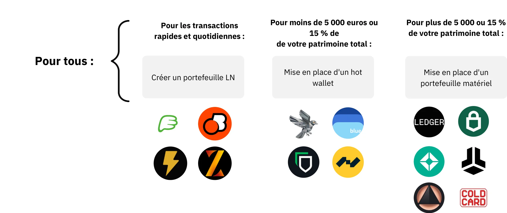

होडलिंग सरल, प्रभावी और सबके लिए सुलभ है; यहाँ तक कि नौसिखियों के लिए भी।

अगले अध्याय में, हम एक ऐसे ही परंतु अधिक सक्रिय प्रोफाइल को देखेंगे: स्टैकर।

## स्टैकर: सतोशी जमा करना

<chapterId>0daf450d-1b91-5d99-9c31-b52ab52a5e21</chapterId>

Bitcoin इकोसिस्टम में, एक स्टैकर वह होता है जो सतोशी (या "Sats") जो Bitcoin की सबसे छोटी इकाई है, को लगातार और लंबे समय तक जमा करने का तरीका अपनाता है। बड़ी राशि एक साथ निवेश करने के बजाय, एक स्टैकर नियमित रूप से Bitcoin की छोटी मात्रा खरीदता है, चाहे बाजार की स्थिति कुछ भी हो।

विचार सीधा है: कुल मिलाकर सिर्फ 21 मिलियन बिटकॉइन ही होंगे, और हर छोटा सा हिस्सा मायने रखता है। स्टैकर का मकसद है जितना हो सके Sats को धीरे-धीरे जमा करते जाना।

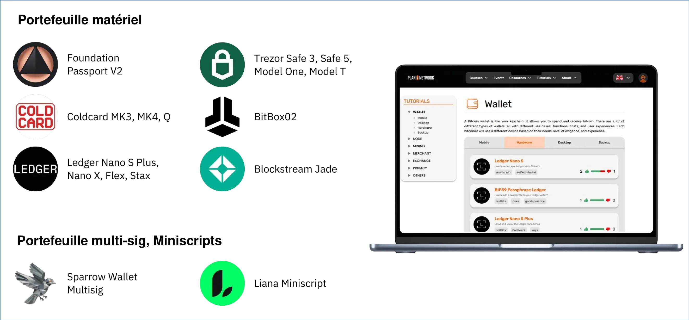

### स्टैकिंग स्ट्रैटेजी क्यों चुनें?

स्टैकिंग एक बेहद कारगर निवेश रणनीति है, खासकर उन लोगों के लिए जो बाजार की उठापटक से बचते हुए धीरे-धीरे Bitcoin की पोजीशन बनाना चाहते हैं। एकमुश्त निवेश या सट्टेबाजी वाली मार्केट टाइमिंग के उलट, स्टैकर्स आमतौर पर "डॉलर-कॉस्ट एवरेजिंग" (DCA) तकनीक अपनाते हैं - यानी Bitcoin की मौजूदा कीमत चाहे जो भी हो, नियमित अंतराल पर (रोज, हफ्ते में, महीने में...) एक तय रकम का निवेश करते रहना।

स्टैकिंग के फायदे :

- **कम उतार-चढ़ाव**: नियमित खरीदारी की वजह से कीमतों के उतार-चढ़ाव कम होते हैं, क्योंकि आप Sats ज्यादा खरीदते हैं जब कीमतें कम होती हैं और कम खरीदते हैं जब कीमतें ज्यादा होती हैं; इससे आपकी औसत लागत कम होती है और तनाव भी घटता है।
- पहुंच में आसानी**: आपको शुरुआत में बड़ी पूंजी की जरूरत नहीं है। आप महीने में सिर्फ €10 से भी शुरू कर सकते हैं और धीरे-धीरे अपने DCA की रकम बढ़ा सकते हैं।
- अनुशासन और स्वचालन** : स्टैकर्स भावनात्मक फैसले लेने से बचते हैं। स्वचालित नियमित खरीदारी से निरंतरता बनी रहती है और आवेगपूर्ण कदमों का जोखिम कम होता है।
- लॉन्ग-टर्म स्ट्रैटेजी**: धीरे-धीरे निवेश करने से बुल मार्केट (तेजी के दौर) का फायदा उठाने के चांस बढ़ जाते हैं, साथ ही मंदी के समय में रिस्क भी कम होता है।

यह तरीका **शुरुआती लोगों के लिए बिल्कुल सही है**; इसमें मार्केट का सही समय निकालने का प्रेशर नहीं होता और धीरे-धीरे, बिना ज्यादा मेहनत के इन्वेस्टमेंट बढ़ता रहता है।

### स्टैकर का निवेश योजना

लक्ष्य है Bitcoin को लंबे समय तक जमा करने के लिए एक टिकाऊ, स्वचालित और सुरक्षित रणनीति बनाना। आपके स्टैकर निवेश योजना को लागू करने के मुख्य कदम यहां दिए गए हैं:

#### 1. सही प्रकार का Wallet चुनना

एक स्टैकर को Wallet सेटअप चाहिए जो आसान इस्तेमाल के साथ-साथ लंबे समय तक सुरक्षा भी दे।

- Hot Wallet** : शुरुआती लोगों के लिए बिल्कुल सही, मोबाइल या डेस्कटॉप वॉलेट्स से आप आसानी से Sats प्राप्त कर सकते हैं और पेमेंट्स कर सकते हैं। हालांकि, ये छोटी रकमों के लिए ज्यादा अच्छे हैं। On-Chain वॉलेट्स को लाइटनिंग वॉलेट्स की तुलना में बेहतर UTXO मैनेजमेंट की वजह से स्टैकिंग के लिए प्राथमिकता दी जाती है। रिकमेंडेड सॉफ्टवेयर वॉलेट्स: Green Wallet, ब्लू Wallet, स्पैरो Wallet, बिटकिट, ननचुक, Aqua, प्रोटॉन

https://planb.network/tutorials/wallet/mobile/aqua-8e6d7dd3-8c03-45cc-90dd-fe3899a7d125

https://planb.network/tutorials/wallet/mobile/Bitkit-Wallet-a7224674-85c4-4045-9baf-37018d89550c

https://planb.network/tutorials/wallet/mobile/blockstream-green-e84edaa9-fb65-48c1-a357-8a5f27996143

https://planb.network/tutorials/wallet/desktop/blockstream-green-desktop-c1503adf-1404-4328-b814-aa97fcf0d5da

https://planb.network/tutorials/wallet/mobile/blue-wallet-2f4093da-6d03-4f26-8378-b9351d0dbc90

https://planb.network/tutorials/wallet/mobile/nunchuk-fc1b553f-5298-4e75-9f34-8af19025f1b1

https://planb.network/tutorials/wallet/desktop/proton-wallet-0bee0bba-ab62-4db0-8c63-b2ad698ca178

https://planb.network/tutorials/wallet/desktop/sparrow-c674e2ac-d46f-4c82-92a7-7d1b0e262f5d

- Hardware Wallet**: जैसे-जैसे आपके Bitcoin होल्डिंग्स बढ़ते हैं, चोरी के जोखिम को कम करने के लिए Cold Wallet के साथ अपने फंड्स को सुरक्षित करना ज़रूरी है। एक सीरियस स्टैकर नियमित रूप से अपने फंड्स को Hot Wallet से Hardware Wallet में ट्रांसफर करता है। उदाहरण: बिटबॉक्स02, ट्रेज़र, Ledger, कोल्डकार्ड, जेड...

https://planb.network/tutorials/wallet/hardware/coldcard-q-73e86d1a-6fe6-4d8b-bb15-8690298020e3

https://planb.network/tutorials/wallet/hardware/jade-plus-green-873099a4-35ec-4be8-b31a-6e7cd6a41ec0

https://planb.network/tutorials/wallet/hardware/ledger-nano-s-plus-75043cb3-2e8e-43e8-862d-ca243b8215a4

https://planb.network/tutorials/wallet/hardware/ledger-flex-3728773e-74d4-4177-b39f-bd923700c76a

https://planb.network/tutorials/wallet/hardware/passport-74e53858-3fa2-43f9-b866-573297546236

https://planb.network/tutorials/wallet/hardware/bitbox02-6af8940f-e19b-4008-8c83-81017032608c

सबसे असरदार तरीका है दोनों का इस्तेमाल: रोज़मर्रा के स्टैकिंग के लिए Hot Wallet और लॉन्ग-टर्म Cold स्टोरेज के लिए Hardware Wallet का। Hot Wallet इस्तेमाल में आसान और सुविधाजनक है। यह आपको जल्दी से अपने बिटकॉइन्स पर कब्ज़ा करने देता है, बजाय उन्हें प्लेटफॉर्म पर छोड़ने के जहाँ उन्हें खतरा हो सकता है। हालाँकि, Hardware Wallet की तुलना में, Hot Wallet बहुत कम सुरक्षा प्रदान करता है। इसलिए स्टैकर को चाहिए कि वह नियमित रूप से अपने फंड्स को अपने Cold Wallet में ट्रांसफर करके अपनी लॉन्ग-टर्म बचत को सुरक्षित करे और ज़्यादा फंड्स Hot Wallet में रखने से बचे। समय-समय पर, स्टैकर Cold स्टोरेज में ट्रांसफर करते समय UTXOs को मिलाता (consolidate) है; छोटे इनपुट्स को मर्ज करके भविष्य के ट्रांजैक्शन फीस को ऑप्टिमाइज़ करने के लिए।

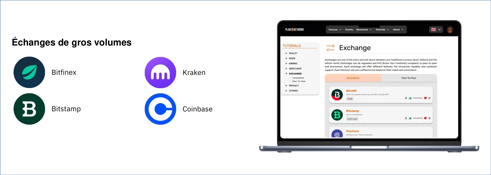

#### 2. डीसीए खरीदारी योजना सेट अप करें

डॉलर-कॉस्ट एवरेजिंग (DCA) एक निवेश रणनीति है जहां आप Bitcoin की छोटी मात्राएं नियमित अंतराल पर खरीदते हैं, चाहे उसकी कीमत कुछ भी हो। एक प्रभावी DCA योजना बनाने के लिए, आपको दो मुख्य Elements को परिभाषित करने की आवश्यकता है:

- खरीदारी की आवृत्ति**: साप्ताहिक, पखवाड़े में एक बार, या मासिक; अपनी आय और लक्ष्यों के आधार पर चुनें। अगर इससे बहुत सारे छोटे-छोटे UTXO बनते हैं जिन्हें बाद में खर्च करना महंगा पड़े, तो बहुत बार खरीदने से बचें। यह आपके बजट और जोखिम सहनशीलता पर निर्भर करता है।  

नियमितता रकम से ज़्यादा महत्वपूर्ण है; लंबे समय तक मामूली रकम जमा करना बेहतर है, बजाय ज़्यादा करने का वादा करके छोड़ देने के। स्वाभाविक है, आपकी वित्तीय स्थिति के अनुसार DCA रकम को समय-समय पर समायोजित किया जा सकता है।

अगला, आपके पास DCA सेट करने के दो विकल्प हैं: इसे ऑटोमेट करना या मैन्युअली मैनेज करना। ज़्यादातर रेगुलेटेड ट्रेडिंग प्लेटफॉर्म अब DCA को ऑटोमेट करने का ऑप्शन देते हैं। आपके अकाउंट में पर्याप्त फिएट होने पर, प्लेटफॉर्म आपके द्वारा सेट किए गए पैरामीटर्स के आधार पर आपके बाय ऑर्डर को अपने आप एक्ज़ीक्यूट कर देगा। साथ ही, DCA ऑटोमेशन के लिए समर्पित प्लेटफॉर्म्स की संख्या भी बढ़ रही है, जो आपके सेल्फ-कस्टडी Wallet में ऑटोमैटिक विथड्रॉल या आपके रोज़ के खर्चों को राउंड ऑफ करने जैसी अतिरिक्त सर्विसेज़ भी ऑफर करते हैं। अगर आप कोई रेगुलेटेड प्लेटफॉर्म यूज़ कर रहे हैं, तो मैं आपके दैनिक प्रबंधन में ज़्यादा शांति के लिए DCA को ऑटोमेट करने की सलाह दूंगा।

डीसीए प्लेटफॉर्म के उदाहरण:

https://planb.network/tutorials/exchange/centralized/bitstack-29fd71be-9570-42c6-8f6f-cd355d62e746

https://planb.network/tutorials/exchange/centralized/relai-v2-30a9671d-e407-459d-9203-4c3eae15b30e

https://planb.network/tutorials/exchange/centralized/stackinsat-5af6a380-f3c6-4246-9f81-9957a16ab066

मुख्यधारा के एक्सचेंज जो डीसीए (DCA) को सपोर्ट करते हैं:

https://planb.network/tutorials/exchange/centralized/bitfinex-dc306d39-bd96-4ab9-a278-a322316716db

https://planb.network/tutorials/exchange/centralized/bitstamp-5a36c896-bff5-46d7-b505-ff069c3ac47c

https://planb.network/tutorials/exchange/centralized/bull-bitcoin-europe-0ccf713e-efcd-44ec-8205-211f49ac7d53

https://planb.network/tutorials/exchange/centralized/kraken-1ef03e25-9b42-49bd-a47d-249e1a13cfc6

https://planb.network/tutorials/exchange/centralized/paymium-92603f76-b985-49ce-81e5-f4fa0df776e5

स्टैकर्स अपनी प्राइवेसी बढ़ाना भी चाह सकते हैं, भले ही यह उनका मुख्य लक्ष्य न हो। ऐसे में, उन्हें रेगुलेटेड प्लेटफॉर्म्स के बाहर P2P अधिग्रहण विधि का उपयोग करने पर विचार करना चाहिए। ऑटोमेटेड DCA खरीदारी के विपरीत, इन तरीकों में आपको अपनी खरीदारी की रणनीति मैन्युअली मैनेज करनी होती है, इसलिए ट्रैक पर बने रहने के लिए अनुशासन जरूरी है।

https://planb.network/tutorials/exchange/peer-to-peer/bisq-v2-c1c6a702-6c16-4101-8b90-62c424017b80

https://planb.network/tutorials/exchange/peer-to-peer/hodlhodl-d7344cd5-6b18-40f5-8e78-2574a93a3879

https://planb.network/tutorials/exchange/peer-to-peer/lnp2pbot-v2-e6bcb210-610b-487d-970c-7cce85273e3c

https://planb.network/tutorials/exchange/peer-to-peer/peach-c6143241-d900-4047-9b73-1caba5e1f874

https://planb.network/tutorials/exchange/peer-to-peer/robosats-b60e4f7c-533a-4295-9f6d-5368152e8c06

#### 3. बिटकॉइन निकालना और सुरक्षित करना

एक बार आपकी खरीदारी की रणनीति तैयार हो जाए, तो बस अपना Bitcoin को Exchange से निकालकर नियमित रूप से Hardware Wallet में ट्रांसफर कर दें। इससे पूर्ण स्व-अभिरक्षा और दीर्घकालिक सुरक्षा सुनिश्चित होती है।

#### 4. कई चक्रों का इंतज़ार करना

स्टैकर्स सालों में सोचते हैं, महीनों में नहीं। होडलर्स की तरह, उन्हें मार्केट क्रैश के दौरों में घबराहट या बुल रन के दौरों में उत्साह से बचना चाहिए।

मुख्य आदतें:

- बार-बार अपने बटुए ना चेक करो, तनाव से बचने के लिए;
- मंदी में बेचो मत; सुधार तो होते ही रहते हैं;
- Bitcoin टेक अपडेट्स के बारे में जानकारी रखें;
- समय-समय पर अपने seed बैकअप और Hardware Wallet की स्थिति जांचें: अब जब आपके वॉलेट सेटअप हो चुके हैं, तो नियमित निगरानी करना ज़रूरी है। समय-समय पर जांचें कि क्या आपका Mnemonic फ्रेज़ अभी भी अपने स्टोरेज लोकेशन पर मौजूद है और क्या इसका ओपेक लिफाफा खुला तो नहीं है। इन जांचों के दौरान, आप मीडिया की हालत देखने के लिए लिफाफा भी खोल सकते हैं। सुनिश्चित करें कि यह खराब नहीं हुआ है और वाक्य अभी भी पूरी तरह से पढ़ने योग्य है। अगर कोई नुकसान के संकेत दिखें, तो अपने Hardware Wallet से एक नई कॉपी बनाना सबसे अच्छा होगा। आप अपने हार्डवेयर वॉलेट्स की भी नियमित जांच कर सकते हैं।

सुरक्षा से समझौता किए बिना आसानी से निगरानी के लिए, Watch-only wallet को पब्लिक की का उपयोग करके बैलेंस ट्रैक करने के लिए सेट अप करें।

https://planb.network/tutorials/wallet/mobile/blockstream-green-watch-only-66c3bc5a-5fa1-40ef-9998-6d6f7f2810fb

### अपने स्टैकर प्रोफाइल का मूल्यांकन करें

सफल स्टैकर्स में ये गुण होते हैं:

- संगठन**: बजट पर टिके रहो, अपनी योजना से न भटको। स्टैकर्स को यह सुनिश्चित करना चाहिए कि उनकी संचय योजना कई सालों तक टिकाऊ हो।
- अनुशासन**: बाजार के शोर-शराबे पर प्रतिक्रिया दिए बिना अपने शेड्यूल का पालन करें। नियमितता, आवेगपूर्ण समायोजनों से ऊपर होती है। हालांकि, फिर भी उचित समायोजन करना संभव है।
- **धैर्य**: स्टैकिंग का फल तुरंत नहीं मिलता। यह रणनीति लंबे समय में ही काम करती है, कई बार सालों लग जाते हैं ठोस नतीजे देखने के लिए। जो लोग सफल होते हैं, वे वही होते हैं जो धैर्य रख पाते हैं और छोटे-मोटे उतार-चढ़ाव से प्रभावित नहीं होते।
- **वित्तीय ज्ञान**: डीसीए (DCA), जोखिम प्रबंधन और जीडब्ल्यू-538 (Bitcoin) बाजार के मूल सिद्धांतों की मजबूत समझ आपको आत्मविश्वास के साथ निवेश करने में मदद करती है। एक जागरूक निवेशक (stacker) उच्च अस्थिरता के दौरान संदेहों का विरोध करने और आवेगपूर्ण निर्णय लेने से बचने के लिए बेहतर ढंग से सुसज्जित होता है।
- **लंबे समय का नजरिया**: एक स्टैकर Bitcoin की तकनीकी क्षमता पर पूरा भरोसा रखता है। उनका ध्यान कम समय के भाव उतार-चढ़ाव पर नहीं, बल्कि सालों तक धीरे-धीरे अपने होल्डिंग्स बढ़ाने पर होता है।

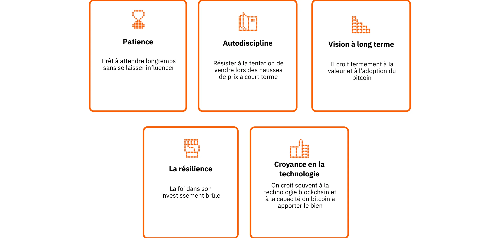

संक्षेप में, स्टैकिंग उनके लिए आदर्श है जो समय के साथ Bitcoin पोजीशन बनाना चाहते हैं, अस्थिरता के जोखिम को कम करना चाहते हैं, और पूर्ण संप्रभुता बनाए रखना चाहते हैं; बिना चार्ट्स में उलझे रहने के।

अगला: हम एक बिल्कुल अलग बिटकॉइनर प्रोफाइल को देखेंगे; एक्टिव यूज़र।

## एक्टिव Bitcoin यूज़र: रोज़मर्रा की ज़िंदगी में Bitcoin को शामिल करना

<chapterId>e0a022ab-207c-571f-b4ad-c432214a756c</chapterId>

Bitcoin का एक्टिव यूज़र बनने का मतलब है लॉन्ग-टर्म इन्वेस्टमेंट स्ट्रैटेजी से आगे निकल जाना। होडलर या स्टैकर की तरह सिर्फ़ सेव करके बैठे रहने वालों से अलग, एक्टिव यूज़र Bitcoin को Exchange** का असली माध्यम मानते हैं। वे इससे सामान और सेवाओं के लिए पेमेंट करते हैं और काउंटर-इकॉनमी में एक्टिवली हिस्सा लेते हैं।

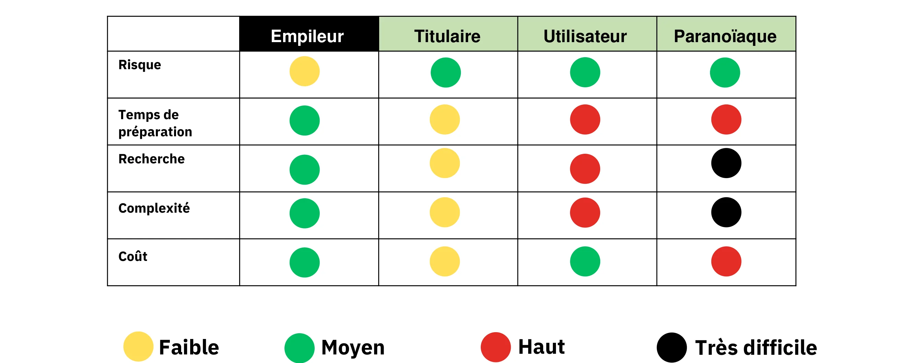

### एक्टिव यूजर स्ट्रैटेजी अपनाने की क्या वजह है?

Bitcoin का रोज़ाना इस्तेमाल करने से व्यक्तिगत और सामूहिक दोनों तरह के फायदे होते हैं:

- **Bitcoin इकोसिस्टम को अपनाकर सपोर्ट करें** :  

*(Note: "Bitcoin" retained as a proper noun, assuming it's a product/tech name. "Ecosystem" translated contextually for colloquial Hindi, and "adoption" adapted as "अपनाकर" for natural flow.)*

हर लेन-देन Bitcoin की मुद्रा के रूप में वैधता को मजबूत करता है और ज्यादा व्यापारियों और सेवाओं को इसे स्वीकार करने के लिए प्रोत्साहित करता है। Bitcoin का उपयोग करना इसकी उपयोगिता के लिए एक वोट डालने जैसा है। पैसे की कीमत उसकी व्यापार को सुगम बनाने की क्षमता से आती है; वस्तु-विनिमय से नहीं। अगर कोई व्यापारी किसी मुद्रा को स्वीकार नहीं करता, तो उसकी कोई वास्तविक कीमत नहीं होती। जितनी ज्यादा वस्तुएं और सेवाएं आप इससे खरीद सकते हैं, यह उतनी ही ज्यादा उपयोगी बन जाती है। Bitcoin में भुगतान करके, आप उन व्यापारियों की ओर मूल्य को निर्देशित कर रहे हैं जो इसे स्वीकार करते हैं। इससे उनका मुनाफा बढ़ता है और समय के साथ, उन प्रतिस्पर्धियों का मुनाफा कम हो सकता है जो इसे अस्वीकार करते हैं। एक समुदाय में, यह गतिशीलता Bitcoin के व्यापक स्वीकृति को बढ़ावा दे सकती है और इसके अपनाने के एक सकारात्मक चक्र में योगदान कर सकती है।

- **Bitcoin के खास फीचर्स का फायदा उठाएं** :

जीडब्ल्यू-549 कई शक्तिशाली फीचर्स प्रदान करता है, जैसे कि जीडब्ल्यू-548 के जरिए फास्ट ट्रांजैक्शन, सेंसरशिप से आजादी, फाइनेंशियल सर्विलांस से मुक्ति, और सिग्नोरेज से छुटकारा। इसका मुख्य मूल्य यह है कि यह पैसे (जीडब्ल्यू-550) पर सरकारी कंट्रोल को खत्म करता है और अनसेंसरेबल ट्रांजैक्शन को संभव बनाता है। अगर ये फायदे आपकी पर्सनल जरूरतों और वैल्यूज से मेल खाते हैं, तो हो सकता है कि एक्टिव यूजर प्रोफाइल आपके लिए बिल्कुल सही हो।

- **करके सीखो**

Bitcoin का एक्टिव इस्तेमाल करने से आपको रियल-वर्ल्ड एक्सपीरियंस मिलता है। आप Wallet टाइप्स, पेमेंट प्राइवेसी और UTXO मैनेजमेंट से परिचित हो जाओगे। रोज़ाना इस्तेमाल करना ही प्रैक्टिकल सीखने का तरीका बन जाता है।

चुनौतियों में तकनीकी जटिलता, कीमतों में उतार-चढ़ाव, और फंड्स के नुकसान को रोकने के लिए अच्छी सुरक्षा व्यवस्था की जरूरत शामिल हैं।

### एक सक्रिय उपयोगकर्ता के लिए निवेश योजना

Bitcoin को रोज़मर्रा के भुगतान के लिए अपनाने के लिए एक सोच-समझकर और व्यवस्थित तरीके की ज़रूरत होती है। एक Hodler या Stacker के विपरीत, Active User को अपने फंड की लंबी अवधि की सुरक्षा और दैनिक लेन-देन की सुविधा दोनों को मैनेज करना पड़ता है। सुरक्षित Cold स्टोरेज और खर्च करने के लिए फंड तक आसान पहुंच के बीच सही संतुलन बनाना इस रणनीति को प्रभावी ढंग से काम करने के लिए बेहद ज़रूरी है।

#### 1. वॉलेट का साफ़ अलगाव

एक्टिव यूज़र्स को सुरक्षा और सुविधा का बैलेंस बनाने के लिए दो अलग-अलग तरह के वॉलेट्स का इस्तेमाल करना चाहिए:

- एक Cold Wallet (Hardware Wallet) लंबे समय तक बचत सुरक्षित करने के लिए।

https://planb.network/tutorials/wallet/hardware/coldcard-q-73e86d1a-6fe6-4d8b-bb15-8690298020e3

https://planb.network/tutorials/wallet/hardware/jade-plus-green-873099a4-35ec-4be8-b31a-6e7cd6a41ec0

https://planb.network/tutorials/wallet/hardware/ledger-nano-s-plus-75043cb3-2e8e-43e8-862d-ca243b8215a4

https://planb.network/tutorials/wallet/hardware/ledger-flex-3728773e-74d4-4177-b39f-bd923700c76a

https://planb.network/tutorials/wallet/hardware/passport-74e53858-3fa2-43f9-b866-573297546236

https://planb.network/tutorials/wallet/hardware/bitbox02-6af8940f-e19b-4008-8c83-81017032608c

https://planb.network/tutorials/wallet/hardware/portal-bd6e83f0-0100-4689-aeb3-513cca944ace

https://planb.network/tutorials/wallet/hardware/satochip-e9bc81d9-d59b-420d-9672-3360212237ba

https://planb.network/tutorials/wallet/hardware/seed-signer-ee2c284a-0e23-49a4-b0ca-4a4702072973

https://planb.network/tutorials/wallet/hardware/tapsigner-ab2bcdf9-9509-4908-9a4a-2f2be1e7d5d2

- एक या एक से ज़्यादा मोबाइल Hot वॉलेट रोज़मर्रा के लेन-देन के लिए। आमतौर पर, एक सक्रिय यूज़र के पास On-Chain, Hot, Wallet और एक लाइटनिंग Wallet दोनों होंगे।

https://planb.network/tutorials/wallet/mobile/aqua-8e6d7dd3-8c03-45cc-90dd-fe3899a7d125

https://planb.network/tutorials/wallet/mobile/Bitkit-Wallet-a7224674-85c4-4045-9baf-37018d89550c

https://planb.network/tutorials/wallet/mobile/blink-7ea5f5a4-e728-4ff9-b3f9-cf20aa6fc2bd

https://planb.network/tutorials/wallet/mobile/blixt-04b319cf-8cbe-4027-b26f-840571f2244f

https://planb.network/tutorials/wallet/mobile/blockstream-green-e84edaa9-fb65-48c1-a357-8a5f27996143

https://planb.network/tutorials/wallet/mobile/blue-wallet-2f4093da-6d03-4f26-8378-b9351d0dbc90

https://planb.network/tutorials/wallet/mobile/breez-46a6867b-c74b-45e7-869c-10a4e0263c06

https://planb.network/tutorials/wallet/mobile/lipa-61019fbd-deb7-4b3c-8cda-0402a4b2e780

https://planb.network/tutorials/wallet/mobile/nunchuk-fc1b553f-5298-4e75-9f34-8af19025f1b1

https://planb.network/tutorials/wallet/mobile/phoenix-0f681345-abff-4bdc-819c-4ae800129cdf

https://planb.network/tutorials/wallet/mobile/wallet-of-satoshi-39149d86-e42b-4e8f-ae9f-7e061e7784f7

https://planb.network/tutorials/wallet/mobile/zeus-3e89603c-501d-439c-8691-d4a0d0de459b

इस तरह से अपने पैसे अलग रखने से रिस्क कम होता है, अगर रोज़मर्रा के भुगतान के लिए इस्तेमाल होने वाला Wallet किसी वजह से कम्प्रोमाइज़ हो जाए।

#### 2. अपना खुद का नोड सेट करें

एक्टिव यूज़र्स अक्सर अपनी निजी परिस्थितियों के आधार पर, भरोसेमंद तीसरे पक्षों पर निर्भरता कम करने की कोशिश करते हैं। इसका सबसे कारगर तरीका है अपना खुद का Bitcoin नोड चलाना। ऐसा करने से वे नेटवर्क को स्वतंत्र रूप से इस्तेमाल कर पाते हैं और साथ ही अपने लेन-देन की प्राइवेसी भी बढ़ा पाते हैं।

https://planb.network/tutorials/node/bitcoin/bitcoin-core-linux-568c13a6-8746-4d63-8e95-f4a61c5ae0ed

https://planb.network/tutorials/node/bitcoin/bitcoin-core-mac-windows-9684ab02-e0af-41c9-8102-86ac7c7727f3

https://planb.network/tutorials/node/bitcoin/bitcoin-knots-e04b2196-4df2-4246-86ef-c02269c29098

https://planb.network/tutorials/node/bitcoin/raspiblitz-d8cdba2e-a682-46cf-9fdc-d8602fbeac02

https://planb.network/tutorials/node/bitcoin/mynode-a481fef3-2fd3-4df3-91c0-112cffa094eb

https://planb.network/tutorials/node/bitcoin/start9-8c8b6827-8423-4929-bcba-89057670ed6a

जो लोग नियमित रूप से Lightning Network का इस्तेमाल करते हैं, उनके लिए अपना खुद का LND, LDK, या Core-Lightning नोड मैनेज करना एक स्मार्ट मूव हो सकता है। इससे उन्हें चैनल्स खोलने और बंद करने का पूरा कंट्रोल मिलता है, सेल्फ-सॉवरेन्टी बढ़ती है, और यहाँ तक कि ट्रांजैक्शन फीस कम करने में भी मदद मिल सकती है; खासकर जब आप Phoenix जैसे ऑटोमेटेड सॉल्यूशंस या उससे भी बदतर, कस्टोडियल लाइटनिंग वॉलेट्स से तुलना करते हैं।

https://planb.network/tutorials/node/lightning-network/alby-hub-62e6356c-6a6d-4134-8f22-c3b6afb9882a

#### 3. नियमित Bitcoin की खरीदारी

एक्टिव यूजर्स को अपनी लॉन्ग-टर्म सेविंग्स और रोज़मर्रा के इस्तेमाल के लिए रखे गए Bitcoin की मात्रा के बीच संतुलन बनाने की ज़रूरत है।

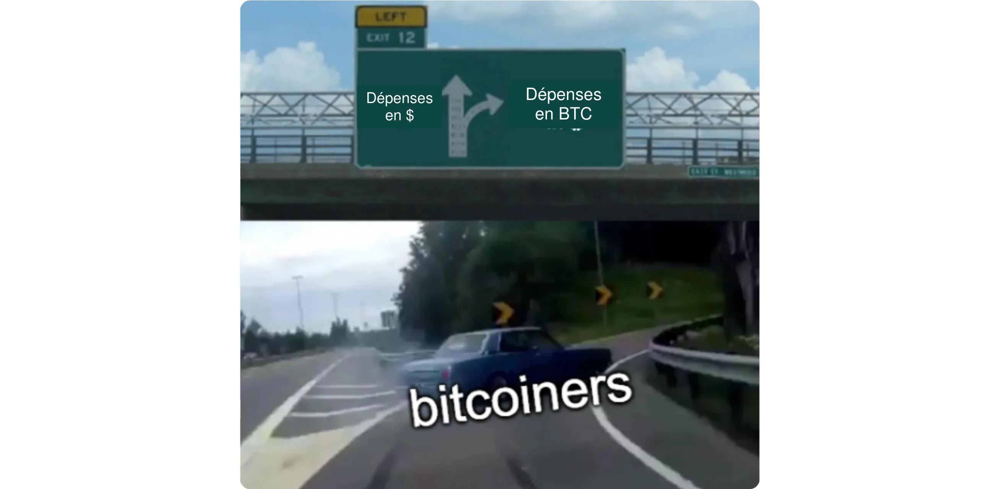

Bitcoin हासिल करने के कई तरीके हैं, यह इस बात पर निर्भर करता है कि आपको कितनी प्राइवेसी चाहिए:

- पारंपरिक खरीदारी विनियमित प्लेटफॉर्म** जैसे Bitfinex या Bull Bitcoin के जरिए (आपके Cold Wallet को टॉप अप करने के लिए आदर्श);

https://planb.network/tutorials/exchange/centralized/bitfinex-dc306d39-bd96-4ab9-a278-a322316716db

https://planb.network/tutorials/exchange/centralized/bitstack-29fd71be-9570-42c6-8f6f-cd355d62e746

https://planb.network/tutorials/exchange/centralized/bitstamp-5a36c896-bff5-46d7-b505-ff069c3ac47c

https://planb.network/tutorials/exchange/centralized/bull-bitcoin-europe-0ccf713e-efcd-44ec-8205-211f49ac7d53

https://planb.network/tutorials/exchange/centralized/kraken-1ef03e25-9b42-49bd-a47d-249e1a13cfc6

https://planb.network/tutorials/exchange/centralized/paymium-92603f76-b985-49ce-81e5-f4fa0df776e5

https://planb.network/tutorials/exchange/centralized/relai-v2-30a9671d-e407-459d-9203-4c3eae15b30e

https://planb.network/tutorials/exchange/centralized/stackinsat-5af6a380-f3c6-4246-9f81-9957a16ab066

- नॉन-केवाईसी अधिग्रहण** पीयर-टू-पीयर सेवाओं जैसे कि पीच, रोबोसैट्स, या जीडब्ल्यू-572 एटीएम के जरिए; जिससे आप अपने जीडब्ल्यू-573 में बिना कोई व्यक्तिगत जानकारी दिए जोड़ सकते हैं।

https://planb.network/tutorials/exchange/peer-to-peer/bisq-v2-c1c6a702-6c16-4101-8b90-62c424017b80

https://planb.network/tutorials/exchange/peer-to-peer/hodlhodl-d7344cd5-6b18-40f5-8e78-2574a93a3879

https://planb.network/tutorials/exchange/peer-to-peer/lnp2pbot-v2-e6bcb210-610b-487d-970c-7cce85273e3c

https://planb.network/tutorials/exchange/peer-to-peer/peach-c6143241-d900-4047-9b73-1caba5e1f874

https://planb.network/tutorials/exchange/peer-to-peer/robosats-b60e4f7c-533a-4295-9f6d-5368152e8c06

- Bitcoin** में कमाई, एक्टिव यूज़र होने का मतलब सिर्फ BTC खर्च करना नहीं है, बल्कि उसे कमाना भी है। अगर आपका कोई बिज़नेस है, तो Bitcoin को पेमेंट के तौर पर स्वीकार करने के बारे में सोचें। अगर आप नौकरी करते हैं, तो देखें कि क्या आपका एम्प्लॉयर आपको पूरी या आंशिक सैलरी BTC में देने का ऑप्शन ऑफर करता है।

https://planb.network/tutorials/business/point-of-sale/swiss-bitcoin-pay-2-a78b057e-ed11-47ac-860c-71019fcb451a

https://planb.network/tutorials/business/point-of-sale/open-node-e69a0c1c-47f7-4932-8494-e6f26c3c9784

https://planb.network/tutorials/business/point-of-sale/btcpay-server-928eb01e-824b-4b57-a3e8-8727633beddc

#### 4. सक्रिय खर्च प्रबंधन

बिटकॉइन खर्च करने के चुनाव पर अक्सर आलोचना होती है। कुछ Bitcoin यूज़र्स फिएट करेंसी खर्च करना पसंद करते हैं, जिसे वे कम गुणवत्ता वाला मानते हैं और इसलिए उसे खत्म करना चाहते हैं, बजाय बिटकॉइन खर्च करने के।  

लेकिन इस सोच में दो बड़ी खामियाँ हैं: पहली, यह Bitcoin के भुगतान के साधन के रूप में फायदों को नज़रअंदाज़ करती है (पिछले सेक्शन देखें), और दूसरी, यह सवाल उठाती है: फिएट करेंसी, जिसे कम मूल्यवान समझा जाता है, उसे खर्च करने के लिए क्यों रखा जाए?

एक ज़्यादा तर्कसंगत तरीका है "खर्च करो और बदलो" वाला तरीका। इसका मतलब है कि पहले बताए गए सभी कारणों से Bitcoin खर्च करना, और फिर अपने Bitcoin की बचत को कम होने देने की बजाय, खर्च किए हुए Sats को फिएट करेंसी से नए खरीदकर बदल देना।

Bitcoin खर्च करना आसान बनाने के लिए, कई टूल्स उपलब्ध हैं, जैसे [BTC Map](https://btcmap.org/), जो आपको दुनिया भर में Bitcoin स्वीकार करने वाले व्यापारियों को दिखाता है। इनमें से कुछ व्यापारी आपको ऑनलाइन ऑर्डर करने और उत्पादों को डिलीवर कराने की भी सुविधा देते हैं।

चूंकि हम अभी भी एक ऐसे बदलाव के दौर में हैं जहाँ रोज़मर्रा के सभी दुकानदार BTC स्वीकार नहीं करते, तो कुछ आसान पर असरदार तरीके हैं। जैसे कि, Bitcoin से गिफ्ट कार्ड खरीदना एक व्यावहारिक हल है, और Bitrefill, Coinsbee, या The Bitcoin Company जैसे कई प्रदाता यह सेवा देते हैं।

https://planb.network/tutorials/exchange/centralized/bitrefill-8c588412-1bfc-465b-9bca-e647a647fbc1

#### 5. तकनीकी जागरूकता और लचीलापन

Bitcoin प्रोटोकॉल, Layer-2 सिस्टम्स जैसे Lightning Network और इन इकोसिस्टम से जुड़े पूरे एप्लिकेशन Layer के साथ, तेजी से विकसित हो रहा है। एक सक्रिय उपयोगकर्ता के रूप में, आपको यह करना चाहिए:

- नए समाधानों के बारे में अपडेट रहें जो रोज़मर्रा के इस्तेमाल को आसान बनाते हैं;
- नियमित रूप से यूजर अनुभव को बेहतर बनाने के लिए नए टूल्स और सेवाओं का टेस्ट करें;
- तकनीकी प्रगति और बाजार के बदलाव के हिसाब से अपनी रणनीति को ढाल लो।

### अपने एक्टिव यूज़र प्रोफ़ाइल का मूल्यांकन करें

क्या तुम एक एक्टिव Bitcoin यूज़र बनने के लिए बने हो? यहाँ वो खास बातें हैं जो इस प्रोफाइल को परिभाषित करती हैं:

- प्रैग्मैटिज़्म और Commitment:** आप Bitcoin को अपने रोज़मर्रा की ज़िंदगी में शामिल करने और इसके इकोसिस्टम के विकास में सक्रिय भूमिका निभाने के लिए प्रेरित हैं। आप इसके साथ आने वाले फ़ायदों और चुनौतियों दोनों को पहचानते हैं।
- तकनीकी दक्षता:** आपको पहले से ही Bitcoin वॉलेट और Lightning Network के काम करने का अच्छा ज्ञान है; या फिर आप सीखने के लिए उत्सुक हैं। आप UTXO मैनेजमेंट जैसी उन्नत अवधारणाओं को समझने में सहज हैं।
- लचीलापन और अनुकूलनशीलता:** आप नए टूल आज़माने, समाधानों के बीच स्विच करने और अपनी प्रथाओं को समायोजित करने के लिए तैयार हैं क्योंकि Bitcoin इकोसिस्टम विकसित होता है और आपकी ज़रूरतें बदलती हैं।
- वित्तीय अनुशासन:** आप अपने Bitcoin खर्च और बचत का ध्यान से प्रबंधन करते हैं। आप रोज़मर्रा के फंड को दीर्घकालिक बचत से स्पष्ट रूप से अलग रखने के महत्व को समझते हैं।

अंत में, एक्टिव यूज़र Bitcoin के इकोसिस्टम को आगे बढ़ाने में सीधा योगदान देता है। Bitcoin को अपनी रोज़मर्रा की आदतों में शामिल करके, वे न सिर्फ़ इसके अपनाए जाने में सहायता करते हैं, बल्कि खुद की एक्सपर्टीज़ भी बढ़ाते हैं।

अगले अध्याय में, हम Bitcoin के आखिरी और शायद सबसे दिलचस्प यूज़र प्रोफाइल पर चर्चा करेंगे: पैरानॉयड यूज़र।

## पैरानॉइड बिटकॉइनर: गोपनीयता सबसे ऊपर

<chapterId>5c624acd-662e-5134-ab7a-fb75cde7c3f8</chapterId>

पैरानॉयड बिटकॉइनर के लिए, प्राइवेसी वैकल्पिक नहीं है; यह ज़रूरी है। ऐसी दुनिया में जहां लगभग हर फाइनेंशियल मूव ट्रैक किया जाता है, वे अपनी पहचान और ट्रांजैक्शन हिस्ट्री को सुरक्षित रखने को Bitcoin इस्तेमाल करने का एक अनिवार्य हिस्सा मानते हैं। वे आमतौर पर पर्सनल डेटा (खासकर KYC-कंप्लायंट एक्सचेंजेज जहां ID वेरिफिकेशन ज़रूरी होता है) के एक्सपोज़ होने के जोखिमों के बारे में बहुत जागरूक होते हैं।

उनके लिए, हर एक्शन मायने रखता है। हर ट्रांजैक्शन, हर Wallet सेटअप, और नेटवर्क के साथ हर इंटरैक्शन को सोच-समझकर किया जाता है। एक छोटी सी गलती भी संवेदनशील जानकारी उजागर कर सकती है जो उनकी पहचान को उनके Bitcoin होल्डिंग्स से जोड़ दे। उनका आखिरी मकसद? Bitcoin का इस्तेमाल इस तरह से करना जिससे उनकी पहचान, लोकेशन और फाइनेंशियल स्थिति पूरी तरह प्राइवेट रहे।

### इतना सावधानी भरा रवैया क्यों अपना रहे हो?

एक प्राइवेसी-फर्स्ट माइंडसेट अपनाने के कई फायदे हैं:

- **वित्तीय स्वायत्तता:** बैंकों, सरकारों और कंपनियों की नज़र से दूर रहकर, आप खुद को निगरानी और अवांछित दखल से बचाते हैं।
- संपत्ति सुरक्षा:** अगर आर्थिक या राजनीतिक हालात अस्थिर हो जाएँ, तो तीसरे पक्ष के लिए आपके Bitcoin को ट्रैक करना या जब्त करना बहुत मुश्किल हो जाता है अगर वह आपकी पहचान से जुड़ा नहीं है।
- व्यक्तिगत सुरक्षा में सुधार:** जिन लोगों के पास Bitcoin की बड़ी मात्रा होती है, वे निशाना बन सकते हैं। अपनी पहचान छुपाकर रखने से आपके निशाने पर आने का खतरा कम हो जाता है।
- **भेदभाव से मुक्ति**: कुछ सेवाएँ या सरकारें आपके पिछले एक्टिविटी या आप कौन हैं, इसके आधार पर ट्रांजैक्शन या अकाउंट्स को ब्लॉक कर सकती हैं। प्राइवेसी इस ताकत पर लगाम लगाती है।
- Bitcoin की मूल भावना को बनाए रखना:** Bitcoin को सेंसरशिप-प्रतिरोधी और बिना अनुमति वाले पैसे के रूप में डिज़ाइन किया गया था। आपकी गोपनीयता की रक्षा करना इस मूल मिशन को सम्मान देने का एक हिस्सा है।

यह आज के डिजिटल और वित्तीय दुनिया में मौजूदा असली खतरों का एक समझदार, सोचा-समझा जवाब है। हाँ, इस तरीके में ज़्यादा मेहनत लगती है। इसमें वक्त लगता है, तकनीकी ज्ञान चाहिए, और अनुशासन की ज़रूरत होती है। लेकिन जो लोग इस रास्ते को चुनते हैं, उनके लिए यह सिर्फ Bitcoin इस्तेमाल करने की बात नहीं है - यह उनके पैसे, उनकी पहचान और उनकी आज़ादी पर दोबारा कंट्रोल पाने की बात है।

वे सिर्फ निवेशक या यूजर नहीं हैं; वे एक ऐसी सिस्टम से बाहर निकल रहे हैं जो उनके बारे में हर चीज़ जानना चाहती है।

### परानॉइड निवेश योजना

परानॉयड बिटकॉइनर एक सख्त रणनीति का पालन करता है जो दो मुख्य लक्ष्यों पर आधारित है: गुमनामी बनाए रखना और सुरक्षा को अधिकतम करना। इस तरह का उपयोगकर्ता विनियमित प्लेटफॉर्म्स (खासकर वे जिनमें KYC की जरूरत होती है) से बचना चाहता है, लेन-देन की ट्रेस करने की संभावना को खत्म करना चाहता है, और अपने फंड्स को निगरानी, जब्ती और अन्य बाहरी खतरों से बचाना चाहता है।

#### 1. वॉलेट और नोड्स सेट करना

परानॉइड यूज़र कभी भी फंड्स को उनके सोर्स या यूज़ के हिसाब से मिक्स नहीं करता। बजाय, वो अपने Bitcoin को पर्पस के हिसाब से अलग-अलग कंपार्टमेंट में बाँट देता है, मल्टीपल और स्पेशलाइज़्ड वॉलेट्स का इस्तेमाल करके:

- एक Cold Wallet (एयर-गैप्ड और/या DIY)**  
लॉन्ग-टर्म होल्डिंग्स को हाईली सिक्योर, एयर-गैप्ड या DIY वॉलेट्स में स्टोर किया जाता है। ये आमतौर पर ओपन-सोर्स डिवाइसेज होते हैं या वे जिनका कोड वेरिफायेबल हो, जैसे कि जेड, कोल्डकार्ड, सीडसाइनर, पोर्टल या पासपोर्ट... जब भी संभव हो, यूजर्स इन डिवाइसेज को अनामिक रूप से खरीदते हैं; या तो कैश पेमेंट करके या फिजिकल स्टोर पर Bitcoin का इस्तेमाल करके, या ऑनलाइन डिस्क्रीट शिपिंग ऑप्शंस और BTC पेमेंट्स के साथ ऑर्डर करके। फ्रांस में, उदाहरण के लिए, [Bitcoin बाज़ार](https://bitcoinbazar.fr/) एक ऐसा स्टोर है। आप अपने एरिया में इसी तरह के प्रोवाइडर्स ढूंढ सकते हैं।

https://planb.network/tutorials/wallet/hardware/jade-plus-sparrow-938abf16-e10a-4618-860d-cd771373a262

https://planb.network/tutorials/wallet/hardware/coldcard-q-advanced-b8cc3f29-eea9-48fe-a953-b003d5b115e0

https://planb.network/tutorials/wallet/hardware/passport-74e53858-3fa2-43f9-b866-573297546236

https://planb.network/tutorials/wallet/hardware/portal-bd6e83f0-0100-4689-aeb3-513cca944ace

- एक जीडब्ल्यू-608 जीडब्ल्यू-606 रोज़मर्रा के लेनदेन के लिए**, नियमित खर्च के लिए, सुरक्षा को लेकर सतर्क उपयोगकर्ता गोपनीयता-केंद्रित वॉलेट जैसे कि अशिगारू, वासाबी जीडब्ल्यू-606 या स्पैरो जीडब्ल्यू-606 चुनते हैं। ये वॉलेट उन्नत सुविधाओं का समर्थन करते हैं जैसे: मिनी-जीडब्ल्यू-604 खर्च लेनदेन, पेजॉइन, संभावित जीडब्ल्यू-604 टूल्स, सिक्का नियंत्रण, जीडब्ल्यू-607 टैगिंग, या अपने खुद के जीडब्ल्यू-605 नोड से कनेक्ट करने की क्षमता।

https://planb.network/tutorials/wallet/desktop/sparrow-c674e2ac-d46f-4c82-92a7-7d1b0e262f5d

https://planb.network/tutorials/wallet/desktop/wasabi-a0b51540-32d2-4ed2-98aa-801da5d35cf6

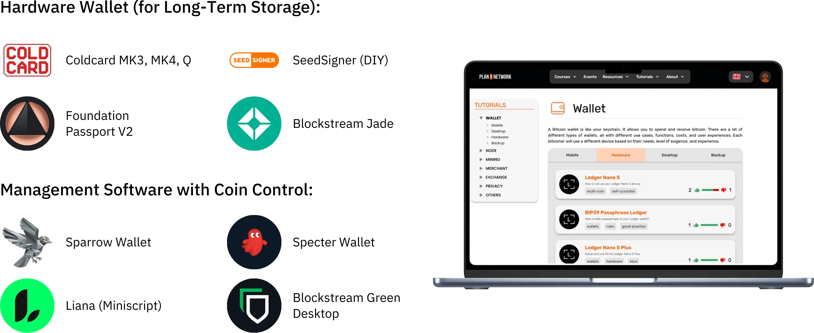

- अपना खुद का **Bitcoin नोड** चलाना बेहद जरूरी है। इससे ट्रांजैक्शन ब्रॉडकास्टिंग पर पूरा कंट्रोल रहता है और किसी तीसरे पक्ष के इंफ्रास्ट्रक्चर पर निर्भरता नहीं होती। यह प्राइवेसी की सुरक्षा करता है, सेंसरशिप रोकता है, और Bitcoin प्रोटोकॉल के नियमों को स्वतंत्र रूप से वेरिफाई करने की आजादी देता है। चाहे लिनक्स, विंडोज, macOS पर हो या फिर प्लग-एंड-प्ले सेटअप जैसे RaspiBlitz, myNode, या Start9 के जरिए, एक सतर्क यूजर अपने नोड को संप्रभुता का अटूट स्तंभ मानता है।

https://planb.network/tutorials/node/bitcoin/bitcoin-core-linux-568c13a6-8746-4d63-8e95-f4a61c5ae0ed

https://planb.network/tutorials/node/bitcoin/bitcoin-core-mac-windows-9684ab02-e0af-41c9-8102-86ac7c7727f3

https://planb.network/tutorials/node/bitcoin/bitcoin-knots-e04b2196-4df2-4246-86ef-c02269c29098

https://planb.network/tutorials/node/bitcoin/raspiblitz-d8cdba2e-a682-46cf-9fdc-d8602fbeac02

https://planb.network/tutorials/node/bitcoin/mynode-a481fef3-2fd3-4df3-91c0-112cffa094eb

https://planb.network/tutorials/node/bitcoin/start9-8c8b6827-8423-4929-bcba-89057670ed6a

- **Lightning Network** पर लेन-देन करने के लिए, उसी स्तर के नियंत्रण और विवेक को बनाए रखते हुए, वे अपना खुद का **Lightning नोड** भी चलाते हैं। इससे उन्हें सीधे चैनल्स को मैनेज करने और इस तरह खर्च करने की सुविधा मिलती है जो निगरानी या कस्टोडियल सेवाओं पर निर्भरता को कम करता है।

https://planb.network/tutorials/node/lightning-network/alby-hub-62e6356c-6a6d-4134-8f22-c3b6afb9882a

सुरक्षा यहीं नहीं रुकती। seed वाक्यांशों का बैकअप लेने के लिए, पैरानॉयड यूज़र धातु के बैकअप का इस्तेमाल करता है जिन्हें टैम्पर-इविडेंट सील्ड लिफाफों में रखा जाता है। वे नियमित रूप से जाँचते हैं कि बैकअप सुरक्षित हैं और किसी भी आकस्मिक स्थिति के लिए तैयार रहने के लिए Wallet रिकवरी प्रक्रियाओं का परीक्षण करते हैं।

https://planb.network/tutorials/wallet/backup/backup-mnemonic-22c0ddfa-fb9f-4e3a-96f9-46e2a7954270

https://planb.network/tutorials/wallet/backup/recovery-test-5a75db51-a6a1-4338-a02a-164a8d91b895

बचत को सुरक्षित करने की बात हो, तो वे ज़्यादा उन्नत तरीके अपना सकते हैं जैसे कि मल्टीसिग्नेचर वॉलेट्स (टाइमलॉक के साथ या बिना)।

https://planb.network/tutorials/wallet/desktop/liana-306ef457-700c-4fdd-b07a-8fb7a8a29f04

ये कॉन्फ़िगरेशन्स रिस्क को कम करते हैं। seed फ्रेज़ में BIP39 passphrase जोड़ने से एक और Layer सुरक्षा की परत जुड़ जाती है और यह सुनिश्चित करता है कि उनके फंड्स तक एक ही खोज से पहुंच को खतरा नहीं हो सकता।

https://planb.network/tutorials/wallet/backup/passphrase-a26a0220-806c-44b4-af14-bafdeb1adce7

एक परानॉयड बिटकॉइनर, बिल्कुल, अपने बिटकॉइन्स के लिए एक सोचा-समझा वारिस योजना रखेगा। यह महत्वपूर्ण विषय कोर्स के अगले भाग में विस्तार से कवर किया जाएगा।

विस्तार से कहें तो, इस तरह का यूज़र कंप्यूटिंग के प्रति एक उन्नत, प्राइवेसी-कॉन्शियस नज़रिया अपनाता है। ये लोग अपनी डिजिटल ज़िंदगी के हर Layer में ओपन-सोर्स, सिक्योर टूल्स का इस्तेमाल करते हैं जो यूज़र प्राइवेसी का सम्मान करते हैं:

- ऑपरेटिंग सिस्टम**, चाहे वो उनके फोन पर हो या कंप्यूटर पर;

https://planb.network/tutorials/computer-security/operating-system/grapheneos-08d43d7a-0b22-4638-a151-578d48d32d88

https://planb.network/tutorials/computer-security/operating-system/linux-mint-da44852e-513f-4004-949a-8fde60c1bca5

https://planb.network/tutorials/computer-security/operating-system/ubuntu-78a3be56-5d51-4ec3-8629-0dd27c352ab5

- **प्रमाणीकरण उपकरण** ;

https://planb.network/tutorials/computer-security/authentication/authy-a76ab26b-71b0-473c-aa7c-c49153705eb7

https://planb.network/tutorials/computer-security/authentication/bitwarden-0532f569-fb00-4fad-acba-2fcb1bf05de9

https://planb.network/tutorials/computer-security/authentication/keepass-f8073bb7-5b4a-4664-9246-228e307be246

https://planb.network/tutorials/computer-security/authentication/security-key-61438267-74db-4f1a-87e4-97c8e673533e

- **संचार के उपकरण**;

https://planb.network/tutorials/computer-security/communication/ivpn-5a0cd5df-29f1-4382-a817-975a96646e68

https://planb.network/tutorials/computer-security/communication/mullvad-968ec5f5-b3f0-4d23-a9e0-c07a3e85aaa8

https://planb.network/tutorials/computer-security/communication/proton-mail-c3b010ce-254d-4546-b382-19ab9261c6a2

https://planb.network/tutorials/computer-security/communication/tor-browser-a847e83c-31ef-4439-9eac-742b255129bb

- डेटा प्रबंधन उपकरण**।

https://planb.network/tutorials/computer-security/data/integrity-authenticity-21d0420a-be02-4663-94a3-8d487f23becc

https://planb.network/tutorials/computer-security/data/proton-drive-03cbe49f-6ddc-491f-8786-bc20d98ebb16

https://planb.network/tutorials/computer-security/data/veracrypt-d5ed4c83-7c1c-4181-95ea-963fdf2d83c5

अगर आप IT सुरक्षा के बारे में और जानना चाहते हैं, तो हम इस विषय पर समर्पित एक पूरा पहला साल का कोर्स ऑफर करते हैं:

https://planb.network/courses/99c46148-7080-4915-a7e0-9df0e145cd47

#### 2. बिना पहचान जाहिर किए बिटकॉइन खरीदना

एक पैरानॉइड निवेशक का मूल सिद्धांत है कि वह Bitcoin को अपनी असली दुनिया की पहचान से जोड़े बिना हासिल करे। KYC प्लेटफॉर्म्स से बचने और On-Chain फिंगरप्रिंटिंग को रोकने के लिए, वे कई तरीके अपनाते हैं:

- जीडब्ल्यू-620 खरीदने के प्लेटफॉर्म** जैसे कि बिस्क, रोबोसैट, एलएनपी2पीबॉट, पीच, जीडब्ल्यू-619 जीडब्ल्यू-619, वगैरह। ;

https://planb.network/tutorials/exchange/peer-to-peer/bisq-v2-c1c6a702-6c16-4101-8b90-62c424017b80

https://planb.network/tutorials/exchange/peer-to-peer/hodlhodl-d7344cd5-6b18-40f5-8e78-2574a93a3879

https://planb.network/tutorials/exchange/peer-to-peer/lnp2pbot-v2-e6bcb210-610b-487d-970c-7cce85273e3c

https://planb.network/tutorials/exchange/peer-to-peer/peach-c6143241-d900-4047-9b73-1caba5e1f874

https://planb.network/tutorials/exchange/peer-to-peer/robosats-b60e4f7c-533a-4295-9f6d-5368152e8c06

- आमने-सामने नकद लेन-देन**, जैसे कि स्थानीय Bitcoin मीटअप्स में;

https://planb.network/courses/1c643dc9-a15f-4f9e-93b6-cb3c58b4ee35

- जीडब्ल्यू-622 एटीएम**;
- Exchange में सामान या सेवाएं प्रदान करके Sats** कमाना, Bitcoin के लिए;
- जीडब्ल्यू-626 बिटकॉइन्स**।

https://planb.network/tutorials/mining/hardware/attakai-0d177e6b-e167-4b25-8e38-4ec74213d1fb

https://planb.network/tutorials/mining/hardware/braiin-mini-miner-b4c5cb2c-e7ee-4521-a750-edefb0747db3

https://planb.network/tutorials/mining/hardware/bitaxe-d317e1a7-d775-401d-85df-51f4f2217566

सेंट्रलाइज़्ड एक्सचेंजेस को पूरी तरह से टाला जाता है क्योंकि वे प्राइवेसी और सेंसरशिप या ज़ब्ती के खतरे पैदा करते हैं।

#### 3. ऑनचेन ट्रेसिंग को रोकना

सिक्के गुमनाम तरीके से हासिल करने के बाद भी, अगर सावधानी न बरती जाए तो व्यक्तिगत डेटा On-Chain लीक हो सकता है। पैरानॉयड यूज़र लेन-देन के स्तर पर गोपनीयता बचाने के लिए अतिरिक्त कदम उठाता है:

- Address के पुन: उपयोग से बचें**, चाहे मैन्युअल तरीके से हो या फिर Silent Payments या BIP47 जैसे एडवांस्ड टूल्स का इस्तेमाल करके ;
- अपने UTXOs को लेबल करें** ;
- **खर्च करते समय कोने का नियंत्रण अभ्यास करना** ;
- **यूटीएक्सओ के समेकन से बचना** ;
- **गोपनीयता सुरक्षित करने वाले लेन-देन ढांचों का उपयोग**: कॉइनजॉइन, पेजॉइन, रिकोशे, और मिनी-पेमेंट कॉइनजॉइन...

वे Blockchain निगरानी की बुनियादी बातों से भी वाकिफ हैं और जानते हैं कि कंपनियाँ गतिविधियों का पता कैसे लगाती हैं। चेन एनालिसिस फर्मों द्वारा इस्तेमाल किए जाने वाले ह्यूरिस्टिक्स और पैटर्न को समझकर, वे जानी-मानी जाल में फँसने से बचने के लिए सक्रिय कदम उठा सकते हैं।

जो लोग On-Chain की प्राइवेसी और निगरानी विरोधी सुविधाओं के बारे में और गहराई से जानना चाहते हैं, उनके लिए हम Bitcoin प्राइवेसी प्रैक्टिसेस पर एक एडवांस्ड दूसरे साल का ट्रेनिंग प्रोग्राम ऑफर करते हैं:

https://planb.network/courses/65c138b0-4161-4958-bbe3-c12916bc959c

#### 4. सतर्क रहना और अपनी रणनीति को अपडेट करते रहना

Bitcoin प्रोटोकॉल, Lightning Network, और संबंधित टूल्स लगातार विकसित हो रहे हैं। एक सतर्क यूज़र हमेशा चौकन्ना और लचीला बना रहता है:

- नए प्राइवेसी तकनीकों और सुरक्षा उपकरणों के बारे में जानकारी रखना
- नए टूल्स और सर्विसेज़ को नियमित रूप से टेस्ट करते रहना ताकि उनका ऑपरेशनल सेटअप हमेशा तेज़ बना रहे
- रोज़ाना हार्डवेयर वॉलेट और नोड्स को चेक करना कि वे अपडेट हैं और सही तरीके से काम कर रहे हैं
- समय-समय पर यह जाँचना कि बैकअप (जैसे, सीलबंद Mnemonic लिफाफे) के साथ छेड़छाड़ नहीं की गई है
- रेगुलेटरी बदलावों पर नज़र रखकर अपनी रणनीति को रियल टाइम में ढालना

### अपने पागलपन वाले प्रोफाइल का आकलन करना

पागलपन वाली रणनीति अपनाना कोई आम फैसला नहीं है। इसमें सख्त अनुशासन, लगातार मेहनत और टूल्स व प्राइवेसी के बेस्ट प्रैक्टिसेज को सीखने के लिए काफी समय लगाना पड़ता है।

क्या यह तरीका आपके लिए सही है?

एक पैरानॉयड बिटकॉइनर की मुख्य विशेषताएं ये हैं:

- **सतर्क और सुरक्षा-जागरूक**: आप अपनी निजता को बहुत महत्व देते हैं और व्यक्तिगत जानकारी के किसी भी लीक को रोकने के लिए अतिरिक्त सावधानियां बरतने को तैयार हैं। आप वित्तीय निगरानी को एक गंभीर खतरा मानते हैं और खुद को इससे बचाने के तरीके सक्रिय रूप से ढूंढते हैं।
- **स्वतंत्र**: आप किसी भी तीसरी पार्टी की सेवा पर अपने बिटकॉइन को स्टोर, मैनेज या ट्रांसफर करने के लिए निर्भर होने से इनकार करते हैं। आप अपने खुद के Bitcoin और लाइटनिंग नोड्स होस्ट करने, जटिल वॉलेट्स का उपयोग करने और अपने बैकअप्स व प्राइवेट कीज़ को मैनेज करने की पूरी जिम्मेदारी लेने के लिए तैयार हैं।
- **भरोसेमंद नहीं**: आप KYC प्लेटफॉर्म्स से सक्रिय रूप से बचते हैं और गुमनाम P2P हासिल करने के तरीकों को तरजीह देते हैं, भले ही इसके लिए आपको ज्यादा कीमत चुकानी पड़े। आप समझते हैं कि आपके द्वारा साझा की गई कोई भी निजी जानकारी किसी दिन आपके खिलाफ इस्तेमाल की जा सकती है।
- **ज्ञानी और अनुशासित**: आपको साइबर सुरक्षा और गोपनीयता बढ़ाने वाली तकनीकों का जुनून है। आप उपलब्ध समाधानों का अध्ययन करने, टूल्स का परीक्षण करने, सर्वोत्तम प्रथाओं के बारे में खुद को शिक्षित करने और जोखिमों को कम करने के लिए सख्त कार्यप्रणाली लागू करने का समय निकालते हैं।
- **व्यावहारिक और यथार्थवादी**: आप समझते हैं कि पूर्ण गुमनामी लगभग असंभव है, लेकिन आप प्राइवेसी, सुरक्षा और उपयोगिता के बीच संतुलन बनाते हुए अपनी पहचान को जितना हो सके कम करने का प्रयास करते हैं। नए खतरों और तकनीकी विकास के अनुसार आपका दृष्टिकोण लगातार विकसित होता रहता है।

अगर ये बातें आपको जानी-पहचानी लगती हैं, तो यह रणनीति आपके लिए बिल्कुल सही हो सकती है। इसमें मेहनत और लगातार कोशिश की ज़रूरत होती है, लेकिन यह आपको वित्तीय आज़ादी का ऊंचा स्तर देती है और आपके पैसों पर नज़र रखने, जब्त करने या पता लगाने से सुरक्षा भी प्रदान करती है।

यह तरीका खास तौर पर मददगार है अगर आप:

- भारी मात्रा में Bitcoin रखो,
- एक तानाशाही सरकार के नीचे जीना,
- अपनी गुमनामी को व्यक्तिगत, पेशेवर या विचारधारात्मक कारणों से बचाने की ज़रूरत है।

कोर्स के अगले भाग में, हम एक अहम मुद्दे पर चर्चा करेंगे जिसे अक्सर नज़रअंदाज़ कर दिया जाता है: इमरजेंसी की स्थिति में अपने बिटकॉइन्स कैसे ट्रांसफर करें।

# अपने वारिसों और अपनी दौलत की सुरक्षा करना

<partId>0b8a9528-719b-4a2d-bd50-1e173a896570</partId>

## विरासत की योजना बनाना

<chapterId>233c88d3-2e8e-5eba-ac06-efe67a209038</chapterId>

अपने बिटकॉइन के ट्रांसमिशन को सुनिश्चित करना एक ज़िम्मेदारी है जिसे अक्सर नज़रअंदाज़ कर दिया जाता है, लेकिन यह बेहद ज़रूरी है। Bitcoin द्वारा दी जाने वाली वित्तीय संप्रभुता के साथ-साथ संपत्ति प्रबंधन की सावधानी भी ज़रूरी है। इसके बिना, आपके वारिस आपके Hard से कमाए गए फंड्स तक पहुँचने में असमर्थ हो सकते हैं। इस अध्याय में, हम Bitcoin पर लागू होने वाली एस्टेट प्लानिंग की बुनियादी बातों को समझेंगे।

### Bitcoin सक्सेशन प्लान तैयार करना क्यों जरूरी है?

कल्पना कीजिए कि अचानक कोई घटना होती है (एक दुर्घटना या अप्रत्याशित परिस्थिति) और आप अब यहाँ नहीं हैं। आपका परिवार, जो पहले से ही दुखी है, अब एक और चुनौती का सामना कर रहा है: आपके बिटकॉइन तक पहुँचना। हो सकता है उन्होंने आपको प्राइवेट कीज़, Mnemonic वाक्यांश, और लेन-देन की अपरिवर्तनीयता के बारे में बात करते सुना हो, लेकिन ये अवधारणाएँ उनके लिए अस्पष्ट हो सकती हैं। वे अब इसे खुद समझने की कोशिश कर रहे हैं।

फिर आपके पास दो विकल्प हैं:

- अपने बिटकॉइन को आसानी और सुरक्षित तरीके से एक्सेस करने के लिए अपने प्रियजनों के लिए एक स्पष्ट, संरचित योजना बनाने में समय निकालें;
- कुछ नहीं कर रहे, उम्मीद कर रहे हैं कि वे खुद ही समझ जाएंगे। लेकिन अगर उनसे गलती हो गई, Wallet तक पहुंच खो दी या गलती से फंड Address को भेज दिए, तो आपकी दौलत हमेशा के लिए गायब हो सकती है।

विरासत की योजना बनाने में सिर्फ 15 मिनट से लेकर एक घंटे का समय लगाना सब कुछ बदल सकता है। यह सिर्फ सावधानी की बात नहीं है, बल्कि उन लोगों के प्रति जिम्मेदारी दिखाने का तरीका भी है जो आप पर निर्भर हो सकते हैं।

### Bitcoin सक्सेशन प्लान के लक्ष्य

पामेला मॉर्गन ने अपनी किताब *[क्रिप्टोएसेट इनहेरिटेंस प्लानिंग](https://www.amazon.com/gp/product/1947910116/)* में एक मजबूत वसीयत योजना के लिए चार मुख्य लक्ष्य बताए हैं:

- सुनिश्चित करें कि आपके वारिस सही समय पर आपके बिटकॉइन तक पहुँच सकें (लेकिन उससे पहले नहीं);
- चोरी या समझौते का जोखिम कम करें इससे पहले कि वे बिटकॉइन्स विरासत में पाएं;
- यह सुनिश्चित करें कि आपके वारिस जानते हों कि अगर वे चाहें तो बिटकॉइन को लंबे समय तक कैसे सुरक्षित रख सकते हैं;
- क्रिप्टो-एसेट्स को आगे बढ़ाते समय पारिवारिक झगड़ों और कानूनी पचड़ों से बचें।

एक अच्छी तरह से सोचा-समझा प्लान सिर्फ पैसा ट्रांसफर करने के बारे में नहीं है; यह आपके अपनों को आम गलतियों और संभावित खतरों से बचाने के बारे में भी है।

यह अध्याय [पामेला मॉर्गन](https://x.com/pamelawjd) के काम से प्रेरित है। [उनकी किताब](https://www.amazon.com/gp/product/1947910116/) और हालांकि उनकी किताब Bitcoin इनहेरिटेंस प्लान बनाने के लिए एक विस्तृत और विशेषज्ञ-सत्यापित तरीका प्रदान करती है, **यह सामग्री कानूनी सलाह नहीं है**। यह एक सिद्ध तरीका है, लेकिन हर व्यक्ति को अपनी खुद की रिसर्च करनी चाहिए और सिफारिशों को अपनी व्यक्तिगत स्थिति और क्षेत्राधिकार के अनुसार ढालना चाहिए।

[पामेला मॉर्गन](https://x.com/pamelawjd) ने इस कोर्स के लिए [उनके काम](https://www.amazon.com/gp/product/1947910116/) के उपयोग की उदारता से अनुमति दी है, और हम Bitcoin इनहेरिटेंस प्लान बनाने के लिए उनके तरीके का पालन करेंगे। इस अध्याय में, हम उनकी किताब के पहले भाग पर ध्यान केंद्रित करेंगे।

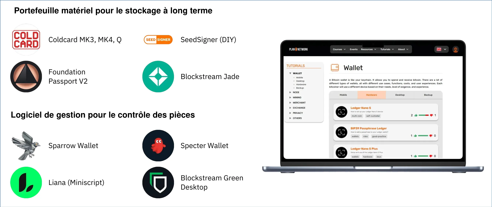

Bitcoin के उत्तराधिकार योजना को बेहतर तरीके से समझने के लिए, हम सीड्रिक के उदाहरण को देखेंगे, जो एक सामान्य Bitcoin उपयोगकर्ता है और जिसे अपनी संपत्ति के हस्तांतरण की योजना बनानी है अगर कुछ अप्रत्याशित हो जाए।

उसका प्रोफाइल:

- लंबे समय तक निवेश करने वाला जो बार-बार ट्रेड नहीं करता;
- एक Hardware Wallet का मालिक है और कभी-कभी इस्तेमाल के लिए एक मोबाइल Wallet भी रखता है;
- वह अपने बिटकॉइन खरीदने के लिए एक ही KYC Exchange प्लेटफॉर्म का इस्तेमाल करता है;
- अपने चचेरे भाई ने Bitcoin से मिलवाया ;
- यहाँ ऑल्टकॉइन नहीं हैं या Lightning Network का इस्तेमाल नहीं होता।

हमारा लक्ष्य है कि हम सीड्रिक के प्रोफाइल के अनुसार एक सरल और प्रभावी योजना बनाएं, इससे पहले कि हम दूसरे तरह के यूजर्स को शामिल करते हुए ज्यादा जटिल परिदृश्यों पर आगे बढ़ें।

### शुरू करने से पहले

अपना 30 मिनट निकालिए। अपने लिए नहीं, बल्कि उनके लिए जो आप पर निर्भर हैं। एस्टेट प्लानिंग एक महत्वपूर्ण काम है, लेकिन अक्सर इसे टाल दिया जाता है, नज़रअंदाज़ किया जाता है या भुला दिया जाता है। बहुत से लोग, यहाँ तक कि सबसे सावधान लोग भी, इसे टालते रहते हैं... जब तक कि बहुत देर नहीं हो जाती। हज़ारों बिटकॉइन पहले ही लापरवाही की वजह से खो चुके हैं। यह गलती मत कीजिए! यह आपकी वित्तीय स्वतंत्रता की यात्रा का **अंतिम चरण** है: अपने प्रियजनों के लिए अपनी Bitcoin संपत्ति को सुरक्षित करना।

#### तुम्हें क्या चाहिए?

सुनिश्चित करें कि आपका वातावरण शांत और ध्यान भटकाने वाली चीज़ों से मुक्त हो, फिर इन कुछ ज़रूरी चीज़ों को इकट्ठा करें:

- 4 से 5 सफेद कागज की शीट्स ;
- कलम;
- 2 लिफाफे ;
- एक फोन या Address किताब;
- एक कंप्यूटर (वैकल्पिक)।

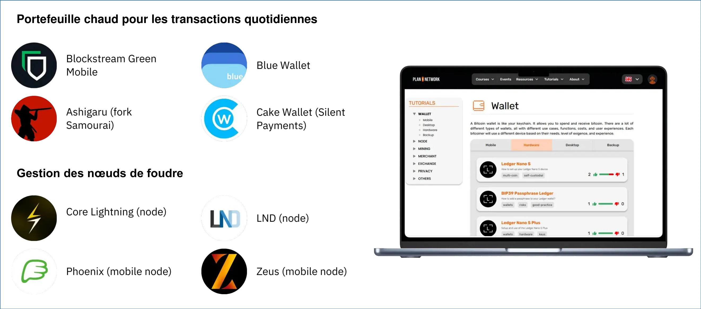

#### विरासत योजना के बारे में आम गलतफहमियाँ

बहुत से लोग इस कदम को टाल देते हैं क्योंकि उनके मन में गलत धारणाएँ होती हैं जो उन्हें कार्रवाई करने से रोकती हैं। पामेला मॉर्गन ने अपनी किताब _क्रिप्टोएसेट इनहेरिटेंस प्लानिंग_ (पेज 18) में कुछ आम मिथकों का जिक्र किया है:

- "*मुझे एक वकील किराए पर लेना होगा।*"** → **गलत**। हालांकि कानूनी मामलों में वकील मददगार हो सकता है, लेकिन तकनीकी Bitcoin वारिसी योजना बिना वकील के भी बनाई जा सकती है। सबसे ज़रूरी चीज़ है स्पष्ट और आसानी से उपलब्ध निर्देश होना;
- "*मुझे किसी तीसरे पक्ष पर भरोसा करना होगा।*"** → **गलत**। आपकी योजना को इस तरह डिज़ाइन किया जा सकता है कि भरोसे की ज़रूरत कम हो, जैसे कि जानकारी को कई पक्षों में बाँट देना या मल्टी-सिग्नेचर समाधानों का इस्तेमाल करना, चाहे टाइमलॉक हो या न हो;
- "*योजना बनाने से मेरी संपत्ति चुराना आसान हो जाएगा।*"** → **गलत**।  

एक अच्छी तरह से सोची-समझी योजना चोरी के प्रयासों से बचाती है, साथ ही यह सुनिश्चित करती है कि आपके वारिस आपके धन को सुरक्षित रूप से प्राप्त कर सकें। हालाँकि, यह ध्यान रखना ज़रूरी है कि कोई भी समाधान पूरी तरह से सुरक्षित नहीं है: वास्तव में, वारिस योजना चोरी का खतरा बढ़ा सकती है, यह इस पर निर्भर करता है कि कौन सी जानकारी साझा की गई है। हम इस पर बाद में विस्तार से चर्चा करेंगे;
- "*मेरे बिटकॉइन की कीमत इतनी कम है कि प्लान करने लायक नहीं।*"** → **गलत**। आगे की प्लानिंग हमेशा बेहतर होती है। आपके प्रियजनों को शायद पता नहीं होगा कि आपके पास Bitcoin की कितनी मात्रा है, और यह अच्छी बात है। लेकिन अगर आपके साथ कुछ हो जाता है, तो क्या वे इसे रिकवर नहीं करना चाहेंगे, भले ही उन्हें सही मात्रा का पता न हो? Bitcoin की कीमत समय के साथ काफी बढ़ सकती है, इसलिए यह समझदारी है कि आप उनके लिए अपने फंड तक पहुँचना आसान बनाएँ, और उन्हें इसकी वैल्यू के बारे में गलत उम्मीद न दें या उन्हें ऐसी चीज़ की तलाश में न छोड़ें जो शायद मौजूद ही न हो।
- "*मेरे वारिस अपने आप ही इसका पता लगा लेंगे।*"** → **गलत**। Bitcoin कोई आम बैंक खाता नहीं है। बिना स्पष्ट निर्देशों के, आपके अपने लोग आपके फंड तक कभी नहीं पहुँच पाएँगे, या सिर्फ उसका एक हिस्सा ही ढूँढ पाएँगे। बैंक खातों की तरह नहीं, जहाँ मौत के बाद वित्तीय संस्थाएँ या नोटरी परिवार वालों से संपर्क करती हैं, Bitcoin और Wallet के मामले में कोई बिचौलिया नहीं होता जो आपके परिवार को सूचित करे। इसलिए, यह आप पर निर्भर है कि आप इसे अपनी एस्टेट प्लान में साफ़-साफ़ शामिल करें;
- "*एक Smart contract सब कुछ संभाल सकता है।*"** → **गलत**। एक Smart contract, जैसे कि multi-sig या Wallet जिसमें टाइमलॉक हो, समाधान का हिस्सा तो हो सकता है, लेकिन यह कभी भी एक अच्छी तरह से बनी योजना की जगह नहीं ले सकता, खासकर उन लोगों के लिए जो Bitcoin से अनजान हैं। दोनों समाधान एक-दूसरे के पूरक हैं।

अब एक्शन लेने का समय आ गया है। इन 30 मिनटों को अपनी वसीयत की योजना बनाने में लगाइए। यह एक छोटा सा कदम है, लेकिन आपके प्रियजनों के लिए बहुत बड़ा फर्क ला सकता है।

### चरण 1: अपने वारिसों की मदद के लिए सही लोगों को चुनें

Bitcoin में वारिस को संपत्ति सौंपने की बात आती है, तो आपके प्रियजनों को प्राइवेट कीज़ या वॉलेट रिकवर करने का अनुभव नहीं होगा। उन्हें योग्य और भरोसेमंद लोगों की बाहरी मदद की ज़रूरत पड़ेगी। सबसे बेहतर तरीका यह है कि कम से कम दो अलग-अलग लोगों को चुना जाए:

- एक भरोसेमंद रिश्तेदार**, जो आपकी योजना को सुचारू रूप से अंजाम देने का ध्यान रखेगा। उन्हें Bitcoin की गहरी जानकारी होना जरूरी नहीं है, लेकिन वह ऐसा व्यक्ति होना चाहिए जिस पर आपके वारिस भरोसा कर सकें।
- एक्सपीरियंस्ड Bitcoin यूज़र**, जो फंड्स रिकवर करने, वॉलेट मैनेज करने और प्रोसेसेस को समझने में टेक्निकल सपोर्ट दे सकता है।

जिन लोगों को आप चुनते हैं, उन्हें कभी भी आपके प्राइवेट कीज़ (या आपके Mnemonic वाक्यांश) तक सीधी पहुंच नहीं होनी चाहिए, लेकिन उन्हें यह करने में सक्षम होना चाहिए:

- अपने वारिसों को फंड्स को वापस पाने और सुरक्षित करने में मार्गदर्शन करें;
- Bitcoin वॉलेट्स, रिकवरी फ्रेज़ेज़, और ट्रांज़ैक्शन्स की बेसिक जानकारी समझाता हूँ:

1. **Bitcoin वॉलेट**:  
   - यह एक डिजिटल वॉलेट है जिसमें आप अपने क्रिप्टो करेंसी को स्टोर और मैनेज कर सकते हैं।  
   - यह सिक्योर होता है और प्राइवेट कीज़ का इस्तेमाल करता है ताकि सिर्फ आप ही अपने फंड्स को एक्सेस कर सकें।  

2. **रिकवरी फ्रेज़ (Recovery Phrase)**:  
   - यह 12 या 24 शब्दों की एक सीक्रेट लिस्ट होती है जो आपके वॉलेट को रिस्टोर करने में मदद करती है।  
   - अगर आप अपना वॉलेट खो देते हैं या डिवाइस बदलते हैं, तो इस फ्रेज़ की मदद से वापस एक्सेस पा सकते हैं।  
   - इसे कभी किसी के साथ शेयर न करें, नहीं तो आपके फंड्स चोरी हो सकते हैं।  

3. **ट्रांज़ैक्शन्स (Transactions)**:  
   - Bitcoin वॉलेट से आप क्रिप्टो करेंसी भेज और प्राप्त कर सकते हैं।  
   - हर ट्रांज़ैक्शन को ब्लॉकचेन पर वेरिफाई किया जाता है, जिसमें कुछ समय लग सकता है।  
   - ट्रांज़ैक्शन फीस (Gas Fee) नेटवर्क कंडीशन के हिसाब से अलग-अलग हो सकती है।  

सावधानी: हमेशा अपनी रिकवरी फ्रेज़ को सेफ और प्राइवेट रखें, और ट्रांज़ैक्शन करते समय एड्रेस डबल-चेक करें!
- आम गलतियों से बचने में मदद करें।

जिस कागज़ पर आपका Bitcoin वंशानुक्रम योजना बनेगी, उस पर संभावित उम्मीदवारों की तुलना करने वाली एक तालिका बनाएं। इसमें उनके भरोसे के स्तर, Bitcoin के बारे में उनकी जानकारी, और उनसे कैसे संपर्क करें - इन सबका मूल्यांकन करें। उदाहरण के लिए:  

| उम्मीदवार का नाम | भरोसे का स्तर (1-10) | Bitcoin की जानकारी (हाँ/नहीं) | संपर्क विवरण |
|------------------|----------------------|---------------------------|---------------|
| [नाम डालें]     | [अंक डालें]          | [हाँ/नहीं]                | [विवरण डालें]|  

(नोट: विशेष वर्णों और फॉर्मेटिंग को बनाए रखा गया है।)

| Person               | Trust Level     | Bitcoin Knowledge   | Contact Methods         | Notes                                                                                                                   |
|----------------------|-----------------|----------------------|--------------------------|------------------------------------------------------------------------------------------------------------------------|
| My brother Bob       | Very high       | Low                  | Phone & email            | Bob doesn't know Bitcoin well, but he's 100% reliable. He can ensure the process goes smoothly.                        |
| My cousin Nathan     | High            | Medium               | Phone & Instagram        | Has some Bitcoin knowledge and can guide my heirs. Aware of the plan. #1 to talk to in case of need.                   |
| Ricco (Bitcoiner friend) | Medium      | Very high            | Twitter, email & photo   | Very technically skilled, but should never have access to the funds. To be contacted for technical support.            |
| Bitcoin YouTuber     | Low             | High                 | YouTube channel          | Good information source for learning, but cannot intervene directly.                                                   |

अगर आपके पास कोई भरोसेमंद या काबिल परिवार का सदस्य नहीं है, तो आप एक पेशेवर को भी हायर कर सकते हैं, जैसे कि Bitcoin इनहेरिटेंस (विरासत) में स्पेशलाइज़्ड वकील, या कोई स्पेशलाइज़्ड एस्टेट प्लानिंग सर्विस। सबसे ज़रूरी बात यह है कि आपके वारिसों को भरोसेमंद तकनीकी मदद मिले, और साथ ही आपके फंड्स की सुरक्षा और गोपनीयता भी बनी रहे।

### चरण 2: जल्दी और आसान इन्वेंटरी बनाएं

अपने बिटकॉइन्स को सुरक्षित या ट्रांसमिट करने के बारे में सोचने से पहले, अपने Bitcoin एसेट्स की एक स्पष्ट सूची बनाना ज़रूरी है। यह सूची आपके इनहेरिटेंस प्लान को व्यवस्थित करने का आधार होगी और आपके वारिसों को यह समझने में मदद करेगी कि आपकी संपत्ति कहाँ है और उसे कैसे एक्सेस किया जा सकता है।

यहाँ लक्ष्य तुरंत आपकी सुरक्षा को बेहतर बनाना नहीं है, बल्कि सिर्फ आपकी मौजूदा स्थिति को सूचीबद्ध करना है। यह आपके बिटकॉइन और उन्हें एक्सेस करने के तरीकों का एक स्नैपशॉट है। आप बाद में, इस पहली सूची पूरी होने के बाद, सुरक्षा को समायोजित और मजबूत कर सकते हैं।

Bitcoin से जुड़े बिटकॉइन या फिएट करेंसी वाले सभी जगहों के बारे में सोचें। इसमें शामिल हो सकते हैं:

- जीडब्ल्यू-672 प्लेटफॉर्म्स**: आपके जीडब्ल्यू-673 खरीदारी से जुड़े बीटीसी या फिएट वाले खाते।
- **Hot वॉलेट (मोबाइल या डेस्कटॉप)**: आपके फ़ोन पर इंस्टॉल किए गए ऐप्स, जिनका उपयोग रोज़मर्रा के लेन-देन के लिए किया जाता है;
- **हार्डवेयर वॉलेट्स** : फिजिकल डिवाइसेज जो आपकी प्राइवेट कीज़ को ऑफलाइन स्टोर करते हैं;
- दूसरे विकल्प**: Multisig, पेपर वॉलेट, खास तरह से स्टोर की गई प्राइवेट कीज़, वगैरह।

इन्वेंटरी को व्यवस्थित करने के लिए एक टेबल का उपयोग करें। इस डॉक्यूमेंट को ऑनलाइन स्टोर नहीं करना है, बल्कि इसे सुरक्षित जगह पर रखना है, आदर्श रूप से कागज़ पर। उदाहरण के लिए:

| आइटम         | मात्रा | स्थान       | टिप्पणी          |
|--------------|--------|-------------|------------------|
| उदाहरण आइटम 1 | 5      | स्टोररूम    | अच्छी हालत में   |
| उदाहरण आइटम 2 | 10     | गोदाम       | जांच की आवश्यकता|

| General | Storage type | Assets held | Localization | Mnemonic backup | Password (PIN, passphrase...) | Notes |
| --------------------- | ---------------- | -------------- | --------------------------------- | ------------------------------------------------------------------------ | ----------------------------------------------------------------------------------------------- | --------------------------------------------------------------------------------------------------------------- |
| Bitfinex | BTC & Euros | Accessible online | None (custodial platform) | | Bitwarden & 2FA password manager with Authy app on my phone | I bought my BTC here. Funds must be withdrawn after purchase |
| Physical wallet | Jade Plus | BTC | Personal safe at home | Copy at my Uncle Bob's and in a bank safe at BNP Paribas | passphrase stored at my mother's. PIN code stored on Bitwarden password manager. PIN code stored on Bitwarden password manager. | I use 2 separate wallets: a normal one with only the mnemonic phrase and one with a passphrase. |
| Green Wallet | BTC | On my Iphone 15 | Copy of the seed in my safe at home | PIN code stored on the Bitwarden password manager. | The application is in hidden mode. | The application is in hidden mode |

इस स्तर पर, आपको तुरंत अपने फंड वितरण को समायोजित करने, अपनी सुरक्षा सुधारने, या और बिटकॉइन खरीदने/बेचने का मन कर सकता है। लेकिन अभी कुछ न करें! यहाँ लक्ष्य कोई कार्रवाई करना नहीं, बल्कि अपनी मौजूदा स्थिति का एक स्नैपशॉट बनाना है। आप हमेशा बाद में अपनी योजना को बेहतर बना सकते हैं, लेकिन अभी पूरी तरह से इन्वेंट्री पूरी करने पर ध्यान दें।

जब यह इन्वेंटरी पूरी हो जाएगी, तो कमजोर बिंदुओं को पहचानना और एक सुरक्षित व प्रभावी ट्रांसमिशन प्रक्रिया को व्यवस्थित करना बहुत आसान हो जाएगा।

### चरण 3: पत्र लिखें

#### हाथ से लिखा खत क्यों?

यह बहुत ज़रूरी है कि आपकी विरासत की योजना साफ, पढ़ने लायक और सुरक्षित हो। इसे हासिल करने के लिए, कागज़ पर स्याही से हाथ से पत्र लिखें, और डिजिटल दस्तावेज़ों से बचें जो हैक हो सकते हैं। यह पत्र कोई वसीयत या कानूनी घोषणा नहीं है, बल्कि एक व्यावहारिक मार्गदर्शिका है जो आपके प्रियजनों को आपके बिटकॉइन्स सुरक्षित रूप से पाने में मदद करेगी।

पत्र सरल, सीधा होना चाहिए और निम्नलिखित आवश्यक Elements को शामिल करना चाहिए:

- एक परिचय जो बताता है कि वसूल किए जाने वाले संपत्तियों की प्रकृति क्या है;
- विश्वसनीय लोगों के संपर्क जो आपके वारिसों को रिकवरी प्रक्रिया में मदद कर सकते हैं;
- संपत्तियों की एक स्पष्ट सूची, जिसमें भंडारण के तरीके और पहुंच की जानकारी शामिल हो;
- खास सुरक्षा निर्देश ताकि गलतियाँ या धोखाधड़ी से बचा जा सके;
- एक अंतिम संदेश, और कोई कानूनी निर्देश अगर लागू हो।

#### नमूना वारिसत पत्र

यहाँ पामेला मॉर्गन के क्रिप्टोएसेट इनहेरिटेंस प्लानिंग से प्रेरित एक मॉडल है। आपको इसे अपनी व्यक्तिगत स्थिति के अनुसार ढाल लेना चाहिए:

---
**तारीख: `तारीख बताएं`**

प्रिय `वारिसों के नाम`,

अगर तुम ये ख़त पढ़ रहे हो, तो मैं अब यहाँ नहीं हूँ। सबसे पहले, यह जान लो कि मैं तुमसे प्यार करता/करती हूँ और मैंने अपने बिटकॉइन को मैनेज करने में तुम्हारी मदद के लिए यह दस्तावेज़ तैयार करने में वक्त निकाला है, जिनकी कुछ वैल्यू हो सकती है। यह कोई मुश्किल काम नहीं है, लेकिन इसमें सावधानी और ध्यान देने की ज़रूरत है। Bitcoin एक पीयर-टू-पीयर सिस्टम है: अगर कोई गलती हो जाए तो उसे सुधारने का कोई रास्ता नहीं है। कृपया कोई भी कदम उठाने से पहले इस ख़त को पूरा ध्यान से पढ़ लेना।

#### 1. विश्वसनीय लोगों से संपर्क करें

मैंने Bitcoin को समझने और मेरी संपत्ति वापस पाने में तुम्हारी मदद के लिए कुछ लोगों को नियुक्त किया है। उन्हें कभी भी फंड्स तक सीधी पहुंच नहीं देनी चाहिए, लेकिन वे तुम्हें प्रक्रिया समझा सकते हैं:

- मेरा भाई बॉब: +33 6 00 00 00 00; bobmybrother@supermail.com.  
इस प्रक्रिया में मदद के लिए तुम बॉब पर भरोसा कर सकते हो। हालाँकि Bitcoin के बारे में उसे ज़्यादा तकनीकी जानकारी नहीं है, लेकिन सवाल करने और सावधानी बरतने के लिए वही सही आदमी है ताकि तुम सुरक्षित तरीके से सफल हो सको।
- मेरा कज़िन नैथन: +33 6 00 00 00 00; nathandelacroix@supermail.com. नैथन ने मुझे Bitcoin से परिचित कराया। वह कंप्यूटिंग में बहुत निपुण है और आपके ज़्यादातर सवालों के जवाब दे सकता है। उसके पास कुछ Bitcoin भी है और वह आपको तकनीकी मार्गदर्शन दे सकता है। आप उसे फैमिली गैदरिंग में मिल चुके हैं, और मैंने यहाँ उसकी एक फोटो भी शामिल की है।
- रिको: ट्विटर पर @RiccoSuperBitcoiner; ईमेल - ricco425@supermail.com। मैंने रिको के साथ कई सालों तक काम किया है। आप उनसे कभी नहीं मिले, इसलिए सही व्यक्ति से संपर्क करने के लिए उनसे पूछें - "सीड्रिक के कुत्ते का नाम क्या है?" अगर वह जवाब दे "12," तो यह वही हैं। रिको एक बहुत ही दोस्ताना और कुशल Bitcoin विशेषज्ञ हैं। वह आपके सभी सवालों का जवाब देंगे और आप Bitcoin सुरक्षा के बारे में उनके निर्णय पर भरोसा कर सकते हैं। उनसे संपर्क करने में संकोच न करें, लेकिन उन्हें कभी भी फंड्स की सीधी पहुंच न दें।

यह अजीब लग सकता है, लेकिन उन सभी से संपर्क करें। इसके अलावा, आप Andreas Antonopoulos को YouTube पर सुनकर और Pamela Morgan की किताब *Cryptoasset Inheritance Planning* खरीदकर और जानकारी हासिल कर सकते हैं।

इन लोगों से संपर्क करो और अहम फैसले लेने से पहले उनकी राय जरूर जाँच लो। **किसी पर आँख मूंदकर भरोसा मत करो।**

#### 2. मेरे बिटकॉइन कहाँ हैं?

यहाँ मेरे पास जो कुछ भी है, उसकी पूरी सूची है, उनका स्थान और उन तक कैसे पहुँचा जाए।

- मैं अपने फोन (Samsung Galaxy S8) का इस्तेमाल अपने Samourai Wallet को एक्सेस करने के लिए करता हूँ। इस Wallet का रिकवरी फ्रेज़ दो कॉपी में सेव है: एक बैंक वॉल्ट में रखा हुआ है, दूसरा अंकल बॉब के पास। मेरे फोन और Wallet को अनलॉक करने के लिए जो PIN चाहिए, वो मेरे घर पर और मेरी दादी के पास रखा हुआ है।
- मैं अपने डेल 2018 लैपटॉप से ऑनलाइन Exchange प्लेटफॉर्म Bitfinex तक पहुँचता हूँ। वहाँ अभी भी बिटकॉइन या डॉलर हो सकते हैं। इन फंड्स को वापस पाने के लिए, आपको या तो सीधे Bitfinex से संपर्क करना होगा या मेरे अकाउंट में लॉगिन करने की कोशिश करनी होगी। (**सावधान रहें, यह गैरकानूनी हो सकता है—अपने स्थानीय कानूनों की जाँच कर लें**)।
- मैंने अपने ऑनलाइन अकाउंट्स को पासवर्ड मैनेजर से सुरक्षित कर लिया है। इस मैनेजर का बैकअप बैंक वॉल्ट में रखा हुआ है। मेरा Bitfinex अकाउंट भी टू-फैक्टर ऑथेंटिकेशन से सुरक्षित है, जिसे मैं अपने फोन (Samsung Galaxy S8, Authy ऐप) के जरिए या घर पर रखे बैकअप कोड का इस्तेमाल करके एक्सेस कर सकता हूँ।
- मेरे पास एक Trezor Model One Hardware Wallet है, जिसे मैं अपने PC पर Sparrow Wallet सॉफ्टवेयर के जरिए एक्सेस करता हूँ। इस Wallet का रिकवरी फ्रेज़ दो कॉपी में सेफ रखा गया है: एक बैंक वॉल्ट में, दूसरा अंकल बॉब के पास। इस Wallet का PIN मेरे घर और मेरी माँ के पास रखा हुआ है। डिवाइस खुद शायद मेरे ऑफिस के सेफ में रखा हुआ है। मैं अपने Trezor Model One पर BIP39 passphrase का इस्तेमाल करता हूँ। यह passphrase डिवाइस पर फंड्स तक पहुँचने के लिए बेहद जरूरी है। इस passphrase का बैकअप दो जगहों पर रखा गया है: मेरे घर पर और मेरी माँ के पास।

इन फंड्स को हैंडल करने से पहले सारी ज़रूरी सावधानियाँ बरतें। कभी भी रिकवरी फ्रेज़ की पूरी जानकारी किसी एक व्यक्ति को न दें और इन डिटेल्स को तभी शेयर करें जब बिल्कुल ज़रूरी हो।

#### 3. सुरक्षा सावधानियाँ और निर्देश

- जल्दी मत करो**। कार्यवाही करने से पहले सीखने के लिए समय निकालो। Bitcoin सही तरीके से इस्तेमाल करने पर सुरक्षित है।
- कभी भी 24-शब्दों वाला वाक्य किसी एक व्यक्ति को मत देना**। अगर कोई आपसे पूरी पहुँच माँगे, तो सावधान हो जाओ।
- अपने वॉलेट को किसी अज्ञात कंप्यूटर से कनेक्ट न करें**। सुरक्षित वातावरण का उपयोग करें, अगर संभव हो तो ऑफलाइन।
- धोखाधड़ी से सावधान रहें**। Bitcoin के आसपास कई धोखाधड़ी हो रही हैं। केवल इस पत्र में बताए गए लोगों पर भरोसा करें।
- **जो कुछ भी करो, सेव करके रखो**। नोट्स बनाओ, जरूरी कदम रिकॉर्ड करो, और एक्सेस को सुरक्षित रखो।

#### 4. कानूनी जानकारी और अंतिम संदेश

मेरी पर्सनल फाइल में और मेरे नोटरी के पास मेरी वसीयत की एक कॉपी मिलेगी। यह चिट्ठी कोई आधिकारिक वसीयत नहीं है, लेकिन यह मेरे बिटकॉइन को मैनेज करने में तुम्हारी मदद करेगी।

अपना ख्याल रखना और याद रखना कि मैं तुमसे प्यार करता/करती हूँ। मेरी यही चाहत है कि ये संसाधन तुम्हारे काम आएँ और तुम्हें मन की शांति के साथ आगे बढ़ने में मदद करें।

हस्ताक्षर

तुम्हारा नाम

तारीख

---
यह वारिसाना पत्र का एक ठोस उदाहरण है। इसे अपनी व्यक्तिगत स्थिति के अनुसार ज़रूर ढालें। साथ ही, रिकवरी प्रक्रिया में कितना विवरण शामिल करना है, यह तय करना भी महत्वपूर्ण है। अगर आपको डर है कि आपके वारिस इस न्यूनतम जानकारी से आपके बिटकॉइन्स को रिकवर नहीं कर पाएंगे, तो प्रक्रिया को विस्तार से समझाते हुए एक चरण-दर-चरण ट्यूटोरियल लिखने पर विचार करें।

इसके अलावा, तुम्हें इस वसीयत योजना में कितनी जानकारी साझा करनी है, इसका संतुलन बनाना होगा। जितनी ज़्यादा तुम अपनी सुरक्षा विधियों के बारे में बताओगे, उतना ही ज़्यादा तुम जीते जी अपनी सुरक्षा को खतरे में डाल सकते हो अगर यह चिट्ठी गलत हाथों में पड़ जाए। मिसाल के तौर पर, अगर कोई चोर इस चिट्ठी को पा लेता है, तो उसे तुरंत पता चल जाएगा कि Wallet की अहम जानकारी कहाँ मिलेगी। वहीं दूसरी ओर, अगर तुम बहुत कम बताओगे, तो तुम्हारे वारिसों को यह खतरा होगा कि वे तुम्हारे बिटकॉइन तक पहुँच ही नहीं पाएँगे। इसलिए, तुम्हें एक मध्यम मार्ग ढूँढ़ना होगा।

आखिरकार, वारिसाना योजना की दुविधा सुरक्षा रणनीतियों की तरह ही है: यह हमेशा नुकसान के खतरे और चोरी के खतरे के बीच संतुलन बनाने की बात होती है। पर्याप्त जानकारी दर्ज न करने से आपके वारिसों के बिटकॉइन तक पहुंच खोने का खतरा बढ़ जाता है, जबकि बहुत अधिक जानकारी साझा करने से अभी चोरी का खतरा बढ़ सकता है।

### चरण 4: अपने पत्र की समीक्षा करें और सुरक्षित रखें

खत्म करने से पहले, यह सुनिश्चित कर लें कि आपके पत्र में शामिल है:

- विश्वसनीय व्यक्तियों की एक स्पष्ट सूची जिसमें उनका संपर्क विवरण शामिल है
- आपकी संपत्ति की विस्तृत सूची और उन्हें कहाँ ढूंढें
- पहुँच और सुरक्षा के बारे में सटीक निर्देश
- मेरे प्यारे वारिसों के नाम एक विचारशील और दयालु संदेश:  

तुम सबके लिए मेरे प्यार और चिंता के साथ, यह संदेश तुम्हारे हाथों में सौंप रहा हूँ। जीवन की यात्रा में खुशियाँ और चुनौतियाँ दोनों आती हैं, लेकिन याद रखना—हमेशा एक-दूसरे का साथ देना, प्यार बनाए रखना, और विनम्रता से आगे बढ़ना।  

धन और संपत्ति से ज़्यादा महत्वपूर्ण हैं तुम्हारे रिश्ते और इंसानियत। मुश्किल वक्त में धैर्य रखना, खुशियाँ बाँटना, और ज़रूरतमंदों की मदद करना कभी न भूलना।  

मेरी हर दुआ और आशीर्वाद तुम्हारे साथ है। खुश रहो, संयम से काम लो, और जीवन को पूरी मस्ती और ईमानदारी से जियो।  

तुम्हारा हमेशा,  
[आपका नाम]  

(💛 याद रखना: परिवार सबसे बड़ा खज़ाना है।)

अपनी व्यक्तिगत स्थिति के आधार पर, इस पत्र की कई हस्तलिखित प्रतियाँ बनाएँ और उन्हें सुरक्षित स्थानों (तिजोरी, किसी भरोसेमंद व्यक्ति के पास, आदि) में रखें। अपने वारिसों को बता दें कि यह वसीयत योजना मौजूद है, हालाँकि इसकी सामग्री को तुरंत खुलासा करने की जरूरत नहीं है। अतिरिक्त सुरक्षा के लिए, आप इस पत्र को एक टैम्पर-इविडेंट अपारदर्शी लिफाफे में रख सकते हैं ताकि यह सुनिश्चित हो सके कि इसे आपकी अनुमति के बिना नहीं खोला गया है।

अगर ज़रूरत हो, तो अपनी योजना को कानूनी ढांचे में शामिल करने के लिए वकील या नोटरी से सलाह लें।

**बधाई हो!** आपने अपनी Bitcoin संपत्ति को सुरक्षित करने में एक महत्वपूर्ण कदम पूरा कर लिया है। अब आप इसे समय-समय पर समीक्षा करके और Multisig सेटअप को टाइमलॉक के साथ कम करने जैसे उन्नत समाधानों का पता लगाकर अपनी वसीयत योजना को और बेहतर बना सकते हैं:

https://planb.network/tutorials/wallet/desktop/liana-306ef457-700c-4fdd-b07a-8fb7a8a29f04

संदर्भ: [*क्रिप्टोएसेट इनहेरिटेंस प्लानिंग, मालिकों के लिए एक सरल गाइड* - पामेला मॉर्गन, 2018.](https://www.amazon.com/gp/product/1947910116/)

खास धन्यवाद [पामेला मॉर्गन](https://x.com/pamelawjd) को उनके काम के लिए और इस कंटेंट को एडाप्ट करने की अनुमति देने के लिए।

## अब आप टॉप 0.1% सबसे तैयार बिटकॉइनर्स में से एक हैं!

<chapterId>5f4cfab9-9af1-584b-a1fe-a0769a991f19</chapterId>

अगर तुम यहाँ तक पहुँच गए हो, तो अब तुम एक जागरूक अल्पसंख्यक का हिस्सा हो! बहुत कम लोग Bitcoin के साथ इतना आगे जाते हैं, और तुम्हें गर्व हो सकता है कि तुम कितनी दूर निकल आए हो। शायद तुमने इस ट्रेनिंग कोर्स के सभी ट्यूटोरियल्स को फॉलो किया है: अपना पहला Hardware Wallet सेट अप किया, रिकवरी फ्रेज़ सुरक्षित की, डॉलर-कॉस्ट एवरेजिंग (DCA) प्लान बनाया, KYC के साथ और बिना KYC के Bitcoin हासिल किया, यहाँ तक कि अपने Bitcoin की इनहेरिटेंस भी प्लान की। तुमने जो भी कदम उठाए हैं, वह सच्ची वित्तीय संप्रभुता की ओर एक बड़ी छलांग है।

अगर तुमने अभी तक यह सब नहीं किया है, लेकिन जल्द ही करने के लिए प्रतिबद्ध हो, तो तुम पहले से ही बाकियों से आगे हो। सीखने और कार्रवाई करने की यही दृढ़ता असली मायने रखती है। अब तुम समझ गए हो कि Bitcoin हमारे व्यक्तिगत और सामूहिक भविष्य के लिए इतना महत्वपूर्ण बदलाव क्यों है।

जब से मैंने लोगों को Bitcoin के बारे में जागरूक करना शुरू किया है, तब से पारिस्थितिकी तंत्र और मैं खुद भी काफी आगे बढ़ चुके हैं। आज Bitcoin की सबसे बेहतरीन खूबियों को दर्शाने के लिए इस कोर्स को पूरी तरह से अपडेट किया गया है। साथ मिलकर यह सफर वाकई कमाल का रहा है!

### Bitcoin का आगे क्या होगा?

अगर हम लॉगरिदमिक प्राइस कर्व को देखें, तो एक बात साफ हो जाती है: हम कभी भी यह नहीं जानते कि हम साइकिल में कहाँ हैं। हो सकता है आप यह कोर्स तभी पढ़ रहे हों जब ग्रोथ का एक नया चरण शुरू हो रहा हो, या फिर आप बियर मार्केट के बीच में हों। जो भी हो, साइकिल चलती रहती है, जिसमें कभी शानदार हाई आते हैं और कभी-कभी कड़वे करेक्शन भी होते हैं।

लेकिन कीमत से परे, Bitcoin की ग्रोथ हैरान करने वाली है। जो चीज़ साइफरपंक्स के बीच एक अनजान प्रोजेक्ट के तौर पर शुरू हुई थी, वो अब एक ग्लोबल मूवमेंट बन चुकी है। सिल्क रोड से लेकर इंस्टीट्यूशनल एडॉप्शन तक, Bitcoin ने खुद को ग्लोबल फाइनेंशियल लैंडस्केप में मज़बूती से स्थापित कर लिया है। अब इसे कोई फ्रिंज एक्सपेरिमेंट नहीं, बल्कि एक सीरियस एसेट क्लास माना जाता है जिसे इंस्टीट्यूशंस और दुनियाभर के लाखों लोगों ने अपनाया है।

इस सोच में बदलाव तकनीकी प्रगति के साथ-साथ आया है। वॉलेट्स और इंफ्रास्ट्रक्चर लगातार बेहतर हो रहे हैं। हर साल, नए समाधान सामने आते हैं जो Bitcoin को और सुरक्षित, मजबूत और यूजर-फ्रेंडली बनाते हैं। आज, Bitcoin पहले से कहीं ज्यादा विकेंद्रीकृत, सुलभ और बेहतर समझा जाने वाला है।

बेश, चुनौतियाँ अभी भी मौजूद हैं: नियमन, गोपनीयता, व्यापक अपनावट, और एक चक्रीय अर्थव्यवस्था का विकास। लेकिन जब तक समुदाय सक्रिय, जिज्ञासु और संलग्न बना रहता है, Bitcoin पारंपरिक वित्तीय प्रणाली का एक शक्तिशाली विकल्प बना रहेगा।

एक बात तो तय है: Bitcoin बना रहेगा; हर 10 मिनट में एक नया ब्लॉक बनाता रहेगा, बिना थके, दिन-रात, साल-दर-साल। हम और यूजर्स देखेंगे, और वॉलेट्स, एक्सचेंजेस, साथ ही और रेगुलेशन्स, टेक्निकल चुनौतियाँ, संकट और नए अविष्कार भी।

जैसे-जैसे वैश्विक संकट जारी हैं और मुद्रास्फीति फिएट करेंसी की क्रय शक्ति को कम कर रही है, Bitcoin स्वाभाविक रूप से अधिक लोगों को आकर्षित करेगा, खासकर उन्हें जो वित्तीय स्वतंत्रता और व्यक्तिगत संप्रभुता की तलाश में हैं। यह प्रवृत्ति Bitcoin को और मजबूत बनाएगी और नए प्रतिभाशाली लोगों को आकर्षित करेगी जो इसके प्रोटोकॉल, स्केलिंग लेयर्स, और रोजमर्रा के उपयोग के मामलों में सुरक्षा, गोपनीयता और उपयोगिता को बेहतर बनाने में मदद करेंगे।

### तुम्हारा अगला कदम क्या है?

विडंबना यह है कि सबसे बड़ा बदलाव Bitcoin नहीं होगा; वो तुम खुद होगे।

तुम Bitcoin का इस्तेमाल, समझ और इससे जुड़ाव करने के तरीके में विकसित हो जाओगे। शायद तुम्हें इसके लिए सच्चा जुनून पैदा हो जाए, इतना कि दूसरों को सिखाने लगो, समुदाय में शामिल हो जाओ, या बस लंबे समय तक अपनी दौलत को सुरक्षित रखो। तुम्हारा रास्ता जो भी हो, Bitcoin ने तुम्हारी दुनिया को देखने का नज़रिया बदल दिया होगा; और शायद आज़ादी और वित्तीय ज़िम्मेदारी के साथ तुम्हारा रिश्ता भी।

आगे बढ़ने के लिए आप यहां कुछ दिशाएं देख सकते हैं:

#### 1. गति बनाए रखो

अगर तुम्हारी मौजूदा रणनीति काम कर रही है, तो बस चलते रहो।

Sats को नियमित रूप से स्टैक करते रहें और सुरक्षा के लिए बेस्ट प्रैक्टिसेज को मेन्टेन करें। आपने पहले ही एक मजबूत बेस बना लिया है, और अगर आपका मुख्य लक्ष्य सिर्फ अपनी Bitcoin सेविंग्स को सुरक्षित रखना है तो आगे जाने की कोई जरूरत नहीं है।

इकोसिस्टम के विकास को ध्यान से देखो, अपनी रणनीति को बेहतर बनाओ, और जरूरत पड़ने पर अपनी सेटअप को मजबूत करो।

#### 2. अपना ज्ञान बढ़ाएं

तुम्हारी यात्रा यहीं ख़त्म नहीं होती। Bitcoin एक लगातार बदलती दुनिया है, और यहाँ हमेशा कुछ न कुछ नया खोजने को मिलता है। Bitcoin की गहरी समझ बनाने के लिए, तुम इन दिशाओं में आगे बढ़ सकते हो:

- अपनी डिजिटल सुरक्षा को बेहतर बनाने के लिए, हमारे शुरुआती सुरक्षा कोर्स से शुरुआत करें:

https://planb.network/courses/99c46148-7080-4915-a7e0-9df0e145cd47

- अगर आप Bitcoin के आर्थिक और दार्शनिक पहलुओं में दिलचस्पी रखते हैं, तो ये गहन कोर्सेज देखें:

https://planb.network/courses/d07b092b-fa9a-4dd7-bf94-0453e479c7df

https://planb.network/courses/caa75343-ac90-4249-bcca-0e2e57c3a0f1

https://planb.network/courses/9d1bde6a-33e5-45dd-b7c0-94da72e45b11

- जिन बिजनेस ओनर्स को अपनी कंपनी की रणनीति में Bitcoin को शामिल करने में दिलचस्पी है, उन्हें यह नहीं चूकना चाहिए:

https://planb.network/courses/a804c4b6-9ff5-4a29-a530-7d2f5d04bb7a

- Bitcoin के निर्माण की दिलचस्प कहानी और सिस्टम के शुरुआती सालों के बारे में जानने के लिए, मैं आपको यह कोर्स ज़रूर लेने की सलाह देता हूँ:

https://planb.network/courses/a51c7ceb-e079-4ac3-bf69-6700b985a082

- आख़िर में, अगर आप Bitcoin और इसके इकोसिस्टम के टेक्निकल पहलुओं के बारे में जानने के इच्छुक हैं, तो इन ट्रेनिंग कोर्सेज़ को एक्सप्लोर करें:

https://planb.network/courses/34bd43ef-6683-4a5c-b239-7cb1e40a4aeb

https://planb.network/courses/46b0ced2-9028-4a61-8fbc-3b005ee8d70f

https://planb.network/courses/65c138b0-4161-4958-bbe3-c12916bc959c

#### 3. Bitcoin इकोसिस्टम में योगदान दें

Bitcoin सिर्फ एक फाइनेंशियल टूल नहीं है; यह एक मूवमेंट है। आपके स्किल्स और इंटरेस्ट के हिसाब से, आप कई तरीकों से इसमें योगदान दे सकते हैं:

- **जागरूक करें और शिक्षित करें**: अपने प्रियजनों को Bitcoin के बारे में समझाएं, अपना ज्ञान साझा करें और स्थानीय चर्चाओं में हिस्सा लें;
- **टूल्स और एप्लिकेशन डेवलप करें**: अगर आपके पास टेक्निकल स्किल्स हैं, तो ओपन-सोर्स टूल्स में योगदान देना Bitcoin के लिए वैल्यू लाने का एक शानदार तरीका है।
- **स्थानीय समुदाय से जुड़ें**: इवेंट्स, मीटअप्स और फोरम में हिस्सा लें ताकि दूसरे बिटकॉइनर्स से मिल सकें और Exchange के नवीनतम अपडेट्स पर चर्चा कर सकें।

अगर आप दूसरों को शिक्षित करने में मदद करना चाहते हैं, तो Plan ₿ Network हमेशा योगदानकर्ताओं की तलाश में रहता है! हमारी सारी शैक्षिक सामग्री ओपन-सोर्स है और GitHub पर होस्ट की गई है। हम योगदानकर्ताओं का स्वागत करते हैं जो सामग्री को प्रूफरीड करने और विभिन्न भाषाओं में अनुवाद करने में मदद कर सकें; Exchange में कुछ Sats के लिए! चाहे अभी हो या बाद में आपके Bitcoin सफर में, आप [हमारे टेलीग्राम ग्रुप फॉर कंट्रिब्यूटर्स](https://t.me/PlanBNetwork_ContentBuilder) में Plan ₿ Network के शामिल होने के लिए आमंत्रित हैं।

### आखिरी बातें

BTC102 कोर्स लेने के लिए बहुत-बहुत धन्यवाद।

मेरा नाम रोग्ज़ी है, Découvre Bitcoin का संस्थापक और Plan ₿ Network का सह-संस्थापक; यह प्लेटफॉर्म हमारे अद्भुत नए पार्टनर्स, टीथर और फुलगुर वेंचर्स की वजह से संभव हुआ है, और हमारे साझा मिशन की वजह से जितने हो सके उतने लोगों को Bitcoin के बारे में शिक्षित करना है।

आपकी राय हमारे लिए बेहद कीमती है। प्लेटफॉर्म पर कमेंट करके बताइए कि आपको कोर्स का यह अपडेटेड वर्जन कैसा लगा। आपके सुझाव हमें अपनी कंटेंट की क्वालिटी को और बेहतर बनाने में मदद करते हैं।

अब आप फाइनल एग्जाम देने के लिए तैयार हैं; यह 40 सवालों की टेस्ट होगी जो आपकी समझ को जाँचेगी और आपको सर्टिफिकेट दिलाएगी।

शुभकामनाएँ!

मुझे उम्मीद है कि हम जल्द ही Plan ₿ Network पर किसी और कोर्स में फिर मिलेंगे; चाहे वह मेरा हो या इस कम्युनिटी के किसी और शानदार टीचर का। और कौन जाने, शायद हम किसी कॉन्फ्रेंस, इवेंट या Bitcoin मीटअप में आमने-सामने भी मिल जाएँ।

एक बार फिर से, तुमने जितनी दूर तक का सफर तय किया है, उसके लिए बधाई। और याद रखो; मेरा मुख्य लक्ष्य हमेशा एक ही रहेगा:

**जितने लोगों को हो सके, Bitcoin के जरिए वित्तीय आज़ादी दिलाने में मदद करना।**

**Bitcoin के साथ आपकी यात्रा में शुभकामनाएँ!**  

(Note: "Bitcoin" is kept as it is since it appears to be a code/number, possibly a model or identifier, which typically remains unchanged in translations.)

# अंतिम भाग

<partId>a8425389-4a53-4b57-b9b4-36c1cab12de5</partId>

## समीक्षाएँ और रेटिंग्स

<chapterId>3f43175a-fb7a-5b1c-a887-7dcf615d7a3a</chapterId>

<isCourseReview>true</isCourseReview>
## अंतिम परीक्षा

<chapterId>f3ff8089-8f89-56a8-be8c-b60296b4d91f</chapterId>

<isCourseExam>true</isCourseExam>
## निष्कर्ष

<chapterId>b082b8eb-dabc-5d79-94cf-eb8f48fc1968</chapterId>

<isCourseConclusion>true</isCourseConclusion>